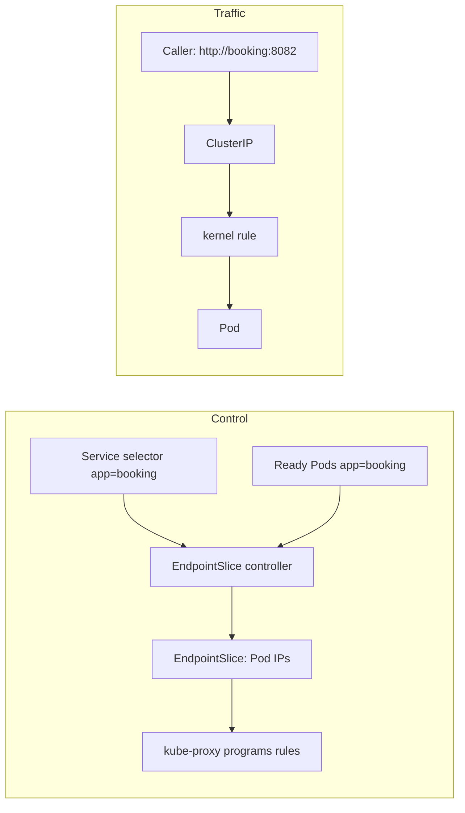

# Services and readiness

*Stage 1 · Liftoff*

**You will be able to:** trace how a Service name becomes a ready Pod, explain what readiness does for traffic, and diagnose a Service that exists but never answers.

Ignition's [ReplicaSets](../cluster/replicasets) chapter ended with Pods that get replaced and receive new IPs. If `search` called booking at a Pod IP, every replacement would break it. Callers need an address that **stays the same** while the Pods behind it change, and that **only points at Pods that can actually serve**.

## A stable name in front of changing Pods

A Service is like the **front desk phone number** of a company. Callers dial one number. Which employee answers can change daily, and the receptionist only transfers you to someone who is in and ready.

Precisely: a **Service** gives a set of Pods a stable DNS name and a stable virtual IP (the **ClusterIP**). It stores three things: a label **selector** (which Pods count), **ports** (`port` is what callers use, `targetPort` is the container's port), and the ClusterIP.

The Service itself does not carry packets. It is configuration. Separate actors turn it into behaviour, and keeping the **control path** (setting up the routing information) apart from the **traffic path** (packets actually flowing) clears up most confusion.

## How a request reaches a Pod


```mermaid
flowchart LR
  subgraph Control
    SVC[Service selector app=booking] --> ESC[EndpointSlice controller]
    Pods[Ready Pods app=booking] --> ESC
    ESC --> EPS[EndpointSlice: Pod IPs]
    EPS --> KP[kube-proxy programs rules]
  end
  subgraph Traffic
    C[Caller: http://booking:8082] --> VIP[ClusterIP] --> Rule[kernel rule] --> Pod
  end
```

1. The **EndpointSlice controller** finds Pods matching the selector **and** reporting ready, and writes their IPs into an `EndpointSlice` object.
2. **kube-proxy** on every node reads those slices and installs kernel routing rules.
3. A caller sends a packet to the ClusterIP; the node's rules rewrite it to one ready Pod's IP.

The ClusterIP is **virtual**: no process listens on it. It exists only as a rule that rewrites packets.

## Readiness: a traffic gate

A **readiness probe** is a check the kubelet runs against a container to decide whether it should receive traffic *now*. It is different from a liveness probe.

| | On failure | Effect on the Service |
|---|---|---|
| Liveness | Container is **restarted** | Pod briefly disappears |
| Readiness | Container keeps running | Pod IP is **removed** from endpoints |

Readiness lets slow starters finish connecting to their database before taking requests, isolates a degraded Pod, and keeps a broken rollout from receiving traffic.

## Two silent failures

| Failure | What you see | Evidence |
|---|---|---|
| **Selector typo** (`app: boking`) | The name resolves, calls hang or reset | `kubectl get endpoints` shows `<none>`. **No event is emitted**: the API considers it valid |
| **Propagation delay** | A few errors during fast rollouts | "Pod ready" or "Pod gone" reaches every node's rules a moment later (Stage 4's `preStop` addresses this) |

## Service types

| Type | Reachable from | Typical use |
|---|---|---|
| `ClusterIP` (default) | Inside the cluster | Service-to-service calls |
| `NodePort` | `<node-ip>:30000–32767` | Local/kind access |
| `LoadBalancer` | An external IP from a controller (cloud or MetalLB) | Edge entry |

## Diagnose in four commands

```bash
kubectl get endpoints booking -n apollo-airlines                                    # 1. did the selector match?
kubectl get pods -n apollo-airlines -l app=booking                                  # 2. are the Pods ready?
kubectl get endpointslices -n apollo-airlines -l kubernetes.io/service-name=booking # 3. was a slice published?
kubectl run c --rm -it --restart=Never -n apollo-airlines --image=curlimages/curl:8.7.1 -- curl -s http://booking:8082/readyz   # 4. does the live path work?
```

## Common misconceptions

- **"The Service forwards packets."** It is data that node rules are built from.
- **"If DNS resolves, the Service works."** DNS returns the ClusterIP even when there are zero endpoints.
- **"Readiness failure restarts the container."** That is liveness.

## Check yourself

<details>
<summary>The Service exists and DNS resolves, but calls fail. What do you check first?</summary>

`kubectl get endpoints <svc>`. Empty means the selector matches no ready Pod.
</details>

<details>
<summary>Why is a failing readiness probe not a reason to restart?</summary>

Restarting does not fix a missing dependency; withholding traffic does the useful part.
</details>

## Where this leads

Booking needs more than a name to run: database addresses, secrets and its own identity. Next: how configuration reaches a Pod.
