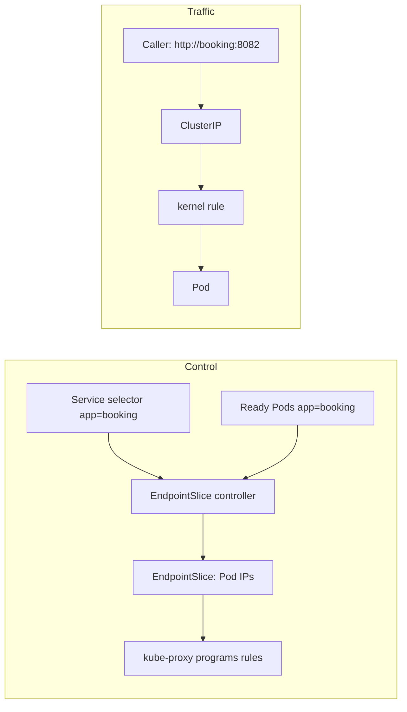

# Services and readiness

*Stage 1 · Liftoff*

**You will be able to:** trace Service → selector → EndpointSlice → ready Pod, and diagnose "Service exists but nothing answers".

## Key points

- Pod IPs change on every replacement, so callers use a **Service**: stable DNS name + virtual IP (ClusterIP).
- A Service object stores: a label **selector**, **ports** (`port` → `targetPort`), and a ClusterIP.
- It does **not** route packets. Node agents (`kube-proxy`) program kernel rules.
- **Control path** (config) and **traffic path** (packets) are maintained by different actors.


```mermaid
flowchart LR
  subgraph Control
    SVC[Service selector app=booking] --> ESC[EndpointSlice controller]
    Pods[Ready Pods app=booking] --> ESC
    ESC --> EPS[EndpointSlice: Pod IPs]
    EPS --> KP[kube-proxy programs rules]
  end
  subgraph Traffic
    C[Caller: http://booking:8082] --> VIP[ClusterIP] --> Rule[kernel rule] --> Pod
  end
```

## Readiness vs liveness

| | On failure | Effect on Service |
|---|---|---|
| Liveness | Container **restarted** | (Pod disappears briefly) |
| Readiness | Container keeps running | Pod IP **removed** from endpoints |

- Readiness lets slow starters finish booting, isolates degraded Pods, and stops a broken rollout from taking traffic.

## Two silent failure modes

| Failure | Looks like | Evidence |
|---|---|---|
| Selector typo (`app: boking`) | Name resolves, calls hang or reset | `kubectl get endpoints` → `<none>`; **no event** |
| Propagation delay | A few errors during fast rollouts | Endpoint removal reaches nodes asynchronously (Stage 4 `preStop`) |

## Service types

| Type | Reachable | Use |
|---|---|---|
| `ClusterIP` (default) | Inside the cluster | Service-to-service |
| `NodePort` | `<node>:30000–32767` | Local/kind access |
| `LoadBalancer` | External IP from a controller (cloud, MetalLB) | Edge |

## Diagnose in four commands

```bash
kubectl get endpoints booking -n apollo-airlines                                   # 1. selector matched?
kubectl get pods -n apollo-airlines -l app=booking                                 # 2. Pods ready?
kubectl get endpointslices -n apollo-airlines -l kubernetes.io/service-name=booking # 3. slice published?
kubectl run c --rm -it --restart=Never -n apollo-airlines --image=curlimages/curl:8.7.1 -- curl -s http://booking:8082/readyz  # 4. live path
```

## Check yourself

<details>
<summary>The Service exists and DNS resolves, but calls fail. What do you check first?</summary>

`kubectl get endpoints <svc>`. Empty means the selector matches no ready Pod.
</details>

<details>
<summary>Why is a failing readiness probe not a reason to restart?</summary>

Restarting does not fix a missing dependency; withholding traffic does the useful part.
</details>
