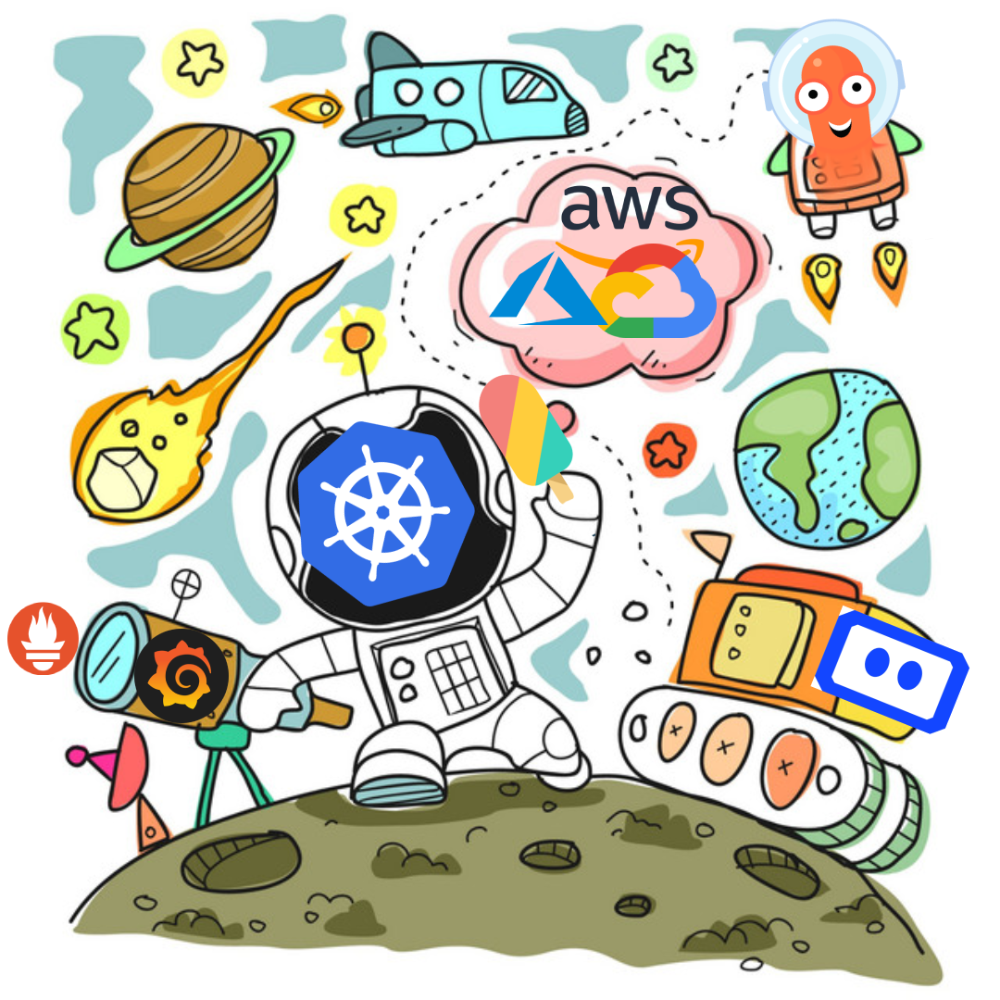

# Apollo 11

11 stage plan to enable you to become very good with the whole k8s based cloud native ecosystem and comfortable with all the components involved for almost every requirement that may come up to build a robust architecture.

## Stages:

- Stage 0: Local Setup on docker

- Stage 1: Helm packaging and Kustomize Patching

- Stage 2: Deployment/

- Stage 3: Gitops

- Stage 4: Monitoring + Observability + Tracing

- Stage 5: Routing using ingress controller

- Stage 6: Service Mesh

- Stage 7: Security and Compliance

- Stage 8: AutoScaling and Load testing

- Stage 9: Chaos Engineering + Backup and Restore

- Stage 10: Progressive Deployment

- Stage 11: Litfoff

> **Tip**: I encourage that you either fork this repo or create your own repo as you follow these stages. Your commits pushed from your laptop mostly wont be visible in the github contributions until you follow this to setup GPG verified commits https://www.youtube.com/watch?v=4166ExAnxmo

> You can use github codespaces as you can skip this hassle altogether :D 

--------------------------------

# Pre-requisites
--------------------------------

- **Linux** :
  - <https://linuxjourney.com/>
  - <https://developer.ibm.com/tutorials/linux-basics-and-commands/>

- **Vim**: ( Its very good even if you dont reach the neovim nerd level :P )
  - [Vim Basics in 8 Minutes](https://www.youtube.com/watch?v=ggSyF1SVFr4)
  - [Vim Crash Course | How to edit files quickly in CKAD / CKA exam](https://www.youtube.com/watch?v=knyJt8d6C_8)

- **Yaml**: ( Everything is yaml in the cloud native world [its changing though ])
  - <https://www.youtube.com/watch?v=1uFVr15xDGg>
  - <https://developer.ibm.com/tutorials/yaml-basics-and-usage-in-kubernetes/>

- **Go Lang basics**:
  
  - http://tour.golang.org/
  - https://gobyexample.com
  - https://www.practical-go-lessons.com
  - https://quii.gitbook.io/learn-go-with-tests

- **Docker/Container Basics**

   Because even though docker is no more the only container runtime in town [nor is it technically supported without a external shim in k8s]. Its still the best place to get to know about containers and explore them
   
    - https://docs.docker.com/get-started/overview
    - [Docker explained in Sketches](https://dev.to/aurelievache/series/8105)
  
   Deep-dive:
  
  - <http://docker-saigon.github.io/post/Docker-Internals/>
  - <https://gist.github.com/StevenACoffman/41fee08e8782b411a4a26b9700ad7af5> [best practices]

# Stage 1: Basics + Local setup

> Goal: We get our applications running in a simple docker-compose setup just to understand the basic functional working.

## 3.Kubernetes basics

- Get your hands dirty. This tutorial will give a good bootstrap on k8s operations

  - <https://kubernetes.io/docs/tutorials/kubernetes-basics/>

  - Brisk through <https://kubernetes.io/docs/concepts>.

  - Check all the terms and glossary <https://kubernetes.io/docs/reference/glossary/?all=true>

  
  The two tasks will make it pretty easy for you to understand the core concepts from the documentation. This will be just to consolidate those core concepts and collect more dots of k8s knowledge. In the later stages you will be able to connect those extra dots as well.

## Install minikube & understand the basics:
 <https://kubernetes.io/docs/tutorials/hello-minikube/>

 > Note: Minikube is the simplest way to start a local k8s cluster. There are many other ways like kind(Kubernetes in Docker) ,k3s,microk8s amongst others. <https://developer.ibm.com/blogs/options-to-run-kubernetes-locally/>

 <https://kubernetes.io/docs/reference/kubectl/overview/>

# Stage 2: Rest api + backend in local k8s cluster [ 2 weeks ]

> Goal: Have a very basic rest api with a basic html based ui frontend deployed on a local k8s cluster

1. Create namespace "application"

 `kubectl create namespace mynamespace`

2. Create a simple go rest API 

3. Build docker image with it

https://redhat-scholars.github.io/kubernetes-tutorial/kubernetes-tutorial/index.html

Create a deployment and expose as external service

Should be able to access it from browser as <externalip>.port

Create namespace "nosql"
mongodb deployment
Expose mongodb as internal service
Mongodb credentials stored in secrets.
Then referenced from mongoexpress deployment
(Need to create secrets before you can use them)

Learn peristent volumes and stateful sets and change mongodb to that instead of deployment

Create a config map of non sensitive values if needed

Mongo express deployment
Expose mongodbexpress as external service

Change go code to interact with mongodb
Make the go service interact with mongodb service
Crud operation should work

Create namespace front end
Add a small front end app to the make calls to go api

Create local image

Create it as deployment and load env variables from a config map
Expose it as external service

# Stage 3: Routing using ingress controller [ 1 week ]

> Goal: Rest api to interact with mongodb. mongoexpress to interact with mongodb. Frontend to interact with API

Create ingress rules for sample url ---> gobuydoge.com
/Frontend will take to frontend external service
/Backend will take to backeelnd external service

Create ingress controller to control all the routes
On local machine add entry for gobuydoge.com to the ingress controller ip

Gobuydoge.com/frontend should show frontend
Gobuydoge.com/backend should show backend

Extra:

- Have a look at various other ingress controllers: <https://docs.google.com/spreadsheets/d/191WWNpjJ2za6-nbG4ZoUMXMpUK8KlCIosvQB0f-oq3k/htmlview?pru=AAABdXUHlbs*g6XkyoZXhanlhRazst77Xw>

--------------------------------

Stage 4: Move on from Minikube/Docker
--------------------------------

> Goal: Now that we have a good handson, lets move to building a prod grade cluster **the hard way**

- This is ofcourse an inspriration from the legendary Kelsey Hightowers: https://github.com/kelseyhightower/kubernetes-the-hard-way

We will be building a end to end cluster in gcp using kubespray.

Follow this guide for detailed steps: [stage 4 notes](stages/stage4/README.md)

Install any other container runtime other than docker

- [Docker is no longer supported](https://blog.datacamp.engineering/understanding-the-kubernetes-docker-deprecation-notice-by-dummies-for-dummies-c9f2685486e0)

- <https://www.youtube.com/watch?v=bV5RcNiHlfw> [Kubernetes cluster with CRI-O container runtime | Step by step tutorial]

- Run the above setup in either of a cloud k8s platform (manually for now):

  - EKS
  - AKS
  - GKE
  - Linode
  https://snyk.io/blog/hardening-amazon-eks-security/

Extra:

- Use buildah to build container images instead of
- Try different local k8s platforms: k3s,kind,microk8s.
- Aws eks infra building with CDK

--------------------------------

Stage 5: Helm packaging
--------------------------------
https://www.youtube.com/watch?v=ZMFYSm0ldQ0
https://www.youtube.com/playlist?list=PLTCrU9sGyburBw9wNOHebv9SjlE4Elv5a

> Goal: Rest api to interact with mongodb. mongoexpress to interact with mongodb. Frontend to interact with API

<https://developer.ibm.com/tutorials/helm-101-labs/>

- helm packages building
- Helmfile

- Optional:
  - Complete scenarios here: <https://www.katacoda.com/javajon/courses/kubernetes-tools>

--------------------------------

Stage 6: Service Mesh
--------------------------------

> Goal: Rest api to interact with mongodb. mongoexpress to interact with mongodb. Frontend to interact with API

- Service mesh ISTIO

A service mesh, like the open source project Istio, is a way to control how different parts of an application share data with one another. Unlike other systems for managing this communication, a service mesh is a dedicated infrastructure layer built right into an app. This visible infrastructure layer can document how well (or not) different parts of an app interact, so it becomes easier to optimize communication and avoid downtime as an app grows.

<https://www.youtube.com/watch?v=hkR1M6qwpnw> [Istio in 5 minutes]
Istio Service Mesh Explained <https://www.youtube.com/watch?v=6zDrLvpfCK4>

<https://piotrminkowski.com/2021/07/12/multicluster-traffic-mirroring-with-istio-and-kind/>

--------------------------------

Stage 7: Monitoring + Observability + Tracing
--------------------------------

> Goal: Rest api to interact with mongodb. mongoexpress to interact with mongodb. Frontend to interact with API
https://12factor.net/ -- 12 factor app

  - <https://developer.ibm.com/tutorials/debug-and-log-your-kubernetes-app/>
  - EFK Logging

- K8s monitoring

  - lens
  - prometheus
  - Tracing using opentelementry

--------------------------------

Stage 8: App Testing + Deployment/Gitops + Autoscaling
--------------------------------

https://training.linuxfoundation.org/training/introduction-to-gitops-lfs169/

https://github.com/devtron-labs/devtron
<https://tutorialedge.net/golang/intro-testing-in-go/>

<https://itnext.io/kubernetes-deployment-strategies-types-and-argo-rollouts-9d5f98e8b24e>
<https://blog.container-solutions.com/kubernetes-deployment-strategies>

> Goal: Rest api to interact with mongodb. mongoexpress to interact with mongodb. Frontend to interact with API

- K8s Deployment strategy
  - CICD using github actions
  - DevSecops
  - TestOps
  - k8s misconfiguration from reaching production- datree

- Various deployment patterns in K8s
- gitops with flux v2

Tekton:
https://www.youtube.com/playlist?list=PLzpeuWUENMK3ITxCCJRtGGSb3Pf58W80r

https://www.youtube.com/watch?v=qJZQwd34yMI
https://www.youtube.com/watch?v=rGHeAez-k5I&list=PLEV9ul4qfGOYLooAW9hnekIOyCMtI7zaZ&index=2

ArgoCd:

https://www.youtube.com/watch?v=c4v7wGqKcEY
https://www.youtube.com/watch?v=QrLwFEXvxbo
https://www.youtube.com/watch?v=cCYnIQZnlRg

https://rtfm.co.ua/en/github-github-actions-overview-and-argocd-deployment-example/

--------------------------------

Stage 9: Event driven architecture
--------------------------------

https://www.stackrox.com/post/2020/01/kubernetes-networking-demystified/

> Goal: Rest api to interact with mongodb. mongoexpress to interact with mongodb. Frontend to interact with API

- Introduce a event bus or stream eg. Apache FLink and operate using same

Asynchronous Event Handling Using Microservices and Kafka
https://www.youtube.com/watch?v=AwJItZbCAv4

--------------------------------

Stage 10: Load Testing + Chaos Engineering + Backup and Restore
--------------------------------

> Goal: Rest api to interact with mongodb. mongoexpress to interact with mongodb. Frontend to interact with API

- DevSecOps
- inject failure into your Kubernetes clusters

For load testing: https://www.containiq.com/post/kubernetes-load-testing

--------------------------------

Stage 11: Security and Compliance + threat detection
--------------------------------

Certmanager:

https://www.youtube.com/watch?v=deLW2h1RGz0

https://www.youtube.com/watch?v=7m4_kZOObzw

https://www.youtube.com/watch?v=juVPuWBi29s
https://getbetterdevops.io/k8s-ingress-with-letsencrypt/

https://www.nsa.gov/News-Features/Feature-Stories/Article-View/Article/2716980/nsa-cisa-release-kubernetes-hardening-guidance/
> Goal: Rest api to interact with mongodb. mongoexpress to interact with mongodb. Frontend to interact with API

<https://kubernetes.io/docs/concepts/security/>

https://twitter.com/kubesploit

- Secure the cluster based on the 4C’s of cloud native security
<https://developer.ibm.com/articles/journey-to-kubernetes-security/>
<https://developer.ibm.com/blogs/basics-of-kubernetes-security/>

<https://developer.ibm.com/tutorials/installing-and-using-sysdig-falco/>

- Falco
- kubehunter
- Gatekeeper

- Enforce good practices using datree

<https://www.stackrox.com/post/2020/05/kubernetes-security-101/>

Apollo program continues: Go deeper in this space
--------------------------------

Write your own Kubernetes controller in Rust from scratch
<https://blog.frankel.ch/start-rust/6/>

> Goal: Rest api to interact with mongodb. mongoexpress to interact with mongodb. Frontend to interact with API

Explore Kubernetes Serverless:

- K-native
  <https://cloud.google.com/knative/>

- OpenFaas
  <https://www.openfaas.com/>

- Kubeless

 Optional:
  <https://www.katacoda.com/javajon/courses/kubernetes-serverless>

Openshift:

- <https://developer.ibm.com/videos/openshift-vs-kubernetes-for-developers/>

- Admission controllers/webhooks <https://www.youtube.com/watch?v=1mNYSn2KMZk>
- Kubernetes Operator

-- Try new tools and features:
 <https://github.com/grafana/tanka>

- <https://ymmt2005.hatenablog.com/entry/k8s-things> [47 Things To Become a Kubernetes Expert]
- <https://github.com/dgkanatsios/CKAD-exercises>
- <https://github.com/walidshaari/Kubernetes-Certified-Administrator>
- <https://github.com/walidshaari/Certified-Kubernetes-Security-Specialist>
- <https://github.com/ibrahimjelliti/CKSS-Certified-Kubernetes-Security-Specialist>

## Cheatsheets

- kubectl: <https://kubernetes.io/docs/reference/kubectl/cheatsheet/>

--------------------------------

## Labs

- <https://developer.ibm.com/tutorials/kubernetes-101-labs/>
- <https://labs.play-with-k8s.com/>#
- Complete all k8s scenarios in <https://www.katacoda.com/>

References
--------------------------------

- <https://github.com/tomhuang12/awesome-k8s-resources>
 <https://labs.play-with-k8s.com/>#
 <https://developer.ibm.com/components/kubernetes/series/kubernetes-learning-path/>

[Top Kubernetes Interview Questions Answers (From Container Specialist)](https://www.youtube.com/watch?v=lHC7xpFack8)
--------------------------------

Reading lists
--------------------------------

- Kubernetes
  - <https://kubernetes.io/case-studies/>

  - https://boxunix.com/2020/05/15/a-better-way-of-organizing-your-kubernetes-manifest-files/

- Docker:
  - <https://developer.ibm.com/articles/containerization-of-legacy-applications/>

- <https://github.com/arialdomartini/Back-End-Developer-Interview-Questions>

--------------------------------

Youtube Channels
--------------------------------

- [ That DevOps Guy] <https://www.youtube.com/channel/UCFe9-V_rN9nLqVNiI8Yof3w>

-

--------------------------------

Blogs
--------------------------------

<https://kubernetes.io/blog/>

--------------------------
Inspiring Articles for long term learning
--------------------------

https://typesense.org/blog/the-unreasonable-effectiveness-of-just-showing-up-everyday/

-- Reading list:

- https://codefresh.io/about-gitops/gitops-for-infrastructure-and-applications/
- https://medium.com/paypal-tech/scaling-kubernetes-to-over-4k-nodes-and-200k-pods-29988fad6ed
- https://learnk8s.io/troubleshooting-deployments?utm_content=buffer20927&utm_medium=organic-twitter&utm_source=twitter&utm_campaign=civo-buffer
- https://www.cncf.io/wp-content/uploads/2022/02/CNCF-Annual-Survey-2021.pdf
- https://cloudnative101.dev/concepts/cloud-native/
- https://blog.kubecost.com/blog/kubernetes-kops/
