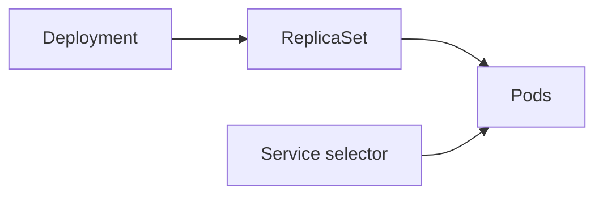

# Stage 1 — Liftoff

Stage 1 moves all ten Launchpad components into one `apollo-airlines` namespace. The key transition is from a bare Pod to controller-owned workloads:



## What changes

- Deployments and ReplicaSets keep application replicas running.
- Services give changing Pods stable names and virtual IPs.
- ConfigMaps and Secrets separate configuration from the image.
- Jobs initialize the three databases once.
- Dedicated tokenless ServiceAccounts give workload identity without API access.
- Databases still use `emptyDir`; replacement loses data. Persistence is Stage 3.

## Build

```bash
cd Apollo11
bash stages/stage1/scripts/apply.sh
# If images are already loaded:
bash stages/stage1/scripts/apply.sh --skip-build
kubectl get deployments,statefulsets,jobs,pods -n apollo-airlines
```

Read the graph before applying it:

```bash
sed -n '1,180p' stages/stage1/k8s/apps/booking/booking-dep.yaml
sed -n '1,120p' stages/stage1/k8s/apps/booking/booking-svc.yaml
kubectl kustomize stages/stage1/k8s > /tmp/stage1.yaml
```

## Concepts: controllers, Services, and configuration

A Deployment declares a desired number of interchangeable Pods. It owns a ReplicaSet, and the ReplicaSet owns the Pods. When one Pod disappears, the ReplicaSet notices the replica count is below the desired value and creates a replacement. This is reconciliation.

A Service is a stable virtual address plus a selector. The selector finds matching, ready Pods and publishes them through EndpointSlices. The Service is not an owner and does not restart anything. A Deployment selector and its Pod-template labels must match; a Service selector must match those Pod labels. Kubernetes can accept a wrong selector because the error is semantic, not YAML syntax.

A ConfigMap stores ordinary configuration. A Secret is a separate API type for sensitive values, but base64 is only encoding—not encryption. A ServiceAccount is workload identity; token automount is disabled here because these applications do not need to call the Kubernetes API. A Job is for bounded work such as database initialization, not a long-running server.

### Deployment lifecycle, slowly

When you apply a Deployment, the API server stores the Deployment object. The Deployment controller notices that no ReplicaSet represents the requested Pod template, so it creates one. The ReplicaSet controller notices that no Pods exist for its selector, so it creates them. The scheduler assigns each unscheduled Pod to a node. The kubelet starts the containers and reports status back through the API server.

That chain is why a Deployment is more than a nicer Pod manifest. It creates an ownership graph and a reconciliation loop. The desired number is `.spec.replicas`; the observed number appears in `.status.replicas`, `.status.readyReplicas`, and `.status.availableReplicas`. Those values can differ while images pull, probes fail, or a node is unavailable.

```yaml
apiVersion: apps/v1
kind: Deployment
metadata:
  name: booking
  labels:
    app.kubernetes.io/name: booking
spec:
  replicas: 2
  selector:
    matchLabels:
      app: booking
  strategy:
    type: RollingUpdate
    rollingUpdate:
      maxUnavailable: 25%
      maxSurge: 25%
  template:
    metadata:
      labels:
        app: booking
    spec:
      serviceAccountName: booking
      containers:
        - name: booking
          image: apollo11/booking:latest
          ports:
            - name: http
              containerPort: 8082
```

`replicas` is a request, not a promise that two Pods are immediately ready. `selector` is immutable after creation for a Deployment because changing ownership underneath a running controller would be unsafe. The Pod template is hashed; changing the template creates a new ReplicaSet. `maxSurge` allows temporary extra Pods during an update, while `maxUnavailable` bounds how many old Pods may be unavailable. The `containerPort` is metadata for the Pod; it is not a host port.

### Why labels and selectors are a contract

The Deployment selector and Pod-template labels form one ownership contract. The Service selector forms a second traffic contract. These three blocks are often visually close, which makes copy/paste mistakes common:

```yaml
# The Deployment owns Pods with this label.
spec:
  selector:
    matchLabels: { app: booking }
  template:
    metadata:
      labels: { app: booking }

---
# The Service sends traffic to those same labels.
spec:
  selector: { app: booking }
```

If the Service says `app: bookings`, the Service still exists and gets a ClusterIP, but its EndpointSlice is empty. If the Deployment template says `tier: backend` but the Deployment selector says `app: booking`, the controller cannot own the intended Pods. Always inspect the live labels and selectors instead of assuming the YAML you opened is the object that was applied.

### Configuration injection and precedence

Apollo11 uses ConfigMaps for URLs, ports, and ordinary settings, and Secrets for database credentials and JWT material. Configuration can be mounted as files or injected as environment variables. Environment variables are captured when a container starts; changing a ConfigMap does not necessarily restart existing containers or update an already-read environment variable. A rollout is often required after configuration changes.

The safe reading pattern is:

```yaml
env:
  - name: FLIGHT_SERVICE_URL
    valueFrom:
      configMapKeyRef:
        name: apollo-airlines-config
        key: flight-service-url
  - name: JWT_SECRET
    valueFrom:
      secretKeyRef:
        name: apollo-airlines-secrets
        key: jwt-secret
```

The Pod template references object names, not the values themselves. This keeps configuration separate from the image and makes a deployment reusable. It does not make a Secret safe to print: anyone who can read the Secret or the process environment may still retrieve it.

### Jobs are completion controllers

A Job is successful only when its Pod exits with code zero and the Job controller records completion. A Pod in `Running` or `Completed` state is not the same as a Job whose desired completions are satisfied. Inspect `kubectl get job`, `.status.succeeded`, `kubectl describe job`, and the Job Pod logs together.

Apollo11's database Jobs use bounded retries while PostgreSQL becomes reachable, then run SQL with `ON_ERROR_STOP`. This matters because a shell pipeline can otherwise hide a failing SQL command and let the Job exit successfully. A seed operation should be idempotent: running it twice should converge to the same data rather than create duplicates.

## YAML explainer

For a Deployment, `.spec.selector.matchLabels` must match `.spec.template.metadata.labels`; the controller uses that relationship to decide which Pods it owns. A Service's `.spec.selector` must match the Pod labels, and `.spec.ports[].targetPort` must match the container's listening port. These are semantic contracts that a YAML parser cannot validate.

ConfigMap values are non-secret configuration. Secret values are commonly base64-encoded, not automatically encrypted or safe to print. `envFrom` is convenient but hides the origin of each variable; explicit `valueFrom.configMapKeyRef` and `secretKeyRef` are easier to audit. `emptyDir` survives a container restart but belongs to the Pod, so replacing the database Pod loses its contents.

## Inspect

```bash
kubectl get deployments,replicasets,pods -n apollo-airlines
kubectl describe deployment booking -n apollo-airlines
kubectl get endpointslice -n apollo-airlines -l kubernetes.io/service-name=booking -o wide
kubectl get configmap,secret,serviceaccount -n apollo-airlines
kubectl get jobs -n apollo-airlines
kubectl logs job/init-flight-db -n apollo-airlines
kubectl auth can-i get pods --as=system:serviceaccount:apollo-airlines:booking -n apollo-airlines
```

The authorization answer should be `no`, and the Jobs should be `Complete`. Verify behavior on the mapped ports: frontend `30080`, flight `30081`, booking `30082`, identity `30083`, search `30084`.

### Read status instead of guessing

```bash
kubectl get deployment booking -n apollo-airlines -o yaml
kubectl get deployment booking -n apollo-airlines \
  -o jsonpath='desired={.spec.replicas} ready={.status.readyReplicas} updated={.status.updatedReplicas}{"\n"}'
kubectl get rs,pod -n apollo-airlines -l app=booking --show-labels
kubectl get endpointslice -n apollo-airlines \
  -l kubernetes.io/service-name=booking -o yaml
```

Compare desired, updated, ready, and available counts. For a Service, compare its selector to Pod labels, then compare EndpointSlice addresses to the ready Pods. For a Job, compare completion state, exit code, logs, and events. Each object answers a different question; no single `kubectl get` output is enough.

## Break and recover

Delete a Booking Pod and watch the ReplicaSet create a replacement:

```bash
kubectl delete pod -n apollo-airlines -l app=booking --wait=false
kubectl rollout status deployment/booking -n apollo-airlines --timeout=120s
curl --fail http://127.0.0.1:30082/readyz
```

Create a failed rollout, diagnose it with the Ignition ladder, then roll back:

```bash
kubectl set image deployment/search search=apollo11/search:missing-stage1-demo -n apollo-airlines
kubectl rollout status deployment/search -n apollo-airlines --timeout=30s || true
kubectl get events -n apollo-airlines --sort-by=.metadata.creationTimestamp | tail -20
kubectl describe pod -n apollo-airlines -l app=search
kubectl rollout undo deployment/search -n apollo-airlines
kubectl rollout status deployment/search -n apollo-airlines --timeout=120s
```

Look for `ErrImagePull`/`ImagePullBackOff`. A failed new ReplicaSet can coexist with old healthy Pods because the default RollingUpdate strategy preserves availability within its budget.

The failure is deliberately useful: the API server accepted the new image string because an image name is syntactically valid. The kubelet discovers the problem only when it asks the registry for the image. The Deployment then reports a progressing or stalled rollout, the new ReplicaSet has unavailable Pods, and the old ReplicaSet may still serve traffic. This is the difference between **configuration validation** and **runtime validation**.

### Common Stage 1 failure table

| Symptom | Most useful evidence | Likely cause |
| --- | --- | --- |
| `0/2` ready | `describe pod`, events | Image pull, probe, crash, or missing config |
| Service has no endpoints | Service selector + Pod labels + EndpointSlice | Selector mismatch or Pods not ready |
| Job never completes | Job events + Pod logs | Database unavailable, SQL error, or bad credentials |
| `CreateContainerConfigError` | `describe pod` | Missing ConfigMap/Secret key or wrong name |
| New rollout stuck, old Pods healthy | Deployment/ReplicaSet events | Bad image, command, port, or readiness probe |
| Data disappears after restart | Pod volume definition | `emptyDir` is Pod-scoped; Stage 3 is required |

## Verify and clean up

```bash
bash stages/stage1/scripts/verify.sh
bash stages/stage1/scripts/teardown.sh
```

The verifier is maintainer evidence; your checkpoint is being able to trace Deployment → ReplicaSet → Pod and Service → EndpointSlice, and explain why `emptyDir` is not persistence. Continue to [Stage 2](./stage-2).
