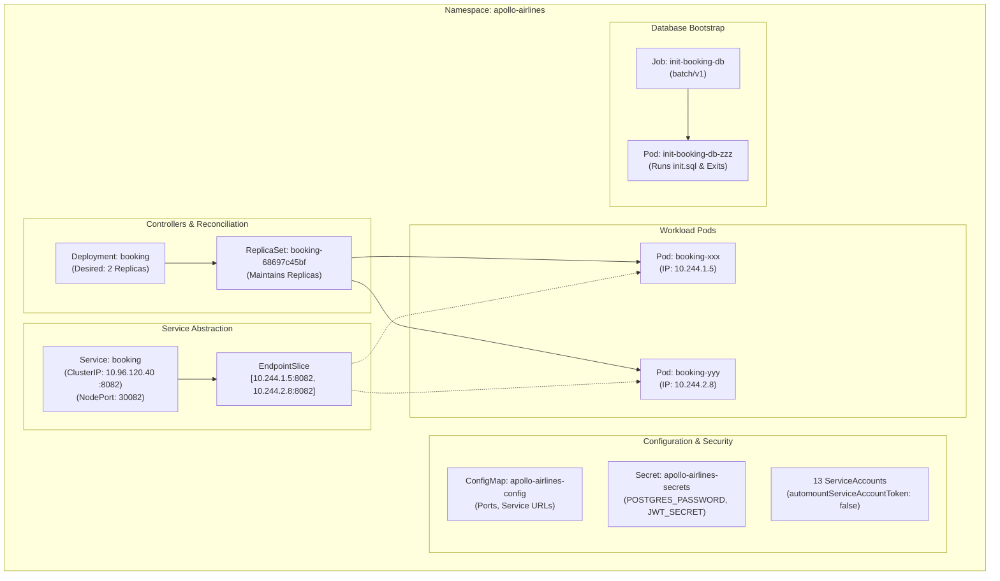

# Stage 1: Liftoff — Workloads on Kubernetes

:::note[Take the controls · Liftoff lab]
Put the airline’s workloads in motion and investigate who brings them back after a failure.
For the explanation before the experiment, start with the
[Liftoff chapters](./learn/workloads/ownership-and-replicas). You can return to this lab whenever you’re ready.
:::

Ignition ended with an uncomfortable result: deleting `apollo-shell` destroyed
the whole object, and nothing recreated it. That was not a broken cluster. It
was an honest consequence of what we declared—a single Pod and no owner that
requested another one.

Stage 1 changes the declaration. Instead of asking Kubernetes to keep one
specific `booking` Pod alive, we ask it to keep *two matching booking replicas*
available. That distinction is the beginning of declarative orchestration. The
cluster is allowed to replace individual Pods because the intent lives above
them.

We will bring the Apollo Airlines workloads into the `apollo-airlines`
namespace, then follow the relationships that make the system work: controller
ownership, labels, stable Service names, injected configuration, bounded
database setup, and workload identity.



---

## 🎯 Learning Goals

By the end of this stage, you will be able to:
1. Explain the 3-tier ownership hierarchy: **Deployment → ReplicaSet → Pods**.
2. Explain the **reconciliation control loop** and how desired state replaces failed Pods.
3. Understand how **Services** provide stable virtual IPs and load balance traffic across dynamic Pod IPs.
4. Master the **Label and Selector contract** that binds Deployments to Pods, and Services to Endpoints.
5. Safely inject configuration and credentials using **ConfigMaps** and **Secrets**.
6. Run finite, one-shot database migrations using Kubernetes **Jobs**.
7. Enforce least-privilege workload identity using dedicated, tokenless **ServiceAccounts**.
8. Observe **Rolling Updates**, diagnose `ImagePullBackOff`, and restore a prior Deployment revision.
9. Understand the critical limitations of `emptyDir` ephemeral storage for databases.

---

## 🧩 Concepts & Manifest Deep Dive

### 1. A replica count is a promise, not a list of Pod names

Suppose we wrote down the two current booking Pod names and tried to preserve
them. The first replacement would make the list stale. Kubernetes solves this
by recording a desired *shape* instead: two Pods whose labels and template match
the booking specification. The names and IPs are disposable details.

Three objects share that work:

- A **Pod** is one running instance. It has a UID, IP, containers, and a node
  assignment. Replacing it produces a different Pod.
- A **ReplicaSet** watches the API for Pods matching its selector and works to
  make the count equal its desired replicas. It creates the replacement after a
  shortfall is observed; it does not promise instantaneous recovery from every
  kind of failure.
- A **Deployment** owns ReplicaSets and describes how a new Pod template should
  replace an old one. That extra layer is what gives us rollout history later.

For the normal Stage 1 lifecycle, the chain looks like this:

```text
you apply Deployment/booking
        │
        ▼
Deployment controller records the desired Pod template and creates a ReplicaSet
        │
        ▼
ReplicaSet controller sees 0 of 2 matching Pods and creates two Pod objects
        │
        ▼
scheduler assigns each unscheduled Pod to a node → kubelet starts its container
```

The API server stores the objects and their status; the controllers do the
watching and requesting. The kubelet is not the component that decides “we need
another booking Pod”—it only makes a Pod run after the scheduler assigns one to
its node.

Let's examine the `booking` service Deployment. The checked-in development
database password embedded in `DATABASE_URL` is redacted in this excerpt:

*Source: `stages/stage1/k8s/apps/booking/booking-dep.yaml`*

```yaml
apiVersion: apps/v1
kind: Deployment
metadata:
  name: booking
  namespace: apollo-airlines
spec:
  replicas: 2
  selector:
    matchLabels:
      app: booking
  template:
    metadata:
      labels:
        app: booking
    spec:
      serviceAccountName: booking
      containers:
        - name: booking
          image: apollo11/booking:latest
          imagePullPolicy: IfNotPresent
          ports:
            - containerPort: 8082
          env:
            - name: DATABASE_URL
              value: "postgresql://postgres:<redacted>@booking-db:5432/booking?sslmode=disable"
            - name: FLIGHT_SERVICE_URL
              valueFrom:
                configMapKeyRef:
                  name: apollo-airlines-config
                  key: FLIGHT_SERVICE_URL
            - name: IDENTITY_SERVICE_URL
              valueFrom:
                configMapKeyRef:
                  name: apollo-airlines-config
                  key: IDENTITY_SERVICE_URL
            - name: NOTIFICATION_SERVICE_URL
              valueFrom:
                configMapKeyRef:
                  name: apollo-airlines-config
                  key: NOTIFICATION_SERVICE_URL
            - name: JWT_SECRET
              valueFrom:
                secretKeyRef:
                  name: apollo-airlines-secrets
                  key: JWT_SECRET
            - name: PORT
              valueFrom:
                configMapKeyRef:
                  name: apollo-airlines-config
                  key: PORT_BOOKING
          livenessProbe:
            httpGet:
              path: /healthz
              port: 8082
            initialDelaySeconds: 10
            periodSeconds: 10
          readinessProbe:
            httpGet:
              path: /readyz
              port: 8082
            initialDelaySeconds: 5
            periodSeconds: 5
```

Read the first three structural fields before the container details:

- `replicas: 2` is the desired count held by the Deployment.
- `selector.matchLabels` is the rule used by the ReplicaSet to recognise Pods it
  owns.
- `template` is the recipe used for each new Pod. Changing this template is what
  makes a Deployment revision.

The `env`, probes, and ServiceAccount inside that template are therefore not
settings on an already-running container. They are part of the recipe for every
future booking Pod. That is why a configuration change may result in a rollout.

### 2. Labels are the contracts that connect independent objects

The Deployment cannot own Pods by their generated names; those names change.
Instead it and the Service make separate promises about the label
`app: booking`. The Deployment's promise is “these are my Pods.” The Service's
promise is “these are the Pods I may send booking traffic to.” One label value
connects both relationships without either object needing to know a Pod IP.

Look closely at the selector and template in `booking-dep.yaml`:

*Source: `stages/stage1/k8s/apps/booking/booking-dep.yaml` (selector and Pod-label excerpt)*

```yaml
  selector:
    matchLabels:
      app: booking
  template:
    metadata:
      labels:
        app: booking
```

:::important[The Selector Contract]
The Deployment's `.spec.selector.matchLabels` MUST match the Pod template's `.spec.template.metadata.labels`.

If these two blocks do not match, the Kubernetes API server will reject the manifest with a validation error because the Deployment controller would create Pods that it cannot track or own!
:::

Now examine the matching Service definition:

*Source: `stages/stage1/k8s/apps/booking/booking-svc.yaml`*

```yaml
apiVersion: v1
kind: Service
metadata:
  name: booking
  namespace: apollo-airlines
spec:
  type: NodePort
  selector:
    app: booking
  ports:
    - port: 8082
      targetPort: 8082
      nodePort: 30082
```

Notice the Service's `.spec.selector`: `app: booking`.
The Service does not point to a Deployment name and it does not contain a list
of Pod IPs. Kubernetes' endpoint controller uses the selector to maintain
EndpointSlices as Pods appear, disappear, or change readiness. Stage 2 will let
you inspect that live translation from label to endpoint.

- `port: 8082`: The port the Service listens on inside the cluster.
- `targetPort: 8082`: The port on the container where traffic is forwarded.
- `nodePort: 30082`: The high port opened on every Kubernetes worker node, allowing your host machine to access the Service directly.

---

### 3. The image is reusable; the environment is not

The booking image is one artifact. It can run only after it knows which database
and peer services to contact and which secret to use for JWT work. Baking those
values into the image would make the image environment-specific; putting every
value inline in every Pod template makes relationships hard to audit.

Kubernetes separates configuration into two dedicated primitives:

#### ConfigMaps (Non-Sensitive Configuration)

*Source: `stages/stage1/k8s/config/configmap.yaml`*

```yaml
apiVersion: v1
kind: ConfigMap
metadata:
  name: apollo-airlines-config
  namespace: apollo-airlines
data:
  PORT_IDENTITY: "8080"
  PORT_FLIGHT: "8081"
  PORT_BOOKING: "8082"
  PORT_SEARCH: "8083"
  PORT_NOTIFICATION: "8084"
  PORT_FRONTEND: "3000"

  IDENTITY_DB: "identity"
  FLIGHT_DB: "flight"
  BOOKING_DB: "booking"

  VITE_IDENTITY_URL: "http://identity:8080"
  VITE_FLIGHT_URL: "http://flight:8081"
  VITE_BOOKING_URL: "http://booking:8082"
  VITE_SEARCH_URL: "http://search:8083"

  FLIGHT_SERVICE_URL: "http://flight:8081"
  IDENTITY_SERVICE_URL: "http://identity:8080"
  NOTIFICATION_SERVICE_URL: "http://notification:8084"

  REDIS_URL: "redis://redis:6379"
```

#### Secrets (Sensitive Credentials)

*Source: `stages/stage1/k8s/config/secrets.yaml`; values are redacted below.*

```yaml
apiVersion: v1
kind: Secret
metadata:
  name: apollo-airlines-secrets
  namespace: apollo-airlines
type: Opaque
stringData:
  POSTGRES_PASSWORD: "<redacted-development-value>"
  JWT_SECRET: "<redacted-development-value>"
```

This is a deliberately redacted excerpt, not an apply-ready manifest. Inspect
the source file locally to see the development-only values used by the lab; do
not copy those values into another cluster.

:::warning[Base64 Encoding Is Not Encryption!]
Kubernetes Secrets store data as base64-encoded strings (`data`) or plain text during authoring (`stringData`). Base64 is an encoding format, NOT encryption! Anyone with read access to the namespace or etcd can decode base64 strings with `base64 -d`. In production, Secrets must be encrypted at rest in etcd and integrated with external KMS / Vault (explored in Stage 8).
:::

In `booking-dep.yaml`, we inject these values cleanly using:
- `valueFrom.configMapKeyRef`: Pulls a specific key from `apollo-airlines-config`.
- `valueFrom.secretKeyRef`: Pulls a specific credential from `apollo-airlines-secrets`.

This is an important boundary: environment variables are read when the
container starts. Updating the ConfigMap does not rewrite an already-running
booking process. A later Pod replacement or rollout reads the current referenced
value. That behavior is why configuration and rollout history belong in the
same learner journey.

---

### 4. Some work should finish instead of staying alive

The web services should stay alive and handle requests. Database setup has a
different contract: wait for PostgreSQL, run SQL once, report success or
failure, and exit. Treating both kinds of work as Deployments would cause a
completed setup task to be restarted forever.

Running migrations inside the application container entrypoint is risky: if 3 replicas start simultaneously, they may race to execute the same `CREATE TABLE` commands.

Kubernetes provides the **Job** resource (`batch/v1`) for tasks that must execute to completion and exit:

*Source: `stages/stage1/k8s/jobs/init-booking-db.yaml`*

```yaml
apiVersion: batch/v1
kind: Job
metadata:
  name: init-booking-db
  namespace: apollo-airlines
spec:
  backoffLimit: 3
  template:
    metadata:
      labels:
        app: init-booking-db
    spec:
      serviceAccountName: init-booking-db
      containers:
        - name: init
          image: postgres:15-alpine
          command:
            - sh
            - -c
            - |
              set -eu
              attempt=0
              until pg_isready -h booking-db -U postgres; do
                attempt=$((attempt + 1))
                if [ "${attempt}" -ge 30 ]; then
                  echo "booking-db did not become ready" >&2
                  exit 1
                fi
                echo "Waiting for booking-db... (${attempt}/30)"
                sleep 2
              done
              psql -v ON_ERROR_STOP=1 -h booking-db -U postgres -d booking -f /init/init.sql
              echo "booking DB init done"
          env:
            - name: PGPASSWORD
              valueFrom:
                secretKeyRef:
                  name: apollo-airlines-secrets
                  key: POSTGRES_PASSWORD
          volumeMounts:
            - name: init-script
              mountPath: /init
      volumes:
        - name: init-script
          configMap:
            name: booking-init-script
      restartPolicy: Never
```

### Follow one Job attempt

The Job controller creates a Pod from `spec.template`. The Pod's shell loop
waits for the `booking-db` Service name to accept connections. Once it can run
the mounted SQL, the container exits with status zero; the Job records a
completion. If an attempt fails, the Job controller may create another Pod up
to `backoffLimit`. A completed Job is not a daemon and does not rerun merely
because the database Pod later changes.

The relevant fields support that lifecycle:
1. **Polls with `pg_isready`**: The Job waits for the `booking-db` PostgreSQL service to accept TCP connections before attempting to run SQL commands.
2. **Mounts SQL from a ConfigMap**: `stages/stage1/k8s/jobs/booking-init-configmap.yaml`
   carries the booking schema (matching
   `stages/stage1/code/booking/init.sql`) and is mounted as
   `/init/init.sql`. Kubernetes mounts the ConfigMap data, not the repository
   file itself.
3. **`restartPolicy: Never`**: If the script fails, the container is not restarted infinitely in an uncontrollable loop; the Job controller retries up to `backoffLimit: 3` times.

---

### 5. Every Pod has an identity, even when it needs no API access

Kubernetes attaches a ServiceAccount identity to Pods. In clusters where token
automount is enabled for the account, that identity can include a token mounted
in the Pod filesystem. Apollo's application services do not need to call the
Kubernetes API, so carrying an API credential would be unnecessary exposure.

None of the Apollo Airlines microservices need to interact with the Kubernetes API. Therefore, Stage 1 provisions 13 dedicated ServiceAccounts with token automount explicitly disabled:

*Source: `stages/stage1/k8s/config/serviceaccounts.yaml`*

```yaml
apiVersion: v1
kind: ServiceAccount
metadata:
  name: booking
  namespace: apollo-airlines
automountServiceAccountToken: false
```

---

## 🧪 Investigations: watch the declared system react

You now have a model to test. In each investigation, first identify the object
that holds the desired state, then watch the object that reacts to it. Do not
equate a `Running` Pod with a ready application: observe controller status,
endpoints, events, and the user-facing route when relevant.

### Exercise 1: Deploying Stage 1

**Question:** after the apply script returns, which separate objects tell us
that the declared application has become runnable rather than merely accepted
by the API server?

- **Objective**: Build application images, load them into kind, and apply all Stage 1 manifests.
- **Starting Point**: Healthy `kind-apollo11` cluster from Ignition.
- **Instructions**:

```bash
cd Apollo11

# 1. Run the verified Stage 1 deploy script
bash stages/stage1/scripts/apply.sh

# 2. Inspect all deployed workloads in apollo-airlines
kubectl get deployments,statefulsets,jobs,pods,svc -n apollo-airlines
```

- **Expected Result**:
  - 10 Deployments report desired replicas available (`2/2` for apps, `1/1` for DBs).
  - 3 Jobs (`init-identity-db`, `init-flight-db`, `init-booking-db`) show `1/1 Completed`.
  - Services show `NodePort` mappings matching ports `30080`–`30084`.
- **Verification Script**:

```bash
bash stages/stage1/scripts/verify.sh
```

All 167 automated checks should pass!

- **Troubleshooting hints**: A verifier failure names the contract it checked.
  Use that resource's status, events, `describe`, and logs rather than rerunning
  the entire apply script blindly.
- **Concept reinforced**: A deployment script establishes desired state; the
  verifier tests the resulting resource graph and behavior.

---

### Exercise 2: Tracing the Ownership Tree

**Prediction:** the Pod's direct owner is a ReplicaSet, not the Deployment.
That indirection is what lets a Deployment retain an old ReplicaSet during a
future rollout.

- **Objective**: Prove that the Deployment owns the ReplicaSet, and the ReplicaSet owns the Pods.
- **Starting Point**: Running Stage 1 cluster.
- **Instructions**:

```bash
# 1. Get the booking Deployment and note its name
kubectl get deployment booking -n apollo-airlines

# 2. Inspect the ReplicaSet created by the Deployment
kubectl get replicaset -n apollo-airlines -l app=booking

# 3. Read the ownerReferences metadata of one booking Pod
BOOKING_POD=$(kubectl get pods -n apollo-airlines -l app=booking -o jsonpath='{.items[0].metadata.name}')

kubectl get pod "${BOOKING_POD}" -n apollo-airlines -o jsonpath='{.metadata.ownerReferences}' | jq
```

- **Expected Result**:
  The Pod's `ownerReferences` points directly to `kind: ReplicaSet` and `name: booking-<hash>`.
  If you inspect the ReplicaSet's `ownerReferences`, it points to `kind: Deployment` and `name: booking`!
- **What Concept This Reinforces**:
  Kubernetes uses `ownerReferences` to maintain a strict hierarchy. Deleting the parent Deployment automatically garbage-collects child ReplicaSets and Pods.
- **Verification command**: Inspect the ReplicaSet parent with `kubectl get rs
  -n apollo-airlines -l app=booking -o jsonpath='{.items[0].metadata.ownerReferences}' | jq`.
- **Troubleshooting hints**: If several ReplicaSets exist after a rollout, use
  each object's revision and owner reference; old ReplicaSets are retained for
  rollback history.

---

### Exercise 3: Self-Healing in Action (Reconciliation Loop)

**Prediction:** deleting one Pod changes the observed count, not the desired
count. Watch for a new UID; that proves a new object was created rather than a
container being restarted inside the old Pod.

- **Objective**: Delete a Pod managed by a Deployment and observe immediate controller recreation.
- **Starting Point**: Stage 1 running with 2 booking replicas.
- **Instructions**:

```bash
# 1. List current booking pods with their UIDs
kubectl get pods -n apollo-airlines -l app=booking -o custom-columns='NAME:.metadata.name,UID:.metadata.uid'

# 2. Delete one of the booking pods
kubectl delete pod "${BOOKING_POD}" -n apollo-airlines

# 3. Immediately list booking pods again
kubectl get pods -n apollo-airlines -l app=booking -o custom-columns='NAME:.metadata.name,STATUS:.status.phase,UID:.metadata.uid'
```

- **Expected Result**:
  Unlike Ignition, the booking ReplicaSet notices the replica shortfall and
  creates a replacement Pod with a new UID. The remaining Ready replica can
  stay behind the Service while the replacement starts.
- **Verification command**: `kubectl rollout status deployment/booking -n
  apollo-airlines` must complete, and two ready endpoints should appear in
  `kubectl get endpoints booking -n apollo-airlines`.
- **Troubleshooting hints**: A replacement stuck Pending is a scheduling issue;
  a replacement stuck unready requires Pod events and logs. The ReplicaSet
  creates Pods, while a node's kubelet starts their containers.
- **Concept reinforced**: Controllers reconcile desired replica count after a
  Pod object disappears.

---

### Exercise 4: Rolling Updates & Diagnosing `ImagePullBackOff`

**Prediction:** the API server accepts the new image reference because it is
syntactically valid. The evidence of failure appears later, when a kubelet tries
to fetch the image. The remaining Ready Pods—not the Deployment object alone—
are what keep the Service useful during the stalled rollout.

- **Objective**: Trigger a broken rollout, diagnose `ImagePullBackOff`, verify service availability, and roll back.
- **Starting Point**: Healthy booking service responding at `http://localhost:30082/readyz`.
- **Instructions**:

```bash
# 1. Update the booking Deployment with a non-existent image tag
kubectl set image deployment/booking booking=apollo11/booking:v999-invalid -n apollo-airlines

# 2. Monitor rollout status
kubectl rollout status deployment/booking -n apollo-airlines --timeout=20s || true

# 3. Check Pod status
kubectl get pods -n apollo-airlines -l app=booking
```

- **Diagnosis (The Evidence Ladder)**:

```bash
# Check events on the failing Pod
BROKEN_POD=$(kubectl get pods -n apollo-airlines -l app=booking | grep -E "(ImagePullBackOff|ErrImagePull)" | awk '{print $1}')
kubectl describe pod "${BROKEN_POD}" -n apollo-airlines | grep -A 5 Events:
```

Events clearly state: `Failed to pull image "apollo11/booking:v999-invalid": rpc error: code = NotFound`.

- **Test Service Availability**:

```bash
# Even though the rollout is stuck, test user traffic!
curl -i http://localhost:30082/readyz
```

Notice that `curl` returns `HTTP 200 OK`!
Because Kubernetes uses rolling update strategy (`maxUnavailable: 25%`), it refused to terminate the old, healthy Pods while the new Pod failed to become Ready!

- **Recovery (Undo Rollout)**:

```bash
# 4. Roll back to the previous stable revision
kubectl rollout undo deployment/booking -n apollo-airlines

# 5. Confirm rollout completes
kubectl rollout status deployment/booking -n apollo-airlines
```

All Pods return to `Running 1/1` on `apollo11/booking:latest`.

- **Expected result**: The bad revision stalls without replacing every healthy
  replica; rollback restores the previous image and a complete rollout.
- **Verification command**: `kubectl rollout history deployment/booking -n
  apollo-airlines` shows the revision history, and the readiness request returns
  HTTP 200.
- **Troubleshooting hints**: If `BROKEN_POD` is empty, list Pods directly and
  describe the newest one. Image pull status can move between `ErrImagePull`
  and `ImagePullBackOff` while retries occur.
- **Concept reinforced**: Deployment rollout state, Pod readiness, image-pull
  events, and Service availability are related but distinct signals.

---

### Exercise 5: The `emptyDir` Data Loss Drill

**Prediction:** the Deployment will replace the database Pod, but it cannot
replace data that existed only in the deleted Pod's `emptyDir`. This is the
precise limitation that Stage 3 addresses.

- **Objective**: Prove that `emptyDir` storage does not survive Pod replacement, setting up the motivation for Stage 3.
- **Starting Point**: Healthy databases in `apollo-airlines`.
- **Instructions**:

  The row values below are a clearly bounded lab adaptation of the schema in
  `stages/stage1/code/booking/init.sql`; they are not Apollo11 seed data.

```bash
# 1. Insert a temporary test reservation into booking-db
kubectl exec -n apollo-airlines deploy/booking-db -- psql -U postgres -d booking -c "
  INSERT INTO bookings (id, booking_reference, user_id, flight_id, seat_number, status)
  VALUES (
    '99999999-9999-4999-8999-999999999999',
    'TEMP-EMPTYDIR-1',
    'b2c3d4e5-f6a7-8901-bcde-f12345678901',
    'aaaaaaaa-aaaa-aaaa-aaaa-aaaaaaaaaaaa',
    'LAB-1A',
    'CONFIRMED'
  );
"

# 2. Verify the record exists
kubectl exec -n apollo-airlines deploy/booking-db -- psql -U postgres -d booking -c "SELECT booking_reference, status FROM bookings WHERE booking_reference='TEMP-EMPTYDIR-1';"

# 3. Delete the booking-db Pod to trigger a replacement
BOOKING_DB_POD=$(kubectl get pod -n apollo-airlines -l app=booking-db -o jsonpath='{.items[0].metadata.name}')
kubectl delete pod "${BOOKING_DB_POD}" -n apollo-airlines
kubectl wait --for=condition=Ready pod -l app=booking-db -n apollo-airlines --timeout=60s

# 4. Re-query the database for the record
kubectl exec -n apollo-airlines deploy/booking-db -- psql -U postgres -d booking -c "SELECT booking_reference, status FROM bookings WHERE booking_reference='TEMP-EMPTYDIR-1';"
```

- **Expected Result**:
  The final query fails with `relation "bookings" does not exist`. The
  `emptyDir` held both the table and the test row, while the one-shot
  `init-booking-db` Job remains `Complete` and does not rerun automatically.
- **Recovery and verification**:

```bash
kubectl delete job init-booking-db -n apollo-airlines
kubectl apply -f stages/stage1/k8s/jobs/init-booking-db.yaml
kubectl wait --for=condition=Complete job/init-booking-db -n apollo-airlines --timeout=90s
kubectl exec -n apollo-airlines deploy/booking-db -- \
  psql -U postgres -d booking -c "SELECT booking_reference FROM bookings WHERE booking_reference='TEMP-EMPTYDIR-1';"
```

  The table exists again, but the query returns zero rows. If a command fails,
  inspect `kubectl logs -n apollo-airlines job/init-booking-db` and the
  `booking-db` Pod events.
- **Troubleshooting hints**: If insertion reports a duplicate, delete the
  existing `TEMP-EMPTYDIR-1` row or choose another lab reference before
  continuing. Never delete a PVC here—Stage 1 uses `emptyDir`.
- **Concept reinforced**: `emptyDir` follows Pod lifetime, and a completed Job
  is not automatically rerun when an unrelated database Pod is replaced.
- **Why Did We Lose Data?**
  In Stage 1, `booking-db-dep.yaml` mounts an `emptyDir` volume:
  ```yaml
  volumes:
    - name: pg-data
      emptyDir: {}
  ```
  `emptyDir` is allocated for one Pod and is deleted with that Pod. For
  stateless apps (like `booking`), this can be appropriate; for this database,
  it loses state. In **Stage 3**, StatefulSets and PersistentVolumeClaims make
  the data survive ordinary Pod replacement. Stage 3 also explains the limits
  of kind's node-local storage—it is not a backup or a highly available
  database.

---

## 🏁 What You Learned

- How Deployments, ReplicaSets, and Pods collaborate to deliver self-healing workloads.
- How the reconciliation loop continuously aligns observed cluster state with declared desired state.
- How Services use label selectors to route traffic across dynamic Pod IP addresses.
- How ConfigMaps and Secrets externalize application settings and passwords.
- Why one-time database bootstrap tasks belong in `batch/v1` Jobs rather than application containers.
- How disabling token automount on ServiceAccounts implements defense-in-depth security.
- How rolling update strategies prevent downtime during failed deployments, and how to use `kubectl rollout undo`.
- Why `emptyDir` storage is ephemeral and cannot be used for stateful database storage.

---

## ✈️ Before Continuing: Checkpoint

Before moving to Stage 2, test your understanding:
1. What is the difference in responsibility between a Deployment and a ReplicaSet?
2. If a Service's `selector` has a typo (e.g. `app: boking`), what will `kubectl apply` do? What will happen to traffic?
3. Why does `kubectl set image` with an invalid tag not take down your existing application?
4. Why did `booking-db` lose its test record when its Pod was deleted?

The workloads now have replaceable Pods and stable Service objects, but we have
not yet followed how a name becomes a ready endpoint or how a browser enters the
cluster. Stage 2 picks up that exact path.

👉 **Continue to [Stage 2: Guidance (Networking & Edge Access)](./stage-2)**
