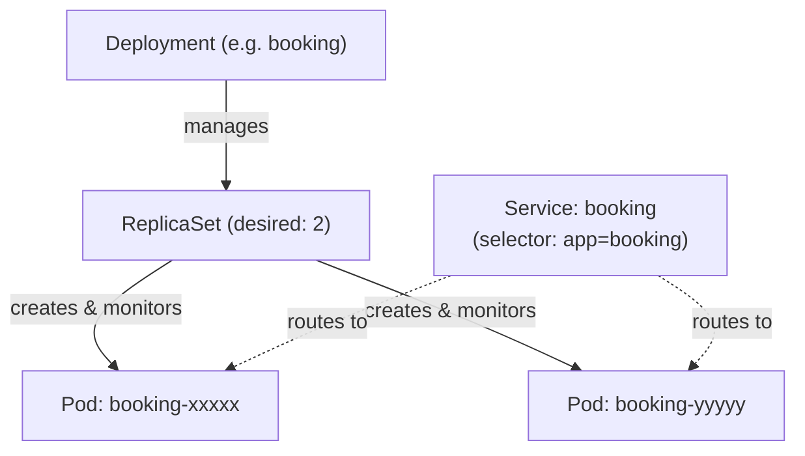

# Stage 1: Liftoff — Workloads & Configuration

**Goal:** Move the complete ten-component Apollo Airlines application from Docker Compose into Kubernetes, inspect the controllers and configuration keeping it healthy, and recover from both Pod loss and a failed rolling update.

In [Ignition](./ignition.md), we saw that deleting a bare Pod left it absent permanently. Stage 1 introduces **Deployments and ReplicaSets** to manage pod lifecycle, **Services and EndpointSlices** for stable networking, **ConfigMaps and Secrets** for decoupled configuration, and **Jobs** for database initialization.



---

## What You Will Learn

1. **Deployments, ReplicaSets, and Pod Templates:** How declarative desired state drives automated reconciliation and self-healing.
2. **Services & EndpointSlices:** How labels and selectors decouple stable virtual endpoints from dynamic, ephemeral Pod IPs.
3. **Namespaces, ConfigMaps, and Secrets:** How configuration and credentials are decoupled from container images.
4. **Dedicated Workload ServiceAccounts:** Why disabling token automount enforces least-privilege security.
5. **One-Shot Initialization Jobs:** How batch Jobs bootstrap databases with bounded retries and `ON_ERROR_STOP`.
6. **Ephemeral Storage (`emptyDir`):** Why database storage currently lives and dies with Pod lifecycles (setting up the problem Stage 3 solves).
7. **Rolling Updates & Rollbacks:** How Deployments manage zero-downtime rollouts, how to diagnose `ImagePullBackOff`, and how to revert with `kubectl rollout undo`.

---

## Architecture: The `apollo-airlines` Namespace

All Stage 1 resources reside in a dedicated namespace: `apollo-airlines`.

```text
Namespace: apollo-airlines

  Configuration & Identities           Stable Networking
  ┌─────────────────────────┐          ┌───────────────────────┐
  │ ConfigMap + Secret      ├─────────►│ 10 Services           │
  │ 13 ServiceAccounts      │          │ (5 NodePorts, 5 CIPs) │
  └─────────────────────────┘          └───────────┬───────────┘
                                                   │
  Infrastructure Deployments (x1)                  ▼
  ┌────────────────────────────────────────────────────────────┐
  │ identity-db   flight-db   booking-db   redis               │
  │ (emptyDir volumes: storage survives container restart only)│
  └──────────────────────────────▲─────────────────────────────┘
                                 │ seeded by
  Database Initialization Jobs   │
  ┌──────────────────────────────┴─────────────────────────────┐
  │ init-identity-db    init-flight-db    init-booking-db      │
  └────────────────────────────────────────────────────────────┘

  Application Deployments (x2 replicas each)
  ┌────────────────────────────────────────────────────────────┐
  │ identity      flight      booking     search               │
  │ notification  frontend                                     │
  └────────────────────────────────────────────────────────────┘
```

:::note Storage Boundary in Stage 1
In Stage 1, all four databases intentionally mount `emptyDir` volumes. Data survives a container crash inside the same Pod, but if the database Pod is deleted, the data is lost. [Stage 3: Mission Data](./stage-3.md) replaces `emptyDir` with `PersistentVolumeClaims` and `StatefulSets`.
:::

---

## Prerequisites

- Active multi-node `kind-apollo11` cluster created during [Ignition](./ignition.md).
- Verify cluster context:
  ```bash
  kubectl config current-context
  # Expected: kind-apollo11 (or kind-apollo11-dev)
  kubectl get nodes
  ```
- Docker, kubectl, curl, and jq available.
- Run all commands from the repository root.

---

## 1. Inspect Declared Manifests

Examine the relationships between Deployments, Pod templates, ServiceAccounts, and Services:

```bash
# View namespace definition
cat stages/stage1/k8s/config/namespace.yaml

# View booking Deployment
sed -n '1,65p' stages/stage1/k8s/apps/booking/booking-dep.yaml

# View booking Service
cat stages/stage1/k8s/apps/booking/booking-svc.yaml
```

Notice the exact contract:
1. `deployment.spec.selector.matchLabels` equals `app: booking`.
2. `deployment.spec.template.metadata.labels` equals `app: booking`.
3. `service.spec.selector` equals `app: booking`.
4. `service.spec.ports[0].targetPort` equals the container's `8082`.
5. `deployment.spec.template.spec.serviceAccountName` specifies `booking`.

If any selector or label is mismatched, Kubernetes accepts the resource, but traffic routing silently fails!

---

## 2. Build and Deploy

The build script compiles all 6 application images and loads them into your kind cluster. The apply script creates configuration, infrastructure, runs database init Jobs, and deploys the application tier:

```bash
# 1. Build and load images into kind
bash stages/stage1/scripts/build-images.sh

# 2. Apply all resources in dependency order
bash stages/stage1/scripts/apply.sh
```

:::tip Skip Image Builds
If images are already built and loaded in your kind cluster, run:
```bash
bash stages/stage1/scripts/apply.sh --skip-build
```
:::

The apply script pauses at each boundary to ensure databases are responsive before starting their respective initialization Jobs.

---

## 3. Inspect: Controllers, Networking, and Identity

### 1. Follow Ownership & Reconciliation

Inspect the ownership chain from Deployment down to Pods:

```bash
# View deployments, replicasets, and pods
kubectl get deployments,replicasets,pods -n apollo-airlines

# Inspect the ownerReferences of a booking ReplicaSet
kubectl get replicaset -n apollo-airlines -l app=booking \
  -o custom-columns='NAME:.metadata.name,DESIRED:.spec.replicas,OWNER:.metadata.ownerReferences[0].name'
```

Notice that the Deployment owns the ReplicaSet, and the ReplicaSet owns the individual Pods.

### 2. Follow Service Selectors to EndpointSlices

A Kubernetes Service is not a running container; it is an iptables/IPVS rule programmed by `kube-proxy` across all nodes. The endpoints are tracked via `EndpointSlice`:

```bash
# View booking Service
kubectl get service booking -n apollo-airlines -o wide

# View EndpointSlice generated for booking
kubectl get endpointslice -n apollo-airlines -l kubernetes.io/service-name=booking -o wide

# Compare with the running booking Pod IPs
kubectl get pods -n apollo-airlines -l app=booking -o wide
```

The IP addresses listed under the EndpointSlice correspond directly to the healthy booking Pods.

### 3. Inspect Configuration & Secrets

```bash
# View externalized configuration
kubectl describe configmap apollo-airlines-config -n apollo-airlines

# View secrets metadata (values are hidden)
kubectl describe secret apollo-airlines-secrets -n apollo-airlines

# See how booking injects environment variables from ConfigMap and Secret
kubectl get deployment booking -n apollo-airlines \
  -o jsonpath='{range .spec.template.spec.containers[0].env[*]}{.name}{" <- "}{.valueFrom.configMapKeyRef.name}{.valueFrom.secretKeyRef.name}{"\n"}{end}'
```

:::note Base64 vs Encryption
Kubernetes Secrets are base64-encoded by default, not encrypted at rest. Anyone with RBAC permissions to read Secrets can decode them. [Stage 8: Command Module](./stage-8.md) introduces enterprise secret management with HashiCorp Vault and External Secrets Operator.
:::

### 4. Workload Identity & Token Security

In Kubernetes, every Pod runs with a `ServiceAccount`. If token automount is enabled, Kubernetes mounts a sensitive API token into `/var/run/secrets/kubernetes.io/serviceaccount/token`.

Since our microservices do not talk to the Kubernetes API, Stage 1 explicitly configures `automountServiceAccountToken: false` on all 13 ServiceAccounts:

```bash
# Verify the 13 dedicated ServiceAccounts exist
kubectl get serviceaccounts -n apollo-airlines

# Test RBAC authorization for the booking identity
kubectl auth can-i get pods \
  --as=system:serviceaccount:apollo-airlines:booking \
  -n apollo-airlines
# Expected: no

# Prove no token is mounted inside the container
BOOKING_POD=$(kubectl get pod -n apollo-airlines -l app=booking -o jsonpath='{.items[0].metadata.name}')
kubectl exec -n apollo-airlines "$BOOKING_POD" -- \
  test ! -e /var/run/secrets/kubernetes.io/serviceaccount/token && echo "Secure: No service account token mounted"
```

### 5. Inspect One-Shot Jobs

Database schemas are initialized using Kubernetes `Job` resources:

```bash
kubectl get jobs,pods -n apollo-airlines -l app=init-flight-db
kubectl logs job/init-flight-db -n apollo-airlines
```

Notice that:
- The Job runs `psql` with `ON_ERROR_STOP=1`. If any SQL statement fails, the Job exits with a non-zero code instead of masking errors.
- Completed Job Pods remain in `Completed` state so logs can be audited later.

---

## 4. Prove Application Behavior

Stage 1 maps five services to NodePorts exposed on your host via kind's port mappings:

| Service | Protocol | NodePort | URL |
|---|---|---|---|
| **frontend** | HTTP | 30080 | [http://127.0.0.1:30080](http://127.0.0.1:30080) |
| **flight** | HTTP | 30081 | [http://127.0.0.1:30081](http://127.0.0.1:30081) |
| **booking** | HTTP | 30082 | [http://127.0.0.1:30082](http://127.0.0.1:30082) |
| **identity** | HTTP | 30083 | [http://127.0.0.1:30083](http://127.0.0.1:30083) |
| **search** | HTTP | 30084 | [http://127.0.0.1:30084](http://127.0.0.1:30084) |

Test each endpoint from your host terminal:

```bash
# Frontend health
curl --fail http://127.0.0.1:30080/healthz

# Flight inventory query (186 flights seeded across 31 days)
curl --fail http://127.0.0.1:30081/api/flights | jq '.flights | length'

# Booking readiness
curl --fail http://127.0.0.1:30082/readyz

# Identity Prometheus metrics
curl --fail http://127.0.0.1:30083/metrics | head -n 10

# Search readiness
curl --fail http://127.0.0.1:30084/readyz
```

:::info Why is notification not a NodePort?
`notification` is only invoked internally by `booking`. Leaving internal services as `ClusterIP` reduces attack surface by not exposing unnecessary ports to the host network.
:::

---

## 5. Break 1: Delete a Controller-Owned Pod

Let's test self-healing on a Deployment-managed workload.

Capture the currently running booking Pods:

```bash
kubectl get pods -n apollo-airlines -l app=booking \
  -o custom-columns='NAME:.metadata.name,UID:.metadata.uid,NODE:.spec.nodeName'

# Select one pod and delete it
BOOKING_POD=$(kubectl get pod -n apollo-airlines -l app=booking -o jsonpath='{.items[0].metadata.name}')
kubectl delete pod "$BOOKING_POD" -n apollo-airlines
```

Instantly observe the pods:

```bash
kubectl get pods -n apollo-airlines -l app=booking
```

**Observation:** Unlike Ignition's bare Pod, the deleted pod was immediately replaced by the ReplicaSet. The new pod has a fresh UID, and the Deployment returned to `2/2` ready replicas within seconds:

```bash
curl --fail http://127.0.0.1:30082/readyz
```

---

## 6. Break 2: Diagnose a Failed Rolling Update

Deployments update pods incrementally using a rolling update strategy. Let's trigger a failure by deploying an image tag that does not exist.

### 1. Perform a Healthy Rollout Restart

First, restart the `search` deployment and observe the rollout history:

```bash
kubectl rollout restart deployment/search -n apollo-airlines
kubectl rollout status deployment/search -n apollo-airlines --timeout=60s
kubectl rollout history deployment/search -n apollo-airlines
```

### 2. Deploy a Broken Image Tag

Now instruct Kubernetes to update `search` to a nonexistent image:

```bash
kubectl set image deployment/search \
  search=apollo11/search:missing-stage1-demo \
  -n apollo-airlines
```

Monitor the rollout:

```bash
kubectl rollout status deployment/search -n apollo-airlines --timeout=20s
```

The command times out! Now use the **Evidence Ladder** to diagnose the failure:

```bash
# 1. Status: Check pod state
kubectl get deployment,replicaset,pod -n apollo-airlines -l app=search

# 2. Events: Check recent cluster events
kubectl get events -n apollo-airlines \
  --sort-by=.metadata.creationTimestamp | tail -n 15

# 3. Describe: Inspect why the pod is failing
kubectl describe pod -n apollo-airlines -l app=search | grep -E "(Image|Failed|Error)"
```

Look at the evidence: `ErrImagePull` and `ImagePullBackOff`.

### 3. Check Application Availability During Failure

Crucially, test whether the user-facing search service is down:

```bash
curl --fail http://127.0.0.1:30084/readyz
# Output: HTTP 200 OK!
```

**Why is it still working?** Kubernetes' default `RollingUpdate` strategy (`maxUnavailable: 25%`) never destroys old, healthy Pods until the new revision's Pods pass readiness checks! Because the new Pod never became Ready, the old healthy ReplicaSet continues serving 100% of user traffic.

---

## 7. Recover: Roll Back the Failed Revision

Revert the deployment back to the previous working revision:

```bash
# Roll back to previous revision
kubectl rollout undo deployment/search -n apollo-airlines

# Verify rollout completes successfully
kubectl rollout status deployment/search -n apollo-airlines --timeout=60s

# Verify image tag is restored
kubectl get deployment search -n apollo-airlines \
  -o jsonpath='{.spec.template.spec.containers[0].image}{"\n"}'
# Output: apollo11/search:latest

# Verify live readiness
curl --fail http://127.0.0.1:30084/readyz
```

The failed Pods are removed, and the search service is completely restored.

---

## Maintainer Verification

Run the automated Stage 1 verification suite:

```bash
bash stages/stage1/scripts/verify.sh
```

The script runs **167 comprehensive checks**, including:
1. Namespace and 13 tokenless ServiceAccounts.
2. Deployment replicas, selectors, and EndpointSlices.
3. Database initialization Job completion and SQL data consistency.
4. Health, readiness, and metrics for all services.
5. Flagship booking workflow with `X-Request-ID` tracing across logs.
6. Automated Pod termination and ReplicaSet replacement.
7. Simulated rollout failure, diagnosis verification, and rollback recovery.

---

## Clean Up & Residue Audit

To tear down Stage 1 resources:

```bash
bash stages/stage1/scripts/teardown.sh
```

Verify that zero residue remains in the cluster:

```bash
kubectl get namespace apollo-airlines
# Expected: Error from server (NotFound)

kubectl get all -A | grep apollo-airlines || echo "Residue clean: 0 resources found"
```

Retain your kind cluster for Stage 2!

---

## Explain & Review Questions

1. **How do a Deployment selector, Pod template label, and Service selector link together?**
   - The Deployment selector defines which Pods the controller manages.
   - The Pod template specifies the labels stamped onto new Pod instances.
   - The Service selector queries the API server for Pods matching those labels to populate its `EndpointSlice`.

2. **Why did the search service continue returning 200 OK during the broken image rollout?**
   The Deployment's rolling update strategy does not terminate older, healthy replicas until newly spawned replicas transition to `Ready`.

3. **What is the difference between base64 encoding and encryption in Kubernetes Secrets?**
   Base64 is an encoding format that converts binary data to ASCII strings for safe transmission; it provides zero confidentiality. Encryption requires cryptographic keys (e.g., KMS, Vault).

4. **Why is `automountServiceAccountToken: false` a recommended security standard?**
   If an attacker achieves remote code execution (RCE) in an application container, an automounted token provides valid credentials to query the Kubernetes API server directly.

---

## What's Next

In [Stage 2: Guidance — Networking & Edge Access](./stage-2.md), we move from direct NodePorts into a progressive **5-substage edge access ladder**: ClusterIP & CoreDNS, NodePort, Traefik Ingress with TLS, MetalLB LoadBalancers, and the modern Envoy Gateway API.