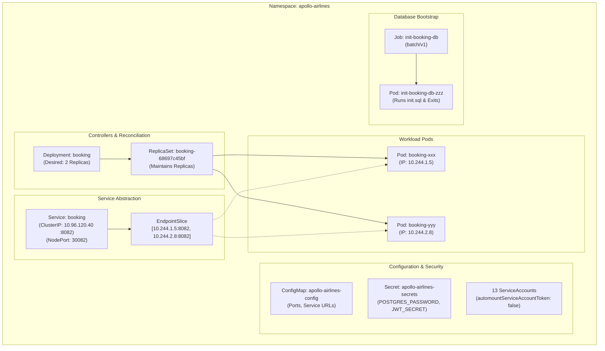

# Stage 1: Liftoff — Workloads on Kubernetes

:::info[Page type · optional lab]
This lab uses the pinned Apollo11 revision from [lab setup](./labs/setup) and the
`apollo-airlines` namespace. Read the Liftoff chapters before taking the controls.
:::

:::note[Take the controls · Liftoff lab]
Put the airline’s workloads in motion and investigate who brings them back after a failure.
For the explanation before the experiment, start with the
[Liftoff chapters](./learn/workloads/ownership-and-replicas). You can return to this lab whenever you’re ready.

Already read them? [Jump to the investigations](#-investigations-watch-the-declared-system-react).
:::

In Ignition, you deleted the `apollo-shell` Pod and Kubernetes did not bring it
back. The cluster was not broken. You had created a single bare Pod, and nothing
was responsible for replacing it.

Stage 1 fixes that. Instead of asking for one specific `booking` Pod, you ask
Kubernetes to keep *two booking replicas* running. Because that request is
stored in a higher-level object, Kubernetes can replace any individual Pod that
disappears.

In this stage you will deploy the Apollo Airlines workloads into the
`apollo-airlines` namespace. Then you will look at how they fit together:
which object owns which, how labels connect objects, how Services give Pods a
stable name, how configuration reaches containers, how databases are set up once,
and how each workload gets its own identity.

<details>
<summary><strong>Optional conceptual refresher</strong></summary>

The Liftoff chapters are the primary explanation. Expand this section when you
want the older manifest deep dive beside the lab.


```mermaid
flowchart TD
  subgraph Namespace ["Namespace: apollo-airlines"]
    subgraph ConfigLayer ["Configuration & Security"]
      CM["ConfigMap: apollo-airlines-config\n(Ports, Service URLs)"]
      SEC["Secret: apollo-airlines-secrets\n(POSTGRES_PASSWORD, JWT_SECRET)"]
      SA["13 ServiceAccounts\n(automountServiceAccountToken: false)"]
    end

    subgraph Controllers ["Controllers & Reconciliation"]
      DEP["Deployment: booking\n(Desired: 2 Replicas)"]
      RS["ReplicaSet: booking-68697c45bf\n(Maintains Replicas)"]
      DEP --> RS
    end

    subgraph WorkloadPods ["Workload Pods"]
      P1["Pod: booking-xxx\n(IP: 10.244.1.5)"]
      P2["Pod: booking-yyy\n(IP: 10.244.2.8)"]
      RS --> P1
      RS --> P2
    end

    subgraph Networking ["Service Abstraction"]
      SVC["Service: booking\n(ClusterIP: 10.96.120.40 :8082)\n(NodePort: 30082)"]
      EPS["EndpointSlice\n[10.244.1.5:8082, 10.244.2.8:8082]"]
      SVC --> EPS
      EPS -.-> P1
      EPS -.-> P2
    end

    subgraph BatchInit ["Database Bootstrap"]
      JOB["Job: init-booking-db\n(batch/v1)"]
      JOB --> INIT_POD["Pod: init-booking-db-zzz\n(Runs init.sql & Exits)"]
    end
  end
```

---

## 🎯 Learning Goals

By the end of this stage, you will be able to:
1. Explain the 3-tier ownership hierarchy: **Deployment → ReplicaSet → Pods**.
2. Explain the **reconciliation control loop** and how desired state replaces failed Pods.
3. Understand how **Services** provide stable virtual IPs and load balance traffic across dynamic Pod IPs.
4. Master the **Label and Selector contract** that binds Deployments to Pods, and Services to Endpoints.
5. Safely inject configuration and credentials using **ConfigMaps** and **Secrets**.
6. Run finite, one-shot database migrations using Kubernetes **Jobs**.
7. Enforce least-privilege workload identity using dedicated, tokenless **ServiceAccounts**.
8. Observe **Rolling Updates**, diagnose `ImagePullBackOff`, and restore a prior Deployment revision.
9. Understand the critical limitations of `emptyDir` ephemeral storage for databases.

---

## 🧩 Concepts & Manifest Deep Dive

### 1. A replica count is a promise, not a list of Pod names

Imagine you noted down the names of the two booking Pods and tried to keep
exactly those two alive. As soon as one was replaced, your list would be wrong.
Kubernetes avoids this by recording what you want rather than which Pods you
have: two Pods that match the booking template. Pod names and IP addresses can
change freely.

Three objects share the work:

- A **Pod** is one running instance. It has a UID, an IP address, containers,
  and a node it runs on. A replacement is a new Pod, not the old one restarted.
- A **ReplicaSet** looks for Pods that match its selector and tries to keep their
  number equal to the desired replica count. When it sees too few, it creates new
  Pods. Recovery is not instant; it happens after the ReplicaSet notices the gap.
- A **Deployment** owns ReplicaSets and defines how a changed Pod template
  replaces the old one. This extra layer is what provides rollout history later.

When you first apply a Deployment, the sequence looks like this:

```text
you apply Deployment/booking
        │
        ▼
Deployment controller records the desired Pod template and creates a ReplicaSet
        │
        ▼
ReplicaSet controller sees 0 of 2 matching Pods and creates two Pod objects
        │
        ▼
scheduler assigns each unscheduled Pod to a node → kubelet starts its container
```

The API server stores the objects and their status. The controllers watch those
objects and create new ones when needed. The kubelet never decides that another
booking Pod is needed. Its only job is to start the containers of a Pod that the
scheduler has assigned to its node.

Here is the `booking` Deployment. The development database password inside
`DATABASE_URL` is redacted in this excerpt:

*Source: `stages/stage1/k8s/apps/booking/booking-dep.yaml`*

```yaml
apiVersion: apps/v1
kind: Deployment
metadata:
  name: booking
  namespace: apollo-airlines
spec:
  replicas: 2
  selector:
    matchLabels:
      app: booking
  template:
    metadata:
      labels:
        app: booking
    spec:
      serviceAccountName: booking
      containers:
        - name: booking
          image: apollo11/booking:latest
          imagePullPolicy: IfNotPresent
          ports:
            - containerPort: 8082
          env:
            - name: DATABASE_URL
              value: "postgresql://postgres:<redacted>@booking-db:5432/booking?sslmode=disable"
            - name: FLIGHT_SERVICE_URL
              valueFrom:
                configMapKeyRef:
                  name: apollo-airlines-config
                  key: FLIGHT_SERVICE_URL
            - name: IDENTITY_SERVICE_URL
              valueFrom:
                configMapKeyRef:
                  name: apollo-airlines-config
                  key: IDENTITY_SERVICE_URL
            - name: NOTIFICATION_SERVICE_URL
              valueFrom:
                configMapKeyRef:
                  name: apollo-airlines-config
                  key: NOTIFICATION_SERVICE_URL
            - name: JWT_SECRET
              valueFrom:
                secretKeyRef:
                  name: apollo-airlines-secrets
                  key: JWT_SECRET
            - name: PORT
              valueFrom:
                configMapKeyRef:
                  name: apollo-airlines-config
                  key: PORT_BOOKING
          livenessProbe:
            httpGet:
              path: /healthz
              port: 8082
            initialDelaySeconds: 10
            periodSeconds: 10
          readinessProbe:
            httpGet:
              path: /readyz
              port: 8082
            initialDelaySeconds: 5
            periodSeconds: 5
```

Start with these three fields, before the container details:

- `replicas: 2` is the number of Pods the Deployment should keep running.
- `selector.matchLabels` is how the ReplicaSet recognises the Pods it owns.
- `template` is the recipe for every new Pod. Changing it creates a new
  Deployment revision.

The `env` entries, probes, and ServiceAccount all sit inside that template. They
are not settings applied to a running container; they are part of the recipe for
every future booking Pod. That is why changing them triggers a rollout.

### 2. Labels are the contracts that connect independent objects

A Deployment cannot track its Pods by name, because Pod names are generated and
change on every replacement. Instead, both the Deployment and the Service use
the label `app: booking` to find Pods. The Deployment uses it to decide which
Pods it owns. The Service uses it to decide which Pods can receive booking
traffic. Neither object needs to know any Pod IP address.

Look closely at the selector and template in `booking-dep.yaml`:

*Source: `stages/stage1/k8s/apps/booking/booking-dep.yaml` (selector and Pod-label excerpt)*

```yaml
  selector:
    matchLabels:
      app: booking
  template:
    metadata:
      labels:
        app: booking
```

:::important[The Selector Contract]
The Deployment's `.spec.selector.matchLabels` must match the labels in the Pod
template (`.spec.template.metadata.labels`).

If they do not match, the API server rejects the manifest. Otherwise the
Deployment would create Pods that its own selector could not find.
:::

Now examine the matching Service definition:

*Source: `stages/stage1/k8s/apps/booking/booking-svc.yaml`*

```yaml
apiVersion: v1
kind: Service
metadata:
  name: booking
  namespace: apollo-airlines
spec:
  type: NodePort
  selector:
    app: booking
  ports:
    - port: 8082
      targetPort: 8082
      nodePort: 30082
```

Look at the Service's `.spec.selector`: `app: booking`. The Service does not
reference a Deployment and does not list Pod IPs. Instead, Kubernetes keeps a set
of EndpointSlices up to date by matching the selector against Pods as they
appear, disappear, or change readiness. You will inspect these in Stage 2.

- `port: 8082`: the port the Service listens on inside the cluster.
- `targetPort: 8082`: the container port that traffic is forwarded to.
- `nodePort: 30082`: a port opened on every node, which lets your host machine
  reach the Service directly.

---

### 3. The image is reusable; the environment is not

The booking image is a single build, but to run it needs to know which database
and which other services to contact, and which secret to use for JWT signing. If
you baked those values into the image, it would only work in one environment. If
you wrote them inline in every Pod template, they would be hard to audit.

Kubernetes provides two objects for configuration:

#### ConfigMaps (Non-Sensitive Configuration)

*Source: `stages/stage1/k8s/config/configmap.yaml`*

```yaml
apiVersion: v1
kind: ConfigMap
metadata:
  name: apollo-airlines-config
  namespace: apollo-airlines
data:
  PORT_IDENTITY: "8080"
  PORT_FLIGHT: "8081"
  PORT_BOOKING: "8082"
  PORT_SEARCH: "8083"
  PORT_NOTIFICATION: "8084"
  PORT_FRONTEND: "3000"

  IDENTITY_DB: "identity"
  FLIGHT_DB: "flight"
  BOOKING_DB: "booking"

  VITE_IDENTITY_URL: "http://identity:8080"
  VITE_FLIGHT_URL: "http://flight:8081"
  VITE_BOOKING_URL: "http://booking:8082"
  VITE_SEARCH_URL: "http://search:8083"

  FLIGHT_SERVICE_URL: "http://flight:8081"
  IDENTITY_SERVICE_URL: "http://identity:8080"
  NOTIFICATION_SERVICE_URL: "http://notification:8084"

  REDIS_URL: "redis://redis:6379"
```

#### Secrets (Sensitive Credentials)

*Source: `stages/stage1/k8s/config/secrets.yaml`; values are redacted below.*

```yaml
apiVersion: v1
kind: Secret
metadata:
  name: apollo-airlines-secrets
  namespace: apollo-airlines
type: Opaque
stringData:
  POSTGRES_PASSWORD: "<redacted-development-value>"
  JWT_SECRET: "<redacted-development-value>"
```

The values are redacted, so this excerpt cannot be applied as it is. The real
file contains development-only values for the lab. Do not reuse them in any
other cluster.

:::warning[Base64 is not encryption]
A Secret stores its values either base64-encoded (`data`) or as plain text that
Kubernetes encodes for you (`stringData`, used here). Base64 is only an encoding.
Anyone who can read the Secret, or read etcd, can decode it with `base64 -d`. In
production, encrypt Secrets at rest in etcd and use an external secret store such
as a KMS or Vault. Stage 8 covers this.
:::

`booking-dep.yaml` reads these values with two fields:
- `valueFrom.configMapKeyRef` takes one key from `apollo-airlines-config`.
- `valueFrom.secretKeyRef` takes one key from `apollo-airlines-secrets`.

Environment variables are read once, when the container starts. If you update the
ConfigMap, a running booking process does not see the change. Only Pods created
afterwards, for example by a rollout, pick up the new value. This is why
configuration changes and rollouts are closely related.

---

### 4. Some work should finish instead of staying alive

Web services should run continuously and handle requests. Database setup is
different: it should wait for PostgreSQL, run its SQL once, report success or
failure, and exit. If you ran it as a Deployment, Kubernetes would keep
restarting it after it finished.

Running the setup SQL inside the application's own startup is also risky. If
several replicas start at the same time, they can race to run the same
`CREATE TABLE` statements.

A **Job** (`batch/v1`) is the Kubernetes object for work that runs to completion
and then stops:

*Source: `stages/stage1/k8s/jobs/init-booking-db.yaml`*

```yaml
apiVersion: batch/v1
kind: Job
metadata:
  name: init-booking-db
  namespace: apollo-airlines
spec:
  backoffLimit: 3
  template:
    metadata:
      labels:
        app: init-booking-db
    spec:
      serviceAccountName: init-booking-db
      containers:
        - name: init
          image: postgres:15-alpine
          command:
            - sh
            - -c
            - |
              set -eu
              attempt=0
              until pg_isready -h booking-db -U postgres; do
                attempt=$((attempt + 1))
                if [ "${attempt}" -ge 30 ]; then
                  echo "booking-db did not become ready" >&2
                  exit 1
                fi
                echo "Waiting for booking-db... (${attempt}/30)"
                sleep 2
              done
              psql -v ON_ERROR_STOP=1 -h booking-db -U postgres -d booking -f /init/init.sql
              echo "booking DB init done"
          env:
            - name: PGPASSWORD
              valueFrom:
                secretKeyRef:
                  name: apollo-airlines-secrets
                  key: POSTGRES_PASSWORD
          volumeMounts:
            - name: init-script
              mountPath: /init
      volumes:
        - name: init-script
          configMap:
            name: booking-init-script
      restartPolicy: Never
```

### Follow one Job attempt

The Job controller creates a Pod from `spec.template`. Inside that Pod, a shell
loop waits until the `booking-db` Service accepts connections, then runs the
mounted SQL file. When the container exits with status zero, the Job is marked
complete. If an attempt fails, the Job controller creates another Pod, up to
`backoffLimit` times. A completed Job does not run again, even if the database
Pod is later replaced.

These fields make that happen:
1. **`pg_isready` polling:** the script waits for `booking-db` to accept
   connections before running any SQL.
2. **SQL from a ConfigMap:** `stages/stage1/k8s/jobs/booking-init-configmap.yaml`
   holds the booking schema (the same SQL as
   `stages/stage1/code/booking/init.sql`) and is mounted at `/init/init.sql`.
   The Pod sees the ConfigMap's contents, not the file from the repository.
3. **`restartPolicy: Never`:** a failed container is not restarted inside the
   same Pod. Instead, the Job controller starts a new Pod, up to
   `backoffLimit: 3` times.

---

### 5. Every Pod has an identity, even when it needs no API access

Every Pod runs as a ServiceAccount. By default, Kubernetes mounts an API token
for that account into the Pod's filesystem, which lets the Pod call the
Kubernetes API.

None of the Apollo Airlines services need to call the Kubernetes API, so a token
would only add risk. Stage 1 therefore creates 13 dedicated ServiceAccounts with
token automount turned off:

*Source: `stages/stage1/k8s/config/serviceaccounts.yaml`*

```yaml
apiVersion: v1
kind: ServiceAccount
metadata:
  name: booking
  namespace: apollo-airlines
automountServiceAccountToken: false
```

---

</details>

## 🧪 Investigations: watch the declared system react

Now test what you have learned. In each investigation, first find the object
that holds the desired state, then watch the object that reacts to it. A Pod
showing `Running` does not mean the application is ready. Also check controller
status, endpoints, events, and, where relevant, the URL a user would visit.

### Exercise 1: Deploying Stage 1

**Question:** after the apply script finishes, which objects show that the
application is actually running, rather than just accepted by the API server?

- **Objective**: Build the application images, load them into kind, and apply all Stage 1 manifests.
- **Starting Point**: A healthy `kind-apollo11` cluster from Ignition, with your terminal in the root of the `Apollo11` repository.

#### What `apply.sh` does: six phases in dependency order

`apply.sh` is not magic. It applies the manifests in six phases, ordered so that
each phase has what it needs from the previous one: configuration first, then
databases, then schema setup, then the application services. You can also apply
the same manifests yourself, phase by phase, from `stages/stage1/k8s/` (or into
`learner-work/stage1/`):

| Phase | Directory | What it does | Why this order |
|---|---|---|---|
| **1/6: Config & identity** | `stages/stage1/k8s/config/` | Creates the namespace, the `apollo-airlines-config` ConfigMap, `apollo-airlines-secrets`, and 13 ServiceAccounts without API tokens. | ConfigMaps and Secrets must exist before Pods start. Otherwise Pods fail with `CreateContainerConfigError`. |
| **2/6: Backing services** | `stages/stage1/k8s/infra/<db>/` | Deploys `identity-db`, `flight-db`, `booking-db`, and `redis`, each with a Deployment and a Service. | The databases must be listening before anything tries to connect to them. |
| **3/6: Wait for backing services** | Cluster state | Runs `kubectl rollout status` on each one until all replicas are ready. | Stops the setup Jobs from connecting to a database that has not started yet. |
| **4/6: Schema setup Jobs** | `stages/stage1/k8s/jobs/` | Mounts the schema ConfigMaps and runs `init-identity-db`, `init-flight-db`, and `init-booking-db` (`batch/v1`). | Creates the tables (`users`, `flights`, `bookings`) before the API services start. |
| **5/6: Application services** | `stages/stage1/k8s/apps/<app>/` | Deploys the 6 services: `identity`, `flight`, `booking`, `search`, `notification`, `frontend`. | Their databases and tables now exist, so they can start cleanly. |
| **6/6: Wait for application services** | Cluster state | Waits until all 6 application Deployments have their desired number of ready replicas. | Confirms that every container passes its `/readyz` probe. |

- **Instructions**:

```bash
cd Apollo11

# 1. Run the verified Stage 1 deploy script (or apply each phase manually above)
bash stages/stage1/scripts/apply.sh

# 2. Inspect all deployed workloads in apollo-airlines
kubectl get deployments,jobs,pods,svc -n apollo-airlines
```

- **Expected Result**:
  - 10 Deployments report desired replicas available (`2/2` for apps, `1/1` for DBs).
  - 3 Jobs (`init-identity-db`, `init-flight-db`, `init-booking-db`) show `1/1 Completed`.
  - Services show `NodePort` mappings matching ports `30080`–`30084`.
- **Verification script (167 checks)**:

```bash
bash stages/stage1/scripts/verify.sh
```

`verify.sh` checks all 10 workloads in five steps, from the weakest evidence to
the strongest:
1. Every resource was accepted by the API and is in the right namespace.
2. Deployments and ReplicaSets have reached their desired replica counts.
3. Each Service has EndpointSlices that contain ready IP addresses.
4. Container logs show no crash loops or SQL connection errors.
5. Live HTTP requests to `/healthz` and `/readyz` on each service succeed.

All 167 checks should pass.

- **Troubleshooting hints**: When a check fails, its message names what it was
  checking. Look at that resource's status, events, `describe` output, and logs.
  Do not simply rerun the whole apply script.
- **Concept reinforced**: The deploy script sets the desired state. The
  verification script checks that the resulting objects actually work.


---

### Exercise 2: Tracing the Ownership Tree

**Prediction:** a Pod's direct owner is a ReplicaSet, not the Deployment. This
extra layer lets a Deployment keep old ReplicaSets around during a rollout.

- **Objective**: Show that the Deployment owns the ReplicaSet, and the ReplicaSet owns the Pods.
- **Starting Point**: Running Stage 1 cluster.
- **Instructions**:

```bash
# 1. Get the booking Deployment and note its name
kubectl get deployment booking -n apollo-airlines

# 2. Inspect the ReplicaSet created by the Deployment
kubectl get replicaset -n apollo-airlines -l app=booking

# 3. Read the ownerReferences metadata of one booking Pod
BOOKING_POD=$(kubectl get pods -n apollo-airlines -l app=booking -o jsonpath='{.items[0].metadata.name}')

kubectl get pod "${BOOKING_POD}" -n apollo-airlines -o jsonpath='{.metadata.ownerReferences}' | jq
```

- **Expected Result**:
  The Pod's `ownerReferences` shows `kind: ReplicaSet` and `name: booking-<hash>`.
  The ReplicaSet's own `ownerReferences` shows `kind: Deployment` and `name: booking`.
- **Concept reinforced**:
  Kubernetes tracks ownership with `ownerReferences`. When you delete a
  Deployment, its ReplicaSets and Pods are garbage-collected automatically.
- **Verification command**: To see the ReplicaSet's owner, run `kubectl get rs
  -n apollo-airlines -l app=booking -o jsonpath='{.items[0].metadata.ownerReferences}' | jq`.
- **Troubleshooting hints**: After a rollout you may see several ReplicaSets.
  Check each one's revision and owner reference. Old ReplicaSets are kept so you
  can roll back.

---

### Exercise 3: Self-Healing in Action (Reconciliation Loop)

**Prediction:** deleting a Pod changes the actual count but not the desired
count. The replacement will have a new UID, which shows that Kubernetes created a
new Pod rather than restarting a container in the old one.

- **Objective**: Delete a Pod owned by a Deployment and watch its controller replace it.
- **Starting Point**: Stage 1 running with 2 booking replicas. This exercise reuses the `BOOKING_POD` variable from Exercise 2, so run both in the same terminal session.
- **Instructions**:

```bash
# 1. List current booking pods with their UIDs
kubectl get pods -n apollo-airlines -l app=booking -o custom-columns='NAME:.metadata.name,UID:.metadata.uid'

# 2. Delete one of the booking pods
kubectl delete pod "${BOOKING_POD}" -n apollo-airlines

# 3. Immediately list booking pods again
kubectl get pods -n apollo-airlines -l app=booking -o custom-columns='NAME:.metadata.name,STATUS:.status.phase,UID:.metadata.uid'
```

- **Expected Result**:
  Unlike in Ignition, the booking ReplicaSet notices that it has too few Pods
  and creates a replacement with a new UID. While the replacement starts, the
  other ready replica keeps serving traffic through the Service.
- **Verification command**: `kubectl rollout status deployment/booking -n
  apollo-airlines` should finish, and `kubectl get endpoints booking -n
  apollo-airlines` should list two ready endpoints.
- **Troubleshooting hints**: A replacement stuck in `Pending` is a scheduling
  problem. A replacement that runs but never becomes ready needs a look at the
  Pod's events and logs. The ReplicaSet creates the Pod; the kubelet on the
  node starts its containers.
- **Concept reinforced**: A controller reconciles the replica count whenever a
  Pod disappears.

---

### Exercise 4: Rolling Updates & Diagnosing `ImagePullBackOff`

**Prediction:** the API server accepts the new image tag because it is a valid
reference. The failure only shows up later, when a kubelet tries to pull the
image. During the stalled rollout, it is the old Pods that are still Ready that
keep the Service working.

- **Objective**: Start a broken rollout, diagnose `ImagePullBackOff`, confirm the service stays available, and roll back.
- **Starting Point**: Healthy booking service responding at `http://localhost:30082/readyz`.
- **Instructions**:

```bash
# 1. Update the booking Deployment with a non-existent image tag
kubectl set image deployment/booking booking=apollo11/booking:v999-invalid -n apollo-airlines

# 2. Monitor rollout status
kubectl rollout status deployment/booking -n apollo-airlines --timeout=20s || true

# 3. Check Pod status
kubectl get pods -n apollo-airlines -l app=booking
```

- **Diagnosis**:

```bash
# Check events on the failing Pod
BROKEN_POD=$(kubectl get pods -n apollo-airlines -l app=booking | grep -E "(ImagePullBackOff|ErrImagePull)" | awk '{print $1}')
kubectl describe pod "${BROKEN_POD}" -n apollo-airlines | grep -A 5 Events:
```

The events include a message like: `Failed to pull image "apollo11/booking:v999-invalid": rpc error: code = NotFound`.

- **Check that the service is still available**:

```bash
# The rollout is stuck, but user traffic should still work
curl -i http://localhost:30082/readyz
```

The request returns `HTTP 200 OK`. The Deployment uses a rolling update
(`maxUnavailable: 25%`), so it does not stop the old healthy Pods until new Pods
become Ready. The new Pod never becomes Ready, so the old Pods stay in place.

- **Recovery (undo the rollout)**:

```bash
# 4. Roll back to the previous stable revision
kubectl rollout undo deployment/booking -n apollo-airlines

# 5. Confirm rollout completes
kubectl rollout status deployment/booking -n apollo-airlines
```

All Pods return to `Running 1/1` on `apollo11/booking:latest`.

- **Expected result**: The bad revision stalls without replacing the healthy
  replicas. The rollback restores the previous image and the rollout completes.
- **Verification command**: `kubectl rollout history deployment/booking -n
  apollo-airlines` shows the revision history, and the readiness request returns
  HTTP 200.
- **Troubleshooting hints**: If `BROKEN_POD` is empty, list the Pods and describe
  the newest one. While Kubernetes retries, the Pod status alternates between
  `ErrImagePull` and `ImagePullBackOff`.
- **Concept reinforced**: Rollout status, Pod readiness, image-pull events, and
  Service availability are related, but each tells you something different.

---

### Exercise 5: The `emptyDir` Data Loss Drill

**Prediction:** the Deployment will replace the database Pod, but it cannot
restore data that lived only in the deleted Pod's `emptyDir`. Stage 3 solves
exactly this problem.

- **Objective**: Show that `emptyDir` storage does not survive Pod replacement, which is the motivation for Stage 3.
- **Starting Point**: Healthy databases in `apollo-airlines`.
- **Instructions**:

  The row values below are made up for this lab. They follow the schema in
  `stages/stage1/code/booking/init.sql` but are not Apollo11 seed data.

```bash
# 1. Insert a temporary test reservation into booking-db
kubectl exec -n apollo-airlines deploy/booking-db -- psql -U postgres -d booking -c "
  INSERT INTO bookings (id, booking_reference, user_id, flight_id, seat_number, status)
  VALUES (
    '99999999-9999-4999-8999-999999999999',
    'TEMP-EMPTYDIR-1',
    'b2c3d4e5-f6a7-8901-bcde-f12345678901',
    'aaaaaaaa-aaaa-aaaa-aaaa-aaaaaaaaaaaa',
    'LAB-1A',
    'CONFIRMED'
  );
"

# 2. Verify the record exists
kubectl exec -n apollo-airlines deploy/booking-db -- psql -U postgres -d booking -c "SELECT booking_reference, status FROM bookings WHERE booking_reference='TEMP-EMPTYDIR-1';"

# 3. Delete the booking-db Pod to trigger a replacement
BOOKING_DB_POD=$(kubectl get pod -n apollo-airlines -l app=booking-db -o jsonpath='{.items[0].metadata.name}')
kubectl delete pod "${BOOKING_DB_POD}" -n apollo-airlines
kubectl wait --for=condition=Ready pod -l app=booking-db -n apollo-airlines --timeout=60s

# 4. Re-query the database for the record
kubectl exec -n apollo-airlines deploy/booking-db -- psql -U postgres -d booking -c "SELECT booking_reference, status FROM bookings WHERE booking_reference='TEMP-EMPTYDIR-1';"
```

- **Expected Result**:
  The final query fails with `relation "bookings" does not exist`. The
  `emptyDir` held both the table and the test row, and both were lost with the
  Pod. The `init-booking-db` Job is still marked `Complete`, so it does not run
  again to recreate the table.
- **Recovery and verification**:

```bash
kubectl delete job init-booking-db -n apollo-airlines
kubectl apply -f stages/stage1/k8s/jobs/init-booking-db.yaml
kubectl wait --for=condition=Complete job/init-booking-db -n apollo-airlines --timeout=90s
kubectl exec -n apollo-airlines deploy/booking-db -- \
  psql -U postgres -d booking -c "SELECT booking_reference FROM bookings WHERE booking_reference='TEMP-EMPTYDIR-1';"
```

  The table exists again, but the query returns zero rows. If a command fails,
  check `kubectl logs -n apollo-airlines job/init-booking-db` and the events of
  the `booking-db` Pod.
- **Troubleshooting hints**: If the insert reports a duplicate, delete the
  existing `TEMP-EMPTYDIR-1` row or use a different reference. Do not delete
  any PVC here; Stage 1 does not use one.
- **Concept reinforced**: An `emptyDir` lives only as long as its Pod, and a
  completed Job does not run again when an unrelated Pod is replaced.
- **Why was the data lost?**
  In Stage 1, `booking-db-dep.yaml` mounts an `emptyDir` volume:
  ```yaml
  volumes:
    - name: pg-data
      emptyDir: {}
  ```
  An `emptyDir` belongs to one Pod and is deleted with it. That is fine for
  stateless apps such as `booking`, but it loses a database's data. In **Stage
  3**, StatefulSets and PersistentVolumeClaims keep the data when a Pod is
  replaced. Stage 3 also explains the limits of kind's node-local storage: it is
  neither a backup nor a highly available database.

---

## 🏁 What You Learned

- How Deployments, ReplicaSets, and Pods collaborate to deliver self-healing workloads.
- How the reconciliation loop continuously aligns observed cluster state with declared desired state.
- How Services use label selectors to route traffic across dynamic Pod IP addresses.
- How ConfigMaps and Secrets externalize application settings and passwords.
- Why one-time database bootstrap tasks belong in `batch/v1` Jobs rather than application containers.
- How disabling token automount on ServiceAccounts implements defense-in-depth security.
- How rolling update strategies prevent downtime during failed deployments, and how to use `kubectl rollout undo`.
- Why `emptyDir` storage is ephemeral and cannot be used for stateful database storage.

---

## ✈️ Before Continuing: Checkpoint

Before moving to Stage 2, test your understanding:
1. What is the difference in responsibility between a Deployment and a ReplicaSet?
2. If a Service's `selector` has a typo (e.g. `app: boking`), what will `kubectl apply` do? What will happen to traffic?
3. Why does `kubectl set image` with an invalid tag not take down your existing application?
4. Why did `booking-db` lose its test record when its Pod was deleted?

The workloads now have replaceable Pods and stable Services. You have not yet
seen how a Service name turns into a ready endpoint, or how a browser reaches the
cluster from outside. Stage 2 covers both.

👉 **Continue to [Stage 2: Guidance (Networking & Edge Access)](./stage-2)**
