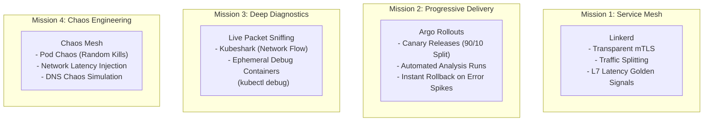

# Stage 10: Mission Extensions — Advanced Operational Patterns

Stage 10 is an **optional catalog of advanced operational missions**. Unlike Stages 1–7 (which form a strict linear learning path), each mission in Stage 10 is an independent, modular lab that can be explored based on your interest.

---

## 🛰️ The Mission Catalog

### Mission 1: Service Mesh with Linkerd
In Stage 2, we secured the cluster edge using TLS at the Gateway. But what about traffic *inside* the cluster between microservices (e.g. `booking` calling `flight`)?

A **Service Mesh** injects a high-performance, lightweight sidecar proxy (written in Rust in Linkerd) into every Pod:
- **Transparent Mutual TLS (mTLS)**: Every TCP connection between microservices is automatically encrypted and authenticated using short-lived cryptographic identities, without modifying a single line of Go or Python application code.
- **Service-to-Service Golden Metrics**: Measures request success rate, latency percentiles, and throughput directly from the sidecar.
- **Traffic Splitting**: Dynamically splits traffic between different versions of a backend service.

---

### Mission 2: Progressive Delivery with Argo Rollouts
In Stage 1, we executed standard Kubernetes Rolling Updates. But rolling updates have a major weakness: if version 2 has a subtle bug that only triggers after 100 requests, Kubernetes will replace 100% of your fleet before you realize anything is wrong!

**Argo Rollouts** replaces the standard `Deployment` with a `Rollout` custom resource:
- **Canary Deployments**: Routes 10% of real user traffic to the new version while keeping 90% on the stable version.
- **Analysis Templates**: Automatically queries Prometheus every 30 seconds:
  *Is the 5xx error rate for canary pods below 1%? Is p95 latency below 200ms?*
- **Automated Rollback**: If Prometheus metrics violate the SLO, Argo Rollouts **aborts the deployment instantly and restores 100% traffic to the stable version** without human intervention!

---

### Mission 3: Live Debugging & Packet Inspection
How do you debug a minimal, stripped-down production container (like `alpine:3.19` or `distroless`) that has no bash, no curl, and no package manager?

1. **Ephemeral Containers (`kubectl debug`)**:
   Attaches a temporary container containing diagnostic tools (`curl`, `tcpdump`, `strace`) into the existing network and process namespace of a running Pod without restarting it!
2. **Kubeshark**:
   The API traffic analyzer for Kubernetes. It uses eBPF to capture, dissect, and visualize live HTTP, gRPC, and PostgreSQL traffic flowing between Apollo microservices in real time without proxy sidecars.

---

### Mission 4: Chaos Engineering with Chaos Mesh
How do you prove that Apollo Airlines is truly fault-tolerant?
By breaking things in production on purpose!

Using **Chaos Mesh**, you define declarative chaos experiments:
- **Pod Chaos**: Kills random `booking` pods every 60 seconds to prove that Envoy Gateway and ReplicaSets maintain zero user-facing 500 errors.
- **Network Latency Chaos**: Injects 500ms of simulated latency between `booking` and `identity-db` to verify application timeouts and circuit breakers.
- **Packet Loss Chaos**: Drops 20% of packets between `flight` and `flight-db` to test database connection retry policies.

---

## 🧭 Status & Learner Guidance

:::note Optional Catalog
As documented in `ROADMAP.md`, Stage 10 is designed as a standalone menu of advanced operational experiments. None of these missions are prerequisites for the core curriculum.
:::

👉 **Explore [Stage 11: Towards Mars (Specialization Catalog)](./stage-11)**
