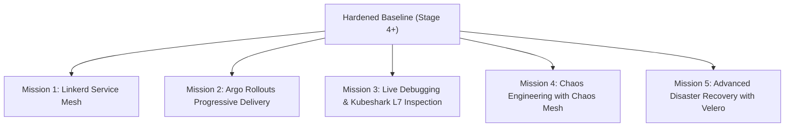

# Stage 10: Production Operations Missions

**Stage 10 is an optional catalog of independent, advanced operational missions.** 

Unlike Stages 1 through 9, which form a strict linear learning path, Stage 10 missions are **modular**. You can pick and choose missions based on your operational interests without needing to complete the entire catalog. Each mission starts from a known working baseline, introduces one mechanism, runs an observable experiment, and returns the cluster to a clean state.



---

## Mission 1: Service Mesh with Linkerd

### Mission Objective
Provide zero-trust, mutual TLS (mTLS) encryption, Layer 7 traffic metrics, retries, and traffic splitting across all Apollo Airlines microservices without changing a single line of application code.

### 1. Install Linkerd CLI & Control Plane
```bash
# 1. Install Linkerd CLI
curl -fsSL https://run.linkerd.io/install | sh
export PATH=$PATH:$HOME/.linkerd2/bin

# 2. Run pre-installation cluster validation
linkerd check --pre

# 3. Install Linkerd CRDs and core control plane
linkerd install --crds | kubectl apply -f -
linkerd install | kubectl apply -f -
linkerd check
```

### 2. Mesh Apollo Airlines
Enable automatic sidecar proxy injection on the application namespace:
```bash
kubectl annotate namespace apollo-airlines-apps linkerd.io/inject=enabled --overwrite
kubectl rollout restart deployment -n apollo-airlines-apps
```

### 3. Verify mTLS & Traffic Splitting
Inspect live traffic security between microservices:
```bash
# Verify mTLS encryption between booking and flight
linkerd-viz edges -n apollo-airlines-apps
# Returns: FROM: booking, TO: flight, SECURED: true (mTLS active!)
```

### 4. Teardown
```bash
linkerd uninstall | kubectl delete -f -
```

---

## Mission 2: Progressive Delivery with Argo Rollouts

### Mission Objective
Replace standard Kubernetes rolling updates with **Canary and Blue-Green progressive delivery**, routing a small percentage of user traffic to a new version while automated analysis gates promotion.

### 1. Install Argo Rollouts
```bash
# Install Argo Rollouts controller
kubectl create namespace argo-rollouts
kubectl apply -n argo-rollouts -f https://github.com/argoproj/argo-rollouts/releases/latest/download/install.yaml

# Install kubectl plugin
curl -LO https://github.com/argoproj/argo-rollouts/releases/latest/download/kubectl-argo-rollouts-linux-amd64
chmod +x kubectl-argo-rollouts-linux-amd64 && sudo mv kubectl-argo-rollouts-linux-amd64 /usr/local/bin/kubectl-argo-rollouts
```

### 2. Deploy Canary Rollout
Convert the `booking` Deployment to a `Rollout`:

```yaml
apiVersion: argoproj.io/v1alpha1
kind: Rollout
metadata:
  name: booking
  namespace: apollo-airlines-apps
spec:
  replicas: 5
  strategy:
    canary:
      steps:
        - setWeight: 20                  # Route 20% traffic to canary
        - pause: { duration: 10m }       # Pause for metrics observation
        - setWeight: 50                  # Route 50% traffic
        - pause: { duration: 10m }
```

### 3. Trigger & Monitor Canary Release
```bash
# Update canary image
kubectl argo rollouts set image booking booking=apollo11/booking:v2.0.0 -n apollo-airlines-apps

# Interactive terminal dashboard
kubectl argo rollouts get rollout booking -n apollo-airlines-apps --watch
```

---

## Mission 3: Live Debugging & Kubeshark L7 Inspection

### Mission Objective
Diagnose production failures on hardened, minimal container images without SSH access or installing debug utilities into production containers.

### Part A: Ephemeral Debug Containers
Because Apollo11 images run without package managers, curl, or shells, use `kubectl debug` to attach an ephemeral container sharing the target Pod's Linux namespaces:

```bash
BOOKING_POD=$(kubectl get pod -n apollo-airlines-apps -l app=booking -o jsonpath='{.items[0].metadata.name}')

# Launch netshoot debug container attached to booking's network and process namespace
kubectl debug -it "$BOOKING_POD" -n apollo-airlines-apps \
  --image=nicolaka/netshoot --target=booking -- sh
```

From inside the ephemeral shell:
```bash
# Inspect listening sockets
ss -tulpn

# Sniff packets on container eth0
tcpdump -i eth0 port 8082
```

### Part B: Kubeshark (eBPF Protocol Sniffer)
Kubeshark captures Layer 7 traffic in real time without proxy injection:

```bash
# Download and start Kubeshark
curl -Lo kubeshark https://github.com/kubeshark/kubeshark/releases/latest/download/kubeshark_linux_amd64
chmod +x kubeshark && sudo mv kubeshark /usr/local/bin/

# Tap traffic in apollo-airlines-apps
kubeshark tap -n apollo-airlines-apps
```

Open the local browser interface to inspect decrypted HTTP, gRPC, and PostgreSQL wire protocol transactions in real time.

---

## Mission 4: Chaos Engineering with Chaos Mesh

### Mission Objective
Prove platform self-healing by injecting controlled, real-world infrastructure failures.

### 1. Install Chaos Mesh
```bash
curl -sSL https://mirrors.chaos-mesh.org/v2.6.2/install.sh | bash
```

### 2. Failure Experiment: Pod Chaos
Randomly terminate booking Pods every 60 seconds to prove that Envoy Gateway and `booking-pdb` maintain zero-downtime availability:

```yaml
apiVersion: chaos-mesh.org/v1alpha1
kind: PodChaos
metadata:
  name: pod-failure-experiment
  namespace: apollo-airlines-apps
spec:
  action: pod-kill
  mode: fixed
  value: '1'
  selector:
    namespaces:
      - apollo-airlines-apps
    labelSelectors:
      app: booking
  scheduler:
    cron: '@every 1m'
```

### 3. Failure Experiment: Network Latency Injection
Inject 200ms of synthetic network latency between `search` and `flight`:

```yaml
apiVersion: chaos-mesh.org/v1alpha1
kind: NetworkChaos
metadata:
  name: network-delay-experiment
  namespace: apollo-airlines-apps
spec:
  action: delay
  mode: all
  selector:
    namespaces:
      - apollo-airlines-apps
    labelSelectors:
      app: search
  delay:
    latency: '200ms'
    jitter: '20ms'
  direction: to
  target:
    selector:
      namespaces:
        - apollo-airlines-apps
      labelSelectors:
        app: flight
```

Observe how the Grafana latency dashboard reflects the 200ms bump while Redis cache hits remain unaffected at &lt;2ms!

---

## Mission 5: Advanced Disaster Recovery with Velero

### Mission Objective
Perform complete cross-cluster backup, state evacuation, and disaster recovery.

```bash
# 1. Install Velero CLI
curl -fsSL https://github.com/vmware-tanzu/velero/releases/latest/download/velero-linux-amd64.tar.gz | tar -xz

# 2. Create complete cluster backup
velero backup create apollo-dr-full \
  --include-namespaces apollo-airlines-apps,apollo-airlines-ui \
  --snapshot-volumes

# 3. Simulate Total Catastrophe
kubectl delete ns apollo-airlines-apps apollo-airlines-ui

# 4. Perform Disaster Recovery
velero restore create --from-backup apollo-dr-full

# 5. Verify Complete Restoration
kubectl get pods -n apollo-airlines-apps
```

---

## Explain & Review Questions

1. **How does a Service Mesh like Linkerd provide mTLS without changing application code?**
   It injects a lightweight proxy (sidecar) into every Pod. The application speaks plain HTTP to localhost, and the proxy intercepts the traffic, encrypts it using certificates issued by the mesh control plane, and forwards it to the destination proxy, which decrypts it.

2. **What is the difference between a Kubernetes `Deployment` rolling update and an Argo Rollout Canary?**
   A Deployment rolling update blindly replaces pods based on health probes, shifting 100% of traffic to new pods as they become ready. A Canary Rollout allows you to shift only a small percentage (e.g., 5%) of real user traffic to the new version, pause, measure error rates, and automatically rollback if metrics fail.

3. **Why use Chaos Engineering in production?**
   To proactively prove that the system can survive node failures, network partitions, and pod crashes automatically, rather than discovering single points of failure during an unplanned 3 AM outage.