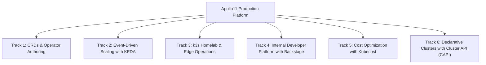

# Stage 11: Towards Mars — Platform Engineering Specializations

**Stage 11 is an advanced specialization catalog for aspiring Platform Engineers and Site Reliability Engineers.**

Rather than a single linear deployment, Stage 11 provides specialized tracks that extend Kubernetes into a comprehensive internal developer platform. Each track defines its own prerequisites, architectural concepts, and hands-on lab exercises.



---

## Track 1: Custom Resources (CRDs) & Operator Authoring

### The Concept
Kubernetes is extensible. You can define your own domain-specific API primitives and write custom Go controllers to reconcile them against the cluster state.

### The Apollo `FlightStatus` CRD

```yaml
apiVersion: apiextensions.k8s.io/v1
kind: CustomResourceDefinition
metadata:
  name: flightstatuses.apollo.io
spec:
  group: apollo.io
  versions:
    - name: v1
      served: true
      storage: true
      schema:
        openAPIV3Schema:
          type: object
          properties:
            spec:
              type: object
              properties:
                flightNumber: { type: string }
                origin: { type: string }
                destination: { type: string }
                status: { type: string, enum: ["SCHEDULED", "BOARDING", "DEPARTED", "ARRIVED", "CANCELLED"] }
            status:
              type: object
              properties:
                activeReplicas: { type: integer }
                phase: { type: string }
  scope: Namespaced
  names:
    plural: flightstatuses
    singular: flightstatus
    kind: FlightStatus
    shortNames: ["fs"]
```

### The Controller Reconciliation Loop (Go)

```go
func (r *FlightStatusReconciler) Reconcile(ctx context.Context, req ctrl.Request) (ctrl.Result, error) {
    log := r.Log.WithValues("flightstatus", req.NamespacedName)

    var flightStatus apollov1.FlightStatus
    if err := r.Get(ctx, req.NamespacedName, &flightStatus); err != nil {
        return ctrl.Result{}, client.IgnoreNotFound(err)
    }

    // Business Logic: If status is CANCELLED, scale down notification workers
    if flightStatus.Spec.Status == "CANCELLED" {
        log.Info("Flight cancelled. Reconciling downstream dependencies...")
        // Update observed generation and status
        flightStatus.Status.Phase = "Reconciled"
        _ = r.Status().Update(ctx, &flightStatus)
    }

    return ctrl.Result{}, nil
}
```

---

## Track 2: Event-Driven Autoscaling with KEDA

### The Problem
Kubernetes HPA scales on CPU and memory. But what if your notification service is receiving 10,000 bookings queued in Redis while CPU usage is still near zero? Standard HPA won't scale in time.

### The Solution: KEDA (Kubernetes Event-driven Autoscaling)
KEDA drives HPA scaling based on external event queues:

```yaml
apiVersion: keda.sh/v1alpha1
kind: ScaledObject
metadata:
  name: notification-redis-scaler
  namespace: apollo-airlines-apps
spec:
  scaleTargetRef:
    apiVersion: apps/v1
    kind: Deployment
    name: notification
  minReplicaCount: 1
  maxReplicaCount: 20
  triggers:
    - type: redis
      metadata:
        address: redis:6379
        listName: booking_notifications
        listLength: "50"   # Add 1 pod for every 50 pending notifications in Redis!
```

---

## Track 3: k3s Homelab & Edge Deployment

Deploy Apollo Airlines on low-cost bare-metal hardware (Intel NUC, Raspberry Pi) and expose services securely to the public internet using **Cloudflare Zero Trust Tunnels** without opening firewall ports.

👉 See the complete guide: **[k3s Homelab Setup](./stage-11/k3s-homelab.md)**.

---

## Track 4: Internal Developer Platform (IDP) with Backstage

Backstage (created by Spotify) centralizes service ownership, documentation, and automated scaffolding:
1. **Service Catalog:** Tracks ownership, APIs, dependencies, and health for all 6 Apollo microservices.
2. **Software Templates:** Enables developers to click "Create New Go Microservice", automatically generating Git repositories, Dockerfiles, and Helm charts conforming to Apollo11 standards.
3. **TechDocs:** Markdown documentation rendered directly from service repositories.

---

## Track 5: Cluster Cost Optimization with Kubecost & Goldilocks

1. **Kubecost:** Allocates cluster spend across namespaces, Deployments, and teams in real time based on AWS/GCP cloud billing rates.
2. **Goldilocks:** Visualizes VPA recommendations to right-size CPU/memory requests, eliminating cloud waste without compromising stability.

---

## Track 6: Declarative Clusters with Cluster API (CAPI)

Cluster API treats entire Kubernetes clusters as declarative resources managed by a management cluster:

```yaml
apiVersion: cluster.x-k8s.io/v1beta1
kind: Cluster
metadata:
  name: apollo-cloud-cluster
spec:
  clusterNetwork:
    pods: { cidrBlocks: ["192.168.0.0/16"] }
  infrastructureRef:
    apiVersion: infrastructure.cluster.x-k8s.io/v1beta1
    kind: AWSCluster
    name: apollo-aws-infra
```

Running `kubectl apply -f cluster.yaml` automatically creates the cloud VPC, control plane, and worker pools!

---

## Explain & Review Questions

1. **What is the difference between a Custom Resource Definition (CRD) and an Operator/Controller?**
   A CRD simply extends the Kubernetes API to accept new YAML schemas (the "What"). An Operator or Controller is the background software loop that watches those CRDs and actually performs the automation to make the real world match the YAML (the "How").

2. **Why use KEDA over the native HorizontalPodAutoscaler (HPA)?**
   HPA is limited to CPU/Memory or complex custom metrics adapters. KEDA allows scaling based on external events directly (like the number of messages in a Kafka topic or AWS SQS queue) and importantly, it can scale workloads all the way down to **zero** pods when there is no event activity.

3. **How does k3s differ from standard upstream Kubernetes (k8s)?**
   k3s is a lightweight, single-binary distribution. It strips out legacy drivers, replaces the heavy `etcd` datastore with a SQL database (like SQLite), and bundles everything needed (containerd, Flannel CNI, Traefik, metrics-server) into one sub-100MB executable, making it perfect for Edge IoT devices, Raspberry Pis, and CI pipelines.