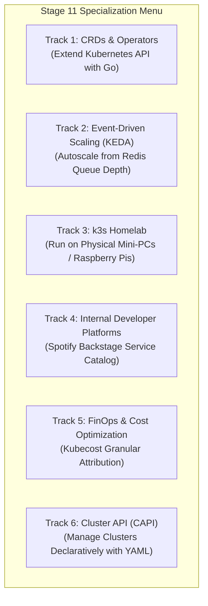

# Stage 11: Towards Mars — Specialization Catalog

Stage 11 represents the **frontier of modern cloud-native engineering**. Once you have mastered running applications on Kubernetes, where do you go next?

This stage offers a menu of independent **specialization tracks**, allowing you to dive deep into custom operators, event-driven scaling, bare-metal edge clusters, developer platforms, or cost optimization.



---

## 🚀 The Specialization Tracks

### Track 1: Custom Resource Definitions (CRDs) & Operators
Kubernetes is not just a container runner; it is a generic, extensible state reconciliation platform.
- **Custom Resource Definition (CRD)**: Defines a new object type in the Kubernetes API (e.g. `kind: FlightSchedule`).
- **Custom Controller (Operator)**: A program written in Go (using `controller-runtime` or Kubebuilder) that watches your custom resource and reconciles real-world state.
- **In Apollo Airlines**: Build an operator that watches a `Flight` CRD, automatically syncs with flight APIs, updates database tables, and emits Kubernetes events when flights are delayed or cancelled!

```yaml
# Conceptual Kubernetes CRD example
apiVersion: aviation.apollo11.io/v1alpha1
kind: FlightSchedule
metadata:
  name: flight-aa-101
  namespace: apollo-airlines-apps
spec:
  flightNumber: "AA101"
  origin: "BOM"
  destination: "SIN"
  departureTime: "10:30:00Z"
  totalSeats: 180
```

---

### Track 2: Event-Driven Autoscaling with KEDA
In Stage 7, we scaled `search` based on CPU utilization. But background processing (like sending booking confirmation emails in `notification`) is **event-driven**, not CPU-bound.
- If 10,000 reservations are created in 10 seconds, the Redis queue has 10,000 pending tasks, but the `notification` worker might only consume 5% CPU while processing one by one!
- **KEDA (Kubernetes Event-driven Autoscaling)** connects directly to event sources (Redis, RabbitMQ, Kafka, AWS SQS).
- It scales the `notification` Deployment from **0 to 20 replicas** based on **queue depth** (`redis_list_length`), and scales back down to **zero** when the queue is empty!

---

### Track 3: Operating a k3s Homelab
Tired of simulated local clusters or paying AWS cloud bills?
Build a physical bare-metal Kubernetes homelab on your home desk!
- **k3s**: A lightweight, certified, fully compliant Kubernetes distribution packaged as a single 100 MB binary by Rancher/SUSE.
- Runs with low memory overhead on Raspberry Pis, Intel NUCs, or refurbished mini-PCs.
- Learn bare-metal reality: physical static IP assignment, Layer 2 networking, local NVMe storage classes, and exposing your Apollo Airlines cluster securely to the internet via Cloudflare Tunnels!

---

### Track 4: Internal Developer Platforms (IDP) with Backstage
In large organizations, developers don't want to write raw Kubernetes YAML or search through dozens of repositories.
- **Spotify Backstage**: An open-source framework for building unified developer portals.
- Provides a centralized **Software Catalog** tracking ownership of Apollo microservices (`booking`, `flight`, `identity`).
- Integrates API documentation (OpenAPI / Swagger specs), CI/CD pipeline status, and one-click scaffolding for spinning up new microservices with pre-baked Kubernetes manifests and Helm charts.

---

### Track 5: FinOps & Cost Optimization with Kubecost
In the cloud, every millicore of CPU and every gigabyte of RAM costs money.
- **Kubecost**: Integrates with Kubernetes metrics and cloud billing APIs (AWS, GCP, Azure).
- Provides real-time, granular cost allocation broken down by **Namespace, Deployment, Service, and Label**.
- Identifies idle, over-provisioned resources:
  *e.g. "The search Deployment requested 2 CPUs but only averaged 0.1 CPUs over the past 30 days, wasting $84/month."*

---

### Track 6: Cluster API (CAPI)
How do you manage 50 Kubernetes clusters across multiple clouds and on-premises datacenters?
By using Kubernetes to manage Kubernetes!
- **Cluster API (CAPI)**: A Kubernetes project that brings declarative, Kubernetes-style APIs to cluster creation, configuration, and management.
- You define a new Kubernetes cluster as a YAML manifest (`kind: Cluster`), and the CAPI controller interacts with cloud APIs (AWS, GCP, vSphere) to provision VPCs, virtual machines, and bootstraps Kubernetes automatically!

---

## 🏁 The Journey Continues

You have traveled from the foundational mechanics of containers in Launchpad to the cutting edge of cloud-native systems.

To test your comprehensive operational mastery, proceed to the final challenge:

👉 **[The Apollo11 Capstone Challenge](./capstone)** — An end-to-end mission synthesizing deployment, failure recovery, scaling, and observability!
