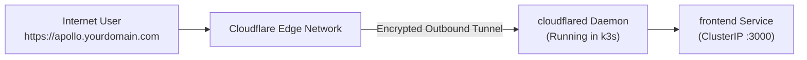

# k3s Homelab & Edge Setup

**k3s** is an official CNCF-certified, lightweight Kubernetes distribution developed by Rancher/SUSE. Packaged as a single &lt;60MB binary, it strips out legacy in-tree cloud providers and storage drivers, replacing them with lightweight alternatives (SQLite instead of etcd, embedded Traefik Ingress, and built-in `local-path` storage).

This guide walks through deploying Apollo Airlines to a physical homelab (e.g. Raspberry Pi 4/5, Intel NUC, or mini PC) and exposing it securely to the public internet using **Cloudflare Zero Trust Tunnels** without opening a single firewall port.

---

## Why k3s for Homelabs?

| Feature | Standard Kubernetes | k3s |
|---|---|---|
| **Binary Size** | ~120MB+ | ~60MB (Single binary) |
| **Idle Memory Usage** | ~1.5GB – 2GB | ~512MB RAM |
| **Datastore** | etcd (requires fast NVMe disks) | SQLite (single node) or embedded etcd (multi-node) |
| **Bundled Addons** | None | Built-in CoreDNS, Traefik, Flannel, `local-path` provisioner |
| **Installation** | Multi-step (`kubeadm`) | Single shell command |

---

## 1. Hardware Recommendations

| Role | Minimum Specs | Recommended Specs |
|---|---|---|
| **Control Plane (Server)** | 2 CPU cores, 2GB RAM | 4 CPU cores, 4GB RAM (e.g. Raspberry Pi 4 4GB/8GB) |
| **Worker (Agent)** | 1 CPU core, 1GB RAM | 2 CPU cores, 4GB RAM |
| **Storage** | 32GB Class 10 MicroSD | 128GB+ USB 3.0 NVMe SSD (avoids SD card write exhaustion) |

---

## 2. Installing k3s

### Option A: Single-Node Installation (Server + Agent in One)

Run on your homelab server:

```bash
curl -sfL https://get.k3s.io | INSTALL_K3S_EXEC="--disable=traefik" sh -
```

:::tip Disabling Built-in Traefik
We pass `--disable=traefik` if we want to run our Stage 2 / Stage 5 **Envoy Gateway + MetalLB** stack instead, or leave it enabled if you want k3s to manage ingress natively.
:::

Check node readiness:
```bash
sudo kubectl get nodes -o wide
```

### Option B: Multi-Node Cluster Setup

#### On the Server (Control Plane):
```bash
curl -sfL https://get.k3s.io | K3S_TOKEN="apollo11-super-secret-token" sh -
```

Get the server's local LAN IP (e.g. `192.168.1.50`).

#### On Worker Nodes (Agents):
```bash
curl -sfL https://get.k3s.io | \
  K3S_URL="https://192.168.1.50:6443" \
  K3S_TOKEN="apollo11-super-secret-token" sh -
```

---

## 3. Deploying Apollo Airlines to k3s

Because k3s is 100% CNCF conformance certified, the Apollo11 Stage 5 Helm chart runs directly on k3s:

```bash
# Export k3s kubeconfig for local access
export KUBECONFIG=/etc/rancher/k3s/k3s.yaml

# Install Apollo Airlines using Dev values
helm install apollo11 stages/stage5/helm/apollo11 \
  -f stages/stage5/helm/apollo11/values-dev.yaml \
  --set metallb.enabled=false \
  --set gateway.enabled=false
```

:::info Storage on k3s
k3s includes Rancher's `local-path` provisioner as its default StorageClass out of the box. Stage 3's StatefulSets bind to 1Gi PVCs automatically without additional storage configuration!
:::

---

## 4. Secure External Exposure: Cloudflare Zero Trust Tunnels

Exposing home servers via dynamic DNS and home router port forwarding (`80`/`443`) exposes your home IP to DDoS attacks and port scanners.

**Cloudflare Tunnels (`cloudflared`)** establishes an outbound-only, encrypted HTTP/2 or QUIC tunnel from your homelab to Cloudflare's edge network. No ports are opened on your home router!



### Step 1: Create a Cloudflare Tunnel
1. Log in to the [Cloudflare Zero Trust Dashboard](https://one.dash.cloudflare.com/).
2. Navigate to **Networks** ➔ **Tunnels** ➔ **Create a Tunnel**.
3. Select **Cloudflared** and give it a name (e.g., `apollo-homelab`).
4. Copy the provided tunnel token.

### Step 2: Deploy `cloudflared` into k3s

```yaml
apiVersion: apps/v1
kind: Deployment
metadata:
  name: cloudflared
  namespace: apollo-airlines-ui
spec:
  replicas: 2
  selector:
    matchLabels:
      app: cloudflared
  template:
    metadata:
      labels:
        app: cloudflared
    spec:
      containers:
        - name: agent
          image: cloudflare/cloudflared:latest
          args:
            - tunnel
            - --no-autoupdate
            - run
            - --token
            - "YOUR_CLOUDFLARE_TUNNEL_TOKEN_HERE"
```

### Step 3: Configure Ingress Rules
In the Cloudflare Dashboard, map Public Hostname:
- **Public Hostname:** `apollo.yourdomain.com`
- **Service Type:** `HTTP`
- **URL:** `frontend.apollo-airlines-ui.svc.cluster.local:3000`

Now open `https://apollo.yourdomain.com` from anywhere in the world on your smartphone or laptop — your homelab Apollo Airlines application is live and secured behind Cloudflare DDoS protection and automated TLS!