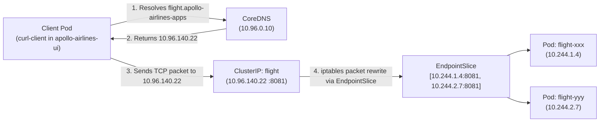

# Stage 2: Guidance — Networking & Edge Access

:::note[Take the controls · Guidance lab]
Trace the route from a passenger’s request to the service that answers it.
For the explanation before the experiment, start with the
[Guidance chapters](./learn/networking/pod-network-and-cni). You can return to this lab whenever you’re ready.
:::

Stage 1 gave every Apollo component a Service name, but it left two questions
unanswered. First: when a booking Pod is replaced, how does another service find
the replacement without discovering its new IP? Second: how does a browser reach
the platform without learning a different high port for every service?

In **Stage 2 (Guidance)**, we organize our architecture into two production namespaces:
- **`apollo-airlines-apps`**: Backend microservices (`identity`, `flight`, `booking`, `search`, `notification`), databases, and Redis.
- **`apollo-airlines-ui`**: Frontend customer web tier (`frontend`).

Stage 2 answers those questions one layer at a time. Do not treat the five
substages as five competing ways to “do networking.” Each one exposes a missing
piece of the previous arrangement: stable internal identity, host reachability,
HTTP routing, local load-balancer addresses, and finally a richer routing API.

```
Substage 1                 Substage 2            Substage 3                Substage 4             Substage 5
──────────                 ──────────            ──────────                ──────────             ──────────
ClusterIP & DNS     ──►    NodePort       ──►    Traefik Ingress    ──►    MetalLB LoadBalancer ──► Envoy Gateway API
Internal FQDN              High NodePorts        Host routing              L2 ARP real IP         Gateway API CRDs
Endpoints & Slices         30080–30084           Local TLS termination     Port 80 / 443          Canonical Baseline
```

| Substage | Mechanism | Protocol / Port | Core Learning Outcome |
|---|---|---|---|
| **01: Internal DNS** | `Service type: ClusterIP` | Virtual internal IPs | CoreDNS FQDN resolution, `Endpoints` vs `EndpointSlice`, selector binding |
| **02: NodePort** | `Service type: NodePort` | `localhost:30080–30084` | L4 host-to-container forwarding via `kube-proxy`, port target mapping |
| **03: Traefik Ingress** | Traefik v3 IngressController | `*.apollo.local:30088/30443` | L7 Host routing, Ingress resources, wildcard TLS termination with Secrets |
| **04: MetalLB** | MetalLB L2 + `type: LoadBalancer` | `*.apollo.local` on real IP | ARP-based external IP allocation in local clusters, eliminating high NodePorts |
| **05: Envoy Gateway** | Envoy Gateway v1.5.0 + MetalLB | `*.apollo.local` on MetalLB IP | **Canonical Baseline**: GatewayClass, Gateway, HTTPRoute, cross-namespace ReferenceGrant |

:::important[Canonical Access Stack]
**Envoy Gateway + MetalLB (Substage 5)** forms the **canonical access stack** that carries forward into Stage 3 and all subsequent stages. Traefik is a valuable transitional learning step, and NetworkPolicy enforcement is deferred to Stage 8 where Calico makes it observable.
:::

---

## 🪜 Substage 1: a stable name over changing Pods

### How ClusterIP Works
The `flight` Pods are deliberately replaceable. A caller therefore cannot use a
Pod IP as the identity of flight. A `ClusterIP` Service supplies a stable name
and virtual address while the endpoint controller maintains the changing set of
selected, ready Pods behind it.

Kubernetes assigns a Service an address from the service CIDR. That address is
virtual: it is implemented by the node's Service-routing implementation, not by
a process listening on a network card with that IP. The exact mechanism depends
on the cluster configuration; Apollo11's kind config selects `iptables` mode.

*Sources: `stages/ignition/kind-config.yaml` and
`stages/stage2/k8s/substages/01-internal-dns/`.*



This is a runtime model, not a list of fixed Apollo11 addresses. Your Pod IPs
and EndpointSlice names will differ. The sequence matters: DNS resolves a
Service name to the stable virtual address; Service routing chooses a ready
endpoint; the packet reaches the current Pod IP.

### DNS Search Domains & FQDNs
The DNS suffix is part of the identity. In Stage 1, all workloads shared one
namespace, so short names often appeared to work. Once the frontend moves to
`apollo-airlines-ui`, the short name `identity` means “identity in *my*
namespace,” not “the identity service I happened to intend.” The namespace is
therefore not just an organisational folder; it changes DNS resolution.
Inside every container, `/etc/resolv.conf` is populated by the kubelet with search domains:
```text
search apollo-airlines-ui.svc.cluster.local svc.cluster.local cluster.local
nameserver 10.96.0.10
options ndots:5
```

When `curl-client` in `apollo-airlines-ui` queries:
- `identity`: Resolves to `identity.apollo-airlines-ui.svc.cluster.local` (FAILS because `identity` lives in `apollo-airlines-apps`).
- `identity.apollo-airlines-apps`: Resolves to `identity.apollo-airlines-apps.svc.cluster.local` (SUCCEEDS).
- Fully Qualified Domain Name (FQDN): `<service>.<namespace>.svc.cluster.local`.

### Endpoints vs. EndpointSlices
A Service spec says *which labels it wants*. It does not directly mutate Pod
networking. The endpoint controller watches that selector and Pod readiness,
then writes endpoint records. `EndpointSlice` is the scalable API object that
holds those records; older `Endpoints` output is a convenient summary but not
the object to build new integrations around.

The controller's sequence is:
1. When Pods matching `app: flight` transition to `Ready: True`, their IPs and ports are recorded in an `EndpointSlice` (`discovery.k8s.io/v1`).
2. If a Pod fails its readiness probe, Kubernetes marks the endpoint unready.
   Consumers stop choosing it after that state propagates; this reduces traffic
   to unready Pods but does not promise zero dropped connections.

#### Hands-On Lab: Substage 1 Discovery & Break Drill

**Prediction:** changing the Service selector cannot change CoreDNS—the name
will still resolve. What changes is the set of usable endpoints behind that
stable name. That distinction is the heart of Service routing.

- **Objective**: Follow a Service name from DNS to ready endpoints, then prove
  that the selector is the binding contract.
- **Starting point**: Stage 1 images are available in the `apollo11` kind
  cluster. Run from the Apollo11 repository root.
- **Instructions**:

```bash
# 1. Apply Substage 1
./stages/stage2/scripts/apply.sh --substage 1 --skip-build

# 2. Inspect Services and EndpointSlices
kubectl get svc -n apollo-airlines-apps
kubectl get endpointslices -n apollo-airlines-apps

# 3. Test cross-namespace DNS from curl-client
kubectl exec -n apollo-airlines-ui curl-client -- nslookup identity.apollo-airlines-apps.svc.cluster.local
kubectl exec -n apollo-airlines-ui curl-client -- curl -s http://identity.apollo-airlines-apps.svc.cluster.local:8080/healthz
```

**Break Drill**: Break the selector on the `identity` Service:
```bash
kubectl patch svc identity -n apollo-airlines-apps -p '{"spec":{"selector":{"app":"identity-broken"}}}'

# Observe the endpoint list become empty after the selector change propagates
kubectl get endpoints identity -n apollo-airlines-apps

# Attempt curl from client pod (fails with timeout):
kubectl exec -n apollo-airlines-ui curl-client -- curl -s --connect-timeout 3 http://identity.apollo-airlines-apps.svc.cluster.local:8080/healthz || echo "Connection failed as expected!"
```

**Recover**:
```bash
kubectl patch svc identity -n apollo-airlines-apps -p '{"spec":{"selector":{"app":"identity"}}}'
kubectl get endpoints identity -n apollo-airlines-apps
```

- **Expected result**: DNS and the health request work before the patch; the
  endpoint list becomes empty and the request fails after it; recovery restores
  endpoint addresses.
- **Verification**: Repeat the final in-cluster `curl`; it must return the
  identity health response.
- **Troubleshooting**: If `curl-client` is absent, inspect the substage apply
  output and `kubectl get pod -n apollo-airlines-ui curl-client`. If endpoints
  stay empty after recovery, compare Service selectors with Pod labels.
- **Concept reinforced**: DNS finds a Service, while selectors and readiness
  determine which Pod endpoints can receive its traffic.

---

## 🚪 Substage 2: NodePort External Access

A ClusterIP is deliberately internal. Your laptop has no route to the service
network identity, so we need a boundary crossing. `NodePort` keeps the same
Service and endpoints, then exposes an additional port on eligible nodes.

`type: NodePort` builds directly on top of `ClusterIP`. It allocates a dedicated port from the cluster's NodePort range (`30000–32767`) and opens that port on **every single node** in the cluster.

*Source: `stages/stage2/k8s/substages/02-nodeport/nodeport-services.yaml` (the `flight` Service document)*

```yaml
apiVersion: v1
kind: Service
metadata:
  name: flight
  namespace: apollo-airlines-apps
spec:
  type: NodePort
  selector:
    app: flight
  ports:
    - name: http
      port: 8081
      targetPort: 8081
      nodePort: 30081
```

For Apollo11 the path is: host `localhost:30081` → kind control-plane container
port `30081` → NodePort Service → a ready flight endpoint on port `8081`.
`kind-config.yaml` supplies the first hop; Kubernetes supplies the latter two.
Without the kind mapping, declaring the NodePort would not by itself make your
laptop's localhost reachable.

#### Hands-On Lab: Substage 2 NodePort

**Prediction:** the application still receives traffic on port `8081`. Port
`30081` belongs to the node-facing Service entry point, not to the flight
container.

- **Objective**: Reach a Kubernetes Service from the host through a configured
  NodePort.
- **Starting point**: Substage 1 works and the cluster was created with
  `stages/ignition/kind-config.yaml`.
- **Instructions**:

```bash
# Apply Substage 2
./stages/stage2/scripts/apply.sh --substage 2 --skip-build

# Query from host laptop
curl -s http://localhost:30081/readyz
curl -s http://localhost:30080/ # Frontend
```

- **Expected result**: Flight readiness and the frontend respond on their
  mapped host ports.
- **Verification**: `kubectl get svc -A | grep NodePort` shows the declared
  `30080`–`30084` ports.
- **Troubleshooting**: If localhost refuses the connection, confirm the kind
  cluster uses the checked-in port mappings; adding a NodePort to a cluster
  created without those mappings does not expose it through the kind container.
- **Concept reinforced**: NodePort adds node-level reachability on top of the
  existing ClusterIP Service.

### Why NodePort is insufficient for production:
- Port numbers must be between `30000` and `32767` (unfriendly for users expecting port 80/443).
- Every node opens the port, consuming node resources.
- No Layer 7 features: No path routing, no hostname routing, no centralized TLS termination.

---

## 🚦 Substage 3: Traefik Ingress & Wildcard TLS

NodePort proves reachability, but it moves URL design into port numbers. A
passenger should not need to know that flight uses `30081` and booking uses
`30082`. HTTP already carries a Host header, so an edge proxy can use one public
address and choose a backend based on the requested hostname.

An **Ingress** is merely a configuration object describing routing rules. It requires an **Ingress Controller** (such as Traefik, NGINX, or Contour) to watch the API and configure a reverse proxy.

*Source: `stages/stage2/k8s/substages/03-traefik-ingress-tls/03-ingress-apps.yaml`*

```yaml
apiVersion: networking.k8s.io/v1
kind: Ingress
metadata:
  name: identity
  namespace: apollo-airlines-apps
spec:
  ingressClassName: traefik
  tls:
    - hosts:
        - identity.apollo.local
      secretName: apollo-tls-secret
  rules:
    - host: identity.apollo.local
      http:
        paths:
          - path: /
            pathType: Prefix
            backend:
              service:
                name: identity
                port:
                  number: 8080
```

The source file contains separate Ingress documents for `identity`, `flight`,
`booking`, and `search`; this is the complete `identity` document. Follow the
indentation as `spec.rules[] → http.paths[] → backend.service`.
`ingressClassName` selects Traefik, and the host rule maps requests to the
`identity` Service on port `8080`.

The Ingress object itself does not open a port or terminate TLS. Traefik watches
Ingress objects that select its class, configures its own proxy, and then makes
an ordinary Service request to `identity`. When the TLS Secret changes or is
missing, the proxy's certificate behaviour changes while the backend Service
and Pods can remain healthy. The break drill isolates that edge dependency.

### Wildcard TLS with Secrets
Substage 3 uses OpenSSL to generate a self-signed wildcard certificate for `*.apollo.local` stored in a Kubernetes Secret:

```bash
# Inspect metadata and key names without printing private-key material
kubectl describe secret apollo-tls-secret -n apollo-airlines-apps
```

#### Hands-On Lab: Substage 3 Ingress & TLS Break Drill

**Prediction:** deleting the TLS Secret tests certificate selection at the
edge, not whether the identity Pod is alive. Separate an HTTPS certificate
problem from an application-health problem before looking at backend logs.

- **Objective**: Route by hostname through Traefik, inspect local TLS behavior,
  then recover a deleted certificate Secret.
- **Starting point**: Substage 2 is healthy and OpenSSL is available to the
  checked-in certificate script.
- **Instructions**:

```bash
# 1. Apply Substage 3
./stages/stage2/scripts/apply.sh --substage 3 --skip-build

# 2. Query over HTTPS through host-forwarded port 30443
curl -k --resolve identity.apollo.local:30443:127.0.0.1 https://identity.apollo.local:30443/healthz
```

**Break Drill**: Delete the TLS Secret:
```bash
kubectl delete secret apollo-tls-secret -n apollo-airlines-apps

# Re-inspect TLS certificate returned by Traefik:
curl -kv --resolve identity.apollo.local:30443:127.0.0.1 https://identity.apollo.local:30443/healthz 2>&1 | grep "issuer"
```
Notice Traefik falls back to its default internal certificate: `CN=TRAEFIK DEFAULT CERT`!

**Recover**:
```bash
./stages/stage2/k8s/substages/03-traefik-ingress-tls/generate-certs.sh
curl -kv --resolve identity.apollo.local:30443:127.0.0.1 https://identity.apollo.local:30443/healthz 2>&1 | grep "issuer"
```
Issuer returns to `CN=*.apollo.local`.

- **Expected result**: The health request succeeds before and after recovery;
  while the Secret is absent, Traefik serves its fallback certificate rather
  than the Apollo11 wildcard certificate.
- **Verification**: `kubectl describe secret apollo-tls-secret -n
  apollo-airlines-apps` lists `tls.crt` and `tls.key`, and the final issuer is
  the locally generated wildcard certificate.
- **Troubleshooting**: If the request cannot connect, inspect the Traefik Pod,
  Service, IngressClass, and Ingress events before diagnosing TLS.
- **Concept reinforced**: Ingress is routing configuration consumed by a
  controller; TLS key material is a separate dependency.

---

## ⚡ Substage 4: MetalLB & LoadBalancer IP Provisioning

Ingress gave us HTTP routing, but the local cluster still needs something to
give the proxy a reachable address. In a public cloud, a controller commonly
reacts to `type: LoadBalancer` by provisioning provider infrastructure. The
Apollo11 kind lab has no such provider.

In bare-metal or local `kind` clusters, there is no cloud provider. A `LoadBalancer` Service stays stuck in `<pending>` forever.

**MetalLB** solves this problem by running an internal controller that assigns real IP addresses from a dedicated pool on your local Docker network using Layer 2 ARP:

*Source: `stages/stage2/k8s/substages/04-metallb/01-ip-pool.yaml`*

```yaml
apiVersion: metallb.io/v1beta1
kind: IPAddressPool
metadata:
  name: apollo-pool
  namespace: metallb-system
spec:
  addresses:
    - 172.18.0.50-172.18.0.100
---
apiVersion: metallb.io/v1beta1
kind: L2Advertisement
metadata:
  name: apollo-l2
  namespace: metallb-system
spec:
  ipAddressPools:
    - apollo-pool
```

#### Hands-On Lab: Substage 4 MetalLB

**Prediction:** `type: LoadBalancer` is a request stored on the Service. It is
MetalLB—not the Service object itself—that fulfils the request by choosing an IP
from the configured local pool.

- **Objective**: Observe a local LoadBalancer address assigned from the
  Apollo11 MetalLB pool.
- **Starting point**: Substage 3 is healthy and the kind Docker network uses the
  address range expected by the checked-in MetalLB configuration.
- **Instructions**:

```bash
# 1. Apply Substage 4
./stages/stage2/scripts/apply.sh --substage 4 --skip-build

# 2. Inspect the Traefik LoadBalancer Service
kubectl get svc traefik -n traefik
```

Notice `EXTERNAL-IP` is populated with an address like `172.18.0.50`!
Now you can query standard port 80 and 443 directly on that IP without any high NodePort:

```bash
METALLB_IP=$(kubectl get svc traefik -n traefik -o jsonpath='{.status.loadBalancer.ingress[0].ip}')
curl -H "Host: identity.apollo.local" "http://${METALLB_IP}/healthz"
```

- **Expected result**: The Traefik Service receives an external IP from
  `172.18.0.50-172.18.0.100`, and the host-routed health request succeeds.
- **Verification**: Compare the Service IP with `kubectl get ipaddresspool -n
  metallb-system apollo-pool -o yaml`.
- **Troubleshooting**: An empty external IP points to MetalLB controller,
  speaker, pool, or Docker-network issues. Inspect their Pods and events; do not
  assume every host uses Docker's `172.18.0.0/16` network unchanged.
- **Concept reinforced**: `type: LoadBalancer` is an API request; a controller
  must implement address allocation in the current environment.

---

## 🌐 Substage 5: The Canonical Baseline — Envoy Gateway API

Ingress has taught us the proxy model. Gateway API keeps the same fundamental
route—listener to Service to ready endpoint—but divides the configuration into
objects with clearer ownership. The point is not that Ingress is unusable; it is
that an infrastructure team and an application team often need to change
different parts of the path without sharing one large resource.

While the Ingress API has served Kubernetes for years, it has limitations:
1. **Monolithic & Un-typed**: Advanced features (canary, rate limiting, header rewriting) require vendor-specific annotations.
2. **No Role Separation**: Infrastructure administrators (configuring IP addresses and TLS certificates) and application developers (defining URL paths) fight over the same Ingress YAML file.
3. **Cross-Namespace Anti-Patterns**: Ingress has poor cross-namespace security boundaries.

The **Gateway API** (`gateway.networking.k8s.io`) is the modern official Kubernetes standard, designed with role separation:

```
┌────────────────────────────────────────────────────────┐
│ INFRASTRUCTURE ARCHITECT (Cluster-wide)                │
│ GatewayClass: eg (Envoy Gateway)                       │
└────────────────────────────────────────────────────────┘
                           │
┌────────────────────────────────────────────────────────┐
│ PLATFORM / OPERATIONS TEAM (apollo-airlines-apps)      │
│ Gateway: apollo-gateway (Listens on port 80/443)       │
└────────────────────────────────────────────────────────┘
                           │
         ┌─────────────────┴─────────────────┐
         ▼                                   ▼
┌──────────────────────────────┐  ┌──────────────────────────────┐
│ APP DEVELOPER (apps)         │  │ UI DEVELOPER (ui)            │
│ HTTPRoute: booking           │  │ HTTPRoute: frontend          │
│ host: booking.apollo.local   │  │ host: frontend.apollo.local  │
│ backendRef: booking:8082     │  │ (Allowed by ReferenceGrant!) │
└──────────────────────────────┘  └──────────────────────────────┘
```

### 1. The Gateway Resource

*Source: `stages/stage2/k8s/substages/05-envoy-gateway/01-gateway.yaml`*

```yaml
apiVersion: gateway.networking.k8s.io/v1
kind: Gateway
metadata:
  name: apollo-gateway
  namespace: apollo-airlines-apps
spec:
  gatewayClassName: eg
  infrastructure:
    parametersRef:
      group: gateway.envoyproxy.io
      kind: EnvoyProxy
      name: envoyproxy-lb-config
  listeners:
    - name: web
      port: 80
      protocol: HTTP
      allowedRoutes:
        namespaces:
          from: All
```

Read the status after applying this object. `Accepted=True` tells you that the
implementation accepted the configuration; `Programmed=True` is stronger
evidence that the implementation has configured data-plane resources. Neither
condition proves a backend application is ready—that is still the Service and
EndpointSlice part of the route you learned in Substage 1.

### 2. The HTTPRoute Resource

*Source: `stages/stage2/k8s/substages/05-envoy-gateway/04-httproute-booking.yaml`*

```yaml
apiVersion: gateway.networking.k8s.io/v1
kind: HTTPRoute
metadata:
  name: booking
  namespace: apollo-airlines-apps
spec:
  parentRefs:
    - name: apollo-gateway
  hostnames: ["booking.apollo.local"]
  rules:
    - backendRefs:
        - name: booking
          port: 8082
```

### 3. Cross-Namespace Security: ReferenceGrant

In Gateway API, a route in namespace A cannot silently route traffic to a Service in namespace B unless namespace B explicitly permits it using a **`ReferenceGrant`**:

*Source: `stages/stage2/k8s/substages/05-envoy-gateway/01a-referencegrant.yaml`*

```yaml
apiVersion: gateway.networking.k8s.io/v1beta1
kind: ReferenceGrant
metadata:
  name: apollo-gateway-grant
  namespace: apollo-airlines-ui
spec:
  from:
    - group: gateway.networking.k8s.io
      kind: HTTPRoute
      namespace: apollo-airlines-apps
  to:
    - group: ""
      kind: Service
      name: frontend
```

#### Hands-On Lab: Substage 5 Envoy Gateway Verification

**Prediction:** a successful Gateway condition proves the edge implementation
understood its configuration. A successful `curl` additionally proves the full
chain: Gateway address → route → Service selector → ready application endpoint.

- **Objective**: Verify the canonical Gateway API resource chain and route live
  requests through it.
- **Starting point**: Substage 4 is healthy.
- **Instructions**:

```bash
# 1. Apply Substage 5 (Canonical Baseline)
./stages/stage2/scripts/apply.sh --substage 5 --skip-build

# 2. Inspect Gateway status
kubectl get gateway -n apollo-airlines-apps

# Check for Programmed=True condition:
kubectl describe gateway apollo-gateway -n apollo-airlines-apps | grep -E "(Programmed|Accepted)"

# 3. Inspect all HTTPRoutes
kubectl get httproute -A

# 4. Query services through Envoy Gateway via MetalLB IP
GATEWAY_IP=$(kubectl get gateway apollo-gateway -n apollo-airlines-apps -o jsonpath='{.status.addresses[0].value}')

curl -H "Host: booking.apollo.local" "http://${GATEWAY_IP}/readyz"
curl -H "Host: flight.apollo.local" "http://${GATEWAY_IP}/readyz"
curl -H "Host: identity.apollo.local" "http://${GATEWAY_IP}/readyz"
```

The three requests should return HTTP 200 readiness responses.

- **Expected result**: The Gateway reports an address, all three readiness
  requests return HTTP 200, and the associated routes report accepted,
  resolved backends.
- **Verification**: The Gateway conditions include `Accepted=True` and
  `Programmed=True`; each HTTPRoute reports an accepted parent and resolved
  references.
- **Troubleshooting**: If `Programmed` is false, inspect GatewayClass and Envoy
  Gateway controller logs. If only the frontend cross-namespace route fails,
  inspect its `ReferenceGrant`. If an app route fails, trace its backend Service
  selector and EndpointSlice.
- **Concept reinforced**: GatewayClass selects an implementation, Gateway owns
  listeners, HTTPRoute owns traffic rules, and ReferenceGrant authorizes a
  cross-namespace backend reference.

---

## 🏁 What You Learned

- How CoreDNS resolves internal cluster names (`<svc>.<ns>.svc.cluster.local`) and why short names fail across namespaces.
- The role of `Endpoints` and `EndpointSlices` in dynamically tracking ready Pod IPs.
- How `type: NodePort` forwards host traffic into containers, and why high ports are clunky.
- How Layer 7 Ingress controllers evaluate Host headers and terminate wildcard TLS.
- How MetalLB provisions real Layer 2 IP addresses in local and bare-metal clusters.
- Why the modern **Gateway API** (`GatewayClass`, `Gateway`, `HTTPRoute`, `ReferenceGrant`) provides cleaner role separation and cross-namespace security than legacy Ingress.

---

## ✈️ Before Continuing: Checkpoint

Before moving to Stage 3, ensure you understand:
1. What component maintains iptables rules on worker nodes for ClusterIP services?
2. If an `HTTPRoute` attaches to a Service in another namespace without a `ReferenceGrant`, what status condition appears on the route?
3. Why did we need MetalLB in kind before `type: LoadBalancer` would work?
4. What happens to traffic when a Pod fails its readiness probe?

Now that you have verified the networking ladder and recorded its evidence,
continue to the persistent data problem exposed in Stage 1.

👉 **Continue to [Stage 3: Mission Data (Persistent Storage & StatefulSets)](./stage-3)**
