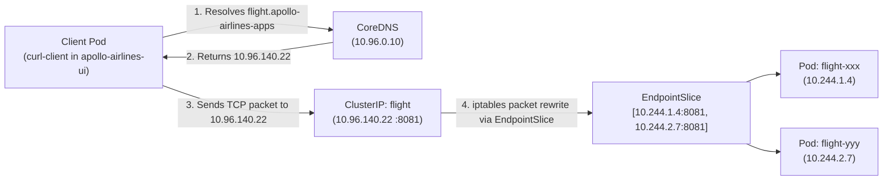

# Stage 2: Guidance — Networking & Edge Access

In Stage 1, all 10 Apollo Airlines workloads ran inside a single namespace, exposed crudely via individual high NodePorts.

In **Stage 2 (Guidance)**, we organize our architecture into two production namespaces:
- **`apollo-airlines-apps`**: Backend microservices (`identity`, `flight`, `booking`, `search`, `notification`), databases, and Redis.
- **`apollo-airlines-ui`**: Frontend customer web tier (`frontend`).

More importantly, Stage 2 walks you through the **5-Substage Networking Ladder**. Rather than jumping straight to complex ingress controllers, you will master each networking layer progressively:

```
Substage 1                 Substage 2            Substage 3                Substage 4             Substage 5
──────────                 ──────────            ──────────                ──────────             ──────────
ClusterIP & DNS     ──►    NodePort       ──►    Traefik Ingress    ──►    MetalLB LoadBalancer ──► Envoy Gateway API
Internal FQDN              High NodePorts        Host routing              L2 ARP real IP         Gateway API CRDs
Endpoints & Slices         30080–30084           Local TLS termination     Port 80 / 443          Canonical Baseline
```

| Substage | Mechanism | Protocol / Port | Core Learning Outcome |
|---|---|---|---|
| **01: Internal DNS** | `Service type: ClusterIP` | Virtual internal IPs | CoreDNS FQDN resolution, `Endpoints` vs `EndpointSlice`, selector binding |
| **02: NodePort** | `Service type: NodePort` | `localhost:30080–30084` | L4 host-to-container forwarding via `kube-proxy`, port target mapping |
| **03: Traefik Ingress** | Traefik v3 IngressController | `*.apollo.local:30088/30443` | L7 Host routing, Ingress resources, wildcard TLS termination with Secrets |
| **04: MetalLB** | MetalLB L2 + `type: LoadBalancer` | `*.apollo.local` on real IP | ARP-based external IP allocation in local clusters, eliminating high NodePorts |
| **05: Envoy Gateway** | Envoy Gateway v1.5.0 + MetalLB | `*.apollo.local` on MetalLB IP | **Canonical Baseline**: GatewayClass, Gateway, HTTPRoute, cross-namespace ReferenceGrant |

:::important Canonical Access Stack
**Envoy Gateway + MetalLB (Substage 5)** forms the **canonical access stack** that carries forward into Stage 3 and all subsequent stages. Traefik is a valuable transitional learning step, and NetworkPolicy enforcement is deferred to Stage 8 where Calico makes it observable.
:::

---

## 🪜 Substage 1: Internal Discovery & CoreDNS

### How ClusterIP Works
When you declare a Service with `type: ClusterIP`, Kubernetes assigns a virtual IP from the service CIDR (e.g. `10.96.0.0/16`). This IP does not correspond to any physical network interface; it exists solely as `iptables` or `IPVS` rules managed by `kube-proxy` on each node.



### DNS Search Domains & FQDNs
Inside every container, `/etc/resolv.conf` is populated by the kubelet with search domains:
```text
search apollo-airlines-ui.svc.cluster.local svc.cluster.local cluster.local
nameserver 10.96.0.10
options ndots:5
```

When `curl-client` in `apollo-airlines-ui` queries:
- `identity`: Resolves to `identity.apollo-airlines-ui.svc.cluster.local` (FAILS because `identity` lives in `apollo-airlines-apps`).
- `identity.apollo-airlines-apps`: Resolves to `identity.apollo-airlines-apps.svc.cluster.local` (SUCCEEDS).
- Fully Qualified Domain Name (FQDN): `<service>.<namespace>.svc.cluster.local`.

### Endpoints vs. EndpointSlices
A Service does not talk to Pods directly. The control plane runs an **EndpointSlice controller**:
1. When Pods matching `app: flight` transition to `Ready: True`, their IPs and ports are recorded in an `EndpointSlice` (`discovery.k8s.io/v1`).
2. If a Pod fails its readiness probe, the controller removes its IP from the EndpointSlice within milliseconds, preventing dropped connections.

#### Hands-On Lab: Substage 1 Discovery & Break Drill

```bash
# 1. Apply Substage 1
./stages/stage2/scripts/apply.sh --substage 1 --skip-build

# 2. Inspect Services and EndpointSlices
kubectl get svc -n apollo-airlines-apps
kubectl get endpointslices -n apollo-airlines-apps

# 3. Test cross-namespace DNS from curl-client
kubectl exec -n apollo-airlines-ui curl-client -- nslookup identity.apollo-airlines-apps.svc.cluster.local
kubectl exec -n apollo-airlines-ui curl-client -- curl -s http://identity.apollo-airlines-apps.svc.cluster.local:8080/healthz
```

**Break Drill**: Break the selector on the `identity` Service:
```bash
kubectl patch svc identity -n apollo-airlines-apps -p '{"spec":{"selector":{"app":"identity-broken"}}}'

# Observe that Endpoints immediately become <none>!
kubectl get endpoints identity -n apollo-airlines-apps

# Attempt curl from client pod (fails with timeout):
kubectl exec -n apollo-airlines-ui curl-client -- curl -s --connect-timeout 3 http://identity.apollo-airlines-apps.svc.cluster.local:8080/healthz || echo "Connection failed as expected!"
```

**Recover**:
```bash
kubectl patch svc identity -n apollo-airlines-apps -p '{"spec":{"selector":{"app":"identity"}}}'
kubectl get endpoints identity -n apollo-airlines-apps
```

---

## 🚪 Substage 2: NodePort External Access

A `ClusterIP` cannot be reached from outside the Kubernetes cluster.

`type: NodePort` builds directly on top of `ClusterIP`. It allocates a dedicated port from the cluster's NodePort range (`30000–32767`) and opens that port on **every single node** in the cluster.

*Source: `stages/stage2/k8s/substages/02-nodeport/flight-svc.yaml`*

```yaml
apiVersion: v1
kind: Service
metadata:
  name: flight
  namespace: apollo-airlines-apps
spec:
  type: NodePort
  selector:
    app: flight
  ports:
    - name: http
      port: 8081
      targetPort: 8081
      nodePort: 30081
```

Because our `kind-config.yaml` in Ignition mapped host port `30081` to the control plane container port `30081`, you can now query the service directly from your laptop!

```bash
# Apply Substage 2
./stages/stage2/scripts/apply.sh --substage 2 --skip-build

# Query from host laptop
curl -s http://localhost:30081/readyz
curl -s http://localhost:30080/ # Frontend
```

### Why NodePort is insufficient for production:
- Port numbers must be between `30000` and `32767` (unfriendly for users expecting port 80/443).
- Every node opens the port, consuming node resources.
- No Layer 7 features: No path routing, no hostname routing, no centralized TLS termination.

---

## 🚦 Substage 3: Traefik Ingress & Wildcard TLS

To provide user-friendly domain names (`http://booking.apollo.local`) and terminate HTTPS on standard ports, Kubernetes provides the **Ingress** API.

An **Ingress** is merely a configuration object describing routing rules. It requires an **Ingress Controller** (such as Traefik, NGINX, or Contour) to watch the API and configure a reverse proxy.

*Source: `stages/stage2/k8s/substages/03-traefik-ingress-tls/03-ingress-apps.yaml`*

```yaml
apiVersion: networking.k8s.io/v1
kind: Ingress
metadata:
  name: apollo-apps-ingress
  namespace: apollo-airlines-apps
  annotations:
    traefik.ingress.kubernetes.io/router.entrypoints: web,websecure
spec:
  tls:
    - hosts:
        - "*.apollo.local"
      secretName: apollo-tls-secret
  rules:
    - host: identity.apollo.local
      http:
        paths:
          - path: /
            pathType: Prefix
            backend:
              service:
                name: identity
                port:
                  number: 8080
    - host: booking.apollo.local
      http:
        paths:
          - path: /
            pathType: Prefix
            backend:
              service:
                name: booking
                port:
                  number: 8082
```

### Wildcard TLS with Secrets
Substage 3 uses OpenSSL to generate a self-signed wildcard certificate for `*.apollo.local` stored in a Kubernetes Secret:

```bash
# Inspect the TLS Secret
kubectl get secret apollo-tls-secret -n apollo-airlines-apps -o yaml
```

#### Hands-On Lab: Substage 3 Ingress & TLS Break Drill

```bash
# 1. Apply Substage 3
./stages/stage2/scripts/apply.sh --substage 3 --skip-build

# 2. Query over HTTPS through host-forwarded port 30443
curl -k --resolve identity.apollo.local:30443:127.0.0.1 https://identity.apollo.local:30443/healthz
```

**Break Drill**: Delete the TLS Secret:
```bash
kubectl delete secret apollo-tls-secret -n apollo-airlines-apps

# Re-inspect TLS certificate returned by Traefik:
curl -kv --resolve identity.apollo.local:30443:127.0.0.1 https://identity.apollo.local:30443/healthz 2>&1 | grep "issuer"
```
Notice Traefik falls back to its default internal certificate: `CN=TRAEFIK DEFAULT CERT`!

**Recover**:
```bash
./stages/stage2/k8s/substages/03-traefik-ingress-tls/generate-certs.sh
curl -kv --resolve identity.apollo.local:30443:127.0.0.1 https://identity.apollo.local:30443/healthz 2>&1 | grep "issuer"
```
Issuer returns to `CN=*.apollo.local`.

---

## ⚡ Substage 4: MetalLB & LoadBalancer IP Provisioning

In public clouds (AWS, GCP, Azure), setting `type: LoadBalancer` tells cloud controllers to automatically provision an AWS Network Load Balancer or GCP Cloud Load Balancer.

In bare-metal or local `kind` clusters, there is no cloud provider. A `LoadBalancer` Service stays stuck in `<pending>` forever.

**MetalLB** solves this problem by running an internal controller that assigns real IP addresses from a dedicated pool on your local Docker network using Layer 2 ARP:

*Source: `stages/stage2/k8s/substages/04-metallb/01-ip-pool.yaml`*

```yaml
apiVersion: metallb.io/v1beta1
kind: IPAddressPool
metadata:
  name: apollo-pool
  namespace: metallb-system
spec:
  addresses:
    - 172.18.0.50-172.18.0.100
---
apiVersion: metallb.io/v1beta1
kind: L2Advertisement
metadata:
  name: apollo-advertisement
  namespace: metallb-system
spec:
  ipAddressPools:
    - apollo-pool
```

#### Hands-On Lab: Substage 4 MetalLB

```bash
# 1. Apply Substage 4
./stages/stage2/scripts/apply.sh --substage 4 --skip-build

# 2. Inspect the Traefik LoadBalancer Service
kubectl get svc traefik -n traefik
```

Notice `EXTERNAL-IP` is populated with an address like `172.18.0.50`!
Now you can query standard port 80 and 443 directly on that IP without any high NodePort:

```bash
METALLB_IP=$(kubectl get svc traefik -n traefik -o jsonpath='{.status.loadBalancer.ingress[0].ip}')
curl -H "Host: identity.apollo.local" "http://${METALLB_IP}/healthz"
```

---

## 🌐 Substage 5: The Canonical Baseline — Envoy Gateway API

While the Ingress API has served Kubernetes for years, it has severe limitations:
1. **Monolithic & Un-typed**: Advanced features (canary, rate limiting, header rewriting) require vendor-specific annotations.
2. **No Role Separation**: Infrastructure administrators (configuring IP addresses and TLS certificates) and application developers (defining URL paths) fight over the same Ingress YAML file.
3. **Cross-Namespace Anti-Patterns**: Ingress has poor cross-namespace security boundaries.

The **Gateway API** (`gateway.networking.k8s.io`) is the modern official Kubernetes standard, designed with role separation:

```
┌────────────────────────────────────────────────────────┐
│ INFRASTRUCTURE ARCHITECT (Cluster-wide)                │
│ GatewayClass: eg (Envoy Gateway)                       │
└────────────────────────────────────────────────────────┘
                           │
┌────────────────────────────────────────────────────────┐
│ PLATFORM / OPERATIONS TEAM (apollo-airlines-apps)      │
│ Gateway: apollo-gateway (Listens on port 80/443)       │
└────────────────────────────────────────────────────────┘
                           │
         ┌─────────────────┴─────────────────┐
         ▼                                   ▼
┌──────────────────────────────┐  ┌──────────────────────────────┐
│ APP DEVELOPER (apps)         │  │ UI DEVELOPER (ui)            │
│ HTTPRoute: booking           │  │ HTTPRoute: frontend          │
│ host: booking.apollo.local   │  │ host: frontend.apollo.local  │
│ backendRef: booking:8082     │  │ (Allowed by ReferenceGrant!) │
└──────────────────────────────┘  └──────────────────────────────┘
```

### 1. The Gateway Resource

*Source: `stages/stage2/k8s/substages/05-envoy-gateway/01-gateway.yaml`*

```yaml
apiVersion: gateway.networking.k8s.io/v1
kind: Gateway
metadata:
  name: apollo-gateway
  namespace: apollo-airlines-apps
spec:
  gatewayClassName: eg
  infrastructure:
    parametersRef:
      group: gateway.envoyproxy.io
      kind: EnvoyProxy
      name: envoyproxy-lb-config
  listeners:
    - name: web
      port: 80
      protocol: HTTP
      allowedRoutes:
        namespaces:
          from: All
```

### 2. The HTTPRoute Resource

*Source: `stages/stage2/k8s/substages/05-envoy-gateway/04-httproute-booking.yaml`*

```yaml
apiVersion: gateway.networking.k8s.io/v1
kind: HTTPRoute
metadata:
  name: booking
  namespace: apollo-airlines-apps
spec:
  parentRefs:
    - name: apollo-gateway
  hostnames: ["booking.apollo.local"]
  rules:
    - backendRefs:
        - name: booking
          port: 8082
```

### 3. Cross-Namespace Security: ReferenceGrant

In Gateway API, a route in namespace A cannot silently route traffic to a Service in namespace B unless namespace B explicitly permits it using a **`ReferenceGrant`**:

*Source: `stages/stage2/k8s/substages/05-envoy-gateway/01a-referencegrant.yaml`*

```yaml
apiVersion: gateway.networking.k8s.io/v1beta1
kind: ReferenceGrant
metadata:
  name: apollo-gateway-grant
  namespace: apollo-airlines-ui
spec:
  from:
    - group: gateway.networking.k8s.io
      kind: HTTPRoute
      namespace: apollo-airlines-apps
  to:
    - group: ""
      kind: Service
      name: frontend
```

#### Hands-On Lab: Substage 5 Envoy Gateway Verification

```bash
# 1. Apply Substage 5 (Canonical Baseline)
./stages/stage2/scripts/apply.sh --substage 5 --skip-build

# 2. Inspect Gateway status
kubectl get gateway -n apollo-airlines-apps

# Check for Programmed=True condition:
kubectl describe gateway apollo-gateway -n apollo-airlines-apps | grep -E "(Programmed|Accepted)"

# 3. Inspect all HTTPRoutes
kubectl get httproute -A

# 4. Query services through Envoy Gateway via MetalLB IP
GATEWAY_IP=$(kubectl get gateway apollo-gateway -n apollo-airlines-apps -o jsonpath='{.status.addresses[0].value}')

curl -H "Host: booking.apollo.local" "http://${GATEWAY_IP}/readyz"
curl -H "Host: flight.apollo.local" "http://${GATEWAY_IP}/readyz"
curl -H "Host: identity.apollo.local" "http://${GATEWAY_IP}/readyz"
```

All return HTTP 200 `{"status":"ready"}`!

---

## 🏁 What You Learned

- How CoreDNS resolves internal cluster names (`<svc>.<ns>.svc.cluster.local`) and why short names fail across namespaces.
- The role of `Endpoints` and `EndpointSlices` in dynamically tracking ready Pod IPs.
- How `type: NodePort` forwards host traffic into containers, and why high ports are clunky.
- How Layer 7 Ingress controllers evaluate Host headers and terminate wildcard TLS.
- How MetalLB provisions real Layer 2 IP addresses in local and bare-metal clusters.
- Why the modern **Gateway API** (`GatewayClass`, `Gateway`, `HTTPRoute`, `ReferenceGrant`) provides cleaner role separation and cross-namespace security than legacy Ingress.

---

## ✈️ Before Continuing: Checkpoint

Before moving to Stage 3, ensure you understand:
1. What component maintains iptables rules on worker nodes for ClusterIP services?
2. If an `HTTPRoute` attaches to a Service in another namespace without a `ReferenceGrant`, what status condition appears on the route?
3. Why did we need MetalLB in kind before `type: LoadBalancer` would work?
4. What happens to traffic when a Pod fails its readiness probe?

Now that our network routing and Gateway API access stack are rock solid, let's solve the persistent data problem we exposed in Stage 1!

👉 **Continue to [Stage 3: Mission Data (Persistent Storage & StatefulSets)](./stage-3)**
