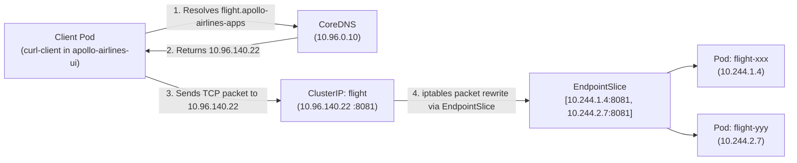

# Stage 2: Guidance — Networking & Edge Access

:::info[Page type · optional lab]
This lab uses the pinned Apollo11 revision and introduces the
`apollo-airlines-apps` and `apollo-airlines-ui` namespace split. Do not reuse
Stage 1 namespace assumptions.
:::

:::note[Take the controls · Guidance lab]
Trace the route from a passenger’s request to the service that answers it.
For the explanation before the experiment, start with the
[Guidance chapters](./learn/networking/pod-network-and-cni). You can return to this lab whenever you’re ready.

Already read them? [Jump to the first hands-on substage](#hands-on-lab-substage-1-discovery--break-drill).
:::

Stage 1 gave every Apollo component a Service name, but two questions remain.
First, when a booking Pod is replaced, how does another service find the new Pod
without knowing its new IP? Second, how can a browser reach the platform without
using a different high port for every service?

In **Stage 2 (Guidance)**, the application is split into two namespaces:
- **`apollo-airlines-apps`**: the backend services (`identity`, `flight`, `booking`, `search`, `notification`), the databases, and Redis.
- **`apollo-airlines-ui`**: the customer-facing `frontend`.

Stage 2 answers the two questions in five substages. They are not five
alternative ways to do networking. Each one fixes a limitation of the one before
it: a stable internal name, access from the host, HTTP routing, a real
load-balancer address, and finally a more flexible routing API.

<details>
<summary><strong>Optional conceptual refresher</strong></summary>

The Guidance chapters are the primary explanation. Expand each substage's
refresher when you need its older combined theory-and-lab context.

```
Substage 1                 Substage 2            Substage 3                Substage 4             Substage 5
──────────                 ──────────            ──────────                ──────────             ──────────
ClusterIP & DNS     ──►    NodePort       ──►    Traefik Ingress    ──►    MetalLB LoadBalancer ──► Envoy Gateway API
Internal FQDN              High NodePorts        Host routing              L2 ARP real IP         Gateway API CRDs
Endpoints & Slices         30080–30084           Local TLS termination     Port 80 / 443          Canonical Baseline
```

| Substage | Mechanism | Protocol / Port | Core Learning Outcome |
|---|---|---|---|
| **01: Internal DNS** | `Service type: ClusterIP` | Virtual internal IPs | CoreDNS FQDN resolution, `Endpoints` vs `EndpointSlice`, selector binding |
| **02: NodePort** | `Service type: NodePort` | `localhost:30080–30084` | L4 host-to-container forwarding via `kube-proxy`, port target mapping |
| **03: Traefik Ingress** | Traefik v3 IngressController | `*.apollo.local:30080/30443` | L7 Host routing, Ingress resources, wildcard TLS termination with Secrets |
| **04: MetalLB** | MetalLB L2 + `type: LoadBalancer` | `*.apollo.local` on real IP | ARP-based external IP allocation in local clusters, eliminating high NodePorts |
| **05: Envoy Gateway** | Envoy Gateway v1.5.0 + MetalLB | `*.apollo.local` on MetalLB IP | **Canonical Baseline**: GatewayClass, Gateway, HTTPRoute, cross-namespace ReferenceGrant |

:::important[Canonical Access Stack]
**Envoy Gateway + MetalLB (Substage 5)** forms the **canonical access stack** that carries forward into Stage 3 and all subsequent stages. Traefik is a valuable transitional learning step, and NetworkPolicy enforcement is deferred to Stage 8 where Calico makes it observable.
:::

---

## 🪜 Substage 1: a stable name over changing Pods

### How ClusterIP Works
`flight` Pods can be replaced at any time, so callers cannot rely on a Pod IP to
reach flight. A `ClusterIP` Service gives callers a stable name and a stable
virtual address. Behind it, the endpoint controller keeps track of which Pods are
currently selected and ready.

Kubernetes gives each Service an address from the service CIDR. The address is
virtual: no process listens on a network interface with that IP. Instead, each
node rewrites traffic sent to it. How that rewriting is done depends on the
cluster configuration. Apollo11's kind config uses `iptables` mode.

*Sources: `stages/ignition/kind-config.yaml` and
`stages/stage2/k8s/substages/01-internal-dns/`.*


```mermaid
flowchart LR
  Client["Client Pod\n(curl-client in apollo-airlines-ui)"]
  CoreDNS["CoreDNS\n(10.96.0.10)"]
  VIP["ClusterIP: flight\n(10.96.140.22 :8081)"]
  EPS["EndpointSlice\n[10.244.1.4:8081, 10.244.2.7:8081]"]
  Pod1["Pod: flight-xxx\n(10.244.1.4)"]
  Pod2["Pod: flight-yyy\n(10.244.2.7)"]

  Client -->|1. Resolves flight.apollo-airlines-apps| CoreDNS
  CoreDNS -->|2. Returns 10.96.140.22| Client
  Client -->|3. Sends TCP packet to 10.96.140.22| VIP
  VIP -->|4. iptables packet rewrite via EndpointSlice| EPS
  EPS --> Pod1
  EPS --> Pod2
```

The addresses in this diagram are examples. Your Pod IPs and EndpointSlice names
will be different. What matters is the order of events: DNS turns the Service
name into the stable virtual address, Service routing picks a ready endpoint, and
the packet arrives at that Pod's current IP.

### DNS search domains and FQDNs
In Stage 1, all workloads shared one namespace, so short names such as
`identity` worked. Now that the frontend lives in `apollo-airlines-ui`, the short
name `identity` means "the `identity` Service in *my own* namespace", which does
not exist there. A namespace is therefore more than a folder: it changes how DNS
names resolve.

The kubelet writes a list of search domains into `/etc/resolv.conf` inside every
container:
```text
search apollo-airlines-ui.svc.cluster.local svc.cluster.local cluster.local
nameserver 10.96.0.10
options ndots:5
```

When `curl-client` in `apollo-airlines-ui` looks up a name:
- `identity` expands to `identity.apollo-airlines-ui.svc.cluster.local`. This **fails**, because `identity` lives in `apollo-airlines-apps`.
- `identity.apollo-airlines-apps` expands to `identity.apollo-airlines-apps.svc.cluster.local`. This **succeeds**.
- The fully qualified domain name (FQDN) of a Service always has the form `<service>.<namespace>.svc.cluster.local`.

### Endpoints and EndpointSlices
A Service only says which labels it wants. It does not itself change any Pod
networking. The endpoint controller watches the Service's selector and the Pods'
readiness, and records the matching Pod addresses. These records are stored as
`EndpointSlice` objects, which scale better than the older `Endpoints` object.
`kubectl get endpoints` is still a handy summary, but build anything new on
`EndpointSlice`.

The controller works like this:
1. When a Pod matching `app: flight` becomes `Ready: True`, its IP and port are added to an `EndpointSlice` (`discovery.k8s.io/v1`).
2. When a Pod fails its readiness probe, its endpoint is marked unready. Clients
   stop sending it traffic once that change has propagated. This reduces traffic
   to unready Pods, but a few connections may still be dropped.

</details>

#### Hands-On Lab: Substage 1 Discovery & Break Drill

**Prediction:** changing the Service selector does not affect DNS, so the name
still resolves. What changes is which endpoints sit behind the name. This is the
key idea of Service routing.

- **Objective**: Follow a Service name from DNS to its ready endpoints, then show
  that the selector is what connects the Service to its Pods.
- **Starting point**: The Stage 1 images are available in the `apollo11` kind
  cluster. Run the commands from the root of the Apollo11 repository.
- **Instructions**:

```bash
# 1. Apply Substage 1
./stages/stage2/scripts/apply.sh --substage 1 --skip-build

# 2. Inspect Services and EndpointSlices
kubectl get svc -n apollo-airlines-apps
kubectl get endpointslices -n apollo-airlines-apps

# 3. Test cross-namespace DNS from curl-client
kubectl exec -n apollo-airlines-ui curl-client -- nslookup identity.apollo-airlines-apps.svc.cluster.local
kubectl exec -n apollo-airlines-ui curl-client -- curl -s http://identity.apollo-airlines-apps.svc.cluster.local:8080/healthz
```

**Break drill**: point the `identity` Service at a label that no Pod has:
```bash
kubectl patch svc identity -n apollo-airlines-apps -p '{"spec":{"selector":{"app":"identity-broken"}}}'

# The endpoint list becomes empty once the change propagates
kubectl get endpoints identity -n apollo-airlines-apps

# Call it from the client Pod (fails with a timeout):
kubectl exec -n apollo-airlines-ui curl-client -- curl -s --connect-timeout 3 http://identity.apollo-airlines-apps.svc.cluster.local:8080/healthz || echo "Connection failed as expected!"
```

**Recover**:
```bash
kubectl patch svc identity -n apollo-airlines-apps -p '{"spec":{"selector":{"app":"identity"}}}'
kubectl get endpoints identity -n apollo-airlines-apps
```

- **Expected result**: Before the patch, DNS and the health request both work.
  After it, the endpoint list is empty and the request fails. After recovery, the
  endpoint addresses return.
- **Verification**: Run the last in-cluster `curl` again. It should return the
  identity health response.
- **Troubleshooting**: If `curl-client` is missing, check the output of the
  substage apply and run `kubectl get pod -n apollo-airlines-ui curl-client`. If
  the endpoints are still empty after recovery, compare the Service's selector
  with the Pod labels.
- **Concept reinforced**: DNS finds the Service. The selector and Pod readiness
  decide which Pods receive its traffic.

---

## 🚪 Substage 2: NodePort External Access

A ClusterIP is reachable only from inside the cluster. Your laptop has no route
to the service network, so you need a way in. `NodePort` keeps the same Service
and endpoints and additionally opens a port on the nodes.

`type: NodePort` builds on `ClusterIP`. It reserves a port from the NodePort
range (`30000–32767`) and opens that port on **every node** in the cluster.

*Source: `stages/stage2/k8s/substages/02-nodeport/nodeport-services.yaml` (the `flight` Service document)*

```yaml
apiVersion: v1
kind: Service
metadata:
  name: flight
  namespace: apollo-airlines-apps
spec:
  type: NodePort
  selector:
    app: flight
  ports:
    - name: http
      port: 8081
      targetPort: 8081
      nodePort: 30081
```

In Apollo11, a request takes this path: `localhost:30081` on your host → port
`30081` of the kind control-plane container → the NodePort Service → a ready
flight endpoint on port `8081`. The first step is set up by `kind-config.yaml`
and the last two by Kubernetes. Without the kind port mapping, a NodePort alone
would not make the Service reachable from your laptop.

#### Hands-On Lab: Substage 2 NodePort

**Prediction:** the flight container still listens on port `8081`. Port `30081`
is only the entry point on the node, not a port of the container.

- **Objective**: Reach a Kubernetes Service from your host through a NodePort.
- **Starting point**: Substage 1 works and the cluster was created with
  `stages/ignition/kind-config.yaml`.
- **Instructions**:

```bash
# Apply Substage 2
./stages/stage2/scripts/apply.sh --substage 2 --skip-build

# Query from host laptop
curl -s http://localhost:30081/readyz
curl -s http://localhost:30080/ # Frontend
```

- **Expected result**: The flight readiness endpoint and the frontend respond on
  their mapped host ports.
- **Verification**: `kubectl get svc -A | grep NodePort` lists the NodePorts
  `30080` to `30084`.
- **Troubleshooting**: If localhost refuses the connection, check that the kind
  cluster was created with the port mappings from the repository. A NodePort added
  to a cluster created without those mappings is not reachable from the host.
- **Concept reinforced**: NodePort adds access through the nodes on top of the
  existing ClusterIP Service.

### Why NodePort is not enough for production
- Ports are limited to `30000`–`32767`, but users expect ports 80 and 443.
- Every node opens the port, whether or not it runs a matching Pod.
- It works at Layer 4 only, so there is no path routing, no hostname routing, and
  no central TLS termination.

---

## 🚦 Substage 3: Traefik Ingress & Wildcard TLS

NodePort works, but it puts the choice of service into the port number. A
passenger should not have to know that flight uses `30081` and booking uses
`30082`. Every HTTP request already carries a `Host` header, so a single proxy at
one address can pick the backend from the hostname.

An **Ingress** is only a configuration object that describes routing rules. An
**Ingress controller** (such as Traefik, NGINX, or Contour) must be running to
read those rules from the API and configure a reverse proxy.

*Source: `stages/stage2/k8s/substages/03-traefik-ingress-tls/03-ingress-apps.yaml`*

```yaml
apiVersion: networking.k8s.io/v1
kind: Ingress
metadata:
  name: identity
  namespace: apollo-airlines-apps
spec:
  ingressClassName: traefik
  tls:
    - hosts:
        - identity.apollo.local
      secretName: apollo-tls-secret
  rules:
    - host: identity.apollo.local
      http:
        paths:
          - path: /
            pathType: Prefix
            backend:
              service:
                name: identity
                port:
                  number: 8080
```

The source file has separate Ingress documents for `identity`, `flight`,
`booking`, and `search`. The one above is the complete `identity` document. Read
the nesting as `spec.rules[]` → `http.paths[]` → `backend.service`.
`ingressClassName` selects Traefik, and the host rule sends requests for
`identity.apollo.local` to the `identity` Service on port `8080`.

The Ingress object does not open a port or terminate TLS itself. Traefik watches
for Ingress objects of its class, configures its own proxy from them, and then
forwards requests to the `identity` Service like any other client. If the TLS
Secret is changed or missing, only the certificate the proxy presents changes.
The backend Service and Pods stay healthy. The break drill below shows this.

### Wildcard TLS with Secrets
Substage 3 uses OpenSSL to generate a self-signed wildcard certificate for
`*.apollo.local` and stores it in a Kubernetes Secret:

```bash
# Inspect metadata and key names without printing private-key material
kubectl describe secret apollo-tls-secret -n apollo-airlines-apps
```

#### Hands-On Lab: Substage 3 Ingress & TLS Break Drill

**Prediction:** deleting the TLS Secret affects which certificate the proxy
serves. It does not affect whether the identity Pod is healthy. Learn to tell a
certificate problem from an application problem before you start reading
backend logs.

- **Objective**: Route requests by hostname through Traefik, look at how TLS
  behaves locally, then recover from a deleted certificate Secret.
- **Starting point**: Substage 2 is healthy, and OpenSSL is available for the
  certificate script in the repository.
- **Instructions**:

```bash
# 1. Apply Substage 3
./stages/stage2/scripts/apply.sh --substage 3 --skip-build

# 2. Query over HTTPS through host-forwarded port 30443
curl -k --resolve identity.apollo.local:30443:127.0.0.1 https://identity.apollo.local:30443/healthz
```

**Break drill**: delete the TLS Secret:
```bash
kubectl delete secret apollo-tls-secret -n apollo-airlines-apps

# Check which certificate Traefik now presents:
curl -kv --resolve identity.apollo.local:30443:127.0.0.1 https://identity.apollo.local:30443/healthz 2>&1 | grep "issuer"
```
Traefik falls back to its built-in certificate, `CN=TRAEFIK DEFAULT CERT`.

**Recover**:
```bash
./stages/stage2/k8s/substages/03-traefik-ingress-tls/generate-certs.sh
curl -kv --resolve identity.apollo.local:30443:127.0.0.1 https://identity.apollo.local:30443/healthz 2>&1 | grep "issuer"
```
Issuer returns to `CN=*.apollo.local`.

- **Expected result**: The health request succeeds before the break and after
  recovery. While the Secret is missing, Traefik serves its fallback certificate
  instead of the Apollo11 wildcard certificate.
- **Verification**: `kubectl describe secret apollo-tls-secret -n
  apollo-airlines-apps` lists `tls.crt` and `tls.key`, and the final issuer is the
  wildcard certificate you generated locally.
- **Troubleshooting**: If the request cannot connect at all, check the Traefik
  Pod, its Service, the IngressClass, and the Ingress events before looking at
  TLS.
- **Concept reinforced**: An Ingress is routing configuration that a controller
  reads. The TLS key material is a separate dependency.

---

## ⚡ Substage 4: MetalLB & LoadBalancer IP Provisioning

Ingress gave us HTTP routing, but the proxy still needs an address that clients
can reach. In a public cloud, a controller reacts to a `type: LoadBalancer`
Service by creating a load balancer at the cloud provider. The Apollo11 kind
cluster has no cloud provider, so a `LoadBalancer` Service would stay in
`<pending>` forever.

**MetalLB** fills that gap. It runs a controller inside the cluster that assigns
real IP addresses from a pool on your local Docker network and announces them
using Layer 2 ARP:

*Source: `stages/stage2/k8s/substages/04-metallb/01-ip-pool.yaml`*

```yaml
apiVersion: metallb.io/v1beta1
kind: IPAddressPool
metadata:
  name: apollo-pool
  namespace: metallb-system
spec:
  addresses:
    - 172.18.0.50-172.18.0.100
---
apiVersion: metallb.io/v1beta1
kind: L2Advertisement
metadata:
  name: apollo-l2
  namespace: metallb-system
spec:
  ipAddressPools:
    - apollo-pool
```

#### Hands-On Lab: Substage 4 MetalLB

**Prediction:** `type: LoadBalancer` is only a request stored on the Service.
MetalLB, not the Service itself, fulfils it by picking an IP from the pool.

- **Objective**: See a LoadBalancer address assigned from the Apollo11 MetalLB
  pool.
- **Starting point**: Substage 3 is healthy, and the kind Docker network uses the
  address range that the MetalLB configuration in the repository expects.
- **Instructions**:

```bash
# 1. Apply Substage 4
./stages/stage2/scripts/apply.sh --substage 4 --skip-build

# 2. Inspect the Traefik LoadBalancer Service
kubectl get svc traefik -n traefik
```

`EXTERNAL-IP` now shows an address such as `172.18.0.50`. You can reach ports 80
and 443 on that address directly, with no high NodePort:

```bash
METALLB_IP=$(kubectl get svc traefik -n traefik -o jsonpath='{.status.loadBalancer.ingress[0].ip}')
curl -H "Host: identity.apollo.local" "http://${METALLB_IP}/healthz"
```

- **Expected result**: The Traefik Service gets an external IP from
  `172.18.0.50-172.18.0.100`, and the request with the `Host` header succeeds.
- **Verification**: Compare the Service's IP with the pool shown by `kubectl get
  ipaddresspool -n metallb-system apollo-pool -o yaml`.
- **Troubleshooting**: If the external IP stays empty, look at the MetalLB
  controller and speaker Pods, the pool, and the Docker network, including their
  events. Your Docker network may not be `172.18.0.0/16`, in which case the pool
  addresses must be changed to match.
- **Concept reinforced**: `type: LoadBalancer` is only a request in the API. A
  controller in your environment has to carry it out.

---

## 🌐 Substage 5: The Canonical Baseline — Envoy Gateway API

Ingress introduced the proxy model. Gateway API keeps the same path (listener,
then Service, then ready endpoint) but splits the configuration across several
objects, each with a clear owner. Ingress still works. The problem is that an
infrastructure team and an application team often need to change different parts
of the path, and a single Ingress object makes them share one resource.

Ingress has some limitations:
1. **One object, loosely defined:** advanced features such as canary releases, rate limiting, and header rewriting need vendor-specific annotations.
2. **No separation of roles:** infrastructure administrators (who manage IP addresses and TLS certificates) and application developers (who define URL paths) must edit the same Ingress YAML.
3. **Weak cross-namespace controls:** Ingress offers little to control which namespaces can reference which.

The **Gateway API** (`gateway.networking.k8s.io`) is the current Kubernetes
standard for this. It is designed around separate roles:

```
┌────────────────────────────────────────────────────────┐
│ INFRASTRUCTURE ARCHITECT (Cluster-wide)                │
│ GatewayClass: eg (Envoy Gateway)                       │
└────────────────────────────────────────────────────────┘
                           │
┌────────────────────────────────────────────────────────┐
│ PLATFORM / OPERATIONS TEAM (apollo-airlines-apps)      │
│ Gateway: apollo-gateway (Listens on port 80/443)       │
└────────────────────────────────────────────────────────┘
                           │
         ┌─────────────────┴─────────────────┐
         ▼                                   ▼
┌──────────────────────────────┐  ┌──────────────────────────────┐
│ APP DEVELOPER (apps)         │  │ UI DEVELOPER (ui)            │
│ HTTPRoute: booking           │  │ HTTPRoute: frontend          │
│ host: booking.apollo.local   │  │ host: frontend.apollo.local  │
│ backendRef: booking:8082     │  │ (Allowed by allowedRoutes!) │
└──────────────────────────────┘  └──────────────────────────────┘
```

### 1. The Gateway Resource

*Source: `stages/stage2/k8s/substages/05-envoy-gateway/01-gateway.yaml`*

```yaml
apiVersion: gateway.networking.k8s.io/v1
kind: Gateway
metadata:
  name: apollo-gateway
  namespace: apollo-airlines-apps
spec:
  gatewayClassName: eg
  infrastructure:
    parametersRef:
      group: gateway.envoyproxy.io
      kind: EnvoyProxy
      name: envoyproxy-lb-config
  listeners:
    - name: http
      port: 80
      protocol: HTTP
      allowedRoutes:
        namespaces:
          from: All
    - name: https
      port: 443
      protocol: HTTPS
      tls:
        mode: Terminate
        certificateRefs:
          - name: apollo-tls-secret
      allowedRoutes:
        namespaces:
          from: All
```

The Gateway has two listeners. The `http` listener serves plain HTTP on port 80. The `https` listener terminates TLS on port 443 with the `apollo-tls-secret` Secret. The TLS lab at the end of this stage uses the `https` listener.

After applying this object, read its status. `Accepted=True` means the
implementation accepted the configuration. `Programmed=True` is stronger: it
means the implementation has set up its data plane. Neither tells you whether a
backend application is ready. That is still determined by the Service and
EndpointSlices you learned about in Substage 1.

### 2. The HTTPRoute Resource

*Source: `stages/stage2/k8s/substages/05-envoy-gateway/04-httproute-booking.yaml`*

```yaml
apiVersion: gateway.networking.k8s.io/v1
kind: HTTPRoute
metadata:
  name: booking
  namespace: apollo-airlines-apps
spec:
  parentRefs:
    - name: apollo-gateway
  hostnames: ["booking.apollo.local"]
  rules:
    - backendRefs:
        - name: booking
          port: 8082
```

### 3. Cross-Namespace Security: ReferenceGrant vs. Route Attachment

Two separate permissions control cross-namespace traffic in Gateway API. Do not
mix them up:

1. **Route attachment (`allowedRoutes`):**
   The `frontend` HTTPRoute lives in `apollo-airlines-ui` but attaches to
   `apollo-gateway` in `apollo-airlines-apps`. The only thing that permits this
   is the Gateway listener's `allowedRoutes.namespaces.from: All` setting.
2. **Backend reference (`ReferenceGrant`):**
   A route in namespace A cannot send traffic to a Service in namespace B unless
   namespace B allows it with a **`ReferenceGrant`**. In Apollo Airlines, the
   frontend HTTPRoute sends traffic to the `frontend` Service in its *own*
   namespace (`apollo-airlines-ui`), so it does not strictly need one.

`01a-referencegrant.yaml` is included as a reference example. In the
`apollo-airlines-ui` namespace, it allows any HTTPRoute in `apollo-airlines-apps`
to reference the `frontend` Service:

*Source: `stages/stage2/k8s/substages/05-envoy-gateway/01a-referencegrant.yaml`*

```yaml
apiVersion: gateway.networking.k8s.io/v1beta1
kind: ReferenceGrant
metadata:
  name: apollo-gateway-grant
  namespace: apollo-airlines-ui
spec:
  from:
    - group: gateway.networking.k8s.io
      kind: HTTPRoute
      namespace: apollo-airlines-apps
  to:
    - group: ""
      kind: Service
      name: frontend
```

:::tip[Two different permissions]
A `ReferenceGrant` lives in the namespace of the target backend and controls
*backend references*. It does not control which routes may attach to a Gateway
listener. That is always controlled by the listener's `allowedRoutes`.
:::

#### Hands-On Lab: Substage 5 Envoy Gateway Verification

**Prediction:** a healthy Gateway condition shows that the implementation
understood its configuration. A successful `curl` shows more: that the whole
chain works, from the Gateway address, through the route and the Service
selector, to a ready application endpoint.

- **Objective**: Check each Gateway API object in the chain and send live
  requests through it.
- **Starting point**: Substage 4 is healthy.
- **Instructions**:

```bash
# 1. Apply Substage 5 (Canonical Baseline)
./stages/stage2/scripts/apply.sh --substage 5 --skip-build

# 2. Inspect Gateway status
kubectl get gateway -n apollo-airlines-apps

# Check for Programmed=True condition:
kubectl describe gateway apollo-gateway -n apollo-airlines-apps | grep -E "(Programmed|Accepted)"

# 3. Inspect all HTTPRoutes
kubectl get httproute -A

# 4. Query services through Envoy Gateway via MetalLB IP
GATEWAY_IP=$(kubectl get gateway apollo-gateway -n apollo-airlines-apps -o jsonpath='{.status.addresses[0].value}')

curl -H "Host: booking.apollo.local" "http://${GATEWAY_IP}/readyz"
curl -H "Host: flight.apollo.local" "http://${GATEWAY_IP}/readyz"
curl -H "Host: identity.apollo.local" "http://${GATEWAY_IP}/readyz"
```

The three requests should return HTTP 200 readiness responses.

- **Expected result**: The Gateway has an address, all three readiness requests
  return HTTP 200, and the routes report an accepted parent and resolved
  backends.
- **Verification**: The Gateway conditions include `Accepted=True` and
  `Programmed=True`. Each HTTPRoute reports an accepted parent and resolved
  references.
- **Troubleshooting**:
  - If `Programmed` is false, check the GatewayClass and the Envoy Gateway
    controller logs.
  - If only the cross-namespace frontend route fails, check the Gateway's
    `allowedRoutes` and the route's attachment conditions. A route that
    references a backend in another namespace also needs a `ReferenceGrant`.
  - If an app route fails, check the backend Service's selector and its
    EndpointSlices.
- **Concept reinforced**: The GatewayClass selects the implementation. The
  Gateway owns the listeners. The HTTPRoute owns the traffic rules. A
  ReferenceGrant allows a reference to a backend in another namespace.

---

## 🔒 Hands-On Lab: Complete Client-to-Application TLS & Failure Drill

In the Envoy Gateway setup from Substage 5, TLS is live: the Gateway terminates
it on port 443 using `apollo-tls-secret`, and the frontend calls the APIs over
HTTPS.

To test TLS properly, ask three separate questions:
1. **Does the listener accept TLS?** `curl -k` connects but skips certificate validation, so it does not show that a browser would accept the connection.
2. **Is the certificate trusted for the requested hostname?** This checks the certificate authority and whether the wildcard matches the hostname.
3. **Do real workflows succeed over HTTPS?** This checks that end-to-end API calls work without browser mixed-content blocks.

The lab has five parts: build, inspect, break, recover, and explain.

### 1. Build: check the TLS configuration
The certificate is generated and stored in a Kubernetes Secret when you deploy Substage 5:
```bash
# Inspect the HTTPS listener on the Gateway
kubectl get gateway apollo-gateway -n apollo-airlines-apps -o jsonpath='{.status.listeners[?(@.name=="https")].conditions}' | jq .
```
If `Accepted`, `Programmed`, and `ResolvedRefs` are all `True`, Envoy Gateway has
loaded `apollo-tls-secret`.

### 2. Inspect: certificate trust, a failing case, and API workflows
```bash
GATEWAY_IP=$(kubectl get gateway apollo-gateway -n apollo-airlines-apps -o jsonpath='{.status.addresses[0].value}')

# A. Extract the public CA certificate from the cluster Secret
kubectl -n apollo-airlines-apps get secret apollo-tls-secret -o jsonpath='{.data.tls\.crt}' | base64 -d > /tmp/apollo-ca.crt

# B. Verify valid certificate trust against the booking hostname
curl --cacert /tmp/apollo-ca.crt --resolve booking.apollo.local:443:${GATEWAY_IP} https://booking.apollo.local/readyz
# Output: {"status":"UP"} (HTTP 200)

# C. Negative check: verify certificate rejection for an unauthorized hostname
curl --cacert /tmp/apollo-ca.crt --resolve untrusted.apollo.invalid:443:${GATEWAY_IP} https://untrusted.apollo.invalid/healthz || echo "Exit code: $?"
# Expected result: curl fails with exit code 60 (SSL peer certificate was not issued for hostname)

# D. Manual passenger workflow over trusted HTTPS:
# Step 1: Login to identity service
TOKEN=$(curl -fsS --cacert /tmp/apollo-ca.crt --resolve identity.apollo.local:443:${GATEWAY_IP} \
  -H "Content-Type: application/json" \
  -d '{"email":"passenger@apolloairlines.com","password":"pass123"}' \
  https://identity.apollo.local/api/users/login | jq -r .token)
echo "JWT Token acquired: ${TOKEN:0:15}..."

# Step 2: Query flight inventory through the Gateway
curl -fsS --cacert /tmp/apollo-ca.crt --resolve flight.apollo.local:443:${GATEWAY_IP} \
  https://flight.apollo.local/api/flights | jq '.[0]'

# E. Optional maintainer verification script:
bash stages/stage2/scripts/verify-tls.sh
```

### 3. Break: delete the certificate Secret
Simulate an accidental deletion of the Secret:
```bash
# Delete the TLS secret
kubectl -n apollo-airlines-apps delete secret apollo-tls-secret

# Test HTTPS reachability:
curl --cacert /tmp/apollo-ca.crt --resolve booking.apollo.local:443:${GATEWAY_IP} https://booking.apollo.local/readyz || echo "HTTPS Failed"

# Inspect the Gateway listener condition:
kubectl get gateway apollo-gateway -n apollo-airlines-apps -o jsonpath='{.status.listeners[?(@.name=="https")].conditions[?(@.type=="ResolvedRefs")]}' | jq .
# ResolvedRefs is now False, with Reason: InvalidCertificateRef

# Test HTTP on port 80:
curl -H "Host: booking.apollo.local" "http://${GATEWAY_IP}/readyz"
# Port 80 still returns HTTP 200
```

### 4. Recover: regenerate the certificate and confirm everything works
Recreate the Secret and check that everything works end to end:
```bash
# 1. Regenerate certificate secret
bash stages/stage2/k8s/substages/03-traefik-ingress-tls/generate-certs.sh --context kind-apollo11

# 2. Re-extract the new certificate
kubectl -n apollo-airlines-apps get secret apollo-tls-secret -o jsonpath='{.data.tls\.crt}' | base64 -d > /tmp/apollo-ca.crt

# 3. Verify HTTPS recovery and rerun the complete API workflow
curl --cacert /tmp/apollo-ca.crt --resolve booking.apollo.local:443:${GATEWAY_IP} https://booking.apollo.local/readyz
bash stages/stage2/scripts/verify-tls.sh
```
The script completes with: `Trusted HTTPS login, populated search, booking, cancellation, and hostname rejection passed.`

### 5. Explain: what the evidence shows
- **`curl -k` can mislead you.** With `-k`, curl connects even when the certificate is untrusted or expired. A real browser would show a security warning or block the request.
- **Hostnames must match the certificate.** The wildcard `*.apollo.local` covers every Apollo service and still correctly fails for other domains.
- **Listeners fail independently.** When the TLS Secret is deleted, only the HTTPS listener is affected (`ResolvedRefs=False`). The HTTP listener keeps serving traffic.

---

## 🏁 What You Learned

- How CoreDNS resolves internal cluster names (`<svc>.<ns>.svc.cluster.local`) and why short names fail across namespaces.
- The role of `Endpoints` and `EndpointSlices` in dynamically tracking ready Pod IPs.
- How `type: NodePort` forwards host traffic into containers, and why high ports are clunky.
- How Layer 7 Ingress controllers evaluate Host headers and terminate wildcard TLS.
- How MetalLB provisions real Layer 2 IP addresses in local and bare-metal clusters.
- Why the modern **Gateway API** (`GatewayClass`, `Gateway`, `HTTPRoute`, `ReferenceGrant`) provides cleaner role separation and cross-namespace security than legacy Ingress.
- How Envoy Gateway terminates TLS and routes traffic across namespaces.

---

## ✈️ Before Continuing: Checkpoint

Before moving to Stage 3, ensure you understand:
1. What component maintains iptables rules on worker nodes for ClusterIP services?
2. If an `HTTPRoute` attaches to a Service in another namespace without a `ReferenceGrant`, what status condition appears on the route?
3. Why did we need MetalLB in kind before `type: LoadBalancer` would work?
4. What happens to traffic when a Pod fails its readiness probe?

You have now worked through each step of the networking ladder. Next, Stage 3
solves the data-loss problem you saw in Stage 1.

👉 **Continue to [Stage 3: Mission Data (Persistent Storage & StatefulSets)](./stage-3)**
