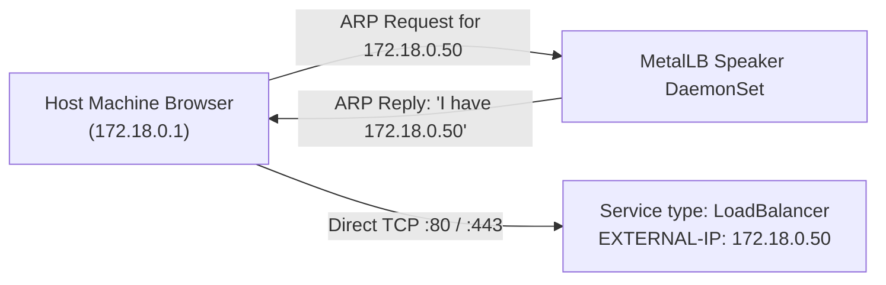
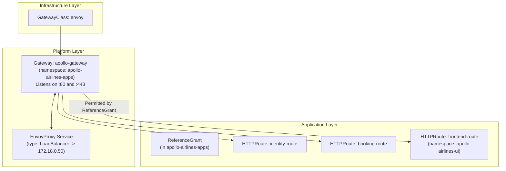

# MetalLB & Envoy Gateway API (Canonical Baseline)

This section covers the final two rungs of the Stage 2 networking ladder:
- **Substage 4 (`04-metallb`):** Provisioning real local IP addresses for `type: LoadBalancer` Services using MetalLB.
- **Substage 5 (`05-envoy-gateway`):** Migrating from Traefik Ingress to the modern **Envoy Gateway API v1.5.0** — **the canonical access baseline that carries forward into Stage 3 and all future stages**.

---

## Part 1: MetalLB & The LoadBalancer Model (Substage 4)

### The Bare-Metal / Local Cluster Challenge

In managed cloud Kubernetes (EKS, GKE, AKS), creating a Service of `type: LoadBalancer` instructs the cloud provider's API to provision an external Network Load Balancer (NLB) or Classic Load Balancer with a real external IP address.

In local clusters (kind) or bare-metal data centers, there is no cloud provider. A Service of `type: LoadBalancer` sits in status `<pending>` forever.

### How MetalLB Solves This in Layer 2 Mode

**MetalLB** is a Kubernetes-native load balancer implementation. In **Layer 2 (ARP)** mode:
1. MetalLB manages a dedicated pool of IP addresses on the local Docker network (e.g., `172.18.0.50–172.18.0.100`).
2. When a Service of `type: LoadBalancer` is created, MetalLB assigns an IP from the pool to the Service's `status.loadBalancer.ingress[0].ip`.
3. MetalLB uses Address Resolution Protocol (ARP) to announce to your host machine: *"Traffic for 172.18.0.50 should be delivered to the MAC address of the kind worker node."*
4. You can now access cluster services on standard ports (**80** and **443**) directly on that IP, completely eliminating high NodePorts!



### MetalLB Manifests

```yaml
# 1. IPAddressPool: Reserve an unused range on the kind Docker subnet
apiVersion: metallb.io/v1beta1
kind: IPAddressPool
metadata:
  name: apollo-pool
  namespace: metallb-system
spec:
  addresses:
    - 172.18.0.50-172.18.0.100

---
# 2. L2Advertisement: Announce the pool via ARP
apiVersion: metallb.io/v1beta1
kind: L2Advertisement
metadata:
  name: apollo-advertisement
  namespace: metallb-system
spec:
  ipAddressPools:
    - apollo-pool
```

---

## Part 2: Migration to Envoy Gateway API (Substage 5)

### Why Gateway API Replaces Ingress

The Kubernetes Gateway API (`gateway.networking.k8s.io`) is an official CNCF project designed to replace the legacy Ingress specification. It introduces a **role-oriented architecture**:

| Role | Kubernetes Resource | Description |
|---|---|---|
| **Infrastructure Provider** | `GatewayClass` | Defines the controller implementation (e.g., `gateway.envoyproxy.io/gatewayclass-controller`) |
| **Cluster Operator** | `Gateway` | Defines point of entry (ports 80/443, TLS listeners, allowed namespaces) |
| **Application Developer** | `HTTPRoute` | Defines routing rules, path matches, filters, and target backend Services |



### Cross-Namespace Routing via `ReferenceGrant`

In traditional Ingress, an Ingress in namespace A cannot safely route to a Service in namespace B. 

Gateway API solves this cleanly:
- The `Gateway` lives in `apollo-airlines-apps`.
- The `frontend` Deployment and its `HTTPRoute` live in `apollo-airlines-ui`.
- The frontend `HTTPRoute` declares `parentRefs[0].namespace: apollo-airlines-apps`.
- For security, Kubernetes rejects cross-namespace attachments by default. A **`ReferenceGrant`** in `apollo-airlines-apps` explicitly authorizes routes from `apollo-airlines-ui` to bind to the Gateway:

```yaml
apiVersion: gateway.networking.k8s.io/v1beta1
kind: ReferenceGrant
metadata:
  name: allow-ui-routes
  namespace: apollo-airlines-apps
spec:
  from:
    - group: gateway.networking.k8s.io
      kind: HTTPRoute
      namespace: apollo-airlines-ui
  to:
    - group: gateway.networking.k8s.io
      kind: Gateway
```

---

## Hands-On Lab: Substage 5 Deployment

### 1. Apply Substage 5

Decommission Traefik and apply MetalLB + Envoy Gateway v1.5.0 + HTTPRoutes:

```bash
./stages/stage2/scripts/apply.sh --substage 5 --skip-build
```

### 2. Inspect Gateway API Resources

Inspect the deployed Custom Resource Definitions (CRDs) and Gateway status:

```bash
# Check Gateway API CRDs
kubectl get crd | grep gateway.networking.k8s.io

# Inspect the GatewayClass
kubectl get gatewayclass

# Inspect the Gateway and its programmed status
kubectl get gateway -n apollo-airlines-apps
# Expected: CLASS=envoy, ADDRESS=172.18.0.50, PROGRAMMED=True

# View all HTTPRoutes across both namespaces
kubectl get httproute -A
```

### 3. Verify Envoy Proxy Service on MetalLB IP

Find the real IP allocated to Envoy by MetalLB:

```bash
ENVOY_IP=$(kubectl get service -n envoy-gateway-system \
  -l gateway.envoyproxy.io/owning-gateway-name=apollo-gateway \
  -o jsonpath='{.items[0].status.loadBalancer.ingress[0].ip}')

echo "Envoy LoadBalancer IP: ${ENVOY_IP}"
# Example: 172.18.0.50
```

### 4. Test External Access on Standard Port 80

Send HTTP requests directly to `${ENVOY_IP}` on port 80 passing target `Host` headers:

```bash
# Query Frontend
curl -i -H "Host: frontend.apollo.local" "http://${ENVOY_IP}/"

# Query Identity Health
curl -i -H "Host: identity.apollo.local" "http://${ENVOY_IP}/healthz"

# Query Flights
curl -s -H "Host: flight.apollo.local" "http://${ENVOY_IP}/api/flights" | jq '.flights | length'

# Query Booking Readiness
curl -i -H "Host: booking.apollo.local" "http://${ENVOY_IP}/readyz"
```

Notice that requests use standard port `80` without high NodePorts!

---

## Break & Recover: HTTPRoute Backend Port Experiment

What happens when an application developer configures an invalid backend port in an HTTPRoute?

### 1. Break the Frontend HTTPRoute

Patch the `frontend` HTTPRoute in `apollo-airlines-ui` to route traffic to non-existent port `9999`:

```bash
kubectl patch httproute frontend -n apollo-airlines-ui \
  --type='json' -p='[{"op": "replace", "path": "/spec/rules/0/backendRefs/0/port", "value": 9999}]'
```

Inspect the route status:

```bash
kubectl describe httproute frontend -n apollo-airlines-ui
```

Notice condition: `ResolvedRefs: False` with reason `PortNotFound`.

Now query the frontend endpoint:

```bash
curl -i -H "Host: frontend.apollo.local" "http://${ENVOY_IP}/"
```

**Observation:** Envoy returns `HTTP/1.1 500 Internal Server Error` (or 503) because the route reference failed resolution.

### 2. Recover the Route

Restore the correct backend port `3000`:

```bash
kubectl patch httproute frontend -n apollo-airlines-ui \
  --type='json' -p='[{"op": "replace", "path": "/spec/rules/0/backendRefs/0/port", "value": 3000}]'
```

Verify route recovery:

```bash
kubectl get httproute frontend -n apollo-airlines-ui
# Status returns to Accepted=True

curl -i -H "Host: frontend.apollo.local" "http://${ENVOY_IP}/"
# Returns: HTTP/1.1 200 OK
```

---

## The Carried-Over Baseline

Substage 5 marks the completion of the edge access ladder. This exact combination — **Envoy Gateway API v1.5.0 + MetalLB Layer 2 LoadBalancer** — is the foundation carried forward into:
- [Stage 3: Mission Data](../stage-3.md) (Persistent Storage)
- [Stage 4: Flight Control](../stage-4.md) (Probes, QoS, PDBs)
- [Stage 5: Payload Integration](../stage-5.md) (Helm & ArgoCD)
- [Stage 6: Mission Operations](../stage-6.md) (Grafana & Observability Ingress)
- [Stage 7: Orbital Maneuvering](../stage-7.md) (Autoscaling)