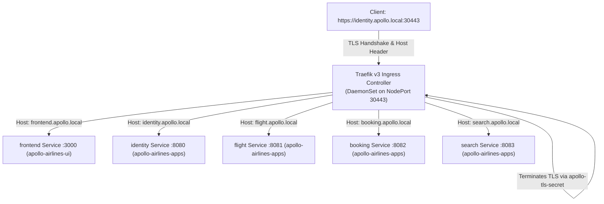

# Ingress Controllers & Local Wildcard TLS

While `NodePort` allowed external access in Substage 2, it required remembering arbitrary high ports (30080, 30081, 30082...) and provided no encryption.

**Substage 3 (`03-traefik-ingress-tls`)** introduces an **Ingress Controller** — a Layer 7 reverse proxy that consolidates external traffic through standard entry points, routes by HTTP `Host` headers, and terminates TLS.

---

## How Ingress Works

An Ingress setup requires two distinct components:
1. **Ingress Controller:** A running reverse proxy application (such as Traefik, NGINX, or Envoy) that watches the Kubernetes API for routing rules.
2. **Ingress Resources:** Declarative manifests (`kind: Ingress`) that define hostnames, URL paths, TLS certificates, and the target backend Services.



---

## The Ingress Resource Manifest

Here is the Ingress resource for the `identity` service:

```yaml
apiVersion: networking.k8s.io/v1
kind: Ingress
metadata:
  name: identity-ingress
  namespace: apollo-airlines-apps
spec:
  ingressClassName: traefik
  tls:
    - hosts:
        - identity.apollo.local
      secretName: apollo-tls-secret
  rules:
    - host: identity.apollo.local
      http:
        paths:
          - path: /
            pathType: Prefix
            backend:
              service:
                name: identity
                port:
                  number: 8080
```

### TLS Secrets

Kubernetes stores TLS certificates in Secrets of type `kubernetes.io/tls`. The Secret contains two keys:
- `tls.crt`: The PEM-encoded certificate chain.
- `tls.key`: The PEM-encoded private key.

---

## Hands-On Lab: Substage 3

### 1. Deploy Substage 3

Deploy the Traefik v3 controller, generate the wildcard TLS certificate (`*.apollo.local`), and apply the Ingress resources:

```bash
./stages/stage2/scripts/apply.sh --substage 3 --skip-build
```

### 2. Inspect Ingress Controller & Resources

```bash
# Check the running Traefik DaemonSet
kubectl get daemonset -n traefik-system

# Inspect Ingress objects in both namespaces
kubectl get ingress -A

# Inspect the generated TLS Secret
kubectl get secret apollo-tls-secret -n apollo-airlines-apps
```

### 3. Verify HTTPS Traffic & Certificate Termination

Send HTTPS requests to NodePort `30443` passing the target `Host` header:

```bash
# 1. Query Identity service over HTTPS
curl -k -i \
  -H "Host: identity.apollo.local" \
  https://localhost:30443/healthz
# Returns: HTTP/2 200 OK

# 2. Query Flight service
curl -k -s \
  -H "Host: flight.apollo.local" \
  https://localhost:30443/api/flights | jq '.flights | length'

# 3. Query Booking service
curl -k -i \
  -H "Host: booking.apollo.local" \
  https://localhost:30443/readyz
```

### 4. Inspect the TLS Certificate Subject

Use `openssl` to verify that Traefik is terminating TLS with the wildcard certificate:

```bash
openssl s_client -connect localhost:30443 -servername identity.apollo.local </dev/null 2>/dev/null \
  | grep -E "(subject=|issuer=)"
# Expected Output:
# subject=CN = *.apollo.local
# issuer=CN = *.apollo.local
```

---

## Break & Recover: Missing TLS Secret Experiment

What happens if an Ingress resource references a TLS Secret that does not exist?

### 1. Delete the TLS Secret

Delete `apollo-tls-secret` from `apollo-airlines-apps`:

```bash
kubectl delete secret apollo-tls-secret -n apollo-airlines-apps
```

Now query the endpoint again:

```bash
openssl s_client -connect localhost:30443 -servername identity.apollo.local </dev/null 2>/dev/null \
  | grep "subject="
# Output: subject=CN = TRAEFIK DEFAULT CERT
```

**Observation:** When a referenced Secret is missing, Traefik does not crash or drop the TCP connection; it falls back to its built-in self-signed fallback certificate (`TRAEFIK DEFAULT CERT`). In a browser, this triggers an untrusted certificate security warning.

### 2. Recover the TLS Secret

Recreate the TLS secret by running the certificate generator:

```bash
bash stages/stage2/k8s/substages/03-traefik-ingress-tls/generate-certs.sh
```

Inspect the certificate subject again:

```bash
openssl s_client -connect localhost:30443 -servername identity.apollo.local </dev/null 2>/dev/null \
  | grep "subject="
# Output: subject=CN = *.apollo.local (Restored!)
```

---

## Why We Transition Beyond Ingress

While Ingress solved Layer 7 routing and TLS, real-world Kubernetes operations exposed key weaknesses in the Ingress specification:
1. **Annotation Overload:** Ingress is too basic. Advanced features (retries, timeouts, header rewrites, rate limits) must be configured through vendor-specific annotations (`traefik.ingress.kubernetes.io/...` vs `nginx.ingress.kubernetes.io/...`). Manifests become non-portable.
2. **Single-Namespace Limitations:** An Ingress resource can only route to Services in its **own namespace**. Cross-namespace routing requires clumsy workarounds.
3. **High Port Dependency:** In local clusters without a cloud provider, Ingress still had to be accessed via NodePort 30443.

To eliminate high ports, Substage 4 introduces **MetalLB**. To replace fragmented Ingress annotations with typed, portable APIs, Substage 5 introduces the **Envoy Gateway API**.