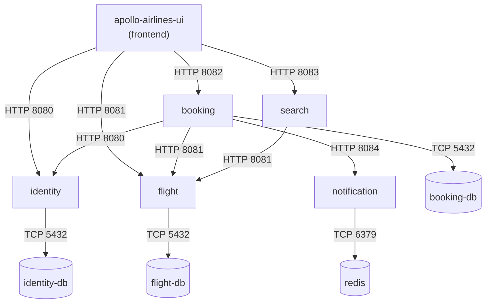

# NetworkPolicies (Architecture Reference)

By default, Kubernetes implements a completely flat, non-isolated network topology: **any Pod can communicate with any other Pod and any Service across all namespaces**.

A **NetworkPolicy** is an API resource that restricts network traffic at the IP/port level (Layer 3 / Layer 4) using label selectors.

:::warning Educational Notice: Reference-Only in Stage 2
Manifests for NetworkPolicies are provided in `stages/stage2/k8s/networkpolicies/` for architectural study, but they are **not applied by default in Stage 2**. 

`kind` uses `kindnet` as its default CNI (Container Network Interface). `kindnet` does not implement the NetworkPolicy specification; if applied, Kubernetes accepts the YAML, but traffic is not blocked. 

Adhering to our **Learner-First Lab Contract**, we do not claim a concept is learned when the lab only contains an inert manifest. Real, observable NetworkPolicy enforcement is taught in **[Stage 8: Command Module Hardening](../stage-8.md)**, where we replace `kindnet` with **Calico CNI** to prove allowed and blocked packet flows.
:::

---

## 1. The Default-Deny Security Pattern

Production Kubernetes security follows the principle of least privilege. You start by denying all inbound traffic, then explicitly carve out allowlists.

```yaml
apiVersion: networking.k8s.io/v1
kind: NetworkPolicy
metadata:
  name: default-deny-ingress
  namespace: apollo-airlines-apps
spec:
  podSelector: {}       # An empty selector matches ALL pods in the namespace
  policyTypes:
    - Ingress           # Drop all incoming packets unless explicitly allowed below
```

Once this policy is applied in an enforcing CNI, all inter-pod traffic inside `apollo-airlines-apps` is dropped immediately until allowlist policies are created.

---

## 2. PodSelector vs NamespaceSelector

Allowlist rules specify which traffic is permitted based on pod and namespace labels:

```yaml
apiVersion: networking.k8s.io/v1
kind: NetworkPolicy
metadata:
  name: allow-identity-db
  namespace: apollo-airlines-apps
spec:
  podSelector:
    matchLabels:
      app: identity-db  # Protects the identity-db pods
  policyTypes:
    - Ingress
  ingress:
    - from:
        - podSelector:
            matchLabels:
              app: identity  # Only pods with label app=identity can connect
      ports:
        - protocol: TCP
          port: 5432
```

### Combining Selectors (AND vs OR Semantics)

Pay close attention to YAML array dashes (`-`):

```yaml
# 1. OR Condition (Two array items):
# Traffic is allowed if it originates from namespace 'apollo-airlines-ui'
# OR from any pod labeled 'app: identity' anywhere.
ingress:
  - from:
      - namespaceSelector:
          matchLabels:
            kubernetes.io/metadata.name: apollo-airlines-ui
      - podSelector:
          matchLabels:
            app: identity

# 2. AND Condition (One array item with two keys):
# Traffic is allowed ONLY if it originates from namespace 'apollo-airlines-ui'
# AND has label 'app: frontend'.
ingress:
  - from:
      - namespaceSelector:
          matchLabels:
            kubernetes.io/metadata.name: apollo-airlines-ui
        podSelector:
          matchLabels:
            app: frontend
```

---

## 3. Apollo Airlines Least-Privilege Traffic Matrix

In a hardened deployment, traffic flows are strictly restricted to intended business interactions:



### Flow Allowlist Table

| Destination | Allowed Sources | Port | Rationale |
|---|---|---|---|
| `identity-db` | `identity` | 5432 | Only identity service manages user records |
| `flight-db` | `flight` | 5432 | Only flight service manages flight inventory |
| `booking-db` | `booking` | 5432 | Only booking service reads/writes bookings |
| `redis` | `notification` (and `search` in Stage 7) | 6379 | Only workers interact with queue / cache |
| `identity` | `frontend`, `booking`, Gateway | 8080 | Auth and token verification |
| `flight` | `frontend`, `booking`, `search`, Gateway | 8081 | Flight queries and seat reservation |
| `booking` | `frontend`, Gateway | 8082 | User reservation requests |
| `search` | `frontend`, Gateway | 8083 | Flight search proxy |
| `notification` | `booking` | 8084 | Internal event emission only |

---

## 4. CNI Support Matrix

NetworkPolicies require an underlying CNI plugin that watches the NetworkPolicy API and programs host iptables, IPVS, or eBPF filter programs:

| CNI Plugin | NetworkPolicy Support | Technology |
|---|---|---|
| **Calico** | ✅ Full Support | iptables / eBPF (Used in Stage 8) |
| **Cilium** | ✅ Full Support + L7 policies | eBPF kernel bytecode |
| **AWS VPC CNI** | ✅ Supported (v1.14+) | AWS security groups & network policies |
| **kindnet** | ❌ No Policy Enforcement | Simple iptables NAT (Default in kind) |
| **Flannel** | ❌ No Policy Enforcement | VXLAN packet encapsulation |

---

## What's Next

Now that networking and edge routing are thoroughly established, [Stage 3: Mission Data](../stage-3.md) transitions to **StatefulSets, PersistentVolumeClaims, and headless Services** to give our databases durable storage that survives Pod deletion.