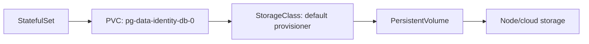

# Stage 3 — Mission Data

Stage 1's `emptyDir` is Pod-scoped. Stage 3 gives the three PostgreSQL databases and Redis stable identity plus per-Pod persistent storage.

## Build

```bash
cd Apollo11
bash stages/stage3/scripts/apply.sh
kubectl get statefulsets,pods,pvc -n apollo-airlines-apps
kubectl get storageclass
bash stages/stage3/scripts/verify.sh
```

The Stage 2 Set 5 Envoy Gateway + MetalLB access stack carries forward.

## Concepts: stable identity and storage

```yaml
kind: StatefulSet
spec:
  serviceName: identity-db
  volumeClaimTemplates:
    - metadata: { name: pg-data }
      spec:
        resources: { requests: { storage: 1Gi } }
```

`serviceName` connects stable Pod DNS to a headless Service. `volumeClaimTemplates` creates one PVC per ordinal Pod, such as `pg-data-identity-db-0`. A PVC is a request; a StorageClass provisioner decides how it becomes a PV. Leaving `storageClassName` unset deliberately selects the cluster default. A StatefulSet gives stable identity and storage relationships; it does not replicate PostgreSQL or provide database failover by itself.

Headless Services use `clusterIP: None`: DNS returns Pod addresses rather than one virtual IP. The application connects to the normal Service; the headless name is for stable identity and future replication/operator work.

### What “persistent” means here

Persistence is a lifecycle statement, not a marketing adjective. Ask: “What event may happen, and should the bytes survive it?”

| Event | `emptyDir` | PVC-backed volume |
| --- | --- | --- |
| Container process restarts | Usually survives | Survives |
| Pod is deleted and recreated | Lost | Reattached to the replacement claim |
| Pod moves to another node | Lost | Depends on provisioner and topology |
| Namespace/volume is deleted | Lost | Usually lost under `Delete` reclaim policy |
| Database process corrupts its data | Not protected | Not protected |

Stage 3 proves storage across a Pod replacement. It does not provide backups, replication, transactions, point-in-time recovery, or protection from an operator deleting the PVC. Those are separate operational properties.

### StatefulSet identity

A Deployment treats Pods as interchangeable. A StatefulSet gives them ordinals (`identity-db-0`), predictable names, and a stable relationship to individual claims. The ordinal is useful for databases and clustered systems that need to distinguish members.

```yaml
apiVersion: apps/v1
kind: StatefulSet
metadata:
  name: identity-db
spec:
  serviceName: identity-db-headless
  replicas: 1
  selector:
    matchLabels: { app: identity-db }
  template:
    metadata:
      labels: { app: identity-db }
    spec:
      containers:
        - name: postgres
          image: postgres:15-alpine
          volumeMounts:
            - name: pg-data
              mountPath: /var/lib/postgresql/data
  volumeClaimTemplates:
    - metadata:
        name: pg-data
      spec:
        accessModes: [ReadWriteOnce]
        resources:
          requests:
            storage: 1Gi
```

`serviceName` is the identity anchor. The selector must match the template labels. `volumeMounts.name` must match the claim-template name. `ReadWriteOnce` generally means one node may mount the volume for writing; it does not mean one process globally. The actual behavior comes from the storage driver.

### PVC → PV → StorageClass

The application requests a PVC. The control plane finds or provisions a PV through the StorageClass. The provisioner creates the real storage, then binds the claim. A PVC is not itself a disk and a StorageClass is not storage capacity; they are request and provisioning policy.



`WaitForFirstConsumer` delays volume placement until the scheduler knows the Pod's node/AZ. This avoids provisioning a zonal disk where the Pod cannot attach. On kind, the default provisioner commonly maps to node-local host storage; that is convenient for learning and not equivalent to a replicated cloud disk.

### Schema, data, and readiness are separate

Postgres image entrypoint scripts establish tables on an empty data directory. Seed Jobs add known rows after the database is reachable. Application readiness checks that the service can use its database. A green database Pod does not prove schema exists, a successful schema init does not prove seed data exists, and completed seed Jobs do not prove the application can connect with its configured credentials.

PostgreSQL mounts schema SQL through `/docker-entrypoint-initdb.d/` and sets `PGDATA` below the mounted directory. Init scripts run only for an empty database directory. Seed Jobs are separate and idempotent, so rerunning them is safe.

## Inspect and prove persistence

```bash
kubectl get pvc,pv -n apollo-airlines-apps
kubectl describe pvc pg-data-identity-db-0 -n apollo-airlines-apps
kubectl get pod identity-db-0 -n apollo-airlines-apps -o wide
kubectl run psql-client --rm -it --restart=Never --image=postgres:15-alpine -n apollo-airlines-apps -- psql "$DATABASE_URL"
```

Record a row, delete `identity-db-0`, wait for the StatefulSet to recreate it, then query the row again. Recovery is the data surviving replacement, not merely the Pod returning to `Running`.

### Storage debugging ladder

```bash
kubectl get pvc -n apollo-airlines-apps
kubectl describe pvc pg-data-identity-db-0 -n apollo-airlines-apps
kubectl get pv
kubectl get storageclass -o yaml
kubectl describe pod identity-db-0 -n apollo-airlines-apps
kubectl get events -n apollo-airlines-apps --sort-by=.metadata.creationTimestamp | tail -30
```

Read from the claim outward: is it Pending or Bound? If Bound, which PV? Which StorageClass provisioned it? Can the replacement Pod mount it on its scheduled node? A `ContainerCreating` state alone cannot tell you whether the problem is image pull, volume attachment, permissions, or a failing init process.

## A storage lab you should narrate

1. Write down the current Pod name, PVC name, PV name, node, and a known row.
2. Delete only the database Pod, not the PVC or namespace.
3. Watch the StatefulSet recreate the same ordinal name.
4. Confirm the replacement is scheduled and the same claim is mounted.
5. Query the known row and add a second row.
6. Delete the Pod again and prove the second row survives too.

Each step tests a different contract. The ordinal tests identity. The claim name tests attachment. The row tests bytes. The second replacement tests that the result was not an in-memory artifact or a one-time init script. If the Pod is Ready but the row is gone, inspect the mounted path and database `PGDATA`; a volume can be attached while the process is reading a different directory.

## Why headless and normal Services coexist

A normal Service gives clients one stable virtual address and load-balances across endpoints. A headless Service returns individual Pod addresses through DNS. Applications that only need a database endpoint should use the normal Service. A database cluster, replication manager, or operator that must address `db-0` and `db-1` individually needs headless discovery. Using a headless Service accidentally can expose client code to Pod membership and connection behavior it was not designed to handle.

## Reclaim policy and teardown risk

The StorageClass reclaim policy controls what happens to a dynamically provisioned PV after its claim is deleted. `Delete` is convenient for disposable labs and dangerous for data you care about. `Retain` leaves an administrator to recover or clean up the volume. Neither policy is a backup. Before teardown, identify which PVCs are disposable and which artifacts need export.

## Stage 3 checkpoint questions

1. Which data survives a container restart, a Pod replacement, a node loss, and namespace deletion?
2. Why does a StatefulSet need a headless Service even when the application uses the normal Service?
3. What is the difference between a PVC, PV, and StorageClass?
4. Why do Postgres init scripts not rerun when you edit the ConfigMap?
5. Why is a `Bound` PVC not proof that the application is using the expected directory?
6. What does this stage prove, and what database guarantees does it deliberately not provide?

## Gotchas

- A PVC can be `Bound` while the Pod still cannot mount it; inspect Pod events and the CSI/provisioner logs.
- `Delete` reclaim policy can delete the backing volume during teardown. Treat `--purge` and volume deletion as data loss.
- A StatefulSet does not magically replicate PostgreSQL; this stage gives stable storage and identity, not database HA.
- Schema init and seed Jobs are different lifecycle concerns: schema at first database initialization, seed data as a repeatable operation.

```bash
bash stages/stage3/scripts/teardown.sh
```

Continue to [Stage 4](./stage-4).
