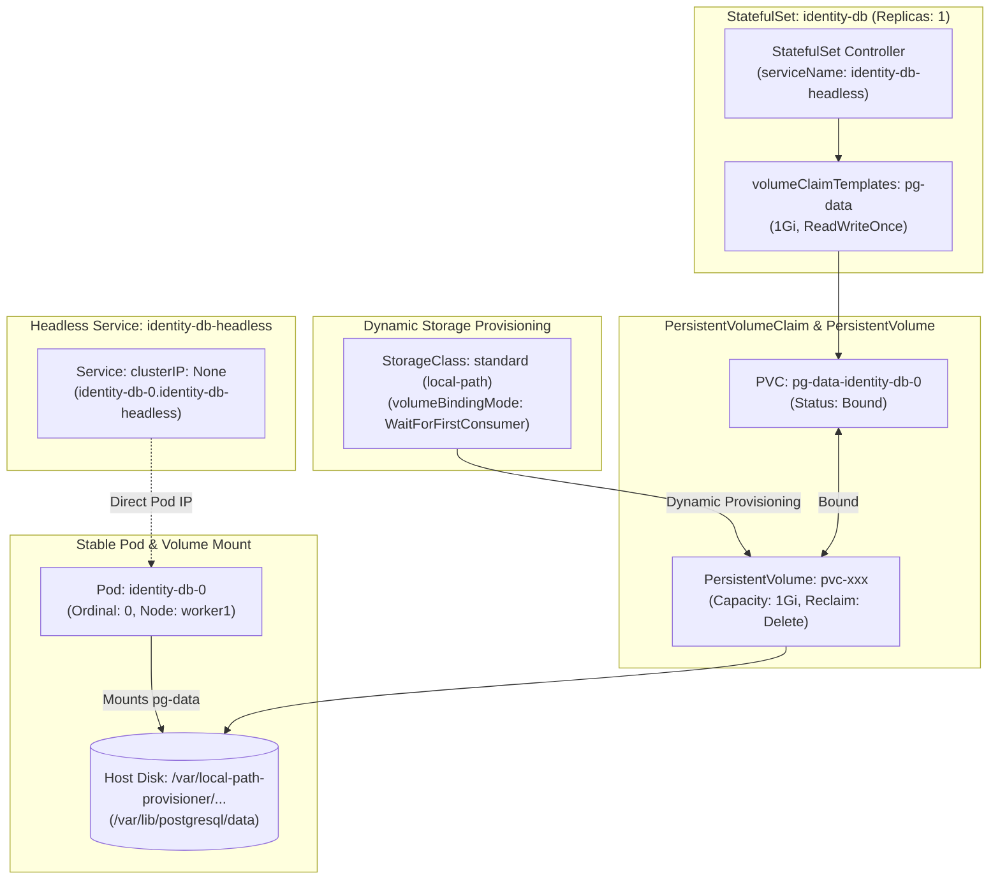

# Stage 3: Mission Data — Persistent Storage & StatefulSets

:::info[Page type · optional lab]
This lab uses the pinned Apollo11 revision. Read every destructive step's scope
and recovery instruction before changing a Pod, claim, volume, or database row.
:::

:::note[Take the controls · Mission Data lab]
Replace a database Pod and investigate which parts of the reservation survive.
For the explanation before the experiment, start with the
[Mission Data chapters](./learn/storage/volume-lifetimes). You can return to this lab whenever you’re ready.

Already read them? [Jump to the investigations](#-investigations-watch-identity-and-storage-stay-connected).
:::

In Stage 1, deleting a database Pod proved two things at once: the Deployment
could replace a process, and the replacement had nowhere durable to find the
old database directory. Reconciliation fixed the replica count; it could not
recover data that was declared as `emptyDir`.

Stage 3 separates a database's *identity* from one temporary Pod and gives that
identity a claim on storage. `identity-db-0` may be replaced, but its claim is
named for that ordinal and can be mounted again. This is a stronger contract
than Stage 1, not a permanent cure for every data failure: the kind
`local-path` backend remains local to a node and is not a backup or HA system.

<details>
<summary><strong>Optional conceptual refresher</strong></summary>

The Mission Data chapters are the primary explanation. Expand this section when
you want the older resource deep dive beside the lab.



---

## 🎯 Learning Goals

By the end of this stage, you will be able to:
1. Explain why databases require **`StatefulSet`** rather than `Deployment`.
2. Understand the storage abstraction chain: **`PersistentVolumeClaim` (PVC) → `PersistentVolume` (PV) → `StorageClass`**.
3. Configure **`volumeClaimTemplates`** to automatically provision unique, sticky storage per replica.
4. Understand how **Headless Services** (`clusterIP: None`) provide stable DNS identity for stateful replicas.
5. Avoid the classic **init container deadlock** by leveraging PostgreSQL's `/docker-entrypoint-initdb.d/` lifecycle hook.
6. Prove volume persistence by destroying a database Pod and verifying data retention.

---

## 💾 What survives which kind of replacement?

Start by separating three lifetimes. A **container** can restart inside the same
Pod. A **Pod** can be deleted and recreated. A **node or cluster** can disappear.
No single volume type answers all three failure modes. The earlier `emptyDir`
experiment only tested Pod deletion.

To share storage between containers in a Pod or survive container restarts, Kubernetes provides Volumes. But not all volumes are persistent:

| Storage Type | Survives Container Restart? | Survives Pod Deletion? | Survives Worker Node Reboot? | Use Case in Apollo11 |
|---|---|---|---|---|
| **`emptyDir`** | ✅ Yes | ❌ **LOST** | Pod/node lifecycle-dependent | Temporary scratch space (`/tmp`), cache |
| **`hostPath`** | ✅ Yes | ✅ Yes (on *that* node) | ⚠️ Node-dependent | Local testing only; breaks portability |
| **Persistent volume through a PVC** | ✅ Yes | ✅ when the claim and backend remain | Backend-dependent | Relational databases (`PostgreSQL`), Redis |

For Apollo11's local-path backend, the final column is deliberately
node-dependent. The lab proves a claim can follow a recreated Pod; it does not
prove that storage follows a failed kind node or survives deleting the cluster.

### A claim is a request; a volume is the fulfilment

An application author should be able to say “this database needs one GiB with
this access mode” without embedding a host path in its Pod spec. Kubernetes
records that request as a claim. A StorageClass tells a provisioner how to
fulfil eligible claims, and the provisioner creates or binds a concrete volume.

1. **`PersistentVolumeClaim` (PVC)**: The *request* for storage written by the application author. It specifies: *"I need 1 GiB of disk space with `ReadWriteOnce` access."*
2. **`PersistentVolume` (PV)**: The actual piece of storage in the cluster (e.g. an AWS EBS volume, a GCP Persistent Disk, or a local directory on kind).
3. **`StorageClass`**: The *provisioner* that dynamically creates PVs on demand when a PVC is submitted.

```
Application Author                 Cluster Administrator / Cloud Provider
┌───────────────────────────┐      ┌───────────────────────────────┐
│ PersistentVolumeClaim     │      │ StorageClass (Driver / CSI)   │
│ (e.g. 1Gi, ReadWriteOnce) │      │ (e.g. local-path, ebs.csi)    │
└─────────────┬─────────────┘      └──────────────┬────────────────┘
              │                                   │
              └───────────────► ◄─────────────────┘
                                │
                                ▼
                   ┌─────────────────────────────┐
                   │ PersistentVolume (PV)       │
                   │ (Bound to PVC, Backed by    │
                   │  Real Physical Storage)     │
                   └─────────────────────────────┘
```

#### Access Modes Explained:
- **`ReadWriteOnce` (RWO)**: The volume can be mounted as read-write by a **single node** at a time. This is standard for block storage (EBS, local disks) and databases like PostgreSQL.
- **`ReadOnlyMany` (ROX)**: The volume can be mounted read-only by many nodes simultaneously.
- **`ReadWriteMany` (RWX)**: The volume can be mounted read-write by many nodes at once (requires networked file systems like NFS or AWS EFS).

---

## 🏛️ Why a StatefulSet changes the question

Stage 1's Deployment treated its replicas as interchangeable. That is ideal for
two booking API Pods. A database replica needs a stable ordinal, a predictable
claim name, and controlled lifecycle. A StatefulSet gives the controller a way
to derive those names from the replica ordinal.

| Property | Deployment | StatefulSet |
|---|---|---|
| **Pod Naming** | Random hash suffix: `booking-68697c45bf-x9z2p` | Deterministic ordinal index: `identity-db-0`, `identity-db-1` |
| **Identity Contract** | Pods are completely interchangeable and disposable | Pods have unique, persistent identity across restarts |
| **Storage Binding** | All replicas share the exact same volume (or none) | Each replica gets its own dedicated PVC via `volumeClaimTemplates` |
| **Scaling Order** | Replicas scale up/down in parallel | Strict sequential order: Pod 1 starts only after Pod 0 is Ready |
| **DNS Contract** | Replicas behind a shared virtual ClusterIP | Each Pod gets its own addressable DNS FQDN via Headless Service |

---

## 🔍 Read `identity-db` from identity to disk

Let's examine how `identity-db` is defined in Stage 3:

*Source: `stages/stage3/k8s/apps/identity-db/identity-db-sts.yaml`*

```yaml
apiVersion: apps/v1
kind: StatefulSet
metadata:
  name: identity-db
  namespace: apollo-airlines-apps
spec:
  serviceName: identity-db-headless
  replicas: 1
  selector:
    matchLabels:
      app: identity-db
  template:
    metadata:
      labels:
        app: identity-db
        tier: data
    spec:
      serviceAccountName: identity-db
      containers:
        - name: postgres
          image: postgres:15-alpine
          ports:
            - containerPort: 5432
          env:
            - name: POSTGRES_USER
              value: "postgres"
            - name: POSTGRES_PASSWORD
              valueFrom:
                secretKeyRef:
                  name: apollo-airlines-secrets
                  key: POSTGRES_PASSWORD
            - name: POSTGRES_DB
              value: "identity"
            - name: PGDATA
              value: /var/lib/postgresql/data/pgdata
          volumeMounts:
            - name: pg-data
              mountPath: /var/lib/postgresql/data
            - name: init-script
              mountPath: /docker-entrypoint-initdb.d
          livenessProbe:
            exec:
              command: ["pg_isready", "-U", "postgres", "-d", "identity"]
            initialDelaySeconds: 10
            periodSeconds: 10
          readinessProbe:
            exec:
              command: ["pg_isready", "-U", "postgres", "-d", "identity"]
            initialDelaySeconds: 5
            periodSeconds: 5
      volumes:
        - name: init-script
          configMap:
            name: identity-db-init-script
  volumeClaimTemplates:
    - metadata:
        name: pg-data
      spec:
        accessModes: ["ReadWriteOnce"]
        resources:
          requests:
            storage: 1Gi
```

### Follow the objects this template creates

When you apply this StatefulSet, Kubernetes does not immediately create “a
database plus a disk” as one opaque unit. The StatefulSet controller derives
`identity-db-0` and the PVC name `pg-data-identity-db-0`. The storage
provisioner fulfils the PVC using the selected StorageClass. Once the Pod is
scheduled and its volume is attached or mounted, the kubelet starts PostgreSQL.
That object chain is what you will inspect in Exercise 1.

1. **`serviceName: identity-db-headless`**:
   Connects the StatefulSet to its companion Headless Service. This grants `identity-db-0` a dedicated DNS A-record:
   `identity-db-0.identity-db-headless.apollo-airlines-apps.svc.cluster.local`.
2. **`volumeClaimTemplates`**:
   Unlike a standard `volumes` block, this is a **template** that instructs the StatefulSet controller to generate a unique PVC for each ordinal pod:
   `pg-data-identity-db-0`.
   If you scaled `replicas: 3`, it would automatically generate `pg-data-identity-db-1` and `pg-data-identity-db-2`.
3. **`PGDATA: /var/lib/postgresql/data/pgdata`**:
   PostgreSQL requires its data directory to be a subdirectory within the mounted volume to avoid permission conflicts with filesystem metadata (`lost+found`).

---

## ⚡ Two names solve two different database problems

A normal `identity-db` Service is for clients that simply need a healthy
database endpoint. A Headless Service is for a caller that needs the identity
of a particular StatefulSet replica. It intentionally has no virtual ClusterIP
to hide that Pod address.

A **Headless Service** explicitly sets `clusterIP: None`:

*Source: `stages/stage3/k8s/apps/identity-db/identity-db-svc-headless.yaml`*

```yaml
apiVersion: v1
kind: Service
metadata:
  name: identity-db-headless
  namespace: apollo-airlines-apps
spec:
  type: ClusterIP
  clusterIP: None
  selector:
    app: identity-db
  ports:
    - port: 5432
      targetPort: 5432
```

### How DNS Differs:
- **Normal Service (`identity-db`)**: A DNS lookup for `identity-db` returns the virtual IP `10.96.140.50`.
- **Headless Service (`identity-db-headless`)**: A DNS lookup returns the **direct IP address of the Pod** (`10.244.1.15`).
- Furthermore, CoreDNS automatically publishes predictable per-pod records:
  `identity-db-0.identity-db-headless.apollo-airlines-apps.svc.cluster.local`.

:::note[Why We Keep Both Services]
Apollo microservices (like `identity`) connect to the normal `identity-db:5432` Service. The headless service is used by Kubernetes for pod identity and is essential for clustered database replication (like Patroni or repmgr).
:::

---

## ⚠️ An attractive design that cannot start

During the development of Stage 3, an intuitive architecture was attempted:
*Add an `initContainers` block that waits for PostgreSQL to start, then runs `psql -f /init.sql`.*

### Why it deadlocks
1. Kubernetes strictly guarantees that **`initContainers` must run to successful completion before main containers start**.
2. If the init container executes `until pg_isready -h 127.0.0.1; do sleep 1; done`, it will loop forever.
3. Why? Because PostgreSQL is inside the **main container**, which the kubelet will not start until the init container exits!
4. Result: Init waits for Main; Main waits for Init. The Pod is stuck in `Init:0/1` forever.

### Use the process that owns the data directory
Official PostgreSQL Docker images include a built-in lifecycle hook:
Any `.sql` or `.sh` script placed in `/docker-entrypoint-initdb.d/` is executed **only once during database initialization** (when the data directory is completely empty).
By mounting our schema ConfigMap to `/docker-entrypoint-initdb.d/`, PostgreSQL runs the SQL schema automatically on first boot, and cleanly skips it on every subsequent restart!

---

</details>

## 🧪 Investigations: watch identity and storage stay connected

The key question is no longer “does Kubernetes make a new database Pod?” Stage
1 already proved it can. Ask instead: *which named claim does the new Pod mount,
and what failure boundary does that claim actually cover?*

### Exercise 1: Deploy Stage 3 and Inspect Storage

**Prediction:** a StatefulSet controller creates a Pod with ordinal `0` and a
PVC whose name includes that ordinal. A `Bound` PVC is evidence that the claim
has been matched to storage; it is not evidence of backup or replication.

- **Objective**: Deploy StatefulSets and inspect dynamic PV/PVC provisioning.
- **Starting Point**: Running `kind-apollo11` cluster.
- **Instructions**:

```bash
cd Apollo11

# 1. Apply Stage 3
bash stages/stage3/scripts/apply.sh

# 2. Inspect StatefulSets and Pods in apollo-airlines-apps
kubectl get statefulsets,pods -n apollo-airlines-apps -l tier=data

# 3. Inspect PVCs and bound PVs
kubectl get pvc,pv -n apollo-airlines-apps
```

- **Expected Result**:
  - `identity-db-0`, `flight-db-0`, `booking-db-0`, and `redis-0` all report `1/1 Running`.
  - PVCs (`pg-data-identity-db-0`, etc.) show `STATUS: Bound` to dynamically created `PersistentVolume` objects.
  - StorageClass is `standard (default)` using kind's `rancher.io/local-path` provisioner.
- **Verification Script**:

```bash
bash stages/stage3/scripts/verify.sh
```
The source README records 68 checks for this verifier. Use its live result as a
baseline, then inspect the PVC/PV relationship yourself; a passing script is
evidence, not a substitute for understanding the storage chain.

- **Troubleshooting hints**: For a Pending PVC, inspect the claim, StorageClass,
  Pod scheduling events, and local-path provisioner before changing manifests.
- **Concept reinforced**: A PVC is a request, a StorageClass describes dynamic
  provisioning, and a PV is the bound storage resource.

---

### Exercise 2: Verifying Headless Service DNS Resolution

**Prediction:** the normal Service and headless Service are not redundant. The
headless lookup should expose the current Pod address for a named replica,
whereas a normal Service gives clients a virtual, load-balanced identity.

- **Objective**: Prove that CoreDNS resolves the Headless Service directly to Pod IPs.
- **Starting Point**: Stage 3 running.
- **Instructions**:

```bash
# 1. Get the actual Pod IP of identity-db-0
POD_IP=$(kubectl get pod identity-db-0 -n apollo-airlines-apps -o jsonpath='{.status.podIP}')
echo "identity-db-0 IP: ${POD_IP}"

# 2. Resolve the headless service hostname from the identity application pod
kubectl exec -n apollo-airlines-apps deploy/identity -- getent hosts identity-db-0.identity-db-headless
```

- **Expected Result**:
  The command prints `${POD_IP} identity-db-0.identity-db-headless...`.
  The DNS query bypassed virtual ClusterIPs and returned the direct Pod IP!
- **Verification command**: Compare the address returned by `getent` with
  `${POD_IP}` captured from the Pod object.
- **Troubleshooting hints**: If `getent` is unavailable or returns nothing,
  inspect the headless Service selector, its EndpointSlice, and the Pod's
  readiness before blaming CoreDNS.
- **Concept reinforced**: Headless Service DNS publishes backend addresses
  rather than a virtual load-balancing ClusterIP.

---

### Exercise 3: The Persistence Proof (The Core Lab)

**Prediction:** the Pod UID changes after deletion, but the PVC name does not.
The row survives only if the replacement mounts that same claim; record both
pieces of evidence before concluding that storage is persistent.

- **Objective**: Prove that data written to `identity-db` survives Pod destruction.
- **Starting Point**: Healthy `identity-db-0` Pod.
- **Instructions**:

```bash
# 1. Check current users seeded in identity-db
kubectl exec -n apollo-airlines-apps identity-db-0 -- \
  psql -U postgres -d identity -c "SELECT email FROM users;"

# 2. Insert a brand-new user record
kubectl exec -n apollo-airlines-apps identity-db-0 -- \
  psql -U postgres -d identity -c "INSERT INTO users (id, email, password_hash, first_name, last_name) VALUES ('99999999-9999-4999-8999-999999999999', 'persisted@apollo.local', 'hash99', 'Persistence', 'Test');"

# 3. Verify the new user is present
kubectl exec -n apollo-airlines-apps identity-db-0 -- \
  psql -U postgres -d identity -c "SELECT email FROM users WHERE id='99999999-9999-4999-8999-999999999999';"

# 4. Delete only the Pod. The StatefulSet recreates it; this does not delete the PVC.
kubectl delete pod identity-db-0 -n apollo-airlines-apps

# 5. Wait for the StatefulSet controller to recreate identity-db-0
kubectl wait --for=condition=Ready pod/identity-db-0 -n apollo-airlines-apps --timeout=60s

# 6. Re-query the database for the user record
kubectl exec -n apollo-airlines-apps identity-db-0 -- \
  psql -U postgres -d identity -c "SELECT email, first_name, last_name FROM users WHERE id='99999999-9999-4999-8999-999999999999';"

# 7. Remove the lab row so later exercises start from the seeded baseline
kubectl exec -n apollo-airlines-apps identity-db-0 -- \
  psql -U postgres -d identity -c "DELETE FROM users WHERE id='99999999-9999-4999-8999-999999999999';"
```

- **Expected Result**:
  Before cleanup, the query returns `persisted@apollo.local | Persistence | Test`.
- **Verification command**: Confirm `pg-data-identity-db-0` stays `Bound` and
  the recreated Pod mounts that claim before deleting the lab row.
- **Troubleshooting hints**: If the row is absent, compare the Pod's mounted PVC
  and PV before/after replacement and inspect PostgreSQL logs. Do not rerun seed
  jobs until you understand which data directory was mounted.
- **What Concept This Reinforces**:
  When `identity-db-0` was deleted, its container was destroyed, but its
  `PersistentVolumeClaim` (`pg-data-identity-db-0`) remained. The recreated Pod
  mounted that same claim, so the row survived.

  In this kind lab, the `local-path` volume is tied to storage on one kind node.
  This proves **Pod-replacement persistence**, not node-loss recovery, backups,
  database replication, or high availability. If the node or cluster storage
  disappears, the data may disappear too.

---

### Exercise 4: Volume Reclaim Policy & PVC Lifecycle

**Question:** what action actually risks this data? Deleting a Pod and deleting
its PVC are not equivalent. Inspecting reclaim policy explains the latter path
without performing a destructive test.

- **Objective**: Understand what happens to PVs when PVCs are deleted.
- **Starting Point**: Stage 3 running.
- **Instructions**:

```bash
# 1. Check the Reclaim Policy on the PersistentVolume
kubectl get pv $(kubectl get pvc pg-data-identity-db-0 -n apollo-airlines-apps -o jsonpath='{.spec.volumeName}')
```

- **Analysis**:
  Notice `RECLAIM POLICY: Delete`.
  - If `ReclaimPolicy: Delete`: Deleting the **PVC** automatically deletes the underlying physical storage disk.
  - If `ReclaimPolicy: Retain`: Deleting the PVC keeps the PV in `Released` state, preventing accidental data destruction until an administrator manually cleans it up.
:::danger[Deleting a StatefulSet Does Not Delete PVCs]
In Kubernetes, running `kubectl delete statefulset identity-db` deliberately leaves PVCs intact! This safety mechanism prevents accidental data loss during application uninstalls.
:::

- **Expected result**: The bound PV reports reclaim policy `Delete`.
- **Verification command**: Record the PVC's `.spec.volumeName` and match it to
  the PV row; this exercise does not delete either object.
- **Troubleshooting hints**: A different provisioner may use another default
  StorageClass or reclaim policy. Report the live value instead of assuming
  kind's local-path default.
- **Concept reinforced**: Reclaim policy governs what happens after claim
  deletion; it says nothing about backups or database replication.

---

## 🏁 What You Learned

- Why stateful workloads require `StatefulSet` rather than `Deployment`.
- How the storage abstraction chain (`PVC` → `PV` → `StorageClass`) separates storage requests from infrastructure drivers.
- How `volumeClaimTemplates` generates per-ordinal sticky PVCs.
- How Headless Services (`clusterIP: None`) provide stable per-pod network identity.
- How to avoid init container deadlocks by using `/docker-entrypoint-initdb.d/` hooks.
- How to verify data survival across stateful Pod replacement.

---

## ✈️ Before Continuing: Checkpoint

Before moving to Stage 4, confirm:
1. Why does `identity-db-0` get the exact same PVC reattached after deletion?
2. What would happen if an init container ran `pg_isready -h 127.0.0.1` before the main container started?
3. What is the difference between deleting a StatefulSet Pod and deleting its PVC?
4. How does an application decide whether to connect via a Headless Service or a normal ClusterIP Service?

Now that the data layer survives ordinary Pod replacement—and its remaining
failure boundaries are explicit—let's explore resource limits, health probes,
and graceful shutdown.

👉 **Continue to [Stage 4: Flight Control (Reliability, Probes & QoS)](./stage-4)**
