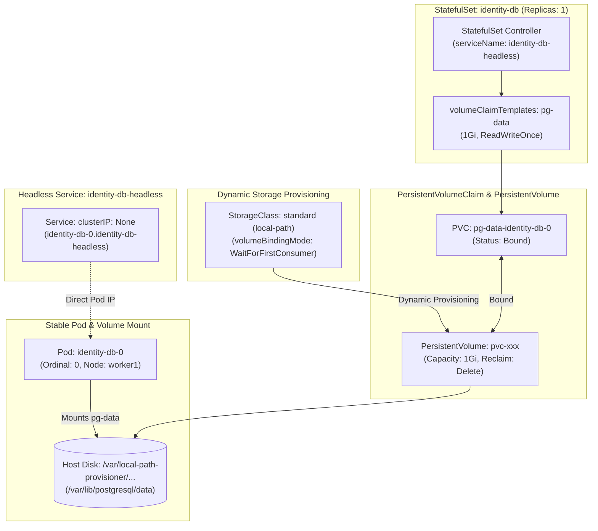

# Stage 3: Mission Data — Persistent Storage & StatefulSets

:::info[Page type · optional lab]
This lab uses the pinned Apollo11 revision. Read every destructive step's scope
and recovery instruction before changing a Pod, claim, volume, or database row.
:::

:::note[Take the controls · Mission Data lab]
Replace a database Pod and investigate which parts of the reservation survive.
For the explanation before the experiment, start with the
[Mission Data chapters](./learn/storage/volume-lifetimes). You can return to this lab whenever you’re ready.

Already read them? [Jump to the investigations](#-investigations-watch-identity-and-storage-stay-connected).
:::

In Stage 1, deleting a database Pod showed two things. The Deployment replaced the
Pod, but the new Pod had no way to find the old data, because it lived in an
`emptyDir`. Reconciliation restored the replica count; it could not restore the
data.

Stage 3 gives each database a stable identity and a claim on storage that outlasts
any single Pod. `identity-db-0` can be replaced, and the new Pod mounts the same
claim, named after its ordinal. This is a stronger guarantee than Stage 1, but it
does not protect against every kind of data loss. The kind `local-path` storage
lives on a single node and is neither a backup nor a high-availability setup.

<details>
<summary><strong>Optional conceptual refresher</strong></summary>

The Mission Data chapters are the primary explanation. Expand this section when
you want the older resource deep dive beside the lab.


```mermaid
flowchart TD
  subgraph StorageClassLayer ["Dynamic Storage Provisioning"]
    SC["StorageClass: standard (local-path)\n(volumeBindingMode: WaitForFirstConsumer)"]
  end

  subgraph StatefulSetLayer ["StatefulSet: identity-db (Replicas: 1)"]
    STS["StatefulSet Controller\n(serviceName: identity-db-headless)"]
    VCT["volumeClaimTemplates: pg-data\n(1Gi, ReadWriteOnce)"]
    STS --> VCT
  end

  subgraph PVCLayer ["PersistentVolumeClaim & PersistentVolume"]
    PVC["PVC: pg-data-identity-db-0\n(Status: Bound)"]
    PV["PersistentVolume: pvc-xxx\n(Capacity: 1Gi, Reclaim: Delete)"]
    VCT --> PVC
    SC -->|Dynamic Provisioning| PV
    PVC <-->|Bound| PV
  end

  subgraph PodIdentity ["Stable Pod & Volume Mount"]
    POD["Pod: identity-db-0\n(Ordinal: 0, Node: worker1)"]
    DISK[("Host Disk: /var/local-path-provisioner/...\n(/var/lib/postgresql/data)")]
    POD -->|Mounts pg-data| DISK
    PV --> DISK
  end

  subgraph HeadlessDNS ["Headless Service: identity-db-headless"]
    HSVC["Service: clusterIP: None\n(identity-db-0.identity-db-headless)"]
    HSVC -.->|Direct Pod IP| POD
  end
```

---

## 🎯 Learning Goals

By the end of this stage, you will be able to:
1. Explain why databases require **`StatefulSet`** rather than `Deployment`.
2. Understand the storage abstraction chain: **`PersistentVolumeClaim` (PVC) → `PersistentVolume` (PV) → `StorageClass`**.
3. Configure **`volumeClaimTemplates`** to automatically provision unique, sticky storage per replica.
4. Understand how **Headless Services** (`clusterIP: None`) provide stable DNS identity for stateful replicas.
5. Avoid the classic **init container deadlock** by leveraging PostgreSQL's `/docker-entrypoint-initdb.d/` lifecycle hook.
6. Prove volume persistence by destroying a database Pod and verifying data retention.

---

## 💾 What survives which kind of replacement?

Start by separating three things that can fail. A **container** can restart inside
the same Pod. A **Pod** can be deleted and recreated. A **node or the whole
cluster** can disappear. No single kind of volume protects against all three. The
`emptyDir` experiment in Stage 1 only tested Pod deletion.

Kubernetes Volumes let containers in a Pod share storage and keep it across
container restarts. Not all volumes last longer than that:

| Storage Type | Survives Container Restart? | Survives Pod Deletion? | Survives Worker Node Reboot? | Use Case in Apollo11 |
|---|---|---|---|---|
| **`emptyDir`** | ✅ Yes | ❌ **LOST** | Pod/node lifecycle-dependent | Temporary scratch space (`/tmp`), cache |
| **`hostPath`** | ✅ Yes | ✅ Yes (on *that* node) | ⚠️ Node-dependent | Local testing only; breaks portability |
| **Persistent volume through a PVC** | ✅ Yes | ✅ when the claim and backend remain | Backend-dependent | Relational databases (`PostgreSQL`), Redis |

With Apollo11's `local-path` storage, whether the data survives a node loss
depends on that node. The lab shows that a claim can be mounted again by a
recreated Pod. It does not show that the data survives the loss of a kind node or
the deletion of the cluster.

### A claim is a request; a volume is what fulfils it

An application author should be able to say "this database needs 1 GiB with this
access mode" without putting a host path in the Pod spec. Kubernetes stores that
request as a claim. A StorageClass tells a provisioner how to satisfy claims, and
the provisioner creates a real volume and binds it to the claim.

1. **`PersistentVolumeClaim` (PVC):** the *request* for storage, written by the application author. For example: "I need 1 GiB of disk with `ReadWriteOnce` access."
2. **`PersistentVolume` (PV):** the actual storage in the cluster, such as an AWS EBS volume, a GCP Persistent Disk, or a local directory on kind.
3. **`StorageClass`:** describes how to create PVs automatically when a PVC is submitted.

```
Application Author                 Cluster Administrator / Cloud Provider
┌───────────────────────────┐      ┌───────────────────────────────┐
│ PersistentVolumeClaim     │      │ StorageClass (Driver / CSI)   │
│ (e.g. 1Gi, ReadWriteOnce) │      │ (e.g. local-path, ebs.csi)    │
└─────────────┬─────────────┘      └──────────────┬────────────────┘
              │                                   │
              └───────────────► ◄─────────────────┘
                                │
                                ▼
                   ┌─────────────────────────────┐
                   │ PersistentVolume (PV)       │
                   │ (Bound to PVC, Backed by    │
                   │  Real Physical Storage)     │
                   └─────────────────────────────┘
```

#### Access modes
- **`ReadWriteOnce` (RWO):** one node at a time can mount the volume read-write. This is typical for block storage (EBS, local disks) and for databases such as PostgreSQL.
- **`ReadOnlyMany` (ROX):** many nodes can mount the volume read-only at the same time.
- **`ReadWriteMany` (RWX):** many nodes can mount the volume read-write at the same time. This needs a network file system such as NFS or AWS EFS.

---

## 🏛️ Why a StatefulSet changes the question

In Stage 1, a Deployment treated its replicas as interchangeable. That suits two
booking API Pods. A database replica needs a fixed number, a predictable claim
name, and a controlled lifecycle. A StatefulSet derives all of these from the
replica's ordinal (its index).

| Property | Deployment | StatefulSet |
|---|---|---|
| **Pod names** | Random suffix: `booking-68697c45bf-x9z2p` | Fixed ordinal: `identity-db-0`, `identity-db-1` |
| **Identity** | Pods are interchangeable and disposable | Each Pod keeps its identity when it is replaced |
| **Storage** | All replicas share one volume, or have none | Each replica gets its own PVC from `volumeClaimTemplates` |
| **Scaling order** | Replicas start and stop in parallel | One at a time, in order: Pod 1 starts only after Pod 0 is Ready |
| **DNS** | Replicas sit behind one shared virtual ClusterIP | Each Pod gets its own DNS name through a headless Service |

---

## 🔍 Read `identity-db` from identity to disk

Here is how Stage 3 defines `identity-db`:

*Source: `stages/stage3/k8s/apps/identity-db/identity-db-sts.yaml`*

```yaml
apiVersion: apps/v1
kind: StatefulSet
metadata:
  name: identity-db
  namespace: apollo-airlines-apps
spec:
  serviceName: identity-db-headless
  replicas: 1
  selector:
    matchLabels:
      app: identity-db
  template:
    metadata:
      labels:
        app: identity-db
        tier: data
    spec:
      serviceAccountName: identity-db
      containers:
        - name: postgres
          image: postgres:15-alpine
          ports:
            - containerPort: 5432
          env:
            - name: POSTGRES_USER
              value: "postgres"
            - name: POSTGRES_PASSWORD
              valueFrom:
                secretKeyRef:
                  name: apollo-airlines-secrets
                  key: POSTGRES_PASSWORD
            - name: POSTGRES_DB
              value: "identity"
            - name: PGDATA
              value: /var/lib/postgresql/data/pgdata
          volumeMounts:
            - name: pg-data
              mountPath: /var/lib/postgresql/data
            - name: init-script
              mountPath: /docker-entrypoint-initdb.d
          livenessProbe:
            exec:
              command: ["pg_isready", "-U", "postgres", "-d", "identity"]
            initialDelaySeconds: 10
            periodSeconds: 10
          readinessProbe:
            exec:
              command: ["pg_isready", "-U", "postgres", "-d", "identity"]
            initialDelaySeconds: 5
            periodSeconds: 5
      volumes:
        - name: init-script
          configMap:
            name: identity-db-init-script
  volumeClaimTemplates:
    - metadata:
        name: pg-data
      spec:
        accessModes: ["ReadWriteOnce"]
        resources:
          requests:
            storage: 1Gi
```

### Follow the objects this template creates

Applying this StatefulSet does not create a database and a disk as a single unit.
Several objects are created, one after another:
1. The StatefulSet controller creates the Pod `identity-db-0` and the PVC
   `pg-data-identity-db-0`.
2. The storage provisioner creates a volume for the PVC, using the StorageClass.
3. Once the Pod is scheduled and the volume is mounted, the kubelet starts
   PostgreSQL.

You will inspect this chain in Exercise 1. These fields in the manifest drive it:

1. **`serviceName: identity-db-headless`:**
   links the StatefulSet to its headless Service. This gives `identity-db-0` its own DNS record:
   `identity-db-0.identity-db-headless.apollo-airlines-apps.svc.cluster.local`.
2. **`volumeClaimTemplates`:**
   unlike a regular `volumes` entry, this is a **template**. The StatefulSet controller uses it to create one PVC per replica, such as `pg-data-identity-db-0`.
   With `replicas: 3` it would also create `pg-data-identity-db-1` and `pg-data-identity-db-2`.
3. **`PGDATA: /var/lib/postgresql/data/pgdata`:**
   PostgreSQL needs its data directory to be a subdirectory of the mounted volume. Using the volume's root can fail because of the `lost+found` directory that some filesystems create there.

---

## ⚡ Two names solve two different database problems

A normal `identity-db` Service is for clients that just need to reach a healthy
database. A headless Service is for callers that need to reach one specific
StatefulSet replica. It deliberately has no virtual ClusterIP, so the Pod's own
address is not hidden.

A **headless Service** sets `clusterIP: None`:

*Source: `stages/stage3/k8s/apps/identity-db/identity-db-svc-headless.yaml`*

```yaml
apiVersion: v1
kind: Service
metadata:
  name: identity-db-headless
  namespace: apollo-airlines-apps
spec:
  type: ClusterIP
  clusterIP: None
  selector:
    app: identity-db
  ports:
    - port: 5432
      targetPort: 5432
```

### How DNS differs
- **Normal Service (`identity-db`):** a lookup of `identity-db` returns the Service's virtual IP, for example `10.96.140.50`.
- **Headless Service (`identity-db-headless`):** a lookup returns the **IP of the Pod itself**, for example `10.244.1.15`.
- CoreDNS also publishes a predictable record for each Pod:
  `identity-db-0.identity-db-headless.apollo-airlines-apps.svc.cluster.local`.

(These IPs are examples; yours will differ.)

:::note[Why keep both Services]
Apollo services such as `identity` connect to the normal `identity-db:5432` Service. The headless Service gives each Pod a stable DNS name, which clustered databases (for example Patroni or repmgr) need for replication.
:::

---

## ⚠️ An attractive design that cannot start

While building Stage 3, an obvious approach was tried first: add an
`initContainers` entry that waits for PostgreSQL to start and then runs
`psql -f /init.sql`.

### Why it deadlocks
1. Kubernetes runs **every init container to successful completion before it starts any main container**.
2. The init container would run `until pg_isready -h 127.0.0.1; do sleep 1; done`, and keep waiting.
3. But PostgreSQL runs in the **main container**, which does not start until the init container exits.
4. Each waits for the other, and the Pod stays in `Init:0/1` forever.

### Let the database initialise itself
The official PostgreSQL image has a built-in hook for this. It runs any `.sql` or
`.sh` file in `/docker-entrypoint-initdb.d/` **once**, when the data directory is
empty. By mounting the schema ConfigMap at that path, PostgreSQL creates the
schema on first start and skips it on every later restart.

---

</details>

## 🧪 Investigations: watch identity and storage stay connected

The question is no longer whether Kubernetes will create a new database Pod;
Stage 1 showed that it will. Ask instead: *which claim does the new Pod mount,
and which failures does that claim actually protect against?*

### Exercise 1: Deploy Stage 3 and inspect storage

**Prediction:** the StatefulSet controller creates a Pod with ordinal `0` and a
PVC whose name contains that ordinal. A `Bound` PVC shows that the claim has been
matched to storage. It does not mean the data is backed up or replicated.

- **Objective**: Deploy the StatefulSets and inspect how PVs and PVCs are provisioned.
- **Starting Point**: A running `kind-apollo11` cluster.
- **Instructions**:

```bash
cd Apollo11

# 1. Apply Stage 3
bash stages/stage3/scripts/apply.sh

# 2. Inspect StatefulSets and Pods in apollo-airlines-apps
kubectl get statefulsets,pods -n apollo-airlines-apps -l tier=data

# 3. Inspect PVCs and bound PVs
kubectl get pvc,pv -n apollo-airlines-apps
```

- **Expected Result**:
  - `identity-db-0`, `flight-db-0`, `booking-db-0`, and `redis-0` all report `1/1 Running`.
  - The PVCs (`pg-data-identity-db-0` and so on) show `STATUS: Bound`, each to a `PersistentVolume` that was created automatically.
  - The StorageClass is `standard (default)`, which uses kind's `rancher.io/local-path` provisioner.
- **Verification script**:

```bash
bash stages/stage3/scripts/verify.sh
```
The repository README says this script runs 68 checks. Use its result as a
baseline, then look at the PVC and PV yourself. A passing script is not a
substitute for understanding how the pieces connect.

- **Troubleshooting hints**: If a PVC stays `Pending`, check the claim, the
  StorageClass, the Pod's scheduling events, and the local-path provisioner before
  you change any manifest.
- **Concept reinforced**: A PVC is a request, a StorageClass describes how to
  provision storage automatically, and a PV is the storage that gets bound to the
  claim.

---

### Exercise 2: Check headless Service DNS

**Prediction:** the normal Service and the headless Service do different jobs. A
headless lookup returns the current address of one named replica. A normal
Service gives clients a single virtual address that is load-balanced.

- **Objective**: Show that CoreDNS resolves the headless Service directly to Pod IPs.
- **Starting Point**: Stage 3 is running.
- **Instructions**:

```bash
# 1. Get the actual Pod IP of identity-db-0
POD_IP=$(kubectl get pod identity-db-0 -n apollo-airlines-apps -o jsonpath='{.status.podIP}')
echo "identity-db-0 IP: ${POD_IP}"

# 2. Resolve the headless service hostname from the identity application pod
kubectl exec -n apollo-airlines-apps deploy/identity -- getent hosts identity-db-0.identity-db-headless
```

- **Expected Result**:
  The command prints `${POD_IP} identity-db-0.identity-db-headless...`. The
  lookup did not go through a virtual ClusterIP; it returned the Pod's own IP.
- **Verification command**: Compare the address from `getent` with `${POD_IP}`,
  which you read from the Pod object.
- **Troubleshooting hints**: If `getent` is missing or returns nothing, check the
  headless Service's selector, its EndpointSlice, and the Pod's readiness before
  suspecting CoreDNS.
- **Concept reinforced**: A headless Service publishes the backend Pods'
  addresses instead of a single virtual ClusterIP.

---

### Exercise 3: Prove the data persists (the core lab)

**Prediction:** the Pod's UID changes after you delete it, but the PVC name does
not. The row survives only if the new Pod mounts the same claim. Record both
facts before you conclude that the storage is persistent.

- **Objective**: Show that data written to `identity-db` survives the deletion of its Pod.
- **Starting Point**: A healthy `identity-db-0` Pod.
- **Instructions**:

```bash
# 1. Check current users seeded in identity-db
kubectl exec -n apollo-airlines-apps identity-db-0 -- \
  psql -U postgres -d identity -c "SELECT email FROM users;"

# 2. Insert a brand-new user record
kubectl exec -n apollo-airlines-apps identity-db-0 -- \
  psql -U postgres -d identity -c "INSERT INTO users (id, email, password_hash, first_name, last_name) VALUES ('99999999-9999-4999-8999-999999999999', 'persisted@apollo.local', 'hash99', 'Persistence', 'Test');"

# 3. Verify the new user is present
kubectl exec -n apollo-airlines-apps identity-db-0 -- \
  psql -U postgres -d identity -c "SELECT email FROM users WHERE id='99999999-9999-4999-8999-999999999999';"

# 4. Delete only the Pod. The StatefulSet recreates it, and the PVC is not deleted.
kubectl delete pod identity-db-0 -n apollo-airlines-apps

# 5. Wait for the StatefulSet controller to recreate identity-db-0
kubectl wait --for=condition=Ready pod/identity-db-0 -n apollo-airlines-apps --timeout=60s

# 6. Re-query the database for the user record
kubectl exec -n apollo-airlines-apps identity-db-0 -- \
  psql -U postgres -d identity -c "SELECT email, first_name, last_name FROM users WHERE id='99999999-9999-4999-8999-999999999999';"

# 7. Remove the lab row so later exercises start from the seeded baseline
kubectl exec -n apollo-airlines-apps identity-db-0 -- \
  psql -U postgres -d identity -c "DELETE FROM users WHERE id='99999999-9999-4999-8999-999999999999';"
```

- **Expected Result**:
  Before the cleanup step, the query returns `persisted@apollo.local | Persistence | Test`.
- **Verification command**: Before deleting the lab row, confirm that
  `pg-data-identity-db-0` is still `Bound` and that the new Pod mounts it.
- **Troubleshooting hints**: If the row is missing, compare the PVC and PV that
  the Pod mounted before and after the replacement, and read the PostgreSQL logs.
  Do not rerun any seed Jobs until you know which data directory was mounted.
- **Concept reinforced**:
  Deleting `identity-db-0` destroyed its container, but its
  `PersistentVolumeClaim` (`pg-data-identity-db-0`) remained. The new Pod mounted
  the same claim, so the row survived.

  In this kind lab, the `local-path` volume lives on one kind node. The lab
  therefore shows persistence across **Pod replacement** only. It does not show
  recovery from node loss, backups, replication, or high availability. If the node
  or its storage is lost, the data can be lost too.

---

### Exercise 4: Reclaim policy and the PVC lifecycle

**Question:** which action actually puts this data at risk? Deleting a Pod and
deleting its PVC are very different. Reading the reclaim policy shows what the
second one would do, without destroying anything.

- **Objective**: Understand what happens to a PV when its PVC is deleted.
- **Starting Point**: Stage 3 is running.
- **Instructions**:

```bash
# 1. Check the Reclaim Policy on the PersistentVolume
kubectl get pv $(kubectl get pvc pg-data-identity-db-0 -n apollo-airlines-apps -o jsonpath='{.spec.volumeName}')
```

- **Analysis**:
  The output shows `RECLAIM POLICY: Delete`.
  - With `Delete`, deleting the **PVC** also deletes the underlying storage and its data.
  - With `Retain`, deleting the PVC leaves the PV in the `Released` state, so the data is kept until an administrator cleans it up by hand.

:::danger[Deleting a StatefulSet does not delete its PVCs]
Running `kubectl delete statefulset identity-db` deliberately leaves the PVCs in place. This protects your data when an application is uninstalled.
:::

- **Expected result**: The bound PV has reclaim policy `Delete`.
- **Verification command**: Note the PVC's `.spec.volumeName` and match it to the
  PV in the output. This exercise does not delete either object.
- **Troubleshooting hints**: Another provisioner may use a different default
  StorageClass or reclaim policy. Report the value you see rather than assuming
  kind's local-path default.
- **Concept reinforced**: The reclaim policy decides what happens to the storage
  after the claim is deleted. It does not provide backups or replication.

---

## 🏁 What You Learned

- Why stateful workloads require `StatefulSet` rather than `Deployment`.
- How the storage abstraction chain (`PVC` → `PV` → `StorageClass`) separates storage requests from infrastructure drivers.
- How `volumeClaimTemplates` generates per-ordinal sticky PVCs.
- How Headless Services (`clusterIP: None`) provide stable per-pod network identity.
- How to avoid init container deadlocks by using `/docker-entrypoint-initdb.d/` hooks.
- How to verify data survival across stateful Pod replacement.

---

## ✈️ Before Continuing: Checkpoint

Before moving to Stage 4, confirm:
1. Why does `identity-db-0` get the exact same PVC reattached after deletion?
2. What would happen if an init container ran `pg_isready -h 127.0.0.1` before the main container started?
3. What is the difference between deleting a StatefulSet Pod and deleting its PVC?
4. How does an application decide whether to connect via a Headless Service or a normal ClusterIP Service?

The data layer now survives ordinary Pod replacement, and you know which failures
it still does not cover. Stage 4 turns to resource limits, health probes, and
graceful shutdown.

👉 **Continue to [Stage 4: Flight Control (Reliability, Probes & QoS)](./stage-4)**
