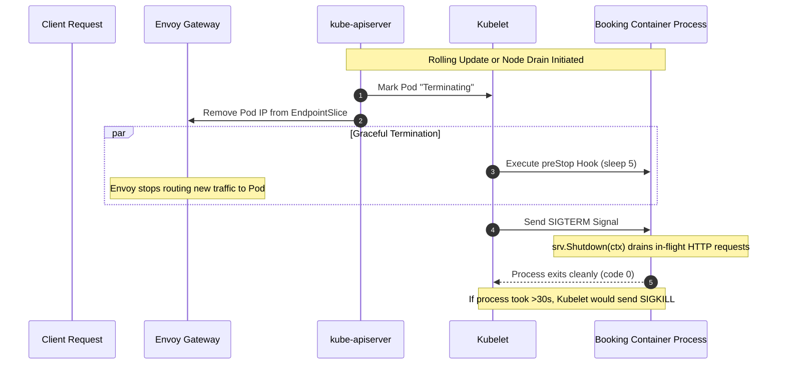

# Stage 4: Flight Control — Reliability, Lifecycle & Governance

In Stages 1–3, we established running workloads, edge networking via Envoy Gateway, and persistent database storage with StatefulSets.

In **Stage 4 (Flight Control)**, we transform our cluster into a production-grade, highly reliable, and self-healing platform. We teach Kubernetes how to manage the complete lifecycle of our containers:
- Knowing when an application is booting (`startupProbe`), when it has deadlocked (`livenessProbe`), and when downstream failures should pause traffic (`readinessProbe`).
- Preventing dropped in-flight user requests during rollouts using **graceful SIGTERM drains and `preStop` hooks**.
- Guaranteeing node resources using **Guaranteed Quality of Service (QoS)**.
- Influencing node placement using **`PriorityClass`** and **`topologySpreadConstraints`**.
- Protecting user availability during maintenance using **`PodDisruptionBudget` (PDB)** and the Eviction API.



---

## 🎯 Learning Goals

By the end of this stage, you will be able to:
1. Configure and differentiate the **three distinct probe paths**: `startupProbe`, `livenessProbe`, and `readinessProbe`.
2. Trace the exact millisecond timeline of **Pod termination** and understand why `preStop` hooks prevent dropped connections.
3. Understand Kubernetes **resource requests and limits**, and why setting `requests == limits` achieves **Guaranteed QoS**.
4. Use **`PriorityClass`** to ensure mission-critical services survive node resource starvation.
5. Distribute replicas evenly across physical nodes using **`topologySpreadConstraints`**.
6. Enforce zero-downtime cluster maintenance using **`PodDisruptionBudget`** and the Kubernetes Eviction API.

---

## 🩺 The Three Health Probes

In Launchpad, we learned that a running process is not necessarily a healthy process. In Kubernetes, the node's **kubelet** uses three distinct probes to govern container lifecycle:

| Probe Type | Question It Answers | What Kubelet Does on Failure | Apollo11 Endpoint |
|---|---|---|---|
| **`startupProbe`** | *"Is the container still initializing / loading caches?"* | Grants a grace period; disables liveness/readiness checks until it passes. | `/healthz/startup` |
| **`livenessProbe`** | *"Is the application process deadlocked or broken internally?"* | **Kills and restarts the container** (increments `restartCount`). | `/healthz/live` |
| **`readinessProbe`** | *"Can the application serve user traffic and talk to its database?"* | **Removes Pod IP from Service Endpoints** (process is NOT killed). | `/healthz/ready` |

### The Startup vs. Liveness Trap
Imagine a Java or Python application that takes 45 seconds to compile caches and initialize database connection pools on startup.
- If you only configure a `livenessProbe` with a 15-second initial delay, the kubelet will check the app at second 15, see a timeout, conclude the app is deadlocked, and **kill the container**!
- The container restarts, begins booting, gets killed again at second 15, and enters `CrashLoopBackOff`.
- **The Solution**: Configure a `startupProbe` with `failureThreshold: 6` and `periodSeconds: 5` (a 30-second window). The kubelet disables liveness checks until the startup probe succeeds!

### Why Readiness Failures Must Not Restart Containers
If `booking-db` goes down, `booking`'s `/healthz/ready` probe fails.
- If you made this a *liveness* check, Kubernetes would reboot `booking` repeatedly. Rebooting `booking` will not fix `booking-db`! It only causes CPU churn and destroys connection state.
- Because it is a *readiness* probe, the kubelet leaves the `booking` process running, but immediately removes its IP from Envoy Gateway. As soon as `booking-db` returns, the readiness probe passes and traffic resumes instantly!

---

## ⏱️ Graceful Termination: SIGTERM, Drains & `preStop`

When a Pod is terminated (during a deployment, rolling update, or node drain), what actually happens?

### The Race Condition
1. The API server marks the Pod `Terminating` and informs the EndpointSlice controller to remove its IP address.
2. At the exact same moment, the kubelet sends a `SIGTERM` signal to the container process.
3. **The Problem**: Propagating the endpoint removal to every node's `kube-proxy` (iptables) and Envoy Gateway takes 1 to 3 seconds across a cluster. If the application process catches `SIGTERM` and immediately closes its TCP port, incoming requests that were already in flight or routed by Envoy will receive `502 Bad Gateway` or `Connection Refused`!

### The Solution: `preStop` Hook + Graceful Shutdown
In `booking-dep.yaml`, we solve this with two coordinated mechanisms:

*Source: `stages/stage4/k8s/apps/booking/booking-dep.yaml`*

```yaml
    spec:
      terminationGracePeriodSeconds: 30
      containers:
        - name: booking
          lifecycle:
            preStop:
              exec:
                command: ["/bin/sh", "-c", "sleep 5"]
```

1. **`lifecycle.preStop` (`sleep 5`)**:
   The kubelet runs this hook *before* sending `SIGTERM`. While the container sleeps for 5 seconds, Envoy Gateway removes the Pod from its active load-balancing pool. No new user requests are sent to this Pod.
2. **`SIGTERM` Handling in Application Code**:
   In `stages/stage4/code/booking/main.go`, the Go application listens for `syscall.SIGTERM`:
   ```go
   quit := make(chan os.Signal, 1)
   signal.Notify(quit, syscall.SIGINT, syscall.SIGTERM)
   <-quit
   log.Println("Received SIGTERM, shutting down gracefully...")
   ctx, cancel := context.WithTimeout(context.Background(), 30*time.Second)
   defer cancel()
   if err := srv.Shutdown(ctx); err != nil {
       log.Fatal("Server forced to shutdown:", err)
   }
   ```
   The HTTP server stops accepting new connections, finishes processing all active in-flight requests, flushes database writes, and cleanly terminates!

---

## ⚖️ Resource Governance: Requests, Limits & Guaranteed QoS

In Kubernetes, you govern hardware resources (CPU and Memory) by specifying **requests** and **limits**:
- **`requests`**: The amount of CPU and memory that the kube-scheduler **guarantees** to reserve on a node for that Pod. If a node does not have enough unallocated requests, the Pod cannot be scheduled there.
- **`limits`**: The maximum ceiling the container is allowed to consume.
  - **CPU (Compressible)**: If a container exceeds its CPU limit, the Linux kernel cgroup **throttles** its CPU shares. The container runs slower, but is not killed.
  - **Memory (Incompressible)**: If a container exceeds its memory limit, the Linux kernel triggers an **OOMKill** (Out Of Memory) event and immediately kills the process!

### The Three Quality of Service (QoS) Classes

When a node experiences severe memory pressure, the kubelet must evict Pods to save the operating system. How does it choose which Pods to sacrifice? Based on their **QoS Class**:

1. **`BestEffort`** (First to be killed):
   Pods with **no** requests and no limits. Lowest priority.
2. **`Burstable`** (Second to be killed):
   Pods with requests lower than limits (e.g. request: 100m, limit: 500m).
3. **`Guaranteed`** (Highest eviction resistance):
   Pods where **`requests == limits`** for BOTH CPU and memory across all containers!

```
┌────────────────────────────────────────────────────────┐
│ HIGH NODE MEMORY PRESSURE (Eviction Priority Ladder)   │
│                                                        │
│  1. BestEffort Pods killed FIRST                       │
│     (No requests, no limits)                           │
│                                                        │
│  2. Burstable Pods killed SECOND                       │
│     (Requests < Limits)                                │
│                                                        │
│  3. Guaranteed Pods PROTECTED                          │
│     (Requests == Limits for CPU and Memory)            │
└────────────────────────────────────────────────────────┘
```

In Stage 4, **all 10 Apollo Airlines workloads are configured for Guaranteed QoS**:

| Tier | Workloads | CPU (Req/Lim) | Memory (Req/Lim) | QoS Class |
|---|---|---|---|---|
| **Flagship** | `booking` | `200m` / `200m` | `256Mi` / `256Mi` | **Guaranteed** |
| **Default App** | `identity`, `flight`, `search` | `100m` / `100m` | `128Mi` / `128Mi` | **Guaranteed** |
| **Low Traffic / UI** | `notification`, `frontend` | `50m` / `50m` | `64Mi` / `64Mi` | **Guaranteed** |
| **Data Tier** | `identity-db`, `flight-db`, `booking-db` | `200m` / `200m` | `256Mi` / `256Mi` | **Guaranteed** |
| **Cache Tier** | `redis` | `100m` / `100m` | `128Mi` / `128Mi` | **Guaranteed** |

*(Note: `100m` means 100 milli-CPUs, or 0.10 of a CPU core. `128Mi` means 128 mebibytes.)*

---

## 🎯 PriorityClasses & Topology Spread

### 1. `PriorityClass`
Under extreme cluster load, if high-priority pods must be scheduled on a full node, Kubernetes can **preempt** (evict) lower-priority pods.

*Source: `stages/stage4/k8s/config/priorityclass.yaml`*

```yaml
apiVersion: scheduling.k8s.io/v1
kind: PriorityClass
metadata:
  name: apollo-airlines-app-critical
value: 1000000
globalDefault: false
description: "Mission-critical revenue services: booking and search"
---
apiVersion: scheduling.k8s.io/v1
kind: PriorityClass
metadata:
  name: apollo-airlines-app-low
value: -100000
globalDefault: false
description: "Background non-blocking services: notification"
```

In `booking-dep.yaml`, we set `priorityClassName: apollo-airlines-app-critical`. If the cluster runs out of resources, background notification workers will be preempted before revenue-generating booking APIs are touched!

### 2. `topologySpreadConstraints`
In a multi-node cluster, what happens if the scheduler accidentally places both replicas of `booking` on `apollo11-worker`? If that single physical worker machine fails, the entire booking API is offline!

In Stage 4, Deployments enforce multi-node distribution:

```yaml
      topologySpreadConstraints:
        - maxSkew: 1
          topologyKey: kubernetes.io/hostname
          whenUnsatisfiable: ScheduleAnyway
          labelSelector:
            matchLabels:
              app: booking
```

- **`topologyKey: kubernetes.io/hostname`**: Evaluates spreading across individual worker nodes.
- **`maxSkew: 1`**: The difference in replica count between any two nodes cannot exceed 1. This guarantees our 2 booking replicas are placed on separate worker nodes (`apollo11-worker` and `apollo11-worker2`)!

---

## 🛡️ PodDisruptionBudgets (PDB) & The Eviction API

When an administrator runs `kubectl drain <node>` to perform a node OS upgrade, Kubernetes calls the **Eviction API** (`/api/v1/namespaces/.../pods/.../eviction`).

A **`PodDisruptionBudget`** (PDB) sets a binding contract on how many voluntary disruptions can occur simultaneously:

*Source: `stages/stage4/k8s/pdb/booking-pdb.yaml`*

```yaml
apiVersion: policy/v1
kind: PodDisruptionBudget
metadata:
  name: booking-pdb
  namespace: apollo-airlines-apps
spec:
  minAvailable: 1
  selector:
    matchLabels:
      app: booking
```

With 2 replicas and `minAvailable: 1`:
- Evicting Pod 1 is **allowed** (1 healthy pod remains).
- Evicting Pod 2 simultaneously is **REJECTED** by the API server with `429 TooManyRequests` until the replacement Pod for replica 1 is fully booted, healthy, and passes its readiness probe!

---

## 🧪 Hands-On Guided Exercises

### Exercise 1: Deploy Stage 4 & Inspect Governance

- **Objective**: Apply Stage 4 and verify probes, QoS classes, and topology distribution.
- **Starting Point**: Running `kind-apollo11` cluster.
- **Instructions**:

```bash
cd Apollo11

# 1. Apply Stage 4
bash stages/stage4/scripts/apply.sh

# 2. Inspect probes on booking
kubectl describe deployment booking -n apollo-airlines-apps | grep -E "(Startup|Liveness|Readiness)"

# 3. Verify QoS Class is Guaranteed
kubectl get pods -n apollo-airlines-apps -l app=booking -o jsonpath='{.items[*].status.qosClass}'
# Output: Guaranteed Guaranteed

# 4. Check that booking replicas are distributed across different worker nodes
kubectl get pods -n apollo-airlines-apps -l app=booking -o wide
```

Notice the `NODE` column: one replica is on `apollo11-worker`, and the other is on `apollo11-worker2`!

---

### Exercise 2: Graceful SIGTERM Shutdown & Log Observation

- **Objective**: Terminate a Pod and observe graceful drain in action.
- **Starting Point**: Stage 4 running.
- **Instructions**:

```bash
# 1. Identify one booking Pod
BOOKING_POD=$(kubectl get pods -n apollo-airlines-apps -l app=booking -o jsonpath='{.items[0].metadata.name}')

# 2. Stream logs in background
kubectl logs -n apollo-airlines-apps "$BOOKING_POD" -f &
LOG_PID=$!
sleep 1

# 3. Delete the Pod (non-blocking)
kubectl delete pod -n apollo-airlines-apps "$BOOKING_POD" --wait=false
```

- **Expected Log Output**:
  ```text
  {"level":"INFO","message":"Received SIGTERM, shutting down gracefully"}
  ```
  The process cleanly closes database connections and drains in-flight requests before exiting. Kill the log stream with `kill $LOG_PID`.

---

### Exercise 3: Testing the Eviction API & PDB Violations

- **Objective**: Use the raw Kubernetes Eviction API to verify that `booking-pdb` blocks concurrent disruptions.
- **Starting Point**: Two healthy `booking` pods running.
- **Instructions**:

```bash
POD1=$(kubectl get pods -n apollo-airlines-apps -l app=booking -o jsonpath='{.items[0].metadata.name}')
POD2=$(kubectl get pods -n apollo-airlines-apps -l app=booking -o jsonpath='{.items[1].metadata.name}')

# 1. Check current PDB status
kubectl get pdb booking-pdb -n apollo-airlines-apps
# ALLOWED DISRUPTIONS should be 1

# 2. Evict the first Pod via raw Eviction API
kubectl create --raw "/api/v1/namespaces/apollo-airlines-apps/pods/${POD1}/eviction" -f - <<EOF
{"apiVersion":"policy/v1","kind":"Eviction","metadata":{"name":"${POD1}","namespace":"apollo-airlines-apps"}}
EOF
# Output: {"status":"Success","code":201}

# 3. Immediately attempt to evict the second Pod while allowed disruptions is 0!
kubectl create --raw "/api/v1/namespaces/apollo-airlines-apps/pods/${POD2}/eviction" -f - <<EOF
{"apiVersion":"policy/v1","kind":"Eviction","metadata":{"name":"${POD2}","namespace":"apollo-airlines-apps"}}
EOF
```

- **Expected Result for Step 3**:
  `Error from server (TooManyRequests): Cannot evict pod as it would violate the pod disruption budget.`
- **What Concept This Reinforces**:
  `PodDisruptionBudgets` strictly enforce application availability contracts during voluntary operations (like cluster upgrades and node drains), preventing engineers from accidentally taking down a production fleet.

---

## 🏁 What You Learned

- How `startupProbe`, `livenessProbe`, and `readinessProbe` fulfill distinct operational roles.
- Why combining `lifecycle.preStop` hooks with graceful SIGTERM signal handling eliminates dropped requests during rollouts.
- How setting equal CPU and memory requests/limits grants Pods **Guaranteed QoS** and maximum eviction resistance.
- How `PriorityClass` protects mission-critical workloads under node starvation.
- How `topologySpreadConstraints` eliminates single-node failure risks.
- How `PodDisruptionBudget` prevents node drains and upgrades from violating availability SLOs.

---

## ✈️ Before Continuing: Checkpoint

Before moving to Stage 5, verify:
1. If a container's readiness probe fails, does the kubelet restart the container?
2. Why is `sleep 5` in the `preStop` hook necessary even if your Go code handles SIGTERM?
3. What combination of resource settings gives a Pod `Guaranteed` QoS?
4. What error does `kubectl` return when an eviction violates a `PodDisruptionBudget`?

Now that our workloads are hardened, resilient, and governed, let's learn how to package and manage them across environments using Helm, Kustomize, and GitOps!

👉 **Continue to [Stage 5: Payload Integration (Helm, Kustomize & GitOps)](./stage-5)**
