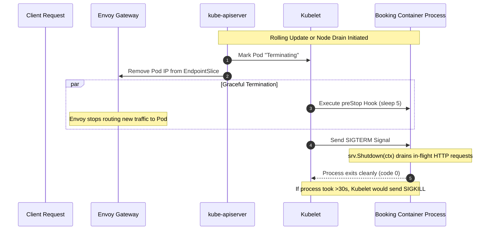

# Stage 4: Flight Control — Reliability, Lifecycle & Governance

:::info[Page type · optional lab]
This lab uses the pinned Apollo11 revision. Confirm two healthy booking replicas
before disruption exercises; a PDB is not a repair mechanism or an availability guarantee.
:::

:::note[Take the controls · Flight Control lab]
Observe how the airline handles startup, unhealthy processes, and graceful departures.
For the explanation before the experiment, start with the
[Flight Control chapters](./learn/reliability/probes). You can return to this lab whenever you’re ready.

Already read them? [Jump to the investigations](#-investigations-ask-which-component-has-authority-to-act).
:::

Stages 1–3 taught the cluster to create workloads, route to ready endpoints,
and reattach local persistent data. Those controls still leave a harder
operational question: when a process is slow, unhealthy, overloaded, or being
replaced, what action is safe? Restarting a Pod can repair one failure and make
another worse.

Stage 4 gives the cluster more precise signals and limits. These controls make
the local platform more resilient, but they are not a production-availability
guarantee:
- Knowing when an application is booting (`startupProbe`), when it has deadlocked (`livenessProbe`), and when downstream failures should pause traffic (`readinessProbe`).
- Preventing dropped in-flight user requests during rollouts using **graceful SIGTERM drains and `preStop` hooks**.
- Guaranteeing node resources using **Guaranteed Quality of Service (QoS)**.
- Influencing node placement using **`PriorityClass`** and **`topologySpreadConstraints`**.
- Protecting user availability during maintenance using **`PodDisruptionBudget` (PDB)** and the Eviction API.

<details>
<summary><strong>Optional conceptual refresher</strong></summary>

The Flight Control chapters are the primary explanation. Expand this section
when you want the older combined account beside the lab.



---

## 🎯 Learning Goals

By the end of this stage, you will be able to:
1. Configure and differentiate the **three distinct probe paths**: `startupProbe`, `livenessProbe`, and `readinessProbe`.
2. Trace the exact millisecond timeline of **Pod termination** and understand why `preStop` hooks prevent dropped connections.
3. Understand Kubernetes **resource requests and limits**, and why setting `requests == limits` achieves **Guaranteed QoS**.
4. Use **`PriorityClass`** to ensure mission-critical services survive node resource starvation.
5. Distribute replicas evenly across physical nodes using **`topologySpreadConstraints`**.
6. Constrain voluntary disruptions using **`PodDisruptionBudget`** and the Kubernetes Eviction API.

---

## 🩺 Three questions that must not share one answer

Launchpad showed that a process can remain alive while its database dependency
is unusable. Kubernetes makes the distinction actionable, but only when we ask
the kubelet the right question. A probe is not a general “health score”: each
one grants the kubelet different authority over the container and Service
endpoint.

| Probe Type | Question It Answers | What Kubelet Does on Failure | Apollo11 Endpoint |
|---|---|---|---|
| **`startupProbe`** | *"Is the container still initializing / loading caches?"* | Grants a grace period; disables liveness/readiness checks until it passes. | `/healthz/startup` |
| **`livenessProbe`** | *"Is the application process deadlocked or broken internally?"* | **Kills and restarts the container** (increments `restartCount`). | `/healthz/live` |
| **`readinessProbe`** | *"Can the application serve user traffic and talk to its database?"* | **Removes Pod IP from Service Endpoints** (process is NOT killed). | `/healthz/ready` |

### What the kubelet changes after each answer
Imagine a Java or Python application that takes 45 seconds to compile caches and initialize database connection pools on startup.
- If you only configure a `livenessProbe` with a 15-second initial delay, the kubelet will check the app at second 15, see a timeout, conclude the app is deadlocked, and **kill the container**!
- The container restarts, begins booting, gets killed again at second 15, and enters `CrashLoopBackOff`.
- **The Solution**: Configure a `startupProbe` with `failureThreshold: 6` and `periodSeconds: 5` (a 30-second window). The kubelet disables liveness checks until the startup probe succeeds!

### Why readiness failure is a routing signal, not a repair command
If `booking-db` goes down, `booking`'s `/healthz/ready` probe fails.
- If you made this a *liveness* check, Kubernetes would reboot `booking` repeatedly. Rebooting `booking` will not fix `booking-db`! It only causes CPU churn and destroys connection state.
- Because it is a *readiness* probe, the kubelet leaves the `booking` process
  running. Kubernetes marks the Pod unready, and its endpoint becomes
  ineligible for ordinary Service traffic after that state propagates. When
  `booking-db` returns and the probe passes again, the endpoint becomes eligible
  without restarting the application.

---

## ⏱️ Termination is a race between routing and work already in flight

When a Pod is terminated during a rollout or voluntary eviction, multiple actors
react asynchronously. Kubernetes starts withdrawing the endpoint, the kubelet
runs lifecycle hooks, and the application decides what to do when it receives
SIGTERM. No single line of YAML produces a seamless request; the mechanism is a
coordinated attempt to reduce the race window.

### The Race Condition
1. The API server marks the Pod `Terminating` and informs the EndpointSlice controller to remove its IP address.
2. At the exact same moment, the kubelet sends a `SIGTERM` signal to the container process.
3. **The Problem**: Endpoint readiness and routing updates are asynchronous.
   During propagation, an in-flight or newly routed request can still reach a
   terminating Pod. Closing the listener too early can therefore produce a
   failed request; no fixed propagation time is guaranteed by these manifests.

### The Solution: `preStop` Hook + Graceful Shutdown
In `booking-dep.yaml`, we solve this with two coordinated mechanisms:

*Source: `stages/stage4/k8s/apps/booking/booking-dep.yaml`*

```yaml
    spec:
      terminationGracePeriodSeconds: 30
      containers:
        - name: booking
          lifecycle:
            preStop:
              exec:
                command: ["/bin/sh", "-c", "sleep 5"]
```

1. **`lifecycle.preStop` (`sleep 5`)**:
   The kubelet runs this hook *before* sending `SIGTERM`. The delay gives
   endpoint and proxy updates time to propagate; it reduces, rather than proves
   the elimination of, new traffic to this Pod.
2. **`SIGTERM` Handling in Application Code**:
   In `stages/stage4/code/booking/main.go`, the Go application listens for `syscall.SIGTERM`:
   ```go
   quit := make(chan os.Signal, 1)
   signal.Notify(quit, syscall.SIGINT, syscall.SIGTERM)
   <-quit
   log.Println("Received SIGTERM, shutting down gracefully...")
   ctx, cancel := context.WithTimeout(context.Background(), 30*time.Second)
   defer cancel()
   if err := srv.Shutdown(ctx); err != nil {
       log.Fatal("Server forced to shutdown:", err)
   }
   ```
   The HTTP server stops accepting new connections, finishes processing all active in-flight requests, flushes database writes, and cleanly terminates!

---

## ⚖️ Scheduling intent and runtime limits are different promises

The scheduler needs to decide whether a Pod can fit before the container starts.
The kernel needs rules after it starts. Requests and limits serve those distinct
moments, even when Stage 4 deliberately makes their values equal.
- **`requests`**: The amount of CPU and memory that the kube-scheduler **guarantees** to reserve on a node for that Pod. If a node does not have enough unallocated requests, the Pod cannot be scheduled there.
- **`limits`**: The maximum ceiling the container is allowed to consume.
  - **CPU (Compressible)**: If a container exceeds its CPU limit, the Linux kernel cgroup **throttles** its CPU shares. The container runs slower, but is not killed.
  - **Memory (Incompressible)**: If a container exceeds its memory limit, the Linux kernel triggers an **OOMKill** (Out Of Memory) event and immediately kills the process!

### The Three Quality of Service (QoS) Classes

When a node experiences severe memory pressure, the kubelet must evict Pods to save the operating system. How does it choose which Pods to sacrifice? Based on their **QoS Class**:

1. **`BestEffort`** (First to be killed):
   Pods with **no** requests and no limits. Lowest priority.
2. **`Burstable`** (Second to be killed):
   Pods with requests lower than limits (e.g. request: 100m, limit: 500m).
3. **`Guaranteed`** (Highest eviction resistance):
   Pods where **`requests == limits`** for BOTH CPU and memory across all containers!

```
┌────────────────────────────────────────────────────────┐
│ HIGH NODE MEMORY PRESSURE (Eviction Priority Ladder)   │
│                                                        │
│  1. BestEffort Pods killed FIRST                       │
│     (No requests, no limits)                           │
│                                                        │
│  2. Burstable Pods killed SECOND                       │
│     (Requests < Limits)                                │
│                                                        │
│  3. Guaranteed Pods PROTECTED                          │
│     (Requests == Limits for CPU and Memory)            │
└────────────────────────────────────────────────────────┘
```

In Stage 4, **all 10 Apollo Airlines workloads are configured for Guaranteed QoS**:

| Tier | Workloads | CPU (Req/Lim) | Memory (Req/Lim) | QoS Class |
|---|---|---|---|---|
| **Flagship** | `booking` | `200m` / `200m` | `256Mi` / `256Mi` | **Guaranteed** |
| **Default App** | `identity`, `flight`, `search` | `100m` / `100m` | `128Mi` / `128Mi` | **Guaranteed** |
| **Low Traffic / UI** | `notification`, `frontend` | `50m` / `50m` | `64Mi` / `64Mi` | **Guaranteed** |
| **Data Tier** | `identity-db`, `flight-db`, `booking-db` | `200m` / `200m` | `256Mi` / `256Mi` | **Guaranteed** |
| **Cache Tier** | `redis` | `100m` / `100m` | `128Mi` / `128Mi` | **Guaranteed** |

*(Note: `100m` means 100 milli-CPUs, or 0.10 of a CPU core. `128Mi` means 128 mebibytes.)*

---

## 🎯 When there is not enough room, state the trade-offs

### 1. `PriorityClass`
Under extreme cluster load, if high-priority pods must be scheduled on a full node, Kubernetes can **preempt** (evict) lower-priority pods.

*Source: `stages/stage4/k8s/config/priorityclass.yaml`*

```yaml
apiVersion: scheduling.k8s.io/v1
kind: PriorityClass
metadata:
  name: apollo-airlines-app-critical
value: 1000000
globalDefault: false
description: "Apollo Airlines app-critical pods (booking, search)."
---
apiVersion: scheduling.k8s.io/v1
kind: PriorityClass
metadata:
  name: apollo-airlines-app-low
value: -100000
globalDefault: false
description: "Apollo Airlines app-low pods (notification)."
```

In `booking-dep.yaml`, `booking` uses
`priorityClassName: apollo-airlines-app-critical`, while notification uses the
low class. If a high-priority Pod is pending and no node has enough resources,
the scheduler may preempt eligible lower-priority Pods to make room. Priority
does not prevent every form of disruption or guarantee booking availability.

### 2. `topologySpreadConstraints`
In a multi-node cluster, what happens if the scheduler accidentally places both replicas of `booking` on `apollo11-worker`? If that single physical worker machine fails, the entire booking API is offline!

In Stage 4, Deployments enforce multi-node distribution:

*Source: `stages/stage4/k8s/apps/booking/booking-dep.yaml` (Pod-spec excerpt)*

```yaml
      topologySpreadConstraints:
        - maxSkew: 1
          topologyKey: kubernetes.io/hostname
          whenUnsatisfiable: ScheduleAnyway
          labelSelector:
            matchLabels:
              app: booking
```

- **`topologyKey: kubernetes.io/hostname`**: Evaluates spreading across individual worker nodes.
- **`maxSkew: 1`**: The scheduler prefers a difference of no more than one
  replica across eligible hostnames. Because `whenUnsatisfiable` is
  `ScheduleAnyway`, this is a soft availability preference, not a guarantee;
  inspect the `NODE` column to see the placement your cluster achieved.

---

## 🛡️ A PDB limits one category of disruption

When an administrator uses the Eviction API—for example through `kubectl drain`
in a maintenance workflow—the API server can consult a
**PodDisruptionBudget**. This is different from a node crash or a container
OOMKill: a PDB only constrains voluntary eviction.

A **`PodDisruptionBudget`** (PDB) sets a binding contract on how many voluntary disruptions can occur simultaneously:

*Source: `stages/stage4/k8s/pdb/booking-pdb.yaml`*

```yaml
apiVersion: policy/v1
kind: PodDisruptionBudget
metadata:
  name: booking-pdb
  namespace: apollo-airlines-apps
spec:
  minAvailable: 1
  selector:
    matchLabels:
      app: booking
```

With 2 replicas and `minAvailable: 1`:
- Evicting Pod 1 is **allowed** (1 healthy pod remains).
- Evicting Pod 2 simultaneously is **REJECTED** by the API server with `429 TooManyRequests` until the replacement Pod for replica 1 is fully booted, healthy, and passes its readiness probe!

---

</details>

## 🧪 Investigations: ask which component has authority to act

For each experiment, name the actor before you run it. Probe results are acted
on by the kubelet; scheduling rules are considered by the scheduler; PDBs are
considered by the Eviction API. Seeing a Pod change state is useful only after
you know which mechanism was allowed to cause that change.

### Exercise 1: Deploy Stage 4 & Inspect Governance

**Prediction:** equal CPU and memory requests/limits explain the QoS class, but
they do not force the scheduler to place replicas on separate nodes. The
topology rule is a separate, soft preference in this stage.

- **Objective**: Apply Stage 4 and verify probes, QoS classes, and topology distribution.
- **Starting Point**: Running `kind-apollo11` cluster.
- **Instructions**:

```bash
cd Apollo11

# 1. Apply Stage 4
bash stages/stage4/scripts/apply.sh

# 2. Inspect probes on booking
kubectl describe deployment booking -n apollo-airlines-apps | grep -E "(Startup|Liveness|Readiness)"

# 3. Verify QoS Class is Guaranteed
kubectl get pods -n apollo-airlines-apps -l app=booking -o jsonpath='{.items[*].status.qosClass}'
# Output: Guaranteed Guaranteed

# 4. Check that booking replicas are distributed across different worker nodes
kubectl get pods -n apollo-airlines-apps -l app=booking -o wide
```

- **Expected result**: Probe fields and Guaranteed QoS are visible. With the
  normal three-node lab, the scheduler will usually spread booking replicas;
  record the actual `NODE` column because `ScheduleAnyway` makes this a soft
  preference.
- **Verification command**: Run `bash stages/stage4/scripts/verify.sh`; the
  current source records 148 checks.
- **Troubleshooting hints**: If Pods co-locate, inspect scheduler events and
  eligible-node resources before assuming the topology rule is broken.
- **Concept reinforced**: Probes, resources, priority, and topology are separate
  inputs to kubelet and scheduler decisions.

---

### Exercise 2: Graceful SIGTERM Shutdown & Log Observation

**Prediction:** the Pod replacement proves Deployment reconciliation; the
termination log helps explain the old process's shutdown path. Neither signal by
itself proves that no request could have failed during the transition.

- **Objective**: Terminate a Pod and observe graceful drain in action.
- **Starting Point**: Stage 4 running.
- **Instructions**:

```bash
# 1. Identify one booking Pod
BOOKING_POD=$(kubectl get pods -n apollo-airlines-apps -l app=booking -o jsonpath='{.items[0].metadata.name}')

# 2. Stream logs in background
kubectl logs -n apollo-airlines-apps "$BOOKING_POD" -f &
LOG_PID=$!
sleep 1

# 3. Delete the Pod (non-blocking)
kubectl delete pod -n apollo-airlines-apps "$BOOKING_POD" --wait=false
```

- **Expected Log Output**:
  ```text
  {"level":"INFO","message":"Received SIGTERM, shutting down gracefully"}
  ```
  The process cleanly closes database connections and drains in-flight requests before exiting. Kill the log stream with `kill $LOG_PID`.

- **Verification command**: Confirm the Deployment returns to two Ready
  replicas with `kubectl rollout status deployment/booking -n
  apollo-airlines-apps`.
- **Troubleshooting hints**: If the log follower ends before showing the signal
  message, use `kubectl logs -n apollo-airlines-apps "$BOOKING_POD"` while the
  terminated Pod still exists, and inspect termination state and events.
- **Concept reinforced**: `preStop`, SIGTERM handling, the grace period, and
  readiness propagation cooperate during termination; none alone proves
  zero-downtime behavior.

---

### Exercise 3: Testing the Eviction API & PDB Violations

**Prediction:** the second eviction is rejected only while the PDB observes too
few available booking Pods. If the first replacement becomes Ready quickly, the
same request can become allowed—this is a live availability calculation, not a
permanent lock.

- **Objective**: Use the raw Kubernetes Eviction API to verify that `booking-pdb` blocks concurrent disruptions.
- **Starting Point**: Two healthy `booking` pods running.
- **Instructions**:

```bash
POD1=$(kubectl get pods -n apollo-airlines-apps -l app=booking -o jsonpath='{.items[0].metadata.name}')
POD2=$(kubectl get pods -n apollo-airlines-apps -l app=booking -o jsonpath='{.items[1].metadata.name}')

# 1. Check current PDB status
kubectl get pdb booking-pdb -n apollo-airlines-apps
# ALLOWED DISRUPTIONS should be 1

# 2. Evict the first Pod via raw Eviction API
kubectl create --raw "/api/v1/namespaces/apollo-airlines-apps/pods/${POD1}/eviction" -f - <<EOF
{"apiVersion":"policy/v1","kind":"Eviction","metadata":{"name":"${POD1}","namespace":"apollo-airlines-apps"}}
EOF
# Output: {"status":"Success","code":201}

# 3. Immediately attempt to evict the second Pod while allowed disruptions is 0!
kubectl create --raw "/api/v1/namespaces/apollo-airlines-apps/pods/${POD2}/eviction" -f - <<EOF
{"apiVersion":"policy/v1","kind":"Eviction","metadata":{"name":"${POD2}","namespace":"apollo-airlines-apps"}}
EOF
```

- **Expected Result for Step 3**:
  `Error from server (TooManyRequests): Cannot evict pod as it would violate the pod disruption budget.`
- **What Concept This Reinforces**:
  `PodDisruptionBudgets` constrain voluntary disruptions such as eviction and
  node drain. They do not prevent crashes, guarantee capacity, or repair an
  unhealthy workload.
- **Verification command**: Watch `kubectl get pdb booking-pdb -n
  apollo-airlines-apps -w` until `ALLOWED DISRUPTIONS` returns to 1.
- **Troubleshooting hints**: This experiment is timing-sensitive. If the
  replacement becomes Ready before the second request, the second eviction may
  be allowed; repeat only after restoring two healthy replicas and watching the
  budget transition.

---

## 🏁 What You Learned

- How `startupProbe`, `livenessProbe`, and `readinessProbe` fulfill distinct operational roles.
- How `lifecycle.preStop` hooks and graceful SIGTERM handling reduce the risk of
  dropped requests during termination.
- How setting equal CPU and memory requests/limits grants Pods **Guaranteed QoS** and maximum eviction resistance.
- How `PriorityClass` protects mission-critical workloads under node starvation.
- How `topologySpreadConstraints` express placement preferences or requirements;
  Stage 4 uses the soft `ScheduleAnyway` form.
- How `PodDisruptionBudget` prevents node drains and upgrades from violating availability SLOs.

---

## ✈️ Before Continuing: Checkpoint

Before moving to Stage 5, verify:
1. If a container's readiness probe fails, does the kubelet restart the container?
2. Why is `sleep 5` in the `preStop` hook necessary even if your Go code handles SIGTERM?
3. What combination of resource settings gives a Pod `Guaranteed` QoS?
4. What error does `kubectl` return when an eviction violates a `PodDisruptionBudget`?

Now that the reliability and governance mechanisms are observable, learn how
to package and manage them across environments with Helm, Kustomize, and GitOps.

👉 **Continue to [Stage 5: Payload Integration (Helm, Kustomize & GitOps)](./stage-5)**
