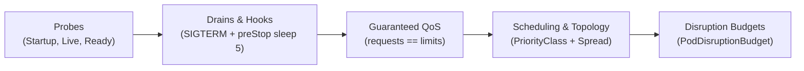
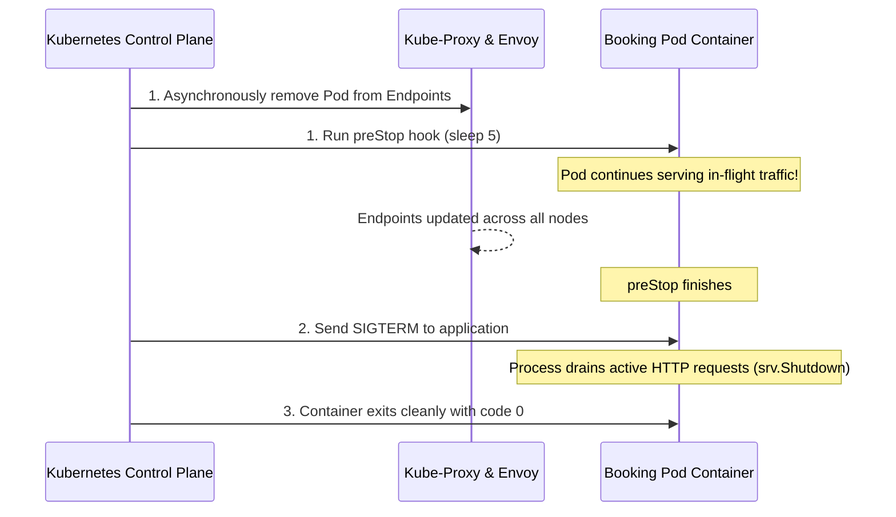

# Stage 4: Flight Control — Workload Reliability & Governance

**Goal:** Transform the running workloads into a production-grade, reliable, and well-governed fleet. 

In Stage 3, workloads survived Pod restarts with persistent disks. But what happens if an application deadlocks, runs out of memory, drops in-flight user requests during rolling restarts, or is evicted when a worker node is drained?

Stage 4 answers these operational requirements through a cohesive reliability and placement architecture:



| | |
|---|---|
| **Curriculum Sequence** | Probes → Drains & Lifecycle Hooks → Guaranteed QoS → Priority & Topology Spread → PodDisruptionBudgets |
| **New Concepts** | `startupProbe`, `livenessProbe`, `readinessProbe`, `preStop` lifecycle hook, `terminationGracePeriodSeconds`, `requests == limits`, Guaranteed QoS, `PriorityClass`, `topologySpreadConstraints`, `PodDisruptionBudget`, Eviction API |
| **Workloads Changed** | All 10 workloads (6 Deployments + 4 StatefulSets) |
| **Verification Target** | **148/148 checks pass** |

---

## 1. The Three Distinct Probe Paths

Kubernetes provides three distinct health probes, each with a different purpose:

| Probe | Path | Purpose | Kubelet Action on Failure |
|---|---|---|---|
| **Startup** | `/healthz/startup` | Protects slow-starting containers during initial bootstrap | Pauses liveness/readiness; kills container only if threshold exceeded |
| **Liveness** | `/healthz/live` | Detects deadlocks, fatal bugs, or frozen execution loops | Kills and restarts the container |
| **Readiness** | `/healthz/ready` | Tests if the pod can currently serve user traffic (DB healthy) | Pulls the Pod IP from Service EndpointSlices (no restart) |

```yaml
# Example from booking deployment:
startupProbe:
  httpGet:
    path: /healthz/startup
    port: 8082
  failureThreshold: 6
  periodSeconds: 5      # Grants 30s window (6 x 5s) before liveness begins

livenessProbe:
  httpGet:
    path: /healthz/live
    port: 8082
  periodSeconds: 10
  failureThreshold: 3   # Restarts container if deadlocked for 30s

readinessProbe:
  httpGet:
    path: /healthz/ready
    port: 8082
  periodSeconds: 5
  failureThreshold: 2   # Drops from load balancer if database connectivity drops
```

:::note StatefulSet Probes
StatefulSets (`identity-db`, `flight-db`, `booking-db`, `redis`) use native CLI exec probes (`pg_isready` and `redis-cli ping`). They omit `startupProbe` because PostgreSQL's internal `initdb` blocks connection acceptance until initialization completes.
:::

---

## 2. Graceful SIGTERM Drains & `preStop` Hooks

### Why `preStop` Is Essential

When a Pod is terminated during a rolling update or node drain, two actions happen **asynchronously and in parallel**:
1. The endpoint controller removes the Pod IP from Service endpoints and Envoy routing tables.
2. The `kubelet` sends a `SIGTERM` signal to the container process.

Because network programming takes a few seconds to propagate across all nodes, the application might receive `SIGTERM` and immediately close its HTTP listener while client requests are still in-flight!



To eliminate dropped connections, Stage 4 introduces a `preStop` hook:

```yaml
lifecycle:
  preStop:
    exec:
      command: ["/bin/sh", "-c", "sleep 5"]
terminationGracePeriodSeconds: 30
```

The Go microservices execute `srv.Shutdown(ctx)` with a 30-second context, and Python `uvicorn` uses `--timeout-graceful-shutdown 30` to drain active sockets cleanly.

---

## 3. Guaranteed Quality of Service (QoS)

Kubernetes classifies Pods into three QoS classes based on resource requests and limits:
- **Guaranteed:** `requests == limits` for both CPU and memory on all containers.
- **Burstable:** `requests < limits` or limits not specified.
- **BestEffort:** No requests or limits set.

Under node memory pressure, the Linux kernel OOM (Out of Memory) killer terminates Pods in order: **BestEffort first, then Burstable, and Guaranteed last**.

Stage 4 configures **Guaranteed QoS** across all workloads:

| Workload Tier | Components | CPU (req/lim) | Memory (req/lim) | QoS Class |
|---|---|---|---|---|
| **App Default** | `identity`, `flight`, `search` | 100m | 128Mi | `Guaranteed` |
| **Flagship** | `booking` | 200m | 256Mi | `Guaranteed` |
| **Low Traffic** | `notification` | 50m | 64Mi | `Guaranteed` |
| **UI / NGINX** | `frontend` | 50m | 64Mi | `Guaranteed` |
| **PostgreSQL** | `identity-db`, `flight-db`, `booking-db` | 200m | 256Mi | `Guaranteed` |
| **Redis** | `redis` | 100m | 128Mi | `Guaranteed` |

---

## 4. PriorityClasses & Topology Spread Constraints

### Pod Priority & Preemption

If a cluster runs low on compute capacity, which workloads should be preserved?
Stage 4 defines two cluster-scoped `PriorityClass` resources:
- `apollo-airlines-app-critical` (`value: 1000000`): Assigned to revenue-critical services (`booking`, `search`).
- `apollo-airlines-app-low` (`value: -100000`): Assigned to asynchronous workers (`notification`).

Under resource exhaustion, the scheduler preempts (evicts) low-priority Pods to make room for critical services.

### Topology Spread Constraints

To avoid placing all replicas on a single worker node (creating a single point of failure), Deployments configure `topologySpreadConstraints`:

```yaml
topologySpreadConstraints:
  - maxSkew: 1
    topologyKey: kubernetes.io/hostname
    whenUnsatisfiable: DoNotSchedule
    labelSelector:
      matchLabels:
        app: booking
```

`maxSkew: 1` guarantees that the difference in replica count between any two worker nodes is at most 1. In our 2-worker cluster, our 2 booking replicas are evenly scheduled: 1 on `apollo11-worker` and 1 on `apollo11-worker2`.

---

## 5. PodDisruptionBudgets (PDB)

A **PodDisruptionBudget (PDB)** protects applications from voluntary disruptions (e.g. `kubectl drain`, node upgrades, autoscaling scale-down).

```yaml
apiVersion: policy/v1
kind: PodDisruptionBudget
metadata:
  name: booking-pdb
  namespace: apollo-airlines-apps
spec:
  minAvailable: 1
  selector:
    matchLabels:
      app: booking
```

With 2 replicas and `minAvailable: 1`, Kubernetes permits only 1 replica to be disrupted at any time.

---

## Hands-On Lab: Deploy Stage 4

Apply the complete Stage 4 reliability stack:

```bash
cd stages/stage4
./scripts/apply.sh
```

### Inspect Probes and QoS

```bash
# 1. Verify probes on booking Deployment
kubectl describe deployment booking -n apollo-airlines-apps | grep -E "(Liveness|Readiness|Startup)"

# 2. Verify QoS class is Guaranteed
kubectl get pods -n apollo-airlines-apps -l app=booking \
  -o custom-columns='NAME:.metadata.name,QOS:.status.qosClass'

# 3. Inspect PriorityClasses
kubectl get priorityclass apollo-airlines-app-critical apollo-airlines-app-low

# 4. Verify multi-node replica spread
kubectl get pods -n apollo-airlines-apps -l app=booking -o wide
# Look at the NODE column: one replica on worker, one replica on worker2!

# 5. Inspect PDBs
kubectl get pdb -A
```

---

## Break 1: Graceful SIGTERM Shutdown & Drain

Watch a booking Pod shut down while streaming logs:

```bash
# Capture the name of one booking pod
POD=$(kubectl get pods -n apollo-airlines-apps -l app=booking -o jsonpath="{.items[0].metadata.name}")

# Follow logs in background
kubectl logs -n apollo-airlines-apps "$POD" -f &
LOG_PID=$!
sleep 1

# Delete the pod asynchronously
kubectl delete pod -n apollo-airlines-apps "$POD" --wait=false

# Wait for shutdown output, then kill log process
sleep 4
kill $LOG_PID 2>/dev/null || true
```

**Expected Log Output:**
```json
{"level":"INFO","service":"booking","message":"Received SIGTERM, shutting down gracefully"}
{"level":"INFO","service":"booking","message":"Database connections closed"}
{"level":"INFO","service":"booking","message":"Server exiting"}
```

Notice that the pod spent 5 seconds in `preStop` before executing `srv.Shutdown()` and closing database connections cleanly.

---

## Break 2: PodDisruptionBudget Exhaustion

Let's test Kubernetes' Eviction API directly against the `booking` service.

Capture the two active booking Pod names:

```bash
POD1=$(kubectl get pods -n apollo-airlines-apps -l app=booking -o jsonpath="{.items[0].metadata.name}")
POD2=$(kubectl get pods -n apollo-airlines-apps -l app=booking -o jsonpath="{.items[1].metadata.name}")
```

### 1. Evict First Pod (Allowed)

```bash
kubectl create --raw "/api/v1/namespaces/apollo-airlines-apps/pods/${POD1}/eviction" -f - <<EOF
{"apiVersion":"policy/v1","kind":"Eviction","metadata":{"name":"${POD1}","namespace":"apollo-airlines-apps"}}
EOF
```

Output:
```json
{"apiVersion":"policy/v1","kind":"Eviction","metadata":{"name":"booking-xxxxx","namespace":"apollo-airlines-apps"},"status":"Success"}
```

The eviction is permitted because 2 replicas existed and `minAvailable: 1`.

### 2. Immediately Evict Second Pod (Rejected!)

While the first replica is terminating and the replacement is not yet `Ready`, attempt to evict the second replica:

```bash
kubectl create --raw "/api/v1/namespaces/apollo-airlines-apps/pods/${POD2}/eviction" -f - <<EOF
{"apiVersion":"policy/v1","kind":"Eviction","metadata":{"name":"${POD2}","namespace":"apollo-airlines-apps"}}
EOF
```

**Output:**
```text
Error from server (TooManyRequests): Cannot evict pod as it would violate the pod disruption budget.
```

The Kubernetes API server actively blocked the eviction! Even a cluster administrator running `kubectl drain` cannot take down the service while PDB constraints are unsatisfied.

---

## Recover: Continuous Service Availability

Verify that user traffic through Envoy Gateway was never interrupted:

```bash
curl -i -H "Host: booking.apollo.local" http://172.18.0.50/readyz
# Returns: HTTP/1.1 200 OK
```

Wait for the replacement replica to become Ready and observe PDB recovery:

```bash
kubectl rollout status deployment/booking -n apollo-airlines-apps
kubectl get pdb booking-pdb -n apollo-airlines-apps
# currentHealthy returns to 2, disruptionsAllowed returns to 1!
```

---

## Maintainer Verification

Run the comprehensive Stage 4 verification suite:

```bash
./scripts/verify.sh
```

**Result: 148/148 checks pass**, verifying:
- Probe definitions (`startup`, `live`, `ready`) across all Deployments.
- `Guaranteed` QoS class across all containers.
- PriorityClass assignment and scheduling priority.
- Node anti-affinity / topology spread balance across kind workers.
- PDB configuration, live Eviction API enforcement, and zero-downtime routing.

---

## Clean Up

```bash
./scripts/teardown.sh
```

---


### Exact Failure Injection & PDB Proof (from verify.sh)

1. Test that the Graceful SIGTERM drain works on the API:
```bash
kubectl logs --follow deployment/booking -n apollo-airlines-apps &
kubectl delete pod -n apollo-airlines-apps -l app=booking
# Expected Output in logs: "Received SIGTERM, shutting down gracefully"
```

2. Test that the PodDisruptionBudget (PDB) blocks voluntary evictions:
```bash
kubectl create poddisruptionbudget booking-pdb --selector=app=booking --min-available=1 -n apollo-airlines-apps
BOOKING_POD=$(kubectl get pod -n apollo-airlines-apps -l app=booking -o jsonpath='{.items[0].metadata.name}')
# Attempt to evict using the raw Eviction API
kubectl proxy &
curl -X POST -H "Content-Type: application/json" -d '{"apiVersion":"policy/v1","kind":"Eviction","metadata":{"name":"'"$BOOKING_POD"'","namespace":"apollo-airlines-apps"}}' http://localhost:8001/api/v1/namespaces/apollo-airlines-apps/pods/$BOOKING_POD/eviction
# Expected Output: HTTP 429 Too Many Requests (Cannot evict pod as it would violate the pod's disruption budget.)
```


## Explain & Review Questions

1. **Why does readiness probe failure NOT restart the container?**
   Readiness indicates traffic readiness, not process failure. If a database goes down temporarily, restarting 100 app containers simultaneously creates a "thundering herd" restart storm that further overwhelms the database.

2. **Why is `sleep 5` in `preStop` necessary if the Go code already handles SIGTERM?**
   Because kube-proxy and Envoy routing updates propagate asynchronously across nodes. Without the `preStop` delay, the app would close its listener before proxies stop sending requests.

3. **What conditions must a Pod satisfy to achieve `Guaranteed` QoS?**
   Every container in the Pod must specify both CPU and memory limits, and the CPU/memory requests must exactly equal their corresponding limits.

---

## What's Next

In [Stage 5: Payload Integration](./stage-5.md), we package our hardened Stage 4 manifests into a production **Helm chart**, create **Kustomize dev/staging/prod overlays**, configure **GitHub Actions CI**, and deploy declaratively with **Argo CD**.