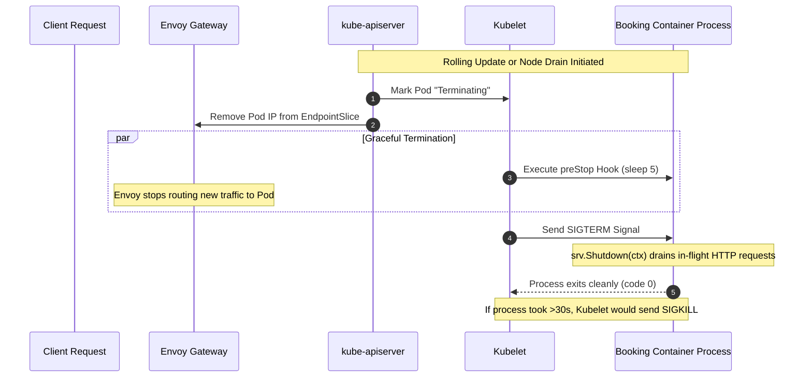

# Stage 4: Flight Control — Reliability, Lifecycle & Governance

:::info[Page type · optional lab]
This lab uses the pinned Apollo11 revision. Confirm two healthy booking replicas
before disruption exercises; a PDB is not a repair mechanism or an availability guarantee.
:::

:::note[Take the controls · Flight Control lab]
Observe how the airline handles startup, unhealthy processes, and graceful departures.
For the explanation before the experiment, start with the
[Flight Control chapters](./learn/reliability/probes). You can return to this lab whenever you’re ready.

Already read them? [Jump to the investigations](#-investigations-ask-which-component-has-authority-to-act).
:::

In Stages 1–3 the cluster learned to create workloads, route traffic to ready
endpoints, and keep local data across Pod replacement. A harder question remains:
when a process is slow, unhealthy, overloaded, or being replaced, what is the
safe thing to do? Restarting a Pod can fix one problem and make another worse.

Stage 4 gives Kubernetes more precise signals and limits to work with. They make
the local platform more resilient, but they do not guarantee production-grade
availability:
- **Probes** tell Kubernetes when an application is still starting (`startupProbe`), when it is stuck (`livenessProbe`), and when it should stop receiving traffic (`readinessProbe`).
- **Graceful shutdown** (a SIGTERM handler plus a `preStop` hook) avoids dropping in-flight requests during rollouts.
- **Guaranteed Quality of Service (QoS)** protects a Pod's node resources.
- **`PriorityClass`** and **`topologySpreadConstraints`** influence where Pods run and which are kept under pressure.
- **`PodDisruptionBudget` (PDB)** and the Eviction API protect availability during maintenance.

<details>
<summary><strong>Optional conceptual refresher</strong></summary>

The Flight Control chapters are the primary explanation. Expand this section
when you want the older combined account beside the lab.


```mermaid
sequenceDiagram
  autonumber
  participant User as Client Request
  participant GW as Envoy Gateway
  participant API as kube-apiserver
  participant KL as Kubelet
  participant App as Booking Container Process

  Note over API,App: Rolling Update or Node Drain Initiated
  API->>KL: Mark Pod "Terminating"
  API->>GW: Remove Pod IP from EndpointSlice
  par Graceful Termination
    KL->>App: Execute preStop Hook (sleep 5)
    Note over GW: Envoy stops routing new traffic to Pod
  end
  KL->>App: Send SIGTERM Signal
  Note over App: srv.Shutdown(ctx) drains in-flight HTTP requests
  App-->>KL: Process exits cleanly (code 0)
  Note over KL,App: If process took >30s, Kubelet would send SIGKILL
```

---

## 🎯 Learning Goals

By the end of this stage, you will be able to:
1. Configure the three probes, `startupProbe`, `livenessProbe`, and `readinessProbe`, and explain how they differ.
2. Describe the sequence of events when a Pod is terminated, and explain how a `preStop` hook reduces dropped connections.
3. Explain resource requests and limits, and why setting `requests == limits` gives a Pod **Guaranteed QoS**.
4. Use **`PriorityClass`** to give critical services precedence when a node is short of resources.
5. Spread replicas across nodes with **`topologySpreadConstraints`**.
6. Limit voluntary disruptions with a **`PodDisruptionBudget`** and the Kubernetes Eviction API.

---

## 🩺 Three questions that must not share one answer

Launchpad showed that a process can stay alive while its database is unusable.
Kubernetes lets you act on that difference, but only if you ask the kubelet the
right question. A probe is not a general health score. Each type of probe gives
the kubelet authority to do something different to the container or to its
Service endpoint.

| Probe | Question it answers | What happens when it fails | Apollo11 endpoint |
|---|---|---|---|
| **`startupProbe`** | *"Is the container still starting up or loading caches?"* | The kubelet keeps waiting, up to a limit. Liveness and readiness checks stay off until it passes. | `/healthz/startup` |
| **`livenessProbe`** | *"Is the process deadlocked or broken internally?"* | The kubelet **kills and restarts the container** (`restartCount` goes up). | `/healthz/live` |
| **`readinessProbe`** | *"Can the application serve traffic and reach its database?"* | The Pod's IP is **removed from the Service's endpoints**. The process is not killed. | `/healthz/ready` |

### What the kubelet does after each answer
Imagine an application that needs 45 seconds at startup to build caches and open
database connections.
- With only a `livenessProbe` that starts checking after 15 seconds, the kubelet probes at second 15, gets a timeout, decides the app is deadlocked, and **kills the container**.
- The container restarts, is killed again at second 15, and ends up in `CrashLoopBackOff`.
- **The fix:** add a `startupProbe`, for example with `failureThreshold: 6` and `periodSeconds: 5`, which allows 30 seconds. The kubelet does not run liveness checks until the startup probe succeeds.

### Readiness failure means "stop routing here", not "repair this"
If `booking-db` goes down, the `/healthz/ready` probe of `booking` fails.
- If that were a *liveness* check, Kubernetes would restart `booking` over and over. That cannot fix `booking-db`, and it wastes CPU and throws away connection state.
- Because it is a *readiness* probe, the kubelet leaves the `booking` process running. Kubernetes marks the Pod unready, and its endpoint stops receiving Service traffic once that change has propagated. When `booking-db` recovers and the probe passes again, the endpoint receives traffic again, with no restart.

---

## ⏱️ Termination is a race between routing and work already in flight

When a Pod is terminated during a rollout or a voluntary eviction, several
components react independently. Kubernetes starts removing the Pod from the
endpoints, the kubelet runs lifecycle hooks, and the application decides what to
do when it receives SIGTERM. No single line of YAML makes this seamless. The
settings below work together to shrink the window in which a request can fail.

### The race
1. The API server marks the Pod `Terminating`, and the EndpointSlice controller starts removing the Pod's IP from its endpoints.
2. Without a `preStop` hook, the kubelet sends `SIGTERM` to the container at about the same time.
3. **The problem:** removing an endpoint and updating the proxies that route to it takes time. During that time a request can still be sent to the terminating Pod. If the application closes its listener right away, that request fails. These manifests do not guarantee how long the update takes.

### The fix: a `preStop` hook plus graceful shutdown
In `booking-dep.yaml`, two settings work together:

*Source: `stages/stage4/k8s/apps/booking/booking-dep.yaml`*

```yaml
    spec:
      terminationGracePeriodSeconds: 30
      containers:
        - name: booking
          lifecycle:
            preStop:
              exec:
                command: ["/bin/sh", "-c", "sleep 5"]
```

1. **`lifecycle.preStop` (`sleep 5`):**
   The kubelet runs this hook *before* it sends `SIGTERM`. The pause gives the
   endpoint and proxy updates time to propagate. It reduces the amount of new
   traffic that reaches this Pod, but does not guarantee there is none.
2. **`SIGTERM` handling in the application:**
   In `stages/stage4/code/booking/main.go`, the Go application waits for `SIGINT` or `SIGTERM`:
   ```go
   quit := make(chan os.Signal, 1)
   signal.Notify(quit, syscall.SIGINT, syscall.SIGTERM)
   <-quit
   log.Println("Received SIGTERM, shutting down gracefully...")
   ctx, cancel := context.WithTimeout(context.Background(), 30*time.Second)
   defer cancel()
   if err := srv.Shutdown(ctx); err != nil {
       log.Fatal("Server forced to shutdown:", err)
   }
   ```
   `srv.Shutdown` makes the HTTP server stop accepting new connections and wait for requests that are already running, up to the 30-second timeout. Then the process exits cleanly.

---

## ⚖️ Scheduling intent and runtime limits are different promises

The scheduler must decide whether a Pod fits on a node before its container
starts. The Linux kernel enforces limits after it starts. Requests serve the
first purpose and limits serve the second, even though Stage 4 sets them to the
same values.
- **`requests`:** the CPU and memory the scheduler reserves for the Pod when deciding whether it fits on a node. Requests count against the node's allocatable capacity. They do not set aside physical memory and do not guarantee performance. A Pod is not scheduled on a node that cannot cover its requests.
- **`limits`:** the most the container may use.
  - **CPU (compressible):** a container over its CPU limit is **throttled** by the kernel. It runs slower but is not killed.
  - **Memory (incompressible):** a container over its memory limit is **OOMKilled** (killed for running out of memory) immediately.

### The three Quality of Service (QoS) classes

When a node is under severe memory pressure, the kubelet has to evict Pods to
protect the node. It chooses which Pods to evict first by their **QoS class**:

1. **`BestEffort`** (evicted first):
   Pods with **no** requests and no limits.
2. **`Burstable`** (evicted second):
   Pods whose requests are lower than their limits (for example request 100m, limit 500m).
3. **`Guaranteed`** (evicted last):
   Pods where **`requests == limits`** for both CPU and memory in every container.

```
┌────────────────────────────────────────────────────────┐
│ HIGH NODE MEMORY PRESSURE (Eviction Priority Ladder)   │
│                                                        │
│  1. BestEffort Pods killed FIRST                       │
│     (No requests, no limits)                           │
│                                                        │
│  2. Burstable Pods killed SECOND                       │
│     (Requests < Limits)                                │
│                                                        │
│  3. Guaranteed Pods PROTECTED                          │
│     (Requests == Limits for CPU and Memory)            │
└────────────────────────────────────────────────────────┘
```

In Stage 4, **all 10 Apollo Airlines workloads use Guaranteed QoS**:

| Tier | Workloads | CPU (Req/Lim) | Memory (Req/Lim) | QoS Class |
|---|---|---|---|---|
| **Flagship** | `booking` | `200m` / `200m` | `256Mi` / `256Mi` | **Guaranteed** |
| **Default App** | `identity`, `flight`, `search` | `100m` / `100m` | `128Mi` / `128Mi` | **Guaranteed** |
| **Low Traffic / UI** | `notification`, `frontend` | `50m` / `50m` | `64Mi` / `64Mi` | **Guaranteed** |
| **Data Tier** | `identity-db`, `flight-db`, `booking-db` | `200m` / `200m` | `256Mi` / `256Mi` | **Guaranteed** |
| **Cache Tier** | `redis` | `100m` / `100m` | `128Mi` / `128Mi` | **Guaranteed** |

*(Note: `100m` means 100 milli-CPUs, or 0.10 of a CPU core. `128Mi` means 128 mebibytes.)*

---

## 🎯 When there is not enough room, decide what matters most

### 1. `PriorityClass`
When the cluster is full and a high-priority Pod needs a place, Kubernetes can
**preempt** (evict) lower-priority Pods to make room.

*Source: `stages/stage4/k8s/config/priorityclass.yaml`*

```yaml
apiVersion: scheduling.k8s.io/v1
kind: PriorityClass
metadata:
  name: apollo-airlines-app-critical
value: 1000000
globalDefault: false
description: "Apollo Airlines app-critical pods (booking, search)."
---
apiVersion: scheduling.k8s.io/v1
kind: PriorityClass
metadata:
  name: apollo-airlines-app-low
value: -100000
globalDefault: false
description: "Apollo Airlines app-low pods (notification)."
```

In `booking-dep.yaml`, `booking` sets
`priorityClassName: apollo-airlines-app-critical`, and notification uses the low
class. If a high-priority Pod is `Pending` and no node has enough resources, the
scheduler may evict lower-priority Pods to make room. Priority does not protect
against every kind of disruption and does not guarantee that booking stays
available.

### 2. `topologySpreadConstraints`
In a multi-node cluster, what if the scheduler puts both `booking` replicas on
the same worker? If that machine fails, the whole booking API goes offline.

In Stage 4, the Deployments ask the scheduler to spread replicas across nodes:

*Source: `stages/stage4/k8s/apps/booking/booking-dep.yaml` (Pod-spec excerpt)*

```yaml
      topologySpreadConstraints:
        - maxSkew: 1
          topologyKey: kubernetes.io/hostname
          whenUnsatisfiable: ScheduleAnyway
          labelSelector:
            matchLabels:
              app: booking
```

- **`topologyKey: kubernetes.io/hostname`:** spread Pods across individual nodes.
- **`maxSkew: 1`:** the scheduler prefers that no node has more than one extra
  replica compared with the others. Because `whenUnsatisfiable` is
  `ScheduleAnyway`, this is a preference, not a guarantee. Check the `NODE` column
  to see where the Pods actually ran.

---

## 🛡️ A PDB limits one category of disruption

When an administrator evicts Pods through the Eviction API, for example with
`kubectl drain` during maintenance, the API server checks the
**PodDisruptionBudget**. A PDB only limits *voluntary* evictions. It does not
help when a node crashes or a container is OOMKilled.

A **`PodDisruptionBudget`** (PDB) sets how many Pods may be voluntarily disrupted at the same time:

*Source: `stages/stage4/k8s/pdb/booking-pdb.yaml`*

```yaml
apiVersion: policy/v1
kind: PodDisruptionBudget
metadata:
  name: booking-pdb
  namespace: apollo-airlines-apps
spec:
  minAvailable: 1
  selector:
    matchLabels:
      app: booking
```

With 2 replicas and `minAvailable: 1`:
- Evicting the first Pod is **allowed**, because one healthy Pod remains.
- Evicting the second Pod at the same time is **rejected** by the API server with `429 TooManyRequests`. It is only allowed once the replacement for the first Pod has started and passed its readiness probe.

---

</details>

## 🧪 Investigations: ask which component has authority to act

Before each experiment, decide which component is responsible for the outcome.
The kubelet acts on probe results. The scheduler applies scheduling rules. The
Eviction API applies PDBs. Watching a Pod change state only teaches you something
once you know which mechanism caused the change.

### Exercise 1: Deploy Stage 4 and inspect the settings

**Prediction:** equal CPU and memory requests and limits explain the QoS class,
but they do not make the scheduler put replicas on separate nodes. In this stage
the topology rule is a separate, soft preference.

- **Objective**: Apply Stage 4 and check the probes, QoS classes, and how Pods are spread across nodes.
- **Starting Point**: A running `kind-apollo11` cluster.
- **Instructions**:

```bash
cd Apollo11

# 1. Apply Stage 4
bash stages/stage4/scripts/apply.sh

# 2. Inspect probes on booking
kubectl describe deployment booking -n apollo-airlines-apps | grep -E "(Startup|Liveness|Readiness)"

# 3. Verify QoS Class is Guaranteed
kubectl get pods -n apollo-airlines-apps -l app=booking -o jsonpath='{.items[*].status.qosClass}'
# Output: Guaranteed Guaranteed

# 4. Check that booking replicas are distributed across different worker nodes
kubectl get pods -n apollo-airlines-apps -l app=booking -o wide
```

- **Expected result**: You can see the probe settings and `Guaranteed` QoS. In the
  usual three-node lab, the scheduler normally spreads the booking replicas. Note
  the actual `NODE` column, because `ScheduleAnyway` makes this only a preference.
- **Verification command**: Run `bash stages/stage4/scripts/verify.sh`. The
  repository records 148 checks.
- **Troubleshooting hints**: If both Pods end up on one node, check the scheduler
  events and the resources available on each node before concluding that the
  topology rule is broken.
- **Concept reinforced**: Probes, resources, priority, and topology are separate
  inputs. The kubelet and the scheduler each use different ones.

---

### Exercise 2: Graceful SIGTERM shutdown and its logs

**Prediction:** the replacement Pod shows that the Deployment reconciled, and the
shutdown log shows how the old process stopped. Neither one proves that no
request failed during the change.

- **Objective**: Terminate a Pod and watch it shut down gracefully.
- **Starting Point**: Stage 4 is running.
- **Instructions**:

```bash
# 1. Identify one booking Pod
BOOKING_POD=$(kubectl get pods -n apollo-airlines-apps -l app=booking -o jsonpath='{.items[0].metadata.name}')

# 2. Stream logs in background
kubectl logs -n apollo-airlines-apps "$BOOKING_POD" -f &
LOG_PID=$!
sleep 1

# 3. Delete the Pod (non-blocking)
kubectl delete pod -n apollo-airlines-apps "$BOOKING_POD" --wait=false
```

- **Expected log output**:
  ```text
  {"level":"INFO","message":"Received SIGTERM, shutting down gracefully"}
  ```
  The process closes its database connections and finishes in-flight requests
  before it exits. Stop the log stream with `kill $LOG_PID`.

- **Verification command**: Confirm the Deployment is back to two Ready replicas
  with `kubectl rollout status deployment/booking -n apollo-airlines-apps`.
- **Troubleshooting hints**: If the log stream ends before the message appears,
  run `kubectl logs -n apollo-airlines-apps "$BOOKING_POD"` while the terminated
  Pod still exists, and check its termination state and events.
- **Concept reinforced**: The `preStop` hook, SIGTERM handling, the grace period,
  and endpoint updates all work together during termination. None of them alone
  guarantees zero downtime.

---

### Exercise 3: Test the Eviction API and PDB enforcement

**Prediction:** `booking-pdb` sets `minAvailable: 1`. With two healthy replicas,
one disruption is allowed. With only one healthy replica, no disruptions are
allowed, so the Eviction API will always reject an eviction request.

- **Objective**: Use the Kubernetes Eviction API directly to check that `booking-pdb` blocks an eviction when only the minimum number of Pods is available.
- **Starting Point**: Two healthy `booking` Pods are running.
- **Instructions**:

```bash
# 1. Inspect the healthy baseline PDB status
kubectl get pdb booking-pdb -n apollo-airlines-apps
# ALLOWED DISRUPTIONS: 1 (2 replicas running, minAvailable: 1)

# 2. Scale booking down to 1 replica so that no disruptions are allowed
kubectl scale deployment/booking -n apollo-airlines-apps --replicas=1
kubectl rollout status deployment/booking -n apollo-airlines-apps

# 3. Check the PDB status again
kubectl get pdb booking-pdb -n apollo-airlines-apps
# ALLOWED DISRUPTIONS is now 0: one replica is running and minAvailable is 1.

# 4. Attempt to evict the single remaining Pod via the Eviction API
REMAINING_POD=$(kubectl get pods -n apollo-airlines-apps -l app=booking -o jsonpath='{.items[0].metadata.name}')

kubectl create --raw "/api/v1/namespaces/apollo-airlines-apps/pods/${REMAINING_POD}/eviction" -f - <<EOF
{"apiVersion":"policy/v1","kind":"Eviction","metadata":{"name":"${REMAINING_POD}","namespace":"apollo-airlines-apps"}}
EOF
```

- **Expected result for step 4**:
  The API server rejects the request immediately:
  `Error from server (TooManyRequests): Cannot evict pod as it would violate the pod disruption budget.`
  It is rejected every time, because `disruptionsAllowed` is `0`.

```bash
# 5. Restore the baseline 2 replicas and verify budget recovery
kubectl scale deployment/booking -n apollo-airlines-apps --replicas=2
kubectl rollout status deployment/booking -n apollo-airlines-apps

# 6. Verify that disruptions allowed has returned to 1
kubectl get pdb booking-pdb -n apollo-airlines-apps
```

- **Concept reinforced**:
  A `PodDisruptionBudget` limits voluntary disruptions such as eviction and node
  drain (`kubectl drain`). Scaling a Deployment down or deleting a Pod directly
  does not go through the Eviction API, so a PDB does not stop it. Voluntary
  operations that do use the Eviction API, such as node drains, cluster upgrades,
  and cluster autoscaler scale-downs, respect the PDB.
- **Verification command**: `kubectl get pdb booking-pdb -n apollo-airlines-apps` shows `ALLOWED DISRUPTIONS: 1` after you scale back to 2 replicas.
- **Troubleshooting hints**: If `ALLOWED DISRUPTIONS` stays `0` after you restore the replicas, run `kubectl get pods -n apollo-airlines-apps -l app=booking` and check that both replicas are Ready.

---

## 🏁 What You Learned

- How `startupProbe`, `livenessProbe`, and `readinessProbe` fulfill distinct operational roles.
- How `lifecycle.preStop` hooks and graceful SIGTERM handling reduce the risk of
  dropped requests during termination.
- How setting equal CPU and memory requests/limits grants Pods **Guaranteed QoS** and maximum eviction resistance.
- How `PriorityClass` protects mission-critical workloads under node starvation.
- How `topologySpreadConstraints` express placement preferences or requirements;
  Stage 4 uses the soft `ScheduleAnyway` form.
- How a `PodDisruptionBudget` stops node drains and upgrades from evicting too many Pods at once.

---

## ✈️ Before Continuing: Checkpoint

Before moving to Stage 5, verify:
1. If a container's readiness probe fails, does the kubelet restart the container?
2. Why is `sleep 5` in the `preStop` hook necessary even if your Go code handles SIGTERM?
3. What combination of resource settings gives a Pod `Guaranteed` QoS?
4. What error does `kubectl` return when an eviction violates a `PodDisruptionBudget`?

You have now observed the reliability and governance settings at work. Stage 5
shows how to package them and manage them across environments with Helm,
Kustomize, and GitOps.

👉 **Continue to [Stage 5: Payload Integration (Helm, Kustomize & GitOps)](./stage-5)**
