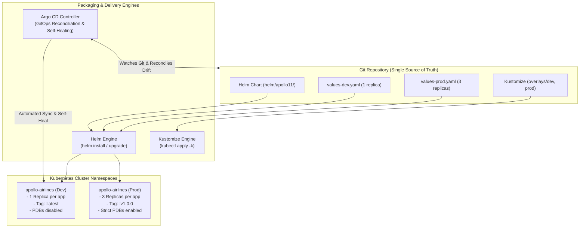

# Stage 5: Payload Integration — Helm, Kustomize & GitOps

In Stages 1–4, we authored dozens of individual Kubernetes YAML files. But in real-world engineering, maintaining raw manifests becomes unmanageable:
- How do you deploy the exact same application to `dev` (1 replica, minimal memory), `staging` (2 replicas), and `production` (3 replicas, strict PDBs, production images) without copy-pasting hundreds of lines of YAML?
- How do you version releases and execute instant rollbacks if a deployment fails?
- How do you guarantee that cluster state matches what is committed to Git?

In **Stage 5 (Payload Integration)**, we solve this by packaging Apollo Airlines into a **production-ready Helm chart**, contrasting it with **Kustomize overlays**, automating image delivery with **GitHub Actions CI**, and reconciling state with **Argo CD GitOps**.



---

## 🎯 Learning Goals

By the end of this stage, you will be able to:
1. Understand the architecture of a **Helm chart** (`Chart.yaml`, `values.yaml`, `templates/`, `_helpers.tpl`).
2. Read and write Go template expressions, conditionals, and indentation helpers (`nindent`).
3. Manage multi-environment configurations using **values files** (`values-dev.yaml` vs `values-prod.yaml`).
4. Contrast Helm's templating model with **Kustomize's overlay and patching model**.
5. Inspect Helm release history and perform automated rollbacks.
6. Understand GitOps principles and observe **Argo CD drift detection and self-healing**.

---

## 📦 Helm: The Package Manager for Kubernetes

**Helm** treats a collection of related Kubernetes resources as a single versioned unit called a **Chart**.

### Chart Anatomy

*Source: `stages/stage5/helm/apollo11/`*

```text
helm/apollo11/
├── Chart.yaml              # Package metadata (name, version 1.0.0, description)
├── values.yaml             # Default configuration values
├── values-dev.yaml         # Dev overrides (1 replica, :latest tag, no PDBs)
├── values-staging.yaml     # Staging overrides (2 replicas, :latest tag)
├── values-prod.yaml        # Prod overrides (3 replicas, :v1.0.0 tag, full PDBs)
├── bundles/                # Static dependencies (Envoy Gateway, MetalLB)
└── templates/              # Go-templated Kubernetes manifests
    ├── _helpers.tpl        # Reusable template functions (labels, names)
    ├── config/             # ConfigMap, Secret, ServiceAccounts
    ├── infra/              # PostgreSQL & Redis StatefulSets + Headless SVCs
    ├── apps/               # Application Deployments & Services
    ├── ui/                 # Frontend Deployment & Service
    ├── gateway/            # Gateway, HTTPRoutes, ReferenceGrant
    └── pdb/                # PodDisruptionBudgets
```

### Go Template Mechanics & `nindent`

In Helm, YAML files inside `templates/` are Go-template programs evaluated against values.

Let's examine how the `booking` Deployment is templated:

*Source: `stages/stage5/helm/apollo11/templates/apps/booking.yaml`*

```yaml
{{- $name := "booking" -}}
{{- $appCfg := index .Values.apps $name -}}
{{- $tier := index .Values.tiers $appCfg.tier -}}
apiVersion: apps/v1
kind: Deployment
metadata:
  name: {{ $name }}
  namespace: {{ .Values.namespaces.apps }}
  labels:
    {{- include "apollo11.labels" . | nindent 4 }}
    app: {{ $name }}
spec:
  replicas: {{ $appCfg.replicas }}
  selector:
    matchLabels:
      app: {{ $name }}
  template:
    metadata:
      labels:
        {{- include "apollo11.podLabels" (dict "root" . "name" $name) | nindent 8 }}
    spec:
      serviceAccountName: {{ $name }}
      containers:
        - name: {{ $name }}
          image: "{{ .Values.image.repository }}/{{ $name }}:{{ .Values.image.tag }}"
          imagePullPolicy: {{ .Values.image.pullPolicy }}
          resources:
            requests:
              cpu: {{ $tier.cpu }}
              memory: {{ $tier.memory }}
            limits:
              cpu: {{ $tier.cpu }}
              memory: {{ $tier.memory }}
```

### Critical Syntax Rules:

1. **`{{-` and `-}}` (Whitespace Trimming)**:
   The hyphen strips leading or trailing whitespace. In YAML, unintended extra spaces or newlines can corrupt the indentation structure.
2. **`nindent 4` / `nindent 8`**:
   `nindent N` inserts a newline followed by $N$ spaces before every line of rendered text.
   Notice: `metadata.labels` needs 4 spaces of indentation, while `spec.template.metadata.labels` needs 8 spaces! Using `nindent` ensures helper outputs align perfectly with the surrounding YAML hierarchy.
3. **Environment Values Hierarchy**:
   When you run `helm install -f values.yaml -f values-prod.yaml`, Helm merges values from left to right. Keys defined in `values-prod.yaml` override identical keys in `values.yaml`.

| Configuration | `values-dev.yaml` | `values-prod.yaml` |
|---|---|---|
| Replicas per app | `1` | `3` |
| Image tag | `latest` | `v1.0.0` (immutable) |
| PodDisruptionBudgets | `enabled: false` | `enabled: true` |
| Resource Tier | `low` / `default` | `flagship` / `default` |

---

## 🔧 Kustomize: Template-Free Declarative Overlays

While Helm uses string templating, **Kustomize** uses pure declarative composition. It starts with a base of raw Kubernetes YAML and applies structured patches.

*Source: `stages/stage5/overlays/dev/kustomization.yaml`*

```yaml
apiVersion: kustomize.config.k8s.io/v1beta1
kind: Kustomization

resources:
  - ../base

labels:
  - includeSelectors: false
    pairs:
      environment: dev

replicas:
  - name: identity
    count: 1
  - name: flight
    count: 1
  - name: booking
    count: 1
  - name: search
    count: 1
  - name: notification
    count: 1
  - name: frontend
    count: 1

images:
  - name: apollo11/booking
    newTag: latest
```

### When to use Helm vs. Kustomize?
- **Use Helm** when creating reusable, distributable packages for other teams, or when complex logic (conditionals, dynamic loops) is needed.
- **Use Kustomize** when managing environment variations within a single Git repository without wanting template syntax errors, or when tweaking third-party vendor manifests.

---

## 🐙 GitOps with Argo CD

**GitOps** is an operational framework where **Git is the single source of truth** for your cluster's desired state.

Instead of human engineers running `helm install` or `kubectl apply` from their laptops, an in-cluster controller (**Argo CD**) continuously synchronizes the live cluster with Git:

```
┌────────────────────────────────────────────────────────┐
│ ARGO CD RECONCILIATION LOOP                            │
│                                                        │
│  1. READ Git Commit (helm/apollo11 + values-prod.yaml) │
│  2. READ Live Cluster State (via kube-apiserver)       │
│  3. COMPARE Desired vs Observed State                  │
│     ├── If identical  ──► Status: Synced & Healthy     │
│     └── If different  ──► Status: OutOfSync            │
│                            │                           │
│     ┌──────────────────────┘                           │
│     ▼                                                  │
│  4. SELF-HEAL / PRUNE                                  │
│     Overwrites rogue manual kubectl changes and        │
│     deletes orphaned cluster resources!                │
└────────────────────────────────────────────────────────┘
```

In `stages/stage5/argocd/`, Apollo11 defines an Argo CD `Application` that monitors the Git repository. If an engineer manually deletes a Deployment via `kubectl delete deployment booking`, Argo CD detects the drift within seconds and **automatically recreates it**!

---

## 🧪 Hands-On Guided Exercises

### Exercise 1: Local Template Rendering with Helm

- **Objective**: Inspect the rendered Kubernetes YAML generated by Helm without applying it to the cluster.
- **Starting Point**: Terminal in the Apollo11 repository.
- **Instructions**:

```bash
cd Apollo11

# 1. Lint the chart to catch syntax or schema errors
helm lint stages/stage5/helm/apollo11

# 2. Render the dev environment manifests to stdout
helm template apollo11 stages/stage5/helm/apollo11 \
  -f stages/stage5/helm/apollo11/values-dev.yaml > /tmp/rendered-dev.yaml

# 3. Check rendered replicas for booking
grep -A 10 "name: booking" /tmp/rendered-dev.yaml | grep "replicas:"
# Output: replicas: 1

# 4. Render the prod environment manifests
helm template apollo11 stages/stage5/helm/apollo11 \
  -f stages/stage5/helm/apollo11/values-prod.yaml > /tmp/rendered-prod.yaml

# Check rendered replicas for prod
grep -A 10 "name: booking" /tmp/rendered-prod.yaml | grep "replicas:"
# Output: replicas: 3
```

- **What Concept This Reinforces**:
  `helm template` is client-side rendering. It lets you inspect every generated line of YAML before it ever touches the API server.

---

### Exercise 2: Deploying Apollo Airlines with Helm

- **Objective**: Install Apollo Airlines as a Helm release and inspect its revision history.
- **Starting Point**: Running `kind-apollo11` cluster.
- **Instructions**:

```bash
# 1. Run the verified Stage 5 apply script in Helm mode
bash stages/stage5/scripts/apply.sh --mode helm --env dev

# 2. Inspect Helm release list
helm list -A

# 3. Check release revision history
helm history apollo11 -n apollo-airlines-apps
```

- **Expected Result**:
  `helm list` shows `apollo11` with `STATUS: deployed` at revision `1`.
  All 10 workloads, 2 namespaces, Gateway, and MetalLB resources are active!

---

### Exercise 3: Upgrades and Automated Rollbacks

- **Objective**: Upgrade the Helm release, trigger a simulated failure, and execute an instant rollback.
- **Starting Point**: Healthy Helm release from Exercise 2.
- **Instructions**:

```bash
# 1. Upgrade the release to scale booking to 4 replicas
helm upgrade apollo11 stages/stage5/helm/apollo11 \
  -f stages/stage5/helm/apollo11/values-dev.yaml \
  --set apps.booking.replicas=4 \
  -n apollo-airlines-apps

# Verify booking now has 4 pods:
kubectl get deployment booking -n apollo-airlines-apps

# 2. Inspect history (now revision 2!)
helm history apollo11 -n apollo-airlines-apps

# 3. Roll back to revision 1
helm rollback apollo11 1 -n apollo-airlines-apps

# 4. Confirm booking scaled back down to 1 replica
kubectl get deployment booking -n apollo-airlines-apps
```

- **Expected Result**:
  `helm rollback` instantly restores revision 1 without modifying any unrelated services!

---

### Exercise 4: Kustomize Inspection

- **Objective**: Render and inspect Kustomize overlays.
- **Starting Point**: Stage 5 directory.
- **Instructions**:

```bash
# Render dev overlay using kubectl's built-in kustomize engine
kubectl kustomize stages/stage5/overlays/dev > /tmp/kustomize-dev.yaml

# Verify image tags and replicas
grep -B 2 -A 5 "image: apollo11/booking:latest" /tmp/kustomize-dev.yaml
```

Notice that Kustomize injected `labels: environment: dev` into all resources without needing a single Go template curly brace!

---

## 🏁 What You Learned

- How Helm packages multi-service architectures into reusable, parameterizable charts.
- How Go templating, conditionals, and `nindent` generate valid Kubernetes YAML.
- How multi-environment values files (`dev`, `staging`, `prod`) eliminate code duplication.
- How Kustomize provides a template-free patching alternative to Helm.
- How Helm tracks release revisions and enables atomic one-command rollbacks.
- How GitOps and Argo CD ensure that cluster state continuously reconciles with Git.

---

## ✈️ Before Continuing: Checkpoint

Before moving to Stage 6, test your understanding:
1. Why is `nindent 8` used instead of `indent 8` when embedding labels into a Pod template?
2. If you pass two values files (`-f values.yaml -f values-prod.yaml`), which one wins if a key is defined in both?
3. How does `helm rollback` know what configuration existed in an earlier revision?
4. What happens when an engineer manually deletes a Pod in an Argo CD-managed cluster with self-healing enabled?

Now that Apollo Airlines is packaged and deployable across any environment, let's turn on full observability: metrics, distributed tracing, and centralized logging!

👉 **Continue to [Stage 6: Mission Operations (Observability & Tracing)](./stage-6)**
