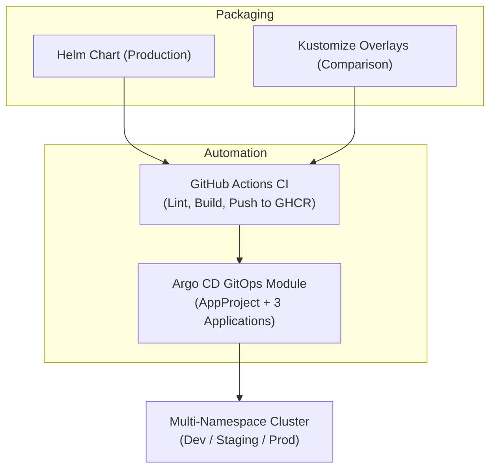

# Stage 5: Payload Integration — Packaging & Delivery

**Goal:** Make Apollo Airlines **deployable, versioned, and CI/CD-driven**. 

The Stage 4 workloads (6 Deployments, 4 StatefulSets, PDBs, Guaranteed QoS, and 13 ServiceAccounts) are packaged into a production-grade **Helm chart** with **Kustomize overlays** for environment variation, a **GitHub Actions matrix CI workflow** that builds and publishes images to GHCR, and an **Argo CD GitOps delivery module**.

| | |
|---|---|
| **New Concepts** | Helm 3 chart structure, Go templating, values files, Kustomize base + overlays, GitHub Actions CI matrix, GHCR image registry, GitOps delivery with Argo CD |
| **Workloads Changed** | None at the workload level — Stage 5 is a packaging and delivery layer. All 10 workloads are identical to Stage 4. |
| **Workloads Unchanged** | Probes, Guaranteed QoS, graceful SIGTERM drains, PDBs, 13 ServiceAccounts, 4 StatefulSets, seed Jobs |
| **Verification Target** | **153 Helm checks / 142 Kustomize checks / 74 Argo CD checks** |

---

## 1. What Changed from Stage 4

Stage 5 introduces four major packaging and deployment capabilities:



1. **Production Helm Chart (`stages/stage5/helm/apollo11/`):** A single, unified chart provisioning configuration, infrastructure, workloads, PDBs, Envoy Gateway, MetalLB, and seed Jobs with environment-specific values files.
2. **Kustomize Overlays (`stages/stage5/overlays/`):** A template-free YAML patching alternative using a complete 61-resource committed base (`generated.yaml`) and `dev`, `staging`, and `prod` overlays.
3. **GitHub Actions CI (`.github/workflows/main.yml`):** A 3-job workflow that lints Helm/Kustomize manifests, executes a parallel matrix build of all 6 container images, and publishes versioned, immutable images to GitHub Container Registry (GHCR).
4. **Argo CD GitOps Module (`stages/stage5/argocd/`):** Vendored Argo CD v3.5.1 installation featuring an `AppProject` tenant boundary and three Applications (`dev`, `staging`, `prod`) demonstrating automated synchronization, drift detection, and self-healing.

---

## 2. Environment Comparison Matrix

| Parameter | Dev | Staging | Prod |
|---|---|---|---|
| **Deployment Path** | Kustomize overlay or Helm (`values-dev.yaml`) | Kustomize overlay or Helm (`values-staging.yaml`) | Helm chart (`values-prod.yaml`) or Kustomize |
| **Replicas Per App** | 1 | 2 | 3 |
| **Image Tag** | `:latest` | `:latest` | `:v1.0.0` (pinned immutable tag) |
| **Image Registry** | Local kind load / GHCR | Local kind load / GHCR | `ghcr.io/darshan-raul/apollo11` |
| **PodDisruptionBudgets** | Disabled (`pdb.enabled: false`) | Disabled (`pdb.enabled: false`) | Enabled (`minAvailable: 2`) |
| **Access Stack** | Envoy Gateway + MetalLB | Envoy Gateway + MetalLB | Envoy Gateway + MetalLB |
| **StatefulSets** | 4 (1 replica each) | 4 (1 replica each) | 4 (1 replica each) |
| **Cost Profile** | Lowest (dev iteration) | Medium (integration testing) | Highest (HA production) |

---

## 3. Hands-On Lab: Deploying Stage 5

Run all commands from the `stages/stage5` directory.

### Option A: Helm Deployment (The Canonical Path)

```bash
cd stages/stage5

# 1. Install with Dev values (1 replica, :latest tag, no PDBs)
bash scripts/apply.sh --env dev

# 2. Or install Staging values (2 replicas, :latest tag)
bash scripts/apply.sh --env staging

# 3. Or install Production values (3 replicas, :v1.0.0, full PDBs)
bash scripts/apply.sh --env prod

# 4. Override image tag dynamically
bash scripts/apply.sh --env prod --tag v1.2.3

# 5. Skip docker build (reuse existing kind images)
bash scripts/apply.sh --skip-build
```

### Option B: Kustomize Deployment (Comparison Lab)

```bash
cd stages/stage5

# Deploy Dev overlay
bash scripts/apply.sh --mode kustomize --env dev

# Deploy Staging overlay
bash scripts/apply.sh --mode kustomize --env staging

# Deploy Prod overlay
bash scripts/apply.sh --mode kustomize --env prod
```

---

## 4. Automated Verification

The verification script automatically detects whether the active deployment is Helm or Kustomize:

```bash
# Auto-detect mode
bash scripts/verify.sh

# Explicit checks
bash scripts/verify.sh --mode helm
bash scripts/verify.sh --mode kustomize --env prod
```

**Verification Results:**
- **Helm/dev:** **153/153 checks pass**.
- **Kustomize/dev:** **142/142 checks pass**.
- **Argo CD:** **74/74 checks pass**.

---

## 5. Clean Up & Teardown

```bash
# Uninstall Helm release (preserves namespaces)
bash scripts/teardown.sh

# Full purge: deletes Helm release, namespaces, MetalLB, and Envoy Gateway
bash scripts/teardown.sh --purge

# Kustomize teardown
bash scripts/teardown.sh --mode kustomize --env dev
```

---

## Deep Dive Guides

- **[Helm — Chart Packaging](./stage-5/helm.md):** Detailed walkthrough of `Chart.yaml`, `values.yaml`, templates, and release lifecycle.
- **[Kustomize — Configuration Patching](./stage-5/kustomize.md):** Base manifests, strategic merge patches, and overlays.
- **[Argo CD — GitOps Deployment](./stage-5/argocd.md):** AppProjects, automated synchronization, drift detection, and self-healing.

---

## What's Next

In [Stage 6: Mission Operations](./stage-6.md), we add full **observability** — Prometheus scraping application `/metrics`, Grafana dashboards, Loki log aggregation via Alloy, and end-to-end distributed tracing with OpenTelemetry and Tempo.