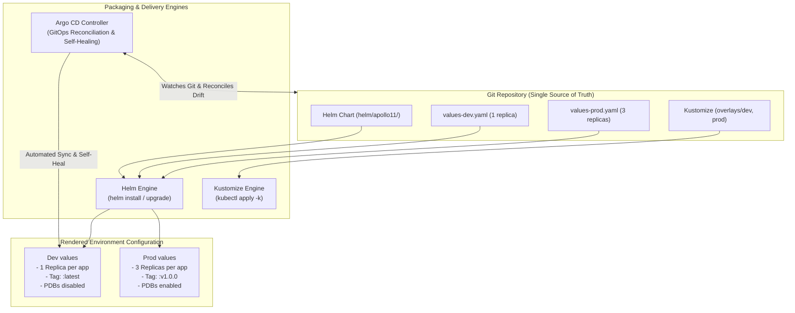

# Stage 5: Payload Integration — Helm, Kustomize & GitOps

:::info[Page type · optional lab]
This lab uses the pinned Apollo11 revision. Rendering, API acceptance, rollout
completion, GitOps sync, and passenger success are separate evidence points.
:::

:::note[Take the controls · Payload Integration lab]
Package and deliver a change to the airline, then inspect the result.
For the explanation before the experiment, start with the
[Payload Integration chapters](./learn/delivery/rendering-and-helm). You can return to this lab whenever you’re ready.

Already read them? [Jump to the investigations](#-investigations-inspect-the-generated-request-before-trusting-the-tool).
:::

In Stages 1–4 you saw how the pieces connect: Deployments use Pod templates,
Services use labels, and databases use claims. If you copy all of that YAML for
every environment, the copies slowly drift apart without anyone noticing. Stage 5
shows how to generate and track the same configuration for each environment while
still being able to see exactly what Kubernetes receives.

It answers three practical questions:
- How do you deploy the same application to `dev` (1 replica, minimal memory), `staging` (2 replicas), and `production` (3 replicas, strict PDBs, production images) without copying hundreds of lines of YAML?
- How do you version releases and go back to an earlier revision when an upgrade fails?
- How do you detect and correct differences between the cluster and Git?

In **Stage 5 (Payload Integration)** you will package Apollo Airlines as a Helm
chart, compare that with Kustomize overlays, look at the repository's GitHub
Actions CI, and use Argo CD to keep the cluster in line with Git. These are
building blocks for delivery. A chart alone does not make the platform
production-ready.

<details>
<summary><strong>Optional conceptual refresher</strong></summary>

The Payload Integration chapters are the primary explanation. Expand this
section when you want the older tool-by-tool account beside the lab.


```mermaid
flowchart TD
  subgraph SourceControl ["Git Repository (Single Source of Truth)"]
    HC["Helm Chart (helm/apollo11/)"]
    VDEV["values-dev.yaml (1 replica)"]
    VPROD["values-prod.yaml (3 replicas)"]
    KO["Kustomize (overlays/dev, prod)"]
  end

  subgraph DeliveryMechanisms ["Packaging & Delivery Engines"]
    HelmEng["Helm Engine\n(helm install / upgrade)"]
    KustEng["Kustomize Engine\n(kubectl apply -k)"]
    ArgoEng["Argo CD Controller\n(GitOps Reconciliation & Self-Healing)"]
  end

  subgraph Environments ["Rendered Environment Configuration"]
    DevNS["Dev values\n- 1 Replica per app\n- Tag: :latest\n- PDBs disabled"]
    ProdNS["Prod values\n- 3 Replicas per app\n- Tag: :v1.0.0\n- PDBs enabled"]
  end

  HC --> HelmEng
  VDEV --> HelmEng
  VPROD --> HelmEng
  KO --> KustEng

  HelmEng --> DevNS
  HelmEng --> ProdNS
  ArgoEng <-->|Watches Git & Reconciles Drift| SourceControl
  ArgoEng -->|Automated Sync & Self-Heal| DevNS
```

---

## 🎯 Learning Goals

By the end of this stage, you will be able to:
1. Describe how a **Helm chart** is organised (`Chart.yaml`, `values.yaml`, `templates/`, `_helpers.tpl`).
2. Read Go template expressions, conditionals, and the `nindent` indentation helper.
3. Manage several environments with **values files** (`values-dev.yaml` and `values-prod.yaml`).
4. Compare Helm's templating with **Kustomize's overlays and patches**.
5. Read a Helm release's history and roll back to an earlier revision.
6. Explain the principles of GitOps, and see **Argo CD detect drift and self-heal**.

---

## 📦 Helm has two outputs: YAML and a release record

A **chart** is the source: templates plus values. `helm template` turns it into
ordinary Kubernetes YAML without contacting the cluster. `helm install` and
`helm upgrade` do the same rendering, then also send the objects to the API
server and record a release revision. These are two different steps, not just
"Helm deploys YAML". Exercises 1 and 2 let you look at each one separately.

### Chart layout

*Source: `stages/stage5/helm/apollo11/`*

```text
helm/apollo11/
├── Chart.yaml              # Package metadata (name, version 1.0.0, description)
├── values.yaml             # Default configuration values
├── values-dev.yaml         # Dev overrides (1 replica, :latest tag, no PDBs)
├── values-staging.yaml     # Staging overrides (2 replicas, :latest tag)
├── values-prod.yaml        # Prod overrides (3 replicas, :v1.0.0 tag, full PDBs)
├── bundles/                # Static dependencies (Envoy Gateway, MetalLB)
└── templates/              # Go-templated Kubernetes manifests
    ├── _helpers.tpl        # Reusable template functions (labels, names)
    ├── config/             # ConfigMap, Secret, ServiceAccounts
    ├── infra/              # PostgreSQL & Redis StatefulSets + Headless SVCs
    ├── apps/               # Application Deployments & Services
    ├── ui/                 # Frontend Deployment & Service
    ├── gateway/            # Gateway, HTTPRoutes, ReferenceGrant
    └── pdb/                # PodDisruptionBudgets
```

### A template is a program that produces YAML

Each YAML file in `templates/` is a Go template. Helm runs it against the values
to produce the final YAML.

Here is how the `booking` Deployment is templated:

*Source: `stages/stage5/helm/apollo11/templates/apps/booking.yaml`. This is
abridged: the environment variables and probes are left out.*

```yaml
{{- $name := "booking" -}}
{{- $appCfg := index .Values.apps $name -}}
{{- $tier := index .Values.tiers $appCfg.tier -}}
apiVersion: apps/v1
kind: Deployment
metadata:
  name: {{ $name }}
  namespace: {{ .Values.namespaces.apps }}
  labels:
    {{- include "apollo11.labels" . | nindent 4 }}
    app: {{ $name }}
spec:
  replicas: {{ $appCfg.replicas }}
  selector:
    matchLabels:
      app: {{ $name }}
  template:
    metadata:
      labels:
        {{- include "apollo11.podLabels" (dict "root" . "name" $name) | nindent 8 }}
    spec:
      serviceAccountName: {{ $name }}
      containers:
        - name: {{ $name }}
          image: "{{ .Values.image.repository }}/{{ $name }}:{{ .Values.image.tag }}"
          imagePullPolicy: {{ .Values.image.pullPolicy }}
          # ...ports, environment variables, and probes omitted...
          resources:
            requests:
              cpu: {{ $tier.cpu }}
              memory: {{ $tier.memory }}
            limits:
              cpu: {{ $tier.cpu }}
              memory: {{ $tier.memory }}
```

### Trace one value to a rendered field

Do it in three steps: find `apps.booking.replicas` in the dev values file, find
`$appCfg.replicas` in the template, then read `spec.replicas` in the rendered
Deployment. Following one value like this is more reliable than trying to
evaluate a whole chart in your head.

These three template features appear in the example:

1. **`{{-` and `-}}` (whitespace trimming):**
   the hyphen removes the whitespace before or after the tag. In YAML, stray spaces or blank lines can break the indentation.
2. **`nindent 4` and `nindent 8`:**
   `nindent N` adds a newline and then indents every line of the output by N spaces.
   `metadata.labels` sits 4 spaces deep and `spec.template.metadata.labels` sits 8 spaces deep, so `nindent` makes each helper's output line up with the YAML around it.
3. **Order of values files:**
   with `helm install -f values.yaml -f values-prod.yaml`, Helm merges the files from left to right. A key in `values-prod.yaml` overrides the same key in `values.yaml`.

| Configuration | `values-dev.yaml` | `values-prod.yaml` |
|---|---|---|
| Replicas per app | `1` | `3` |
| Image tag | `latest` | `v1.0.0` (immutable) |
| PodDisruptionBudgets | `enabled: false` | `enabled: true` |
| Resource tier | `low` / `default` | `flagship` / `default` |

---

## 🔧 Kustomize modifies existing objects

Helm evaluates templates to create objects. **Kustomize** works the other way
round: it starts from existing YAML objects and applies changes to them. It also
produces ordinary Kubernetes YAML, but the differences between environments are
written as overlays instead of template expressions.

*Source: `stages/stage5/overlays/dev/kustomization.yaml`*

```yaml
apiVersion: kustomize.config.k8s.io/v1beta1
kind: Kustomization

resources:
  - ../base

labels:
  - includeSelectors: false
    pairs:
      environment: dev

replicas:
  - name: identity
    count: 1
  - name: flight
    count: 1
  - name: booking
    count: 1
  - name: search
    count: 1
  - name: notification
    count: 1
  - name: frontend
    count: 1

images:
  - name: apollo11/booking
    newTag: latest
```

### When to use Helm and when to use Kustomize
- **Helm** suits reusable packages that other teams install, and configuration that needs logic such as conditionals and loops.
- **Kustomize** suits environment differences inside a single Git repository when you want to avoid template syntax, and tweaking manifests that someone else wrote.

---

## 🐙 GitOps moves reconciliation from your terminal into the cluster

In the earlier stages you ran `kubectl` or Helm yourself and then checked the
result. With GitOps, the desired configuration lives in Git, and a controller
continuously compares it with what is running in the cluster. This is the same
reconciliation idea as a ReplicaSet, applied to the whole application: compare,
report any drift, and, if configured to, correct it.

Instead of engineers running `helm install` or `kubectl apply` from their laptops, a controller inside the cluster (**Argo CD**) keeps the live cluster in sync with Git:

```
┌────────────────────────────────────────────────────────┐
│ ARGO CD RECONCILIATION LOOP                            │
│                                                        │
│  1. READ Git Commit (helm/apollo11 + values-prod.yaml) │
│  2. READ Live Cluster State (via kube-apiserver)       │
│  3. COMPARE Desired vs Observed State                  │
│     ├── If identical  ──► Status: Synced & Healthy     │
│     └── If different  ──► Status: OutOfSync            │
│                            │                           │
│     ┌──────────────────────┘                           │
│     ▼                                                  │
│  4. SELF-HEAL / PRUNE                                  │
│     Overwrites manual kubectl changes and              │
│     deletes cluster resources that are not in Git      │
└────────────────────────────────────────────────────────┘
```

`stages/stage5/argocd/` defines a separate Argo CD Application for each
environment. Dev and staging use automated sync with self-heal, and drift is
corrected within about three minutes. Prod deliberately requires a manual sync.
So a deleted resource is restored automatically in dev and staging, but not in
prod.

---

</details>

## 🧪 Investigations: inspect the generated request before trusting the tool

Packaging tools can make a large application feel like a single command. Keep
asking what that command generated, which revision it recorded, and whether a
controller is allowed to change the live state later.

### Exercise 1: Render templates locally with Helm

**Prediction:** rendering writes files to `/tmp` and does not touch the cluster.
The booking Deployment in each rendered file shows exactly how a values file
changes the replica count.

- **Objective**: Read the Kubernetes YAML that Helm generates, without applying it to the cluster.
- **Starting Point**: A terminal in the Apollo11 repository.
- **Instructions**:

```bash
cd Apollo11

# 1. Lint the chart to catch syntax or schema errors
helm lint stages/stage5/helm/apollo11

# 2. Render the dev manifests into a file
helm template apollo11 stages/stage5/helm/apollo11 \
  -f stages/stage5/helm/apollo11/values-dev.yaml > /tmp/rendered-dev.yaml

# 3. Check rendered replicas for booking
grep -A 10 "name: booking" /tmp/rendered-dev.yaml | grep "replicas:"
# Output: replicas: 1

# 4. Render the prod manifests
helm template apollo11 stages/stage5/helm/apollo11 \
  -f stages/stage5/helm/apollo11/values-prod.yaml > /tmp/rendered-prod.yaml

# Check the rendered replicas for prod
grep -A 10 "name: booking" /tmp/rendered-prod.yaml | grep "replicas:"
# Output: replicas: 3
```

- **Concept reinforced**:
  `helm template` renders on your machine. You can read every line of generated YAML before anything reaches the API server.
- **Expected result**: Both renders succeed. Booking has 1 replica in dev and 3 in prod.
- **Verification command**: `helm lint` exits with status zero, and the two `grep` commands show the replica count for each environment.
- **Troubleshooting hints**: If `grep` matches more than one place, open the rendered Deployment by kind and name with a YAML-aware tool. Matching on nearby text is only a quick check for this lab.

---

### Exercise 2: Deploy Apollo Airlines with Helm

**Prediction:** the API server receives ordinary Kubernetes objects, and Helm adds
a release history that plain `kubectl apply` would not create. Look at both the
Deployment and `helm history` to see the difference.

- **Objective**: Install Apollo Airlines as a Helm release and read its revision history.
- **Starting Point**: A running `kind-apollo11` cluster.
- **Instructions**:

```bash
# 1. Run the Stage 5 apply script in Helm mode
bash stages/stage5/scripts/apply.sh --mode helm --env dev

# 2. List the Helm releases
helm list -A

# 3. Read the release's revision history
helm history apollo11 -n apollo-airlines-apps
```

- **Expected result**:
  `helm list` shows `apollo11` with `STATUS: deployed` at revision `1`.
  All 10 workloads, both namespaces, the Gateway, and the MetalLB resources are running.
- **Verification command**: `bash stages/stage5/scripts/verify.sh --mode helm`
  runs the checks for the Helm path.
- **Troubleshooting hints**: If the release is `failed` or `pending-*`, check
  `helm status`, the release history, the Pod events, and any hook Jobs before you retry.
- **Concept reinforced**: Helm records a release revision that groups many
  rendered resources into one unit that you can upgrade or roll back.

---

### Exercise 3: Upgrades and Rollbacks

**Prediction:** a rollback does not rewind the cluster or undo unrelated
objects. Helm takes the configuration stored with the chosen earlier revision and
applies it as a new revision. The Deployment controller then makes the replica
count match.

- **Objective**: Upgrade the Helm release, read its revision history, and roll back to an earlier revision.
- **Starting Point**: The healthy Helm release from Exercise 2.
- **Instructions**:

```bash
# 1. Upgrade the release to scale booking to 4 replicas
helm upgrade apollo11 stages/stage5/helm/apollo11 \
  -f stages/stage5/helm/apollo11/values-dev.yaml \
  --set apps.booking.replicas=4 \
  -n apollo-airlines-apps

# Check that booking now has 4 Pods:
kubectl get deployment booking -n apollo-airlines-apps

# 2. Read the history (this is now revision 2)
helm history apollo11 -n apollo-airlines-apps

# 3. Roll back to revision 1
helm rollback apollo11 1 -n apollo-airlines-apps

# 4. Check that booking is back to 1 replica
kubectl get deployment booking -n apollo-airlines-apps
```

- **Expected result**: Helm records an upgrade revision and then a rollback
  revision. The booking Deployment returns to the replica count stored with the
  earlier revision. Other releases are not affected.
- **Verification command**: Wait for the `deployment/booking` rollout to finish and
  confirm there is one Ready replica after the rollback.
- **Troubleshooting hints**: Revision numbers belong to one release. Read `helm
  history` and roll back to the revision that was actually good, rather than
  assuming it is `1` in a cluster you have used before.
- **Concept reinforced**: A rollback creates a new release revision from the
  stored earlier configuration. It does not rewind unrelated cluster state.

---

### Exercise 4: Inspect Kustomize output

**Prediction:** the overlay changes the rendered objects without creating a Helm
release. Compare the label and image in its output with the base. Kustomize is
not a second deployment controller.

- **Objective**: Render a Kustomize overlay and read its output.
- **Starting Point**: The Apollo11 repository root.
- **Instructions**:

```bash
# Render the dev overlay with kubectl's built-in Kustomize
kubectl kustomize stages/stage5/overlays/dev > /tmp/kustomize-dev.yaml

# Check the image tag
grep -B 2 -A 5 "image: apollo11/booking:latest" /tmp/kustomize-dev.yaml
```

Kustomize added the label `environment: dev` to every resource without any Go template syntax.

- **Expected result**: Rendering succeeds, the booking image uses `latest`, and the
  environment label appears in the output.
- **Verification command**: `kubectl kustomize stages/stage5/overlays/dev >/dev/null`
  exits with status zero and does not change the cluster.
- **Troubleshooting hints**: If a resource or patch cannot be found, check
  `overlays/dev/kustomization.yaml` and the base it refers to.
- **Concept reinforced**: Kustomize combines and patches Kubernetes objects. Helm
  evaluates templates and records releases.

---

### Exercise 5 (Optional): Argo CD GitOps & Drift Self-Healing

**Prediction:** Helm finishes when its command finishes, but Argo CD keeps running. If someone changes the live cluster by hand (for example, by scaling a Deployment with `kubectl`), Argo CD sees the difference (`OutOfSync`) and automatically restores what Git declares.

- **Objective**: Bootstrap Argo CD, deploy the `apollo11-dev` Application that tracks the Git repository, and watch it correct drift automatically.
- **Starting Point**: A healthy `kind-apollo11` cluster.
- **Note: you do not need to push to Git.** Argo CD runs inside the cluster and tracks the upstream repository (`https://github.com/darshan-raul/Apollo11.git`). To test it, you change the live cluster yourself and watch Argo CD undo the change.

- **Instructions**:

```bash
# 1. Bootstrap Argo CD and apply the dev application
bash stages/stage5/argocd/scripts/bootstrap.sh

# 2. Check the Application status
kubectl get application apollo11-dev -n argocd
# Expected: STATUS: Synced, HEALTH: Healthy

# 3. Change the live cluster by hand to create drift
kubectl scale deployment/booking -n apollo-airlines-dev-apps --replicas=5

# 4. Confirm the manual change took effect
kubectl get deployment booking -n apollo-airlines-dev-apps
# Output: 5 replicas

# 5. Wait for Argo CD's next reconciliation (or force a sync)
argocd app sync apollo11-dev --core 2>/dev/null || \
  kubectl get application apollo11-dev -n argocd -w

# 6. Check the Deployment again
kubectl get deployment booking -n apollo-airlines-dev-apps
# Output: 1 replica. Argo CD restored what Git declares.
```

- **Expected result**: Argo CD notices the manual change, marks the Application `OutOfSync`, and scales `booking` back to 1 replica, the value in Git.
- **Verification command**: `kubectl get application apollo11-dev -n argocd` reports `Synced` and `Healthy`.
- **Concept reinforced**: In GitOps, Git is the single source of truth. Drift in the cluster is corrected instead of accepted.

---

## 🏁 What You Learned

- How Helm packages multi-service architectures into reusable, parameterizable charts.
- How Go templating, conditionals, and `nindent` generate valid Kubernetes YAML.
- How multi-environment values files (`dev`, `staging`, `prod`) eliminate code duplication.
- How Kustomize provides a template-free patching alternative to Helm.
- How Helm tracks release revisions and enables atomic one-command rollbacks.
- How GitOps and Argo CD ensure that cluster state continuously reconciles with Git.

---

## ✈️ Before Continuing: Checkpoint

Before moving to Stage 6, test your understanding:
1. Why is `nindent 8` used instead of `indent 8` when embedding labels into a Pod template?
2. If you pass two values files (`-f values.yaml -f values-prod.yaml`), which one wins if a key is defined in both?
3. How does `helm rollback` know what configuration existed in an earlier revision?
4. What happens when an engineer manually deletes a Pod in an Argo CD-managed cluster with self-healing enabled?

Apollo Airlines is now packaged and can be deployed to each environment. Stage 6
adds observability: metrics, distributed tracing, and centralized logging.

👉 **Continue to [Stage 6: Mission Operations (Observability & Tracing)](./stage-6)**

## Current verification boundary

The check counts quoted in earlier stages are historical. The verified repository
revision is commit `69113dcc80f77e32301d8ee7b9e73a67c923de96`. It includes
context guards, external ownership of the TLS certificate, HTTPS API endpoints in
the frontend, and ServiceAccount token automount protection. To validate your own
environment, use the summary from the current verification script together with
what you observe yourself. A production docs build only checks that the pages
compile and the links work. It does not test the cluster.
