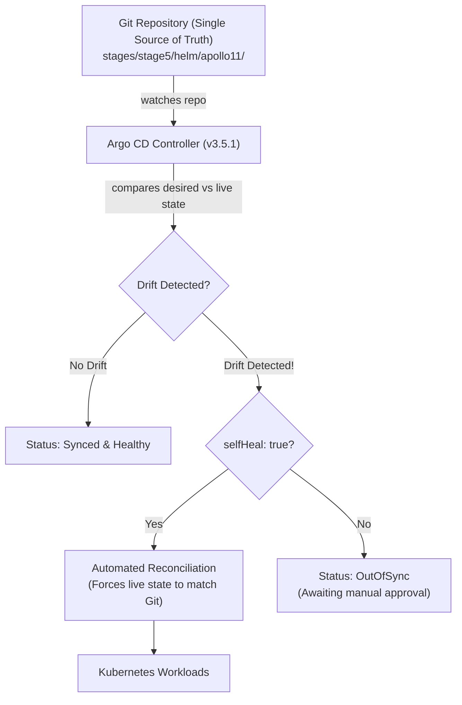

# Argo CD — Declarative GitOps Delivery

**GitOps** is an operational model where the desired state of your Kubernetes cluster is version-controlled in a Git repository. An in-cluster controller continuously compares the live cluster state with the declared state in Git and automatically resolves discrepancies.

In Stage 5, Apollo11 includes a complete, offline-capable **Argo CD GitOps module** located at `stages/stage5/argocd/`.

---

## The GitOps Control Loop



---

## Architectural Components

The Argo CD module is divided into three distinct layers:

```text
stages/stage5/argocd/
├── install.sh                  # Installs vendored Argo CD v3.5.1 offline
├── platform/                   # Shared Envoy Gateway & 6 environment namespaces
│   ├── namespaces.yaml         # apollo-dev-*, apollo-staging-*, apollo-prod-*
│   └── gateway.yaml            # Shared MetalLB + Envoy Gateway
├── projects/
│   └── project.yaml            # AppProject: apollo-airlines (security boundary)
├── applications/
│   ├── dev.yaml                # Dev App (auto-sync, values-dev.yaml)
│   ├── staging.yaml            # Staging App (auto-sync, values-staging.yaml)
│   └── prod.yaml               # Prod App (manual gate, values-prod.yaml)
└── scripts/
    ├── bootstrap.sh            # Idempotent bootstrap orchestrator
    ├── verify.sh               # 74 live GitOps verification checks
    └── teardown.sh             # Graceful teardown (--full, --purge)
```

### 1. The Platform Layer: 6 Isolated Namespaces
To simulate real-world environment promotion locally, the platform provisions three pairs of namespaces:
- `apollo-dev-apps` & `apollo-dev-ui`
- `apollo-staging-apps` & `apollo-staging-ui`
- `apollo-prod-apps` & `apollo-prod-ui`

### 2. The `AppProject` Security Boundary
In production, multi-tenant clusters must restrict where applications can deploy resources. The `apollo-airlines` AppProject enforces:
- **Allowed Destinations:** Only the 6 apollo namespaces listed above.
- **Cluster Resource Whitelist:** Blocks tenant applications from creating cluster-wide resources (such as `ClusterRole`, `StorageClass`, or CRDs).

### 3. Three Environment Applications

```yaml
# applications/dev.yaml (Automated Continuous Delivery)
apiVersion: argoproj.io/v1alpha1
kind: Application
metadata:
  name: apollo11-dev
  namespace: argocd
spec:
  project: apollo-airlines
  source:
    repoURL: https://github.com/darshan-raul/Apollo11.git
    targetRevision: main
    path: stages/stage5/helm/apollo11
    helm:
      valueFiles:
        - values-dev.yaml
  destination:
    server: https://kubernetes.default.svc
    namespace: apollo-dev-apps
  syncPolicy:
    automated:
      prune: true     # Deletes objects removed from Git
      selfHeal: true  # Reverts manual 'kubectl' drift automatically
```

```yaml
# applications/prod.yaml (Gated Production Delivery)
apiVersion: argoproj.io/v1alpha1
kind: Application
metadata:
  name: apollo11-prod
  namespace: argocd
spec:
  project: apollo-airlines
  source:
    repoURL: https://github.com/darshan-raul/Apollo11.git
    targetRevision: main
    path: stages/stage5/helm/apollo11
    helm:
      valueFiles:
        - values-prod.yaml
  destination:
    server: https://kubernetes.default.svc
    namespace: apollo-prod-apps
  # NOTICE: No automated sync block! Production requires manual approval.
```

---

## Hands-On Lab Walkthrough

### 1. Install Argo CD
Install the vendored Argo CD v3.5.1 bundle without external internet dependencies:

```bash
cd stages/stage5/argocd
bash install.sh --offline

# Wait for all Argo CD system pods to be Ready
kubectl wait --for=condition=Ready pods --all -n argocd --timeout=120s
```

### 2. Access the Argo CD Web UI

Forward the Argo CD server port to your local machine:

```bash
kubectl port-forward svc/argocd-server -n argocd 8080:443 &
```

Retrieve the initial auto-generated `admin` password:

```bash
kubectl -n argocd get secret argocd-initial-admin-secret \
  -o jsonpath="{.data.password}" | base64 -d && echo
```

Open [https://localhost:8080](https://localhost:8080) in your browser:
- **Username:** `admin`
- **Password:** *(the string decoded above)*

### 3. Bootstrap Projects and Applications

Execute the bootstrap script to create the 6 environment namespaces, apply the `apollo-airlines` AppProject, register the 3 Applications, and trigger the initial sync:

```bash
bash scripts/bootstrap.sh --sync
```

Check application synchronization status:

```bash
kubectl get applications -n argocd
# NAME               SYNC STATUS   HEALTH STATUS
# apollo11-dev       Synced        Healthy
# apollo11-staging   Synced        Healthy
# apollo11-prod      OutOfSync     Missing
```

Notice that `dev` and `staging` automatically synced to `Synced / Healthy`, while `prod` sits safely in `OutOfSync`, awaiting manual approval!

---

## Break & Recover: Drift Detection & Automated Self-Healing

What happens if an engineer bypasses Git and imperatively tampers with a running deployment?

### 1. Cause Manual Cluster Drift

Manually scale the `booking` deployment in the `dev` environment from 1 to 5 replicas using `kubectl`:

```bash
kubectl scale deployment booking -n apollo-dev-apps --replicas=5
```

Immediately watch the deployment replicas:

```bash
kubectl get deployment booking -n apollo-dev-apps -w
```

### 2. Observe Argo CD Self-Healing in Real Time

```text
NAME      READY   UP-TO-DATE   AVAILABLE   AGE
booking   1/5     5            1           2m
booking   1/1     1            1           2m   <-- SELF-HEALED!
```

**Observation:**
1. The Argo CD controller detected that live state (`replicas: 5`) diverged from the declared Git state (`replicas: 1`).
2. The Application status briefly switched to `OutOfSync`.
3. Because `selfHeal: true` is configured, Argo CD immediately forced the live Kubernetes object back to `1` replica, canceling the unauthorized manual mutation!

---

## Maintainer Verification

Run the automated GitOps verification script:

```bash
bash scripts/verify.sh
```

**Result: 74/74 checks pass**, verifying:
- Argo CD CRDs, API server, controller, and repository server health.
- Platform namespaces and shared Envoy Gateway configuration.
- AppProject permissions and cluster-resource denial policies.
- Automated sync on `dev` and `staging`.
- Manual approval gating on `prod`.
- Live imperative mutation detection and automated self-healing.

---

## Clean Up

```bash
# Delete the 3 tenant applications
bash scripts/teardown.sh

# Remove the entire Argo CD system and 6 environment namespaces
bash scripts/teardown.sh --full

# Complete purge including cluster-scoped CRDs
bash scripts/teardown.sh --purge
```

---

## What's Next

Now that packaging, CI, and GitOps delivery are in place, [Stage 6: Mission Operations](../stage-6.md) shifts focus to **comprehensive observability**: collecting Prometheus metrics, visualizing Grafana dashboards, shipping logs with Loki and Alloy, and tracing distributed requests with OpenTelemetry and Tempo.