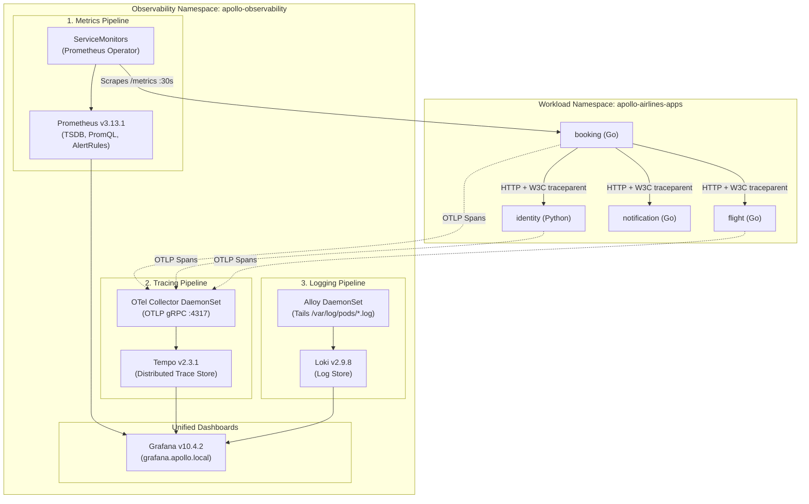

# Stage 6: Mission Operations — Observability & Tracing

Running applications in production without observability is like flying an airplane in a storm with no instruments.

In **Stage 6 (Mission Operations)**, we instrument the entire Apollo Airlines platform across all three pillars of cloud-native observability:
1. **Metrics**: Real Prometheus time-series counters and histograms, automated scraping with `ServiceMonitor` CRDs, PromQL SLO queries, and alerting rules.
2. **Distributed Traces**: W3C `traceparent` context propagation across microservices, OpenTelemetry Collector pipelines, and Tempo trace visualization for the flagship booking workflow.
3. **Centralized Logs**: Structured JSON logs collected by Grafana Alloy DaemonSets and indexed by Loki.
4. **Unified Visualizations**: Pre-provisioned Grafana dashboards linking metrics directly to traces and logs.



---

## 🎯 Learning Goals

By the end of this stage, you will be able to:
1. Understand the distinct roles of **Metrics** (how much/often), **Logs** (what happened), and **Traces** (where time was spent).
2. Use the **Prometheus Operator** pattern and configure `ServiceMonitor` custom resources.
3. Write production **PromQL queries** for request rates, error budgets, and 95th-percentile latencies.
4. Explain distributed context propagation using the **W3C `traceparent`** standard.
5. Deploy **DaemonSets** for per-node telemetry collectors (OpenTelemetry Collector, Grafana Alloy).
6. Trace a live distributed flight reservation from frontend to database in Grafana Tempo.

---

## 📊 Pillar 1: Metrics with Prometheus & Prometheus Operator

### 1. The Prometheus Metric Types
All Apollo backend services expose metrics at `/metrics` in the official Prometheus exposition format:

- **Counters** (`http_requests_total`):
  Values that only increase (until a process restart). You calculate rates over time windows using `rate()`.
  ```text
  http_requests_total{service="booking",method="POST",route="/api/bookings",status="200"} 412
  ```
- **Histograms** (`http_request_duration_ms_bucket`):
  Samples observations (like response latency) into statistical buckets labeled `le` (less-than-or-equal). Used to calculate percentiles (p50, p95, p99).
  ```text
  http_request_duration_ms_bucket{service="booking",le="100"} 380
  http_request_duration_ms_bucket{service="booking",le="500"} 410
  http_request_duration_ms_bucket{service="booking",le="+Inf"} 412
  ```

:::warning Cardinality Explosion
Metrics labels must be strictly bounded! Never put user IDs, booking UUIDs, timestamps, or raw query parameters into metric labels. A million unique booking IDs in a label will generate a million separate time series, exhausting Prometheus memory!
:::

### 2. The Prometheus Operator & `ServiceMonitor`

Instead of manually editing a monolithic `prometheus.yaml` configuration file every time a developer adds a microservice, Kubernetes uses the **Prometheus Operator pattern**.

The operator introduces the **`ServiceMonitor`** Custom Resource Definition (CRD):

*Source: `stages/stage6/helm/apollo11/templates/observability/servicemonitors/booking-sm.yaml`*

```yaml
apiVersion: monitoring.coreos.com/v1
kind: ServiceMonitor
metadata:
  name: booking
  namespace: apollo-observability
  labels:
    app.kubernetes.io/name: booking
    release: apollo11
spec:
  selector:
    matchLabels:
      app: booking
  namespaceSelector:
    any: true
  endpoints:
    - port: http
      path: /metrics
      interval: 30s
      scrapeTimeout: 10s
```

The Prometheus Operator watches for `ServiceMonitor` objects and automatically reconfigures Prometheus's scrape targets dynamically.

### 3. Essential PromQL Formulas

*Source: `stages/stage6/helm/apollo11/templates/observability/prometheus/rules.yaml`*

#### 1. Per-Second Request Rate
```promql
sum(rate(http_requests_total[5m])) by (service)
```
`rate([5m])` calculates the per-second rate of change over a 5-minute sliding window, gracefully handling counter resets when pods restart.

#### 2. Service Error Ratio (SLO Burn)
```promql
sum by (service) (rate(http_requests_total{status=~"5.."}[5m]))
/
clamp_min(sum by (service) (rate(http_requests_total[5m])), 0.001)
```
Divides 5xx server errors by total requests. If the ratio exceeds `0.05` (5%), the alert rule `ApolloErrorRateHigh` fires!

#### 3. 95th-Percentile Latency (p95)
```promql
histogram_quantile(0.95, sum by (le) (rate(http_request_duration_ms_bucket{service="booking"}[5m])))
```
Calculates the latency threshold under which 95% of user requests are served. If this exceeds 500 ms, `ApolloBookingLatencyP95High` triggers a warning.

---

## 🔍 Pillar 2: Distributed Tracing with OpenTelemetry & Tempo

When a user reports that booking a flight took 4 seconds, metrics only tell you that the p95 latency spiked. Metrics cannot tell you **which service** caused the delay.

**Distributed Tracing** tracks the path of a single request across multiple network boundaries:

```
[Browser Client]
  │ (Trace ID: 4bf92f3577b34da6a3ce929d0e0e4736)
  ▼
[Booking Service] ────────────────────────────────────────── Total: 185ms
  ├── Span 1: GET /healthz/ready (Identity) ────── 12ms
  ├── Span 2: GET /api/flights/1 (Flight) ──────── 24ms
  ├── Span 3: POST /api/flights/1/reserve (Flight) 88ms  ◄── BOTTLENECK DETECTED!
  ├── Span 4: INSERT INTO bookings (PostgreSQL) ── 15ms
  └── Span 5: POST /api/notifications (Async) ──── 8ms
```

### Context Propagation: The W3C `traceparent` Header
How does the `flight` service know it is part of the trace initiated by `booking`?
When `booking` sends an outbound HTTP request to `flight`, its OpenTelemetry middleware injects a standardized HTTP header:

```http
traceparent: 00-4bf92f3577b34da6a3ce929d0e0e4736-00f067aa0ba902b7-01
              │  └─────────────┬────────────────┘ └───────┬──────┘ └─ Flags
              │                │                          │
           Version         Trace ID                    Span ID
```

When `flight` receives this header, it creates child spans under the existing `Trace ID` rather than creating a disconnected new trace.

### The OpenTelemetry Collector DaemonSet
Rather than each microservice transmitting traces across the network to Tempo directly, Apollo11 deploys the OpenTelemetry Collector as a **`DaemonSet`**:
- A `DaemonSet` guarantees that **exactly one collector Pod runs on every single worker node**.
- Workload Pods send spans to `localhost` or their node-local collector over fast OTLP gRPC (`:4317`).
- The collector batches, compresses, and ships telemetry to **Grafana Tempo**.

---

## 🪵 Pillar 3: Centralized Logs with Alloy & Loki

Microservices write structured JSON logs directly to standard out (`stdout`).

### How Kubernetes Captures Logs
The container runtime (`containerd`) intercepts stdout/stderr from every container and writes them to host log files at:
`/var/log/pods/<namespace>_<pod-name>_<pod-uid>/<container-name>/*.log`

### Grafana Alloy (The Log Shipper)
Stage 6 runs **Grafana Alloy** as a `DaemonSet` on every node:
1. Alloy mounts `/var/log/pods` from the host.
2. It parses JSON log lines and extracts `trace_id`, `span_id`, and `service`.
3. It ships the parsed streams to **Loki**.
4. In Grafana, when viewing a trace in Tempo, you can click a button to **instantly view the exact log lines** emitted during that specific trace!

---

## 🧪 Hands-On Guided Exercises

### Exercise 1: Deploying Stage 6 Observability

- **Objective**: Deploy Prometheus Operator, Tempo, Loki, Alloy, Grafana, and instrumented workloads.
- **Starting Point**: Running `kind-apollo11` cluster.
- **Instructions**:

```bash
cd Apollo11

# 1. Deploy Stage 6 in Helm dev mode
bash stages/stage6/scripts/apply.sh --mode helm --env dev

# 2. Inspect pods in apollo-observability
kubectl get pods -n apollo-observability

# 3. Verify DaemonSets are running on all worker nodes
kubectl get daemonsets -n apollo-observability
```

- **Expected Result**:
  - `prometheus-k8s`, `tempo`, `loki`, and `grafana` are running.
  - `otel-collector` and `alloy` DaemonSets show `DESIRED: 3, CURRENT: 3, READY: 3`.
- **Verification Script**:

```bash
bash stages/stage6/scripts/verify.sh --mode helm
```
All 190/190 checks must pass!

---

### Exercise 2: Generating Traces with the Trace Test Script

- **Objective**: Execute a synthetic end-to-end booking transaction and observe W3C trace propagation.
- **Starting Point**: Stage 6 running.
- **Instructions**:

```bash
# 1. Run the verified trace test generator
bash stages/stage6/scripts/trace-test.sh
```

- **Expected Result**:
  The script:
  1. Authenticates against `identity` and acquires a JWT token.
  2. Queries `flight` for available flights.
  3. Executes a booking creation request against `booking`.
  4. Prints the generated `TRACE_ID` (e.g. `4bf92f3577b34da6a3ce929d0e0e4736`).

---

### Exercise 3: Inspecting Traces & Logs in Grafana

- **Objective**: Open Grafana, search for the trace, and correlate spans with logs.
- **Starting Point**: Trace ID from Exercise 2.
- **Instructions**:

```bash
# 1. Port-forward Grafana to localhost (or use Envoy Gateway at grafana.apollo.local)
kubectl port-forward svc/grafana 3000:3000 -n apollo-observability &
PF_PID=$!
sleep 2

# Grafana default credentials: admin / admin
```

1. Open your browser to `http://localhost:3000`.
2. Navigate to **Explore** -> Select the **Tempo** datasource.
3. Paste the `TRACE_ID` from Exercise 2 into the search box and click **Query**.
4. Observe the complete waterfall timeline spanning `booking`, `identity`, `flight`, and `notification`!
5. Click on the `booking` span, and click **Logs for this span**. Notice how Loki filters logs to only lines containing this exact `trace_id`!

Stop port-forward when done:
```bash
kill $PF_PID
```

---

### Exercise 4: Querying Live Metrics via PromQL

- **Objective**: Query real Prometheus metrics from the CLI.
- **Starting Point**: Stage 6 running.
- **Instructions**:

```bash
# Query current request rate grouped by service
kubectl exec -n apollo-observability prometheus-apollo-services-0 -c prometheus -- \
  wget -qO- 'http://localhost:9090/api/v1/query?query=sum(rate(http_requests_total[5m]))by(service)' | jq .
```

- **Expected Result**:
  JSON output displaying active per-second request rates for all 5 backend microservices.

---

## 🏁 What You Learned

- The distinct roles and synergy of Metrics, Traces, and Logs.
- How the Prometheus Operator and `ServiceMonitor` CRDs automate target discovery.
- How to write PromQL queries for rates, error ratios, and histogram quantiles.
- How W3C `traceparent` headers maintain trace identity across microservices.
- Why DaemonSets are used to collect per-node telemetry (OpenTelemetry Collector and Alloy).
- How Grafana unifies metrics, Tempo traces, and Loki logs into a single glass pane.

---

## ✈️ Before Continuing: Checkpoint

Before moving to Stage 7, verify you can answer:
1. Why should you avoid putting dynamic booking IDs into Prometheus metric labels?
2. What HTTP header propagates distributed trace context across service boundaries?
3. What is the difference between a Deployment and a DaemonSet?
4. How does `histogram_quantile(0.95, ...)` calculate p95 latency?

Now that our system is fully observable, let's make it elastic! In Stage 7, we introduce Horizontal and Vertical Pod Autoscaling, Redis caching, and advanced scheduling!

👉 **Continue to [Stage 7: Orbital Maneuvering (Autoscaling & Scheduling)](./stage-7)**
