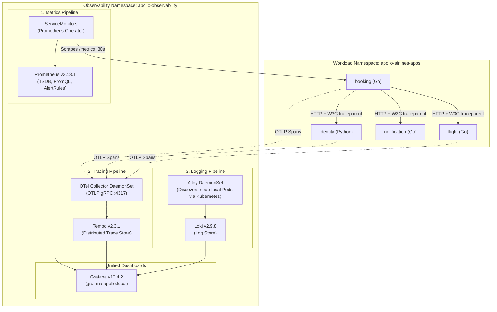

# Stage 6: Mission Operations — Observability & Tracing

Stage 5 made the resource graph reproducible across environments. Earlier
stages told us whether a Pod was ready and whether a rollout completed.
Those are useful cluster facts, but they do not answer a passenger's report that
“my booking was slow” or an operator's question about which dependency failed.
One request crosses several processes; one CPU graph cannot reconstruct that
path.

Stage 6 adds three complementary kinds of evidence to Apollo Airlines:
1. **Metrics**: Real Prometheus time-series counters and histograms, automated scraping with `ServiceMonitor` CRDs, PromQL SLO queries, and alerting rules.
2. **Distributed Traces**: W3C `traceparent` context propagation across microservices, OpenTelemetry Collector pipelines, and Tempo trace visualization for the flagship booking workflow.
3. **Centralized Logs**: Structured JSON logs collected by Grafana Alloy DaemonSets and indexed by Loki.
4. **Grafana views**: pre-provisioned ways to query the three stores without
   pretending that one signal answers every question.



---

## 🎯 Learning Goals

By the end of this stage, you will be able to:
1. Understand the distinct roles of **Metrics** (how much/often), **Logs** (what happened), and **Traces** (where time was spent).
2. Use the **Prometheus Operator** pattern and configure `ServiceMonitor` custom resources.
3. Write production **PromQL queries** for request rates, error budgets, and 95th-percentile latencies.
4. Explain distributed context propagation using the **W3C `traceparent`** standard.
5. Deploy **DaemonSets** for per-node telemetry collectors (OpenTelemetry Collector, Grafana Alloy).
6. Trace the checked-in synthetic booking workflow across its instrumented
   backend services in Grafana Tempo.

---

## 📊 Metrics answer “how much, how often, over what window?”

### 1. A metric is a measurement series, not a request diary
All Apollo backend services expose metrics at `/metrics` in the official Prometheus exposition format:

- **Counters** (`http_requests_total`):
  Values that only increase (until a process restart). You calculate rates over time windows using `rate()`.
  ```text
  http_requests_total{service="booking",method="POST",route="/api/bookings",status="200"} 412
  ```
- **Histograms** (`http_request_duration_ms_bucket`):
  Samples observations (like response latency) into statistical buckets labeled `le` (less-than-or-equal). Used to calculate percentiles (p50, p95, p99).
  ```text
  http_request_duration_ms_bucket{service="booking",le="100"} 380
  http_request_duration_ms_bucket{service="booking",le="500"} 410
  http_request_duration_ms_bucket{service="booking",le="+Inf"} 412
  ```

:::warning[Cardinality Explosion]
Metrics labels must be strictly bounded! Never put user IDs, booking UUIDs, timestamps, or raw query parameters into metric labels. A million unique booking IDs in a label will generate a million separate time series, exhausting Prometheus memory!
:::

### 2. A ServiceMonitor is a declaration that an operator turns into scraping

Stage 2 taught us that a Service selector names a changing group of Pods. The
Prometheus Operator uses the same Kubernetes idea for discovery: a
ServiceMonitor declares which Services expose a metrics port; the operator
watches the custom resource and reconciles Prometheus configuration. The
Prometheus Pod is not parsing this YAML by itself.

The operator introduces the **`ServiceMonitor`** Custom Resource Definition (CRD):

*Source: `stages/stage6/helm/apollo11/templates/observability/servicemonitors/booking-sm.yaml`*

```yaml
apiVersion: monitoring.coreos.com/v1
kind: ServiceMonitor
metadata:
  name: booking
  namespace: apollo-observability
  labels:
    app.kubernetes.io/name: booking
    app.kubernetes.io/part-of: apollo-airlines
    release: apollo11
spec:
  selector:
    matchLabels:
      app: booking
  namespaceSelector:
    any: true
  endpoints:
    - port: http
      path: /metrics
      scheme: http
      interval: 30s
      scrapeTimeout: 10s
      honorLabels: true
  jobLabel: app
```

Follow the relationships in this excerpt: the `selector` finds the `booking`
Service by label; `namespaceSelector` determines where that Service may live;
the endpoint `port` must match the Service port name; the operator then builds
scrape targets from the Service's ready endpoints. A ServiceMonitor existing is
therefore weaker evidence than a target reporting `up`.

### 3. Turn raw counters into questions

*Source: `stages/stage6/helm/apollo11/templates/observability/prometheus/rules.yaml`*

#### 1. Per-Second Request Rate
```promql
sum(rate(http_requests_total[5m])) by (service)
```
`rate([5m])` calculates the per-second rate of change over a 5-minute sliding window, gracefully handling counter resets when pods restart.

#### 2. Service Error Ratio (SLO Burn)
```promql
sum by (service) (rate(http_requests_total{status=~"5.."}[5m]))
/
clamp_min(sum by (service) (rate(http_requests_total[5m])), 0.001)
```
Divides 5xx server errors by total requests. If the ratio exceeds `0.05` (5%), the alert rule `ApolloErrorRateHigh` fires!

#### 3. 95th-Percentile Latency (p95)
```promql
histogram_quantile(0.95, sum by (le) (rate(http_request_duration_ms_bucket{service="booking"}[5m])))
```
Calculates the latency threshold under which 95% of user requests are served. If this exceeds 500 ms, `ApolloBookingLatencyP95High` triggers a warning.

---

## 🔍 A trace answers “what happened to this one request?”

When a user reports that booking a flight took four seconds, a p95 chart can
confirm that latency changed for many requests. It cannot identify the path of
this request. A trace keeps a shared trace ID while each service adds its own
span, making causal order and duration inspectable.

The span layout below is a conceptual reading aid, not a recorded Apollo11 trace
or a latency promise. Use the trace-test script later in this chapter to inspect
the services and durations your own run produced.

**Distributed Tracing** tracks the path of a single request across multiple network boundaries:

```
[Browser Client]
  │ (Trace ID: 4bf92f3577b34da6a3ce929d0e0e4736)
  ▼
[Booking Service] ────────────────────────────────────────── Total: 185ms
  ├── Span 1: GET /healthz/ready (Identity) ────── 12ms
  ├── Span 2: GET /api/flights/1 (Flight) ──────── 24ms
  ├── Span 3: POST /api/flights/1/reserve (Flight) 88ms  ◄── BOTTLENECK DETECTED!
  ├── Span 4: INSERT INTO bookings (PostgreSQL) ── 15ms
  └── Span 5: POST /api/notifications (Async) ──── 8ms
```

### Context propagation is an explicit hand-off
How does the `flight` service know it is part of the trace initiated by `booking`?
When `booking` sends an outbound HTTP request to `flight`, its OpenTelemetry middleware injects a standardized HTTP header:

```http
traceparent: 00-4bf92f3577b34da6a3ce929d0e0e4736-00f067aa0ba902b7-01
              │  └─────────────┬────────────────┘ └───────┬──────┘ └─ Flags
              │                │                          │
           Version         Trace ID                    Span ID
```

When `flight` receives this header, it creates child spans under the existing `Trace ID` rather than creating a disconnected new trace.

### The collector is another reconciled workload, not an invisible pipe
Rather than each microservice transmitting traces across the network to Tempo directly, Apollo11 deploys the OpenTelemetry Collector as a **`DaemonSet`**:

*Sources: `stages/stage6/helm/apollo11/templates/apps/booking.yaml`,
`stages/stage6/helm/apollo11/templates/observability/otel-collector/daemonset.yaml`,
and `stages/stage6/helm/apollo11/templates/observability/otel-collector/config.yaml`.*

- A `DaemonSet` requests one collector Pod on each eligible worker node; its
  status shows whether the desired Pods are actually scheduled and Ready.
- Workloads send OTLP gRPC to the `otel-collector` ClusterIP Service on port
  `4317`; Kubernetes may route a request to any Ready collector endpoint. The
  checked-in application environment does not target `localhost`.
- The collector applies memory limiting and batching, then forwards traces to
  **Grafana Tempo**.

---

## 🪵 Logs preserve the detail that metrics intentionally discard

Apollo services write structured JSON logs to standard output. A log can retain
an exact error message or trace ID, but it is not a bounded, aggregatable metric
label. Keeping that distinction prevents the common mistake of trying to put
booking IDs into Prometheus labels.

### How Kubernetes Captures Logs
The container runtime (`containerd`) intercepts stdout/stderr from every container and writes them to host log files at:
`/var/log/pods/<namespace>_<pod-name>_<pod-uid>/<container-name>/*.log`

### Grafana Alloy (The Log Shipper)
Stage 6 runs **Grafana Alloy** as a `DaemonSet`, requesting one Pod per eligible
node:

*Source: `stages/stage6/helm/apollo11/templates/observability/loki/alloy.yaml`.*

1. Each Alloy Pod discovers only Pods assigned to its own node using
   `spec.nodeName`.
2. It adds namespace, service, Pod, and container labels to the discovered log
   targets.
3. `loki.source.kubernetes` reads those Pod logs and forwards them to Loki.
4. Because application JSON logs contain `trace_id`, a learner can search Loki
   for the ID printed by the trace test.

---

## 🧪 Investigations: choose the signal before opening the tool

Begin with a question. “Which services were involved in this booking?” calls for
a trace. “Is booking error rate rising?” calls for a metric. “What did this
service say for this trace ID?” calls for logs. The investigations deliberately
move between those questions so Grafana does not become a collection of
unexplained dashboards.

### Exercise 1: Deploying Stage 6 Observability

**Prediction:** custom resources such as `ServiceMonitor` and `Prometheus` may
appear in `kubectl get` before their operators have created every dependent Pod.
Inspect the operator-managed object and the resulting workload separately.

- **Objective**: Deploy Prometheus Operator, Tempo, Loki, Alloy, Grafana, and instrumented workloads.
- **Starting Point**: Running `kind-apollo11` cluster.
- **Instructions**:

```bash
cd Apollo11

# 1. Deploy Stage 6 in Helm dev mode
bash stages/stage6/scripts/apply.sh --mode helm --env dev

# 2. Inspect pods in apollo-observability
kubectl get pods -n apollo-observability

# 3. Verify DaemonSets are running on all worker nodes
kubectl get daemonsets -n apollo-observability
```

- **Expected Result**:
  - The Prometheus Operator creates a Pod for the `Prometheus` object named
    `apollo`; `tempo`, `loki`, and `grafana` are running.
  - `otel-collector` and `alloy` DaemonSets show `DESIRED: 3, CURRENT: 3, READY: 3`.
- **Verification Script**:

```bash
bash stages/stage6/scripts/verify.sh --mode helm
```
The source README records 190 checks for this verifier. Use its current result
as a broad platform baseline, then inspect one operator-managed resource and
one generated workload so the reconciliation path is visible.

- **Troubleshooting hints**: Custom resources can exist before their operators
  finish reconciling them. Inspect the operator, the custom resource status,
  generated Pods, PVCs, and events in that order.
- **Concept reinforced**: Operators extend reconciliation from built-in kinds
  to resources such as `Prometheus` and `ServiceMonitor`.

---

### Exercise 2: Generating Traces with the Trace Test Script

**Prediction:** a successful HTTP workflow is not yet proof of tracing. The
script's final Tempo check is the additional evidence that all participating
services retained one trace identity.

- **Objective**: Execute a synthetic end-to-end booking transaction and observe W3C trace propagation.
- **Starting Point**: Stage 6 running.
- **Instructions**:

```bash
# 1. Run the verified trace test generator
bash stages/stage6/scripts/trace-test.sh
```

- **Expected Result**:
  The script:
  1. Authenticates against `identity` and acquires a JWT token.
  2. Queries `flight` for available flights.
  3. Executes a booking creation request against `booking`.
  4. Prints the generated `TRACE_ID` (e.g. `4bf92f3577b34da6a3ce929d0e0e4736`).
- **Verification command**: The script itself queries Tempo and exits nonzero
  unless the same trace contains all four service names; preserve its
  `trace_id=... services=...` line.
- **Troubleshooting hints**: Follow the failing step, then inspect that service
  and the telemetry pipeline. The script also cancels its booking and restores
  the seat, so repeated successful runs should remain reversible.
- **Concept reinforced**: Trace context must propagate through every outbound
  call for spans to join one distributed trace.

---

### Exercise 3: Inspecting Traces & Logs in Grafana

**Question:** can the same trace ID answer two different questions—where time
was spent in Tempo and what `booking` logged in Loki? Compare the two views
rather than assuming a dashboard link proves correlation.

- **Objective**: Open Grafana, search for the trace, and correlate spans with logs.
- **Starting Point**: Trace ID from Exercise 2.
- **Instructions**:

```bash
# 1. Port-forward Grafana to localhost (or use Envoy Gateway at grafana.apollo.local)
kubectl port-forward svc/grafana 3000:3000 -n apollo-observability &
PF_PID=$!
sleep 2

# The chart enables anonymous Viewer access for this local lab.
```

1. Open your browser to `http://localhost:3000`.
2. Navigate to **Explore** -> Select the **Tempo** datasource.
3. Paste the `TRACE_ID` from Exercise 2 into the search box and click **Query**.
4. Observe the waterfall timeline spanning `booking`, `identity`, `flight`, and `notification`.
5. Switch to the **Loki** datasource and run
   `{service="booking"} |= "<TRACE_ID>"`, replacing `<TRACE_ID>` with the value
   printed by the trace test. This explicit query matches the labels configured
   by Apollo11's Alloy manifest and the trace ID in its structured log line.

Stop port-forward when done:
```bash
kill $PF_PID
```

- **Expected result**: Tempo returns the trace ID printed by
  `stages/stage6/scripts/trace-test.sh`, and its resource attributes identify
  all four services.
- **Verification**: Compare the services in Grafana with the script's
  `trace_id=... services=...` summary; both should identify the same trace.
- **Troubleshooting**: If the trace is initially absent, wait for telemetry to
  flush and retry. Then inspect the OpenTelemetry Collector and Tempo logs with
  `kubectl logs -n apollo-observability` using their current Pod names from
  `kubectl get pods`.
- **Concept reinforced**: A trace ID joins spans across services, while the
  same ID in structured logs makes trace-to-log correlation possible.

---

### Exercise 4: Querying Live Metrics via PromQL

**Prediction:** an empty vector can mean no recent traffic, not a broken
Prometheus server. The API status and the returned series answer different
parts of the question.

- **Objective**: Query real Prometheus metrics from the CLI.
- **Starting Point**: Stage 6 running.
- **Instructions**:

```bash
# Query current request rate grouped by service
PROM_POD=$(kubectl get pods -n apollo-observability -l prometheus=apollo \
  -o jsonpath='{.items[0].metadata.name}')
kubectl exec -n apollo-observability "$PROM_POD" -c prometheus -- \
  wget -qO- 'http://localhost:9090/api/v1/query?query=sum(rate(http_requests_total[5m]))by(service)' | jq .
```

- **Expected Result**: Prometheus returns JSON with `status: success`. After
  generating traffic, the result vector contains the services that recorded
  requests during the five-minute query window; idle services can be absent.
- **Verification command**: Check `.status == "success"` and inspect the
  returned vector; an idle service can legitimately have no recent rate sample.
- **Troubleshooting hints**: If the Pod selector is empty, inspect the
  `Prometheus/apollo` status and operator logs. If the vector is empty, generate
  traffic and wait for the next scrape interval.
- **Concept reinforced**: PromQL queries stored time series; a healthy
  Prometheus process does not imply every target is up or recently active.

---

## 🏁 What You Learned

- The distinct roles and synergy of Metrics, Traces, and Logs.
- How the Prometheus Operator and `ServiceMonitor` CRDs automate target discovery.
- How to write PromQL queries for rates, error ratios, and histogram quantiles.
- How W3C `traceparent` headers maintain trace identity across microservices.
- Why DaemonSets are used to collect per-node telemetry (OpenTelemetry Collector and Alloy).
- How Grafana provides one interface for querying Prometheus metrics, Tempo
  traces, and Loki logs.

---

## ✈️ Before Continuing: Checkpoint

Before moving to Stage 7, verify you can answer:
1. Why should you avoid putting dynamic booking IDs into Prometheus metric labels?
2. What HTTP header propagates distributed trace context across service boundaries?
3. What is the difference between a Deployment and a DaemonSet?
4. How does `histogram_quantile(0.95, ...)` calculate p95 latency?

Stage 6 now exposes the signals needed for investigation. Stage 7 adds
Horizontal and Vertical Pod Autoscaling, Redis caching, and advanced
scheduling.

👉 **Continue to [Stage 7: Orbital Maneuvering (Autoscaling & Scheduling)](./stage-7)**
