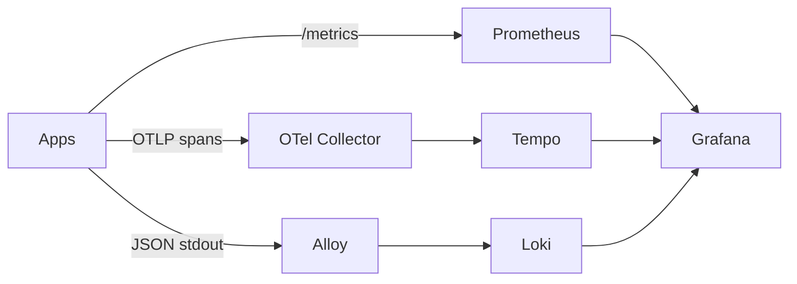

# Stage 6 — Mission Ops

Observability answers three different questions: **metrics** tell you how much and how often, **logs** tell you what a process said, and **traces** tell you where one request spent time across services.

## Build

```bash
cd Apollo11
bash stages/stage6/scripts/apply.sh
bash stages/stage6/scripts/verify.sh
```

The application exposes Prometheus text metrics, OpenTelemetry spans, W3C `traceparent` propagation, and structured JSON logs. The platform includes Prometheus, Grafana, Tempo, Loki, Alloy, and the Operator.

## Concepts: three observability signals

`ServiceMonitor` selects Services/Pods for Prometheus scraping; it is not a dashboard. Metrics are numeric time series for rates, errors, saturation, and latency. A Prometheus rule creates a query-backed alert; an SLO is a user-facing reliability target, not merely a green panel. Logs explain what a process reported. Traces are connected spans showing where one request travelled and spent time. OTLP sends telemetry to a collector; Tempo stores traces; Alloy ships logs to Loki. Namespaces and selectors are ownership boundaries in this stack too.

### Metrics: measure behavior over time

A counter only goes up during the process lifetime; calculate a rate over a window to answer “requests per second.” A histogram records observations in buckets; use it to estimate latency percentiles. A gauge can rise and fall, such as queue depth or active connections. Labels turn one metric name into many time series, so labels must be bounded. A label containing a raw URL, user ID, booking ID, or trace ID can create unbounded cardinality and overload Prometheus.

```text
http_requests_total{service="booking",method="GET",route="/healthz",status="200"}
http_request_duration_seconds_bucket{service="booking",route="/api/bookings",le="0.5"}
```

The route template is safer than the raw path because `/bookings/123` and `/bookings/124` should not become separate label values. A metric endpoint returning 200 proves exposition is reachable; it does not prove Prometheus is scraping it. Check the target state, labels, endpoint path, and sample freshness.

### Logs: events with context

Structured JSON logs make fields queryable and correlate naturally with request IDs, trace IDs, service names, and severity. A log is an event emitted by one process; it is not a timeline spanning the platform. Logs can be duplicated, delayed, sampled, or absent when a process crashes before flushing. Use logs for “what did this component observe or decide?” and use metrics for aggregate behavior.

### Traces: one request, many spans

A trace is a tree or graph of spans. Each span has an operation name, timing, attributes, status, and parent context. W3C `traceparent` carries the trace identity across HTTP calls. If Booking creates a new trace instead of forwarding the incoming context, the user journey fragments into unrelated traces.

The Apollo booking path should show a frontend/client span, Booking server span, downstream Identity and Flight spans, database work, and Notification work where instrumented. A trace can explain latency attribution, but it is sampled and not a replacement for availability metrics.

### Collection pipeline and ownership



Prometheus pulls metrics. Applications push OTLP telemetry to the collector. Alloy discovers and ships Kubernetes logs. Grafana queries the backends; it does not own the data. The shared observability Application must own shared platform resources exactly once, or GitOps systems will fight over them.

### Alerts and SLO thinking

An alert should represent a condition that deserves action. “CPU is 70%” is usually a symptom; “booking availability budget is burning too quickly” is closer to an operational decision. Define the user-facing indicator first, then choose the metric query and threshold. A green dashboard with no data is not healthy, so panels and alerts should distinguish zero from missing data.

### Prometheus queries you should understand

The exact labels vary by implementation, but the reasoning is stable:

```promql
# Request rate over the last five minutes.
sum(rate(http_requests_total[5m])) by (service)

# Error ratio, grouped by service.
sum(rate(http_requests_total{status=~"5.."}[5m])) by (service)
/
sum(rate(http_requests_total[5m])) by (service)

# Approximate latency quantile from a histogram.
histogram_quantile(0.95,
  sum(rate(http_request_duration_seconds_bucket[5m]))
  by (le, service))
```

`rate` converts a monotonically increasing counter into a per-second estimate. `sum by` removes dimensions you do not need while retaining the dimensions you want to compare. Histogram quantiles require the `le` bucket label. A query returning no series is different from a query returning zero; the former may indicate missing scrape data or a label mismatch.

### Instrumentation boundaries

Instrumenting an HTTP server gives you server-side duration and status. It does not automatically include database time, downstream HTTP time, queue wait, or browser rendering time. Instrumenting an outbound client creates child spans and propagates context. Instrumenting a database client gives more attribution, but it can also expose query text or parameters that must be sanitized.

The goal is useful context, not maximum span count. Never put passwords, JWTs, full request bodies, or high-cardinality user identifiers into span attributes or logs. Use booking IDs only if the data-handling policy allows it and the cardinality is controlled.

### ServiceMonitor field model

```yaml
apiVersion: monitoring.coreos.com/v1
kind: ServiceMonitor
metadata:
  name: booking
spec:
  selector:
    matchLabels:
      app.kubernetes.io/name: booking
  namespaceSelector:
    matchNames: [apollo-airlines-apps]
  endpoints:
    - port: http
      path: /metrics
      interval: 15s
```

The selector finds Services, not arbitrary Pods. The endpoint `port` must refer to a named Service port. `namespaceSelector` controls where Prometheus looks. A valid ServiceMonitor can still produce zero targets if the Prometheus resource does not select it, the label is wrong, the Service has no matching endpoints, or the port name differs.

### Logs and labels in Loki

Loki is designed to index a small set of labels and keep the rest in the log line. Make stable labels such as namespace, Pod, container, and service searchable. Do not promote request ID, user ID, or raw URL to an index label for every line. That turns every event into a new stream and increases memory and storage cost.

### Trace sampling and missing links

A trace may be absent because the request was not sampled, the SDK was not initialized, the context header was dropped, the collector endpoint was unavailable, or Tempo rejected the export. Do not interpret “no trace” as “no request.” Use metrics and logs to distinguish traffic absence from telemetry absence. A trace with only a root span tells you the root service emitted telemetry but does not prove downstream propagation.

## Explore one request

```bash
bash stages/stage6/scripts/trace-test.sh
kubectl get servicemonitor,prometheus -A
kubectl port-forward svc/grafana -n apollo-observability 3000:3000
```

Search for `http_requests_total` and request duration in Prometheus. Open Grafana and follow a booking trace: frontend → booking → identity/flight → database/notification. Use the trace ID in the structured logs. The correlation chain is the lesson.

Record one request's trace ID and follow it through the three backends. Then deliberately create a failure and compare what each signal shows: the metric may show an error-rate increase, the log may name a dependency timeout, and the trace may show the exact downstream span that consumed the latency. If only one signal changes, that is evidence about instrumentation or collection—not proof that the other systems are healthy.

### A practical incident walkthrough

Suppose Booking returns `500`:

1. Start with the error-rate metric to determine whether this is one request or a population-wide issue.
2. Use the request ID or trace ID from the client response/log to find the Booking log event.
3. Open the trace and identify the slow or failed child span.
4. Query that dependency's readiness and error metrics.
5. Check whether the failure began after a rollout by comparing deployment revision and telemetry timestamps.
6. Recover the dependency, then prove error rate falls and a new trace completes.

This is more reliable than opening Grafana and searching for a visually alarming panel without a hypothesis.

## Stage 6 checkpoint questions

1. Why is a counter not queried directly as a request rate?
2. Why should route templates be labels instead of raw URLs?
3. What is the difference between a metric, log, and span?
4. What does a ServiceMonitor select, and which additional things can still prevent a target from appearing?
5. Why can a dashboard be green because data is missing rather than because the system is healthy?
6. Which context field connects a Booking span to a Flight span?
7. Which signal would you use first for population-wide error rate, one request's dependency latency, and a process decision?

## Break and recover

Stop or scale a scrape target down, then compare Prometheus target health, application metrics, logs, and traces. Generate a booking while Notification is unavailable and observe the service's bounded dependency behavior. Restore the workload and confirm target health and end-to-end behavior, not just Pod existence.

## Gotchas

- A metric can be fresh while the user journey is failing; combine signals.
- High-cardinality labels such as raw user IDs or URLs can overload a metrics backend.
- A trace only exists if propagation and export both work; a span in one service is not distributed tracing.
- Prometheus scraping requires a correct ServiceMonitor selector, namespace, and endpoint path.
- Shared observability must have one owner in GitOps; do not install three competing Prometheus stacks for three tenants.

```bash
bash stages/stage6/scripts/teardown.sh
```

Continue to [Stage 7](./stage-7).
