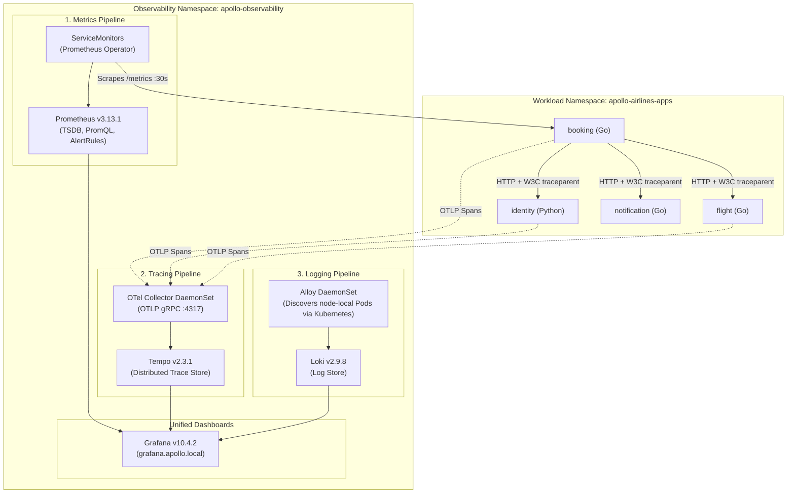

# Stage 6: Mission Operations — Observability & Tracing

:::info[Page type · optional lab]
This lab uses the pinned Apollo11 revision and the `apollo-observability`
namespace. Generated example IDs are not evidence; correlate an ID from the live request you made.
:::

:::note[Take the controls · Mission Operations lab]
Follow a booking through the signals the application leaves behind.
For the explanation before the experiment, start with the
[Mission Operations chapters](./learn/observability/signals-and-metrics). You can return to this lab whenever you’re ready.

Already read them? [Jump to the investigations](#-investigations-choose-the-signal-before-opening-the-tool).
:::

Stage 5 made the deployment reproducible across environments. The earlier stages
told you whether a Pod was ready and whether a rollout had finished. That is
useful, but it does not answer a passenger who says "my booking was slow", or an
operator who asks which dependency failed. A single request passes through
several processes, and a CPU graph cannot show that path.

Stage 6 adds three kinds of evidence to Apollo Airlines, plus Grafana to view
them:
1. **Metrics:** Prometheus counters and histograms, scraped automatically through `ServiceMonitor` resources, with PromQL queries for SLOs and alerting rules.
2. **Distributed traces:** W3C `traceparent` context passed between services, an OpenTelemetry Collector pipeline, and Tempo to view the trace of the main booking workflow.
3. **Centralized logs:** structured JSON logs collected by Grafana Alloy DaemonSets and stored in Loki.
4. **Grafana:** pre-configured views over all three stores. No single signal answers every question, so you will switch between them.

<details>
<summary><strong>Optional conceptual refresher</strong></summary>

The Mission Operations chapters are the primary explanation. Expand this
section when you want the older signal-by-signal account beside the lab.


```mermaid
flowchart TD
  subgraph AppsNS ["Workload Namespace: apollo-airlines-apps"]
    Booking["booking (Go)"]
    Identity["identity (Python)"]
    Flight["flight (Go)"]
    Notification["notification (Go)"]

    Booking -->|HTTP + W3C traceparent| Identity
    Booking -->|HTTP + W3C traceparent| Flight
    Booking -->|HTTP + W3C traceparent| Notification
  end

  subgraph O11yNS ["Observability Namespace: apollo-observability"]
    subgraph MetricsPillar ["1. Metrics Pipeline"]
      SM["ServiceMonitors\n(Prometheus Operator)"]
      Prom["Prometheus v3.13.1\n(TSDB, PromQL, AlertRules)"]
      SM -->|Scrapes /metrics :30s| Booking
      SM --> Prom
    end

    subgraph TracePillar ["2. Tracing Pipeline"]
      OTel["OTel Collector DaemonSet\n(OTLP gRPC :4317)"]
      Tempo["Tempo v2.3.1\n(Distributed Trace Store)"]
      Booking -.->|OTLP Spans| OTel
      Identity -.->|OTLP Spans| OTel
      Flight -.->|OTLP Spans| OTel
      OTel --> Tempo
    end

    subgraph LogPillar ["3. Logging Pipeline"]
      Alloy["Alloy DaemonSet\n(Discovers node-local Pods via Kubernetes)"]
      Loki["Loki v2.9.8\n(Log Store)"]
      Alloy --> Loki
    end

    subgraph Presentation ["Unified Dashboards"]
      Grafana["Grafana v10.4.2\n(grafana.apollo.local)"]
      Prom --> Grafana
      Tempo --> Grafana
      Loki --> Grafana
    end
  end
```

---

## 🎯 Learning Goals

By the end of this stage, you will be able to:
1. Explain what each signal is for: **metrics** (how much and how often), **logs** (what happened), and **traces** (where the time went).
2. Use the **Prometheus Operator** and configure `ServiceMonitor` resources.
3. Write **PromQL queries** for request rate, error ratio, and 95th-percentile latency.
4. Explain how trace context is passed between services with the **W3C `traceparent`** header.
5. Explain why per-node telemetry collectors (OpenTelemetry Collector, Grafana Alloy) run as **DaemonSets**.
6. Follow the repository's synthetic booking workflow across the instrumented backend services in Grafana Tempo.

---

## 📊 Metrics answer “how much, how often, over what window?”

### 1. A metric is a series of measurements, not a record of each request
Every Apollo backend service exposes metrics at `/metrics` in the Prometheus text format:

- **Counters** (`http_requests_total`):
  values that only go up, until the process restarts. Use `rate()` to turn them into a rate over a time window.
  ```text
  http_requests_total{service="booking",method="POST",route="/api/bookings",status="200"} 412
  ```
- **Histograms** (`http_request_duration_ms_bucket`):
  count observations, such as response times, into buckets labeled `le` ("less than or equal to"). You use them to calculate percentiles such as p50, p95, and p99.
  ```text
  http_request_duration_ms_bucket{service="booking",le="100"} 380
  http_request_duration_ms_bucket{service="booking",le="500"} 410
  http_request_duration_ms_bucket{service="booking",le="+Inf"} 412
  ```

:::warning[Keep label values bounded]
Never put user IDs, booking UUIDs, timestamps, or raw query parameters into metric labels. Every distinct value creates a separate time series. A million booking IDs would create a million series and exhaust Prometheus's memory. This problem is called a cardinality explosion.
:::

### 2. A ServiceMonitor tells the operator what to scrape

In Stage 2 you saw that a Service selector picks out a changing group of Pods.
The Prometheus Operator uses the same idea to find scrape targets. A
ServiceMonitor says which Services expose a metrics port. The operator watches
these resources and updates Prometheus's configuration to match. The Prometheus
Pod does not read the ServiceMonitor YAML itself.

The operator adds the **`ServiceMonitor`** Custom Resource Definition (CRD):

*Source: `stages/stage6/helm/apollo11/templates/observability/servicemonitors/booking-sm.yaml`*

```yaml
apiVersion: monitoring.coreos.com/v1
kind: ServiceMonitor
metadata:
  name: booking
  namespace: apollo-observability
  labels:
    app.kubernetes.io/name: booking
    app.kubernetes.io/part-of: apollo-airlines
    release: apollo11
spec:
  selector:
    matchLabels:
      app: booking
  namespaceSelector:
    any: true
  endpoints:
    - port: http
      path: /metrics
      scheme: http
      interval: 30s
      scrapeTimeout: 10s
      honorLabels: true
  jobLabel: app
```

Here is how the pieces connect:
- `selector` finds the `booking` Service by its label.
- `namespaceSelector` says which namespaces that Service may be in.
- The endpoint's `port` must match the name of a port on the Service.
- The operator then creates scrape targets from the Service's ready endpoints.

The existence of a ServiceMonitor therefore proves less than a target that
reports `up`.

### 3. Turn raw counters into answers

*Source: `stages/stage6/helm/apollo11/templates/observability/prometheus/rules.yaml`*

#### 1. Requests per second
```promql
sum(rate(http_requests_total[5m])) by (service)
```
`rate(...[5m])` gives the per-second increase over a sliding 5-minute window. It also handles counter resets when Pods restart.

#### 2. Error ratio (SLO burn)
```promql
sum by (service) (rate(http_requests_total{status=~"5.."}[5m]))
/
clamp_min(sum by (service) (rate(http_requests_total[5m])), 0.001)
```
This divides the rate of 5xx errors by the rate of all requests. If the ratio goes above `0.05` (5%), the alert rule `ApolloErrorRateHigh` fires.

#### 3. 95th-percentile latency (p95)
```promql
histogram_quantile(0.95, sum by (le) (rate(http_request_duration_ms_bucket{service="booking"}[5m])))
```
This estimates the response time that 95% of requests stay under. If it goes above 500 ms, `ApolloBookingLatencyP95High` raises a warning.

---

## 🔍 A trace answers “what happened to this one request?”

Suppose a user says booking a flight took four seconds. A p95 chart can show
that latency went up for many requests, but it cannot show what happened to this
one. A trace carries one trace ID through every service, and each service adds its
own span. That lets you see the order of the calls and how long each took.

The spans below are an illustration only. They are not a recorded Apollo11 trace
and not a promise about latency. To see the real services and durations from your
own run, use the trace-test script later in this chapter.

**Distributed tracing** follows one request across several network calls:

```
[Browser Client]
  │ (Trace ID: 4bf92f3577b34da6a3ce929d0e0e4736)
  ▼
[Booking Service] ────────────────────────────────────────── Total: 185ms
  ├── Span 1: GET /healthz/ready (Identity) ────── 12ms
  ├── Span 2: GET /api/flights/1 (Flight) ──────── 24ms
  ├── Span 3: POST /api/flights/1/reserve (Flight) 88ms  ◄── slowest span
  ├── Span 4: INSERT INTO bookings (PostgreSQL) ── 15ms
  └── Span 5: POST /api/notifications (Async) ──── 8ms
```

### Context propagation: passing the trace along
How does `flight` know that its work belongs to a trace that `booking` started?
When `booking` sends an HTTP request to `flight`, its OpenTelemetry middleware adds a standard header:

```http
traceparent: 00-4bf92f3577b34da6a3ce929d0e0e4736-00f067aa0ba902b7-01
              │  └─────────────┬────────────────┘ └───────┬──────┘ └─ Flags
              │                │                          │
           Version         Trace ID                    Span ID
```

When `flight` receives the header, it creates its spans under the same trace ID instead of starting a separate trace.

### The collector is a workload too
The services do not send traces straight to Tempo. Apollo11 runs the OpenTelemetry Collector as a **`DaemonSet`** and sends traces to it:

*Sources: `stages/stage6/helm/apollo11/templates/apps/booking.yaml`,
`stages/stage6/helm/apollo11/templates/observability/otel-collector/daemonset.yaml`,
and `stages/stage6/helm/apollo11/templates/observability/otel-collector/config.yaml`.*

- A `DaemonSet` asks for one collector Pod on each eligible worker node. Its status shows whether those Pods are actually scheduled and Ready.
- The workloads send OTLP over gRPC to the `otel-collector` ClusterIP Service on port `4317`. Kubernetes may send a request to any Ready collector. The application settings in the repository do not use `localhost`.
- The collector limits its memory use, batches the spans, and forwards the traces to **Grafana Tempo**.

---

## 🪵 Logs preserve the detail that metrics intentionally discard

Apollo services write structured JSON logs to standard output. A log line can
keep an exact error message or a trace ID. Such values are not suitable as
metric labels, which must stay bounded. This is why booking IDs belong in logs and
not in Prometheus labels.

### How Kubernetes captures logs
The container runtime (`containerd`) takes each container's stdout and stderr and writes them to files on the node:
`/var/log/pods/<namespace>_<pod-name>_<pod-uid>/<container-name>/*.log`

### Grafana Alloy (the log shipper)
Stage 6 runs **Grafana Alloy** as a `DaemonSet`, with one Pod on each eligible
node:

*Source: `stages/stage6/helm/apollo11/templates/observability/loki/alloy.yaml`.*

1. Each Alloy Pod finds only the Pods on its own node, using `spec.nodeName`.
2. It adds namespace, service, Pod, and container labels to the logs it finds.
3. `loki.source.kubernetes` reads those Pod logs and sends them to Loki.
4. The application's JSON logs contain `trace_id`, so you can search Loki for the ID that the trace test prints.

---

</details>

## 🧪 Investigations: choose the signal before opening the tool

Start with a question, then pick the signal that answers it. "Which services
were involved in this booking?" needs a trace. "Is the booking error rate going
up?" needs a metric. "What did this service log for this trace ID?" needs logs.
The exercises move between these questions so that Grafana is not just a set of
dashboards you do not understand.

### Exercise 1: Deploy Stage 6 observability

**Prediction:** custom resources such as `ServiceMonitor` and `Prometheus` can
show up in `kubectl get` before their operators have created all of the Pods they
need. Look at the operator-managed object and the workload it creates separately.

- **Objective**: Deploy the Prometheus Operator, Tempo, Loki, Alloy, Grafana, and the instrumented workloads.
- **Starting Point**: A running `kind-apollo11` cluster.
- **Instructions**:

```bash
cd Apollo11

# 1. Deploy Stage 6 in Helm dev mode
bash stages/stage6/scripts/apply.sh --mode helm --env dev

# 2. Inspect pods in apollo-observability
kubectl get pods -n apollo-observability

# 3. Check that the DaemonSets have a ready Pod on every eligible node
kubectl get daemonsets -n apollo-observability
```

- **Expected result**:
  - The Prometheus Operator creates a Pod for the `Prometheus` object named `apollo`, and `tempo`, `loki`, and `grafana` are running.
  - The `otel-collector` and `alloy` DaemonSets have `READY` equal to `DESIRED`. In the default kind cluster the control-plane node is tainted and these DaemonSets do not tolerate the taint, so you should see one Pod per worker (`DESIRED: 2`). The verification script checks only that every desired Pod is ready.
- **Verification script**:

```bash
bash stages/stage6/scripts/verify.sh --mode helm
```
The repository README says this script runs 190 checks. Use its result as a broad
baseline. Then look at one operator-managed resource and the workload it
created, so you can see how the operator reconciles one into the other.

- **Troubleshooting hints**: A custom resource can exist before its operator has
  finished acting on it. Check, in this order: the operator, the custom resource's
  status, the Pods and PVCs it generated, and the events.
- **Concept reinforced**: Operators extend reconciliation from built-in kinds to
  custom resources such as `Prometheus` and `ServiceMonitor`.

---

### Exercise 2: Generate a trace with the trace-test script

**Prediction:** a successful HTTP workflow does not prove that tracing works. The
extra proof is the script's final check against Tempo, which confirms that all
the participating services kept the same trace ID.

- **Objective**: Run a synthetic end-to-end booking and watch the W3C trace context being passed along.
- **Starting Point**: Stage 6 is running.
- **Instructions**:

```bash
# 1. Run the trace-test script
bash stages/stage6/scripts/trace-test.sh
```

- **Expected result**:
  The script does the following:
  1. Starts a temporary `curl` Pod inside the cluster to act as the client.
  2. Logs in to `identity` and gets a JWT, then lists the seeded flights from `flight`.
  3. Generates a random trace ID, and sends a booking request to `booking` with a `traceparent` header that carries it. The trace ID is printed as `trace_id=...`.
  4. Checks that the number of available seats dropped by one.
  5. Polls Tempo until it returns a trace that contains `booking`, `identity`, `flight`, and `notification`.
  6. Cancels the booking and checks that the seat is restored.
- **Verification command**: The script queries Tempo itself and exits with an error
  unless one trace contains all four service names. Keep its
  `trace_id=... services=...` line.
- **Troubleshooting hints**: Find the step that failed, then check that service
  and the telemetry pipeline. The script also deletes its temporary client Pod,
  cancels its booking, and restores the seat, so you can run it again safely.
- **Concept reinforced**: Every outbound call must pass the trace context along,
  or its spans will not join the same trace.

---

### Exercise 3: Look at a trace and its logs in Grafana

**Question:** can one trace ID answer two different questions: where the time went
(in Tempo) and what `booking` logged (in Loki)? Compare the two views yourself.
Do not assume that a link in a dashboard proves they match.

- **Objective**: Open Grafana, find the trace, and match its spans with log lines.
- **Starting Point**: The trace ID from Exercise 2.
- **Instructions**:

```bash
# 1. Forward Grafana to localhost (or use the Envoy Gateway address grafana.apollo.local)
kubectl port-forward svc/grafana 3000:3000 -n apollo-observability &
PF_PID=$!
sleep 2

# The chart enables anonymous Viewer access for this local lab.
```

1. Open `http://localhost:3000` in your browser.
2. Go to **Explore** and select the **Tempo** data source.
3. Paste the `TRACE_ID` from Exercise 2 into the search box and click **Query**.
4. Look at the waterfall timeline. It should span `booking`, `identity`, `flight`, and `notification`.
5. Switch to the **Loki** data source and run
   `{service="booking"} |= "<TRACE_ID>"`, replacing `<TRACE_ID>` with the value
   printed by the trace test. The labels in this query match the ones that
   Apollo11's Alloy configuration adds, and the trace ID appears in the
   structured log line.

When you are done, stop the port-forward:
```bash
kill $PF_PID
```

- **Expected result**: Tempo returns the trace ID printed by
  `stages/stage6/scripts/trace-test.sh`, and its resource attributes name all four
  services.
- **Verification**: Compare the services shown in Grafana with the script's
  `trace_id=... services=...` line. Both should describe the same trace.
- **Troubleshooting**: If the trace is not there yet, wait a moment for the
  telemetry to be flushed and try again. If it is still missing, read the logs of
  the OpenTelemetry Collector and Tempo with `kubectl logs -n apollo-observability`,
  using the Pod names from `kubectl get pods`.
- **Concept reinforced**: A trace ID ties spans together across services. The
  same ID in structured logs lets you jump from a trace to its logs.

---

### Exercise 4: Query live metrics with PromQL

**Prediction:** an empty result can simply mean there was no recent traffic. It
does not mean Prometheus is broken. The API status and the returned series tell
you different things.

- **Objective**: Query real Prometheus metrics from the command line.
- **Starting Point**: Stage 6 is running.
- **Instructions**:

```bash
# Query current request rate grouped by service
PROM_POD=$(kubectl get pods -n apollo-observability -l prometheus=apollo \
  -o jsonpath='{.items[0].metadata.name}')
kubectl exec -n apollo-observability "$PROM_POD" -c prometheus -- \
  wget -qO- 'http://localhost:9090/api/v1/query?query=sum(rate(http_requests_total[5m]))by(service)' | jq .
```

- **Expected result**: Prometheus returns JSON with `status: success`. After you
  generate traffic, the result lists the services that handled requests in the last
  five minutes. Idle services may be missing.
- **Verification command**: Check that `.status == "success"` and read the
  returned result. An idle service can legitimately have no recent rate.
- **Troubleshooting hints**: If the Pod selector returns nothing, check the
  status of `Prometheus/apollo` and the operator logs. If the result is empty,
  generate some traffic and wait for the next scrape.
- **Concept reinforced**: PromQL queries stored time series. A healthy Prometheus
  does not mean every target is up or has been active recently.

---

## 🏁 What You Learned

- What metrics, traces, and logs are each for, and how they complement one another.
- How the Prometheus Operator and `ServiceMonitor` resources find scrape targets automatically.
- How to write PromQL queries for rates, error ratios, and histogram quantiles.
- How W3C `traceparent` headers keep one trace ID across services.
- Why per-node telemetry collectors (OpenTelemetry Collector and Alloy) run as DaemonSets.
- How Grafana lets you query Prometheus metrics, Tempo traces, and Loki logs in one place.

---

## ✈️ Before Continuing: Checkpoint

Before moving to Stage 7, verify you can answer:
1. Why should you avoid putting dynamic booking IDs into Prometheus metric labels?
2. What HTTP header propagates distributed trace context across service boundaries?
3. What is the difference between a Deployment and a DaemonSet?
4. How does `histogram_quantile(0.95, ...)` calculate p95 latency?

Stage 6 now gives you the signals you need to investigate problems. Stage 7 adds
Horizontal and Vertical Pod Autoscaling, Redis caching, and more advanced
scheduling.

👉 **Continue to [Stage 7: Orbital Maneuvering (Autoscaling & Scheduling)](./stage-7)**

## Current verification boundary

The check counts quoted in earlier stages are historical. The verified repository
revision is commit `69113dcc80f77e32301d8ee7b9e73a67c923de96`. It includes
context guards, external ownership of the TLS certificate, HTTPS API endpoints in
the frontend, and ServiceAccount token automount protection. To validate your own
environment, use the summary from the current verification script together with
what you observe yourself. A production docs build only checks that the pages
compile and the links work. It does not test the cluster.

To work through the signals in order (metrics, dashboards, alerts and SLOs, logs,
traces, then correlation), follow `stages/stage6/SIGNALS.md`. The existing
full-stack installer is still the one the maintainers use. The ordered
replacement is waiting for evidence from a full runtime lifecycle.
