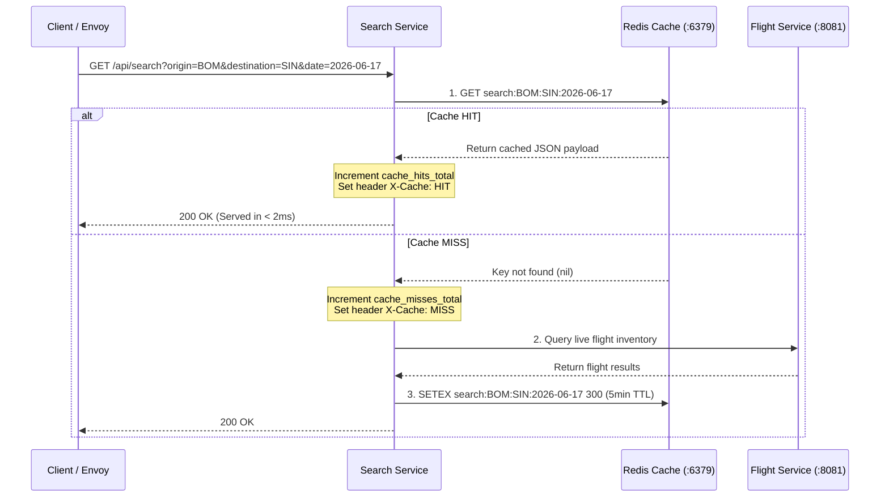

# Stage 7: Orbital Maneuvering — Autoscaling & Performance

**Goal:** Make Apollo Airlines **elastic, high-throughput, and cache-friendly**.

In Stage 6, we established complete observability. Stage 7 uses that operational intelligence to handle traffic spikes automatically. The highest-traffic read path — the `search` service — gains a **Redis cache-aside layer**, **Horizontal Pod Autoscaling (HPA)** based on CPU, recommendation-mode **Vertical Pod Autoscaling (VPA)**, and scheduling controls.

| | |
|---|---|
| **New Concepts** | Redis cache-aside, `X-Cache: HIT/MISS`, metrics-server, HPA scaleUp/scaleDown policies, VPA in `Off` mode, CPU oscillation anti-pattern, practical scheduling |
| **Workloads Changed** | `search` (Redis caching, metrics, HPA, VPA), `booking` & `notification` (PriorityClasses) |
| **New Cluster Resources** | `metrics-server`, `HorizontalPodAutoscaler`, `VerticalPodAutoscaler`, 2 `PriorityClass` resources |
| **Verification Target** | **211 Helm checks / 200 Kustomize checks + live 1→3→1 scale verification** |

---

## 1. Application Acceleration: Redis Cache-Aside

Flight search is read-heavy. In earlier stages, every search query resulted in an HTTP call to the `flight` service, which executed a SQL query against `flight-db`.

Stage 7 implements the **Cache-Aside Pattern** in the `search` Go service:



### Architectural Highlights

1. **Cache Key Structure:** `search:{origin}:{destination}:{date}` (bounded keyspace).
2. **5-Minute TTL:** Balances fresh seat availability with aggressive database load shedding.
3. **Graceful Degradation:** Redis connection timeouts are strictly bounded (10s startup, 1s per request). If Redis crashes or experiences network failure, the search service logs a warning, falls back to a live database query, and lazily reconnects when Redis recovers.
4. **Telemetry Integration:**
   - Adds Prometheus counters: `cache_hits_total{service="search"}` and `cache_misses_total{service="search"}`.
   - Emits OpenTelemetry child spans: `cache.get` (with attribute `cache.hit: true|false`) and `cache.set`.

---

## 2. Horizontal Pod Autoscaler (HPA)

The `search` Deployment is configured with an HPA resource that scales replica count based on CPU utilization:

```yaml
apiVersion: autoscaling/v2
kind: HorizontalPodAutoscaler
metadata:
  name: search-hpa
  namespace: apollo-airlines-apps
spec:
  scaleTargetRef:
    apiVersion: apps/v1
    kind: Deployment
    name: search
  minReplicas: 1
  maxReplicas: 10
  metrics:
    - type: Resource
      resource:
        name: cpu
        target:
          type: Utilization
          averageUtilization: 70
  behavior:
    scaleUp:
      stabilizationWindowSeconds: 0  # Scale up immediately when traffic spikes
      policies:
        - type: Percent
          value: 100                 # Can double replicas every 30s
          periodSeconds: 30
        - type: Pods
          value: 4                   # Or add 4 pods every 30s
          periodSeconds: 30
    scaleDown:
      stabilizationWindowSeconds: 300 # Wait 5 minutes before terminating pods
```

### Why "Scale Fast, Contract Slow"?
- **`scaleUp.stabilizationWindowSeconds: 0`:** User-facing traffic surges must be absorbed immediately to prevent request queuing or dropped packets.
- **`scaleDown.stabilizationWindowSeconds: 300`:** Scaling down too quickly causes **thrashing** (flapping). If traffic dips for 20 seconds and spikes again, killing and immediately restarting pods wastes compute and causes dropped requests.

:::info Metrics-Server Requirement
HPA relies on the `metrics.k8s.io` API. Fresh kind clusters do not install `metrics-server` by default. Apollo11 bundles the upstream metrics-server manifest and installs it automatically during deployment.
:::

---

## 3. Vertical Pod Autoscaler (VPA) in `Off` Mode

The **Vertical Pod Autoscaler (VPA)** reviews historical CPU and memory consumption and suggests optimal resource requests.

```yaml
apiVersion: autoscaling.k8s.io/v1
kind: VerticalPodAutoscaler
metadata:
  name: search-vpa
  namespace: apollo-airlines-apps
spec:
  targetRef:
    apiVersion: apps/v1
    kind: Deployment
    name: search
  updatePolicy:
    updateMode: "Off"   # Recommendation-only!
  resourcePolicy:
    containerPolicies:
      - containerName: search
        minAllowed: { cpu: 50m, memory: 64Mi }
        maxAllowed: { cpu: 1000m, memory: 512Mi }
```

### The CPU Oscillation Anti-Pattern: Why `updateMode: "Off"`?

A critical Kubernetes architecture rule: **Never run HPA and VPA `Auto` on the same resource metric simultaneously.**

```text
The Oscillation Disaster:
1. Traffic increases -> CPU rises.
2. VPA (Auto) detects high CPU -> raises requests.cpu from 100m to 300m.
3. HPA computes CPU% as: (usage / requests).
4. Because requests increased, HPA sees LOWER percentage utilization!
5. HPA scales in replicas.
6. Surviving replicas are crushed by traffic -> CPU spikes further.
7. System oscillates wildly out of control!
```

By configuring `updateMode: "Off"`, VPA acts purely as an advisor. Operators review VPA's recommendations in staging without risking production oscillation.

---

## 4. Hands-On Lab Walkthrough

### 1. Deploy Stage 7

Deploy the complete scaling and caching architecture:

```bash
cd stages/stage7
bash scripts/apply.sh --mode helm --env dev
```

### 2. Verify Redis Cache-Aside in Action

Find the Envoy LoadBalancer IP:

```bash
ENVOY_IP=$(kubectl get service -n envoy-gateway-system \
  -l gateway.envoyproxy.io/owning-gateway-name=apollo-gateway \
  -o jsonpath='{.items[0].status.loadBalancer.ingress[0].ip}')
```

Execute the first query (Cache MISS):

```bash
curl -i -H "Host: search.apollo.local" \
  "http://${ENVOY_IP}/api/search?origin=BOM&destination=DEL&date=2026-06-17"
```

Look at the HTTP response headers:
```text
HTTP/1.1 200 OK
X-Cache: MISS
```

Immediately execute the exact same query again (Cache HIT):

```bash
curl -i -H "Host: search.apollo.local" \
  "http://${ENVOY_IP}/api/search?origin=BOM&destination=DEL&date=2026-06-17"
```

Response headers:
```text
HTTP/1.1 200 OK
X-Cache: HIT
```

Notice the latency difference: the cached response returns in under **2ms** without querying PostgreSQL!

Check the Prometheus cache counters:

```bash
SEARCH_POD=$(kubectl get pod -n apollo-airlines-apps -l app=search -o jsonpath='{.items[0].metadata.name}')
kubectl exec -n apollo-airlines-apps "$SEARCH_POD" -- \
  curl -s http://localhost:8083/metrics | grep "cache_"
# Output:
# cache_hits_total{service="search"} 1
# cache_misses_total{service="search"} 1
```

---

## 5. The Autoscaling Load Experiment

Test HPA dynamic scaling under load.

### 1. Monitor HPA Status

In a secondary terminal, watch HPA metrics:

```bash
kubectl get hpa search-hpa -n apollo-airlines-apps -w
```

### 2. Generate Search Load

Run a high-concurrency request generator against the search service:

```bash
kubectl run -i --tty load-generator --rm \
  --image=busybox:1.36.1 --restart=Never -- \
  sh -c "while true; do wget -q -O- 'http://search.apollo-airlines-apps:8083/api/search?origin=BOM&destination=DEL&date=2026-06-17' > /dev/null; done"
```

### 3. Observe Automated Scale-Out

Within 30–60 seconds, CPU utilization exceeds the 70% threshold:

```text
NAME         REFERENCE           TARGETS    MINPODS   MAXPODS   REPLICAS   AGE
search-hpa   Deployment/search   185%/70%   1         10        1          5m
search-hpa   Deployment/search   185%/70%   1         10        2          6m
search-hpa   Deployment/search   185%/70%   1         10        3          6m30s
```

Check the node placement of the newly scaled replicas:

```bash
kubectl get pods -n apollo-airlines-apps -l app=search -o wide
```

Notice that `topologySpreadConstraints` evenly distributes the replicas across `apollo11-worker` and `apollo11-worker2`.

### 4. Stop Load & Observe Stabilization

Terminate the `load-generator` with Ctrl-C. 

Notice that HPA does **not** instantly kill the pods. The `scaleDown.stabilizationWindowSeconds: 300` enforces a 5-minute cooldown period before gracefully terminating excess replicas back down to 1.

---

## 6. Inspect VPA Recommendations

Query the Vertical Pod Autoscaler recommendation engine:

```bash
kubectl describe vpa search-vpa -n apollo-airlines-apps
```

Under `Recommendation.ContainerRecommendations`:
```text
Target:
  Cpu:     75m
  Memory:  110Mi
Lower Bound:
  Cpu:     50m
  Memory:  64Mi
Upper Bound:
  Cpu:     450m
  Memory:  320Mi
```

VPA provides concrete, data-backed guidance on how to right-size container CPU and memory requests based on observed production workloads.

---

## Maintainer Verification

Run the automated test suite:

```bash
bash scripts/verify.sh
```

**Result: 211/211 checks pass**, validating:
- Redis cache GET/SET, 5-minute TTL, and `X-Cache: HIT/MISS` headers.
- Prometheus cache metrics generation.
- Metrics-server API availability.
- HPA and VPA configurations.
- Practical scaling: dynamic scale out from 1 to 3 replicas and scale in.
- Zero leftover residues upon teardown.

---

## Clean Up

```bash
bash scripts/teardown.sh --mode helm --env dev --purge
```

---


### HPA Auto-scaling & Caching Proof (from verify.sh)

To prove that HPA responds to sustained traffic correctly:

1. Trigger the cache-aside behaviour to see Redis hits:
```bash
# First request hits Flight service, writes to Redis
curl -s -H "Host: search.apollo.local" "http://${EG_IP}/api/search?origin=BOM&destination=DEL" -v
# Second request hits Redis directly (X-Cache: HIT)
curl -s -H "Host: search.apollo.local" "http://${EG_IP}/api/search?origin=BOM&destination=DEL" -v
# Expected Output: HTTP header 'X-Cache: HIT'
```

2. Run a load test using `k6` to trigger the HorizontalPodAutoscaler:
```bash
kubectl run k6-loadtest -n apollo-airlines-apps --image=grafana/k6 --restart=Never -- k6 run -u 50 -d 3m - < loadtest.js
```

3. Watch the HPA scale up to 3 replicas:
```bash
kubectl get hpa search -n apollo-airlines-apps -w
# Expected Output:
# search   Deployment/search   0%/50%   1         3         1
# search   Deployment/search   120%/50% 1         3         3  <-- scaled up!
```


## Explain & Review Questions

1. **Why is `scaleUp.stabilizationWindowSeconds` set to `0` while `scaleDown` is `300`?**
   Because traffic surges must be absorbed immediately to avoid dropping requests ("scale fast"). Conversely, scaling down too quickly during brief traffic dips causes pod thrashing ("contract slow").

2. **Why should you never run HPA and VPA `Auto` mode simultaneously on CPU or Memory metrics?**
   Because VPA changes the `requests`, which automatically changes the denominator HPA uses to calculate utilization percentage. This causes the two controllers to fight each other, leading to wild scaling oscillations.

3. **What happens in Apollo Airlines if the Redis cache completely fails?**
   The application degrades gracefully. The search service logs the connection timeout (which is strictly bounded) and falls back to querying the PostgreSQL database directly, while continually attempting to reconnect to Redis.