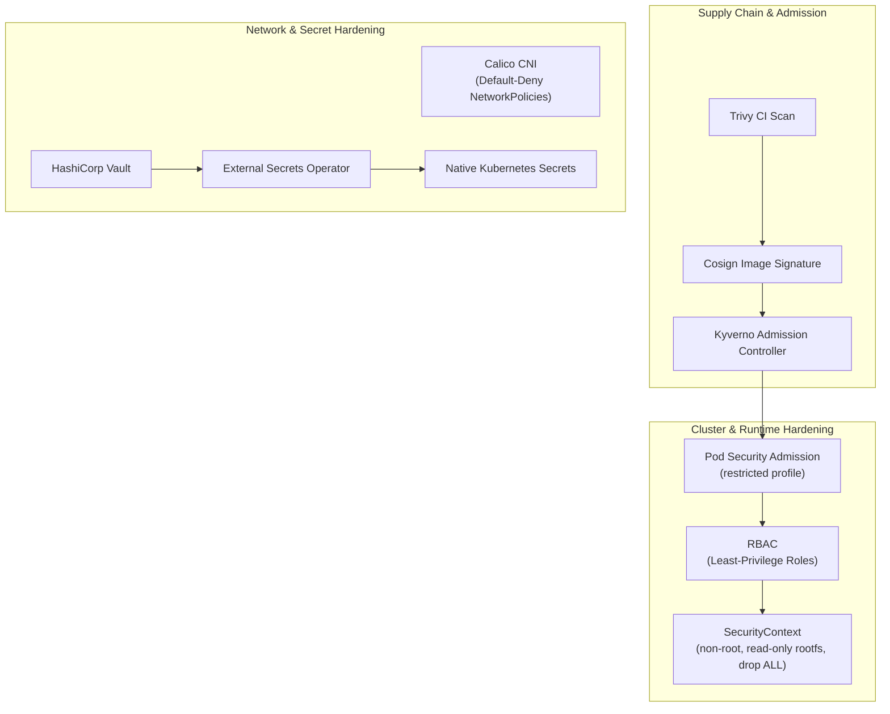
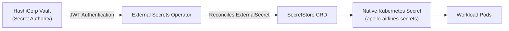

# Stage 8: Command Module — Security Enforcement

> [!WARNING] Lab Status: Planned
> The underlying verified scripts for this stage are currently marked as **Planned/Prototyped** in the Apollo11 repository roadmap. The architectural theory below is correct, but the exact lab manifests and commands may change as the stage undergoes a clean rebuild and verification.


**Goal:** Transform the Stage 7 platform into an enterprise-hardened, defense-in-depth Kubernetes environment. 

In earlier stages, security defaults (such as non-root container users and read-only filesystems) were introduced without active enforcement. Stage 8 makes those controls **explicit, observable, and attackable**. We implement granular access control with **RBAC**, enforce zero-trust container security with **Pod Security Admission**, replace kindnet with **Calico CNI** to enforce NetworkPolicies, integrate **HashiCorp Vault and External Secrets Operator (ESO)**, and enforce supply-chain admission gates with **Kyverno, Trivy, and Cosign**.



---

## 1. Workload Hardening & Pod Security Admission (PSA)

### Pod Security Admission: The Restricted Standard

Kubernetes 1.25+ includes native Pod Security Admission (PSA) replacing legacy PodSecurityPolicies. Stage 8 enforces the **`restricted`** standard on application namespaces:

```yaml
apiVersion: v1
kind: Namespace
metadata:
  name: apollo-airlines-apps
  labels:
    pod-security.kubernetes.io/enforce: restricted
    pod-security.kubernetes.io/enforce-version: latest
    pod-security.kubernetes.io/audit: restricted
    pod-security.kubernetes.io/warn: restricted
```

### The Hardened `securityContext`

To run under `restricted` PSA, every Pod and container must declare explicit security contexts:

```yaml
spec:
  securityContext:
    runAsNonRoot: true
    runAsUser: 10001
    runAsGroup: 10001
    fsGroup: 10001
    seccompProfile:
      type: RuntimeDefault
  containers:
    - name: booking
      securityContext:
        allowPrivilegeEscalation: false
        readOnlyRootFilesystem: true
        capabilities:
          drop:
            - ALL
      volumeMounts:
        - name: tmp
          mountPath: /tmp   # Writable tmpfs scratch space
```

---

## 2. Granular Role-Based Access Control (RBAC)

RBAC governs who can perform which actions on which resources:

```yaml
# 1. Role: Defines permissions within a specific namespace
apiVersion: rbac.authorization.k8s.io/v1
kind: Role
metadata:
  name: flight-operator
  namespace: apollo-airlines-apps
rules:
  - apiGroups: ["apps"]
    resources: ["deployments"]
    verbs: ["get", "list", "watch", "update"]
  - apiGroups: [""]
    resources: ["pods"]
    verbs: ["get", "list", "watch"]

---
# 2. RoleBinding: Binds the Role to a specific user or ServiceAccount
apiVersion: rbac.authorization.k8s.io/v1
kind: RoleBinding
metadata:
  name: bind-flight-operator
  namespace: apollo-airlines-apps
subjects:
  - kind: ServiceAccount
    name: flight-operator-sa
    namespace: apollo-airlines-apps
roleRef:
  kind: Role
  name: flight-operator
  apiGroup: rbac.authorization.k8s.io
```

### Auditing RBAC Permissions

Test authorization from the command line using `kubectl auth can-i`:

```bash
# Check if flight-operator can update deployments
kubectl auth can-i update deployments \
  --as=system:serviceaccount:apollo-airlines-apps:flight-operator-sa \
  -n apollo-airlines-apps
# Returns: yes

# Check if flight-operator can delete pods (not permitted!)
kubectl auth can-i delete pods \
  --as=system:serviceaccount:apollo-airlines-apps:flight-operator-sa \
  -n apollo-airlines-apps
# Returns: no
```

---

## 3. NetworkPolicy Enforcement with Calico CNI

In Stage 2, kind's default `kindnet` CNI could not enforce NetworkPolicies. Stage 8 deploys **Calico CNI** to enforce Layer 3/4 packet filtering:

```bash
# Install Calico CNI
kubectl apply -f https://raw.githubusercontent.com/projectcalico/calico/v3.27.3/manifests/calico.yaml

# Wait for Calico node daemonsets to become ready
kubectl rollout status daemonset/calico-node -n kube-system
```

### The Calico Default-Deny & Allowlist Test

```yaml
apiVersion: networking.k8s.io/v1
kind: NetworkPolicy
metadata:
  name: default-deny-all
  namespace: apollo-airlines-apps
spec:
  podSelector: {}
  policyTypes:
    - Ingress
    - Egress
```

### Safe Failure Experiment: Proving Packet Drops
1. Apply `default-deny-all`.
2. Exec into `booking` and attempt to curl `flight`:
   ```bash
   kubectl exec -n apollo-airlines-apps deploy/booking -- curl --connect-timeout 2 http://flight:8081/healthz
   # Output: Connection timed out (Packets dropped by Calico!)
   ```
3. Apply the specific allowlist policy permitting `booking` to reach `flight:8081`.
4. Re-run the curl: request succeeds instantly!

---

## 4. External Secrets: Vault & External Secrets Operator (ESO)

Storing sensitive passwords directly in plain Kubernetes Secrets or Git repositories is a major security liability. Stage 8 introduces **HashiCorp Vault** as the authoritative secrets engine paired with **External Secrets Operator (ESO)**:



### Manifest: `ExternalSecret`

```yaml
apiVersion: external-secrets.io/v1beta1
kind: ExternalSecret
metadata:
  name: apollo-database-secrets
  namespace: apollo-airlines-apps
spec:
  refreshInterval: 1h
  secretStoreRef:
    name: vault-backend
    kind: SecretStore
  target:
    name: apollo-airlines-secrets
    creationPolicy: Owner
  data:
    - secretKey: POSTGRES_PASSWORD
      remoteRef:
        key: secret/data/apollo/database
        property: password
    - secretKey: JWT_SECRET
      remoteRef:
        key: secret/data/apollo/auth
        property: jwt_secret
```

### The Secret Rotation Test
1. Update the database password in Vault using the Vault CLI.
2. Trigger an immediate refresh in ESO:
   ```bash
   kubectl annotate externalsecret apollo-database-secrets \
     -n apollo-airlines-apps force-sync=$(date +%s) --overwrite
   ```
3. Verify that the native Kubernetes Secret updates automatically within seconds without manual YAML changes!

---

## 5. Policy Admission & Supply Chain Security

### Kyverno: Kubernetes Native Policy Engine

Kyverno validates and mutates incoming API requests using native YAML policies.

```yaml
apiVersion: kyverno.io/v1
kind: ClusterPolicy
metadata:
  name: require-run-as-non-root
spec:
  validationFailureAction: Enforce   # Reject violating Pods
  rules:
    - name: check-non-root
      match:
        any:
          - resources:
              kinds: ["Pod"]
      validate:
        message: "Running as root is forbidden in Apollo11!"
        pattern:
          spec:
            securityContext:
              runAsNonRoot: true
```

### The Admission Rejection Experiment
Attempt to deploy a rogue pod running as root:

```bash
kubectl apply -f - <<EOF
apiVersion: v1
kind: Pod
metadata:
  name: rogue-root-pod
  namespace: apollo-airlines-apps
spec:
  containers:
    - name: root-shell
      image: busybox
      command: ["sleep", "3600"]
EOF
```

**Observation:** The API server rejects the request immediately:
```text
Error from server: admission webhook "validate.kyverno.svc" denied the request: 
Running as root is forbidden in Apollo11!
```

### Image Signing & Verification with Cosign

In our CI pipeline, images built by GitHub Actions are signed using private cryptographic keys:

```bash
cosign sign --key cosign.key ghcr.io/darshan-raul/apollo11/booking:v1.0.0
```

Kyverno verifies image signatures upon admission:
- **Signed images:** Allowed into the cluster.
- **Unsigned or tampered images:** Instantly rejected at the admission webhook.

---

## Maintainer Verification

Run the security audit suite:

```bash
bash stages/stage8/scripts/verify.sh
```

**Verification Checklist:**
- PSA `restricted` profile enforcement verified.
- RBAC role bindings restricted to least privilege.
- Calico packet drops verified under default-deny.
- Vault secret sync and automated rotation proven.
- Kyverno admission webhooks reject root containers and unsigned images.

---

## Explain & Review Questions

1. **Why does Kubernetes PSA `restricted` require dropping all capabilities (`drop: [ALL]`)?**
   Linux capabilities divide root privileges into distinct units (e.g. `CAP_NET_ADMIN`, `CAP_SYS_ADMIN`). Dropping all capabilities ensures that even if an attacker escapes an unprivileged process, they cannot manipulate host network interfaces or kernel modules.

2. **What is the difference between a Role and a ClusterRole?**
   A `Role` grants permissions strictly within a single namespace. A `ClusterRole` grants cluster-wide permissions across all namespaces or over non-namespaced resources (like Nodes, PVs, and StorageClasses).

3. **Why is HashiCorp Vault + ESO safer than checking Secrets into Git?**
   Secrets in Git (even encrypted with Sealed Secrets) create long-term exposure risk. Vault centralizes encryption at rest, enforces audit logs of every secret access, and enables programmatic, automated secret rotation without redeploying code.

---

## What's Next

Now that our local Kubernetes platform is hardened, performant, and resilient, [Stage 9: Lunar Orbit](./stage-9.md) moves Apollo Airlines onto a real public cloud: provisioning a multi-AZ **Amazon EKS** cluster with Terraform, configuring AWS Load Balancer Controller (NLB), EBS CSI storage, and automated disaster recovery with Velero.