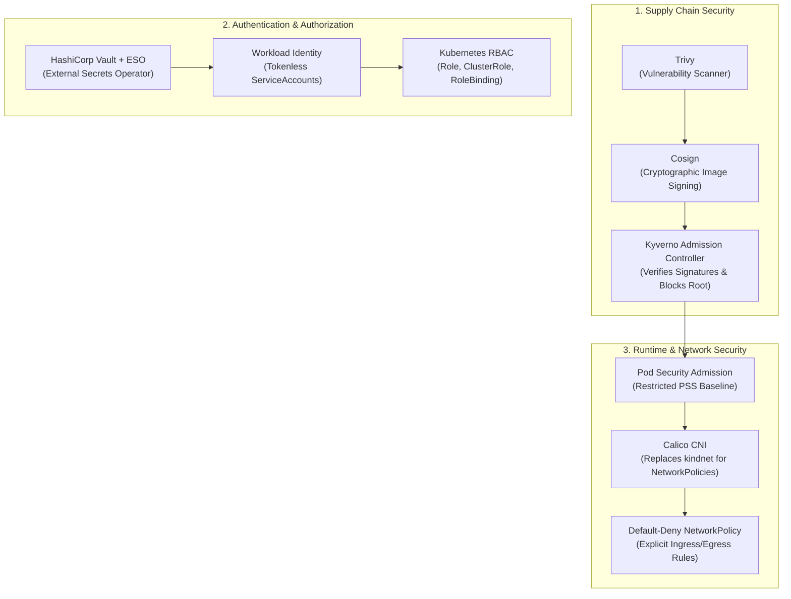

# Stage 8: Command Module Hardening — Security Roadmap

In Stages 1–7, we built, deployed, packaged, and scaled Apollo Airlines. However, we operated with permissive development defaults:
- Microservices can talk to any other microservice across namespaces without firewall restrictions.
- Secrets are stored as base64-encoded strings directly inside `etcd`.
- Pods are allowed to run without strict Pod Security Admission enforcement.

**Stage 8 (Command Module Hardening)** is the planned security milestone for Apollo Airlines. Grounded in the curriculum architecture defined in `ROADMAP.md`, this stage defines the production defense-in-depth model across the Kubernetes security stack.



---

## 🎯 Key Security Concepts Explained

### 1. Role-Based Access Control (RBAC)

RBAC regulates who can perform which actions on which Kubernetes resources.

- **`Role`** (Namespace-Scoped):
  Defines permissions within a specific namespace (e.g. read Pods in `apollo-airlines-apps`).
- **`ClusterRole`** (Cluster-Scoped):
  Defines permissions across all namespaces or on cluster-level objects (Nodes, PersistentVolumes, Namespaces).
- **`RoleBinding` / `ClusterRoleBinding`**:
  Binds a Role or ClusterRole to a subject (a human User, Group, or `ServiceAccount`).

```yaml
# Conceptual Kubernetes example — least-privilege Role for Booking
apiVersion: rbac.authorization.k8s.io/v1
kind: Role
metadata:
  name: booking-reader
  namespace: apollo-airlines-apps
rules:
  - apiGroups: [""]
    resources: ["configmaps"]
    verbs: ["get", "watch", "list"]
```

:::important Least-Privilege Workload Identity
In Stage 1, we disabled token automount on all 13 ServiceAccounts (`automountServiceAccountToken: false`). If a pod does not need to query the Kubernetes API, it should never have an API credential mounted. In Stage 8, any service needing API access receives a dedicated, tightly-scoped RoleBinding.
:::

---

### 2. Pod Security Admission (PSA) & Standards (PSS)

Kubernetes provides built-in admission control to enforce security baselines across namespaces via three **Pod Security Standards**:

1. **`Privileged`**: Completely unrestricted (used by CNI plugins, node agents).
2. **`Baseline`**: Minimally restrictive; prevents known privilege escalations (blocks host network, host ports).
3. **`Restricted`**: Heavily hardened; strictly enforces current container security best practices:
   - Must run as non-root (`runAsNonRoot: true`).
   - Read-only root filesystem (`readOnlyRootFilesystem: true`).
   - Must drop all Linux capabilities except `NET_BIND_SERVICE`.
   - Disallows privilege escalation (`allowPrivilegeEscalation: false`).

```yaml
# Enforcing Restricted Pod Security on the apps namespace
apiVersion: v1
kind: Namespace
metadata:
  name: apollo-airlines-apps
  labels:
    pod-security.kubernetes.io/enforce: restricted
    pod-security.kubernetes.io/enforce-version: latest
```

Because Apollo Airlines containers were already designed with non-root users, dropped capabilities, and read-only filesystems in Launchpad, our workloads conform smoothly to the Restricted standard!

---

### 3. NetworkPolicies with Calico CNI

In Kubernetes, **network traffic is completely open by default**. Any Pod in any namespace can send TCP packets to any other Pod IP or Service, including databases!

A **`NetworkPolicy`** acts as an in-cluster firewall:

```yaml
# Conceptual Kubernetes example — NetworkPolicy isolating booking-db
apiVersion: networking.k8s.io/v1
kind: NetworkPolicy
metadata:
  name: booking-db-isolation
  namespace: apollo-airlines-apps
spec:
  podSelector:
    matchLabels:
      app: booking-db
  policyTypes:
    - Ingress
  ingress:
    - from:
        - podSelector:
            matchLabels:
              app: booking
      ports:
        - protocol: TCP
          port: 5432
```

### Why Calico Is Required:
Kubernetes itself does not implement NetworkPolicy packet filtering; it merely provides the API. The CNI (Container Network Interface) must implement the rules in the Linux kernel (`iptables` or `eBPF`).
- Local `kindnet` ignores NetworkPolicies.
- In Stage 8, `kindnet` is replaced with **Calico CNI**, allowing learners to verify that unauthorized pods (such as `frontend` or an attacker pod) receive an immediate connection timeout when attempting to query `booking-db` directly!

---

### 4. Secret Management: Vault & External Secrets Operator (ESO)

Storing plain base64 Secrets in Git or `etcd` violates compliance standards.

In the Stage 8 architecture:
1. Production passwords and signing keys are stored in an external secrets vault (like **HashiCorp Vault** or AWS Secrets Manager).
2. The **External Secrets Operator (ESO)** runs in the cluster and authenticates to Vault using Kubernetes ServiceAccount tokens.
3. ESO automatically synchronizes secrets into ephemeral Kubernetes `Secret` objects and handles **automated credential rotation**.

---

### 5. Supply Chain Security: Trivy, Cosign & Kyverno

How do you guarantee that unauthorized, unvetted, or vulnerable container images never run in your cluster?

1. **Trivy**: Scans container images for known CVE vulnerabilities and misconfigurations during GitHub Actions CI.
2. **Cosign (Sigstore)**: Cryptographically signs container images after CI tests pass, pushing the signature to the container registry.
3. **Kyverno**: An in-cluster admission controller that intercepts all `Pod` creation requests. If an image is not signed by the team's official Cosign public key, Kyverno **rejects the deployment at the API server boundary**!

---

## 🧭 Roadmap & Implementation Boundary

:::warning Current Repository State
As documented in the Apollo11 `README.md` and `ROADMAP.md`, Stage 8 is a **planned clean rebuild** based on the verified Stage 7 Helm baseline.

Do not apply legacy manifests that may exist in older branches. The supported and verified path runs from **Launchpad through Stage 7**.
:::

### What Learners Can Investigate Right Now:
- Inspect `stages/stage4/k8s/apps/booking/booking-dep.yaml` to verify the container-level security context (`read_only: true`, `securityContext`).
- Inspect `stages/stage1/k8s/config/serviceaccounts.yaml` to verify `automountServiceAccountToken: false`.
- Experiment with labeling a test namespace with `pod-security.kubernetes.io/enforce: restricted` and testing whether your Pods pass admission.

👉 **Continue to [Stage 9: Lunar Orbit (Cloud Deployment Roadmap)](./stage-9)**
