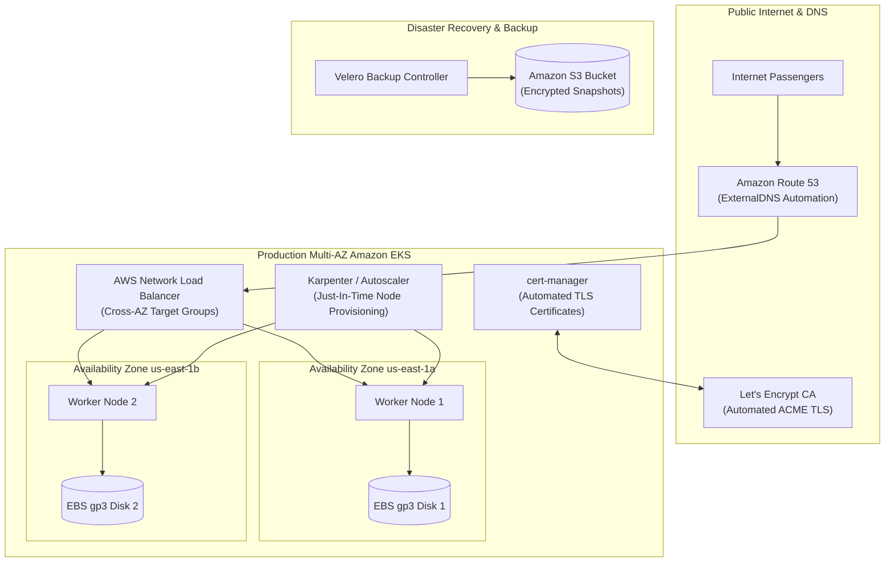

# Stage 9: Lunar Orbit — Production Cloud Operations Roadmap

In the [Cloud Appendix](./eks), we saw how Apollo Airlines deploys to an AWS EKS cluster with an NLB and EBS storage.

**Stage 9 (Lunar Orbit)** is the planned production capstone of Apollo11. It moves beyond a prototype single-AZ setup into a **production-hardened, multi-AZ cloud architecture** capable of handling disasters, zero-downtime upgrades, dynamic node scaling, and automated TLS.

---

## 🎯 Production Cloud Capabilities

### 1. Automated DNS and TLS with ExternalDNS & `cert-manager`
In local environments, we manually edited `/etc/hosts` and generated self-signed certificates.
In Stage 9:
- **`cert-manager`**: Connects to Let's Encrypt via ACME HTTP-01 or DNS-01 challenges, automatically issuing and renewing trusted, browser-valid SSL/TLS certificates for `apolloairlines.com`.
- **`ExternalDNS`**: Synchronizes Kubernetes Gateway and Ingress hostnames directly with Amazon Route 53 or Google Cloud DNS, creating public DNS A-records automatically.

### 2. Elastic Node Scaling: Karpenter vs. Cluster Autoscaler
In Stage 7, we used HPA to scale Pod replicas horizontally. But what happens when the physical worker nodes run out of CPU and memory? New Pods get stuck in `Pending` with `FailedScheduling` events!
- **Cluster Autoscaler**: Monitors pending pods and increments the desired capacity of an AWS EC2 Auto Scaling Group. (Slow: takes 3 to 5 minutes to launch a new node).
- **Karpenter**: A high-performance, open-source node provisioner designed for Kubernetes. It skips EC2 Auto Scaling Groups entirely, directly launching right-sized EC2 Spot or On-Demand instances in under 45 seconds tailored to the exact resource requests of pending pods!

### 3. Disaster Recovery with Velero
If an entire cloud region experiences an outage, or an operator accidentally deletes a namespace, how do you recover?
- **Velero**: An enterprise backup and recovery tool for Kubernetes.
- Backs up all declarative Kubernetes API resources (Deployments, Services, ConfigMaps) to an encrypted Amazon S3 bucket.
- Coordinates with the EBS CSI driver to trigger point-in-time snapshots of attached PersistentVolumes.
- Enables disaster recovery into an entirely clean cluster with one command:
  `velero restore create --from-backup apollo11-nightly`.

### 4. Zero-Downtime Cluster Version Upgrades
Kubernetes releases a new minor version every 4 months (e.g. 1.30 to 1.31). Upgrading a production cluster requires:
1. Upgrading the managed control plane (`kube-apiserver`).
2. Cordoning and draining worker nodes one at a time (`kubectl drain`).
3. Verifying that `PodDisruptionBudgets` (from Stage 4) keep at least 1 healthy replica alive during evictions.
4. Validating pre- and post-upgrade HTTP health checks.

---

## ☁️ Multi-Cloud Portability Analysis: AWS EKS vs. Google Cloud GKE

One of the greatest promises of Kubernetes is portability. How do the Apollo11 building blocks translate between AWS and Google Cloud?

| Architectural Dimension | Amazon EKS (AWS) | Google Kubernetes Engine (GKE) |
|---|---|---|
| **Networking & CNI** | AWS VPC CNI (secondary ENI IPs) | GKE VPC-Native (Alias IP ranges) |
| **Edge Load Balancing** | AWS Load Balancer Controller (NLB/ALB) | GKE Ingress / Gateway Controller (Google Cloud Armor & Global HTTP LB) |
| **Block Storage Driver** | `ebs.csi.aws.com` (gp3 volumes) | `pd.csi.storage.gke.io` (Persistent Disk / Hyperdisk) |
| **Workload Identity** | IAM Roles for Service Accounts (IRSA / EKS Pod Identity) | GKE Workload Identity |
| **Autoscaling** | Karpenter / Cluster Autoscaler | GKE Autopilot or Node Auto-Provisioning |

Notice that the **application layer, Helm templates, and Gateway API HTTPRoutes remain identical**. Only the infrastructure provider and CSI/CNI drivers change.

---

## 🧭 Roadmap Status

:::note Implementation Boundary
As defined in `ROADMAP.md` and `stages/stage9/README.md`, Stage 9 is planned as the future cloud capstone. The standalone `stages/eks/` directory serves as the current runnable cloud prototype.
:::

👉 **Explore [Stage 10: Mission Extensions (Optional Catalog)](./stage-10)**
