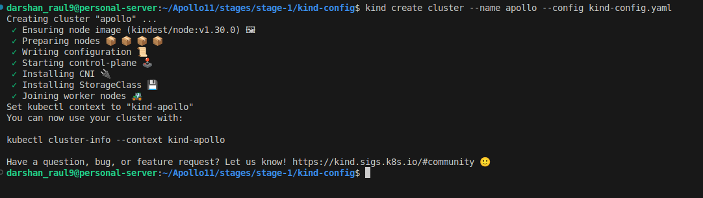
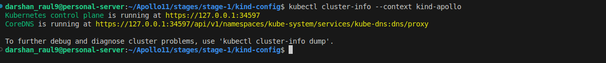
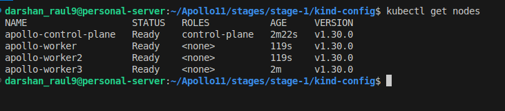
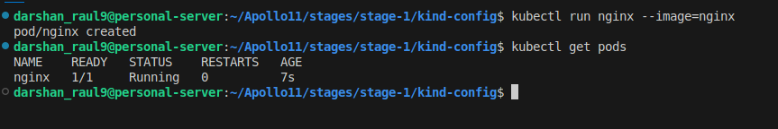
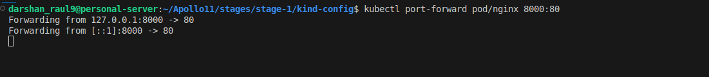
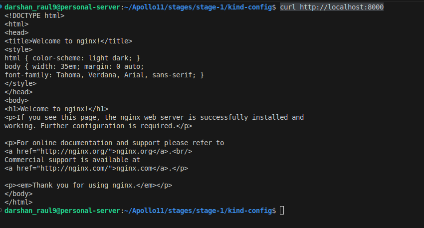
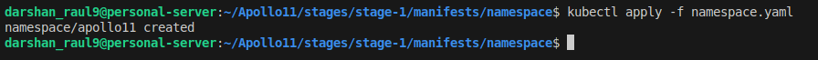
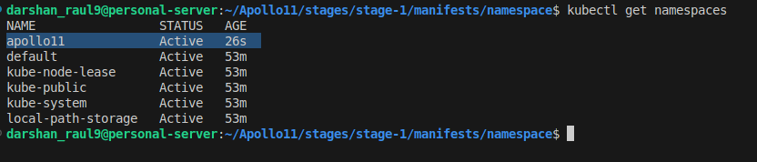
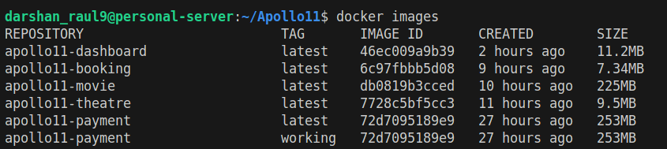

# Running the apps in local k8s

Now that we have all our code working with Docker Compose, it’s time to run it on our local Kubernetes (k8s) cluster. There are multiple options for this:

- **[Minikube](https://minikube.sigs.k8s.io/docs/start)**

    The most famous of the lot. A tool that lets you run Kubernetes locally by spinning up a single-node cluster inside a VM on your machine.
    
    Features:

    - Supports multiple VM drivers and container runtimes.
    - Easy setup with built-in add-ons.
    - Native Kubernetes environment with full API support.

- **[Kind](https://kind.sigs.k8s.io/docs/user/quick-start#creating-a-cluster)** (Kubernetes in Docker)

    A tool for running Kubernetes clusters in Docker containers [and now podman and containerd], ideal for CI pipelines and testing.
    
    Features:

    - Runs Kubernetes entirely in Docker.
    - Supports multi-node clusters.
    - Lightweight and fast to set up.

- **[MicroK8s](https://microk8s.io)**

    A lightweight, pure upstream Kubernetes distribution for workstations, IoT, and appliances.
    
    Features:

    - Zero-configuration installation.
    - Efficient resource usage for edge computing.
    - Full Kubernetes experience with add-on services.
        -Prometheus, Jaeger, Istio, LinkerD and KNative and many more are available are readymade addons

- **[k3s](https://k3s.io)**

    A lightweight Kubernetes distribution designed for resource-constrained environments and edge computing.
    
    Features:

    - Reduced resource footprint with lightweight binaries.
    - Built-in support for external databases.
    - Easy upgrades and support for both ARM and x86 platforms.

- **[Rancher Desktop](https://k0sproject.io)**

    An open-source Kubernetes tool that provides container management on your desktop with a GUI.
    
    Features:

    - Seamless integration with Docker CLI.
    - Switch between container runtimes (e.g., containerd, dockerd).
    - Built-in Kubernetes dashboard for easy cluster management.

- **[k0s](https://k0sproject.io)**

    A zero-friction, fully conformant Kubernetes distribution built for simplicity and minimal overhead.
    
    Features:

    - Single binary with a minimal footprint.
    - No dependencies on external databases or systems.
    - Integrated high availability and multi-node setup support.


I have decided to use kind for this course but it can be followed with absolutely any of these local distributions. Each of them have their tradeoffs and ultimately its our preference.

## Creating kind cluster

### Install kind binary

Follow this link to know more: https://kind.sigs.k8s.io/docs/user/quick-start#installing-from-release-binaries

- For linux, follow these steps:

    ```bash
    # For AMD64 / x86_64
    [ $(uname -m) = x86_64 ] && curl -Lo ./kind https://kind.sigs.k8s.io/dl/v0.24.0/kind-linux-amd64
    # For ARM64 [use this if not using amd computes, mac,gravtion servers etc]
    # [ $(uname -m) = aarch64 ] && curl -Lo ./kind https://kind.sigs.k8s.io/dl/v0.24.0/kind-linux-arm64
    chmod +x ./kind
    sudo mv ./kind /usr/local/bin/kind
    ```

- Change directory to kind directory in the stage 1 folder
    - `cd stages/stage-1/kind-config`
- Look at the content of the kind config file. It is being used to create a kind cluster with custom settings (more that one node in this case) 
    - `cat kind-config.yaml`
- You can read more about customizing kind configuration here: https://kind.sigs.k8s.io/docs/user/configuration/


### Create kind cluster with name and 3 workers

> Optional: The reason I have gone with 3 workers is to get a feel of a real cluster 

- Lets create the kind cluster
    ```bash
    cd stages/stage-1/kind-config
    kind create cluster --name apollo --config kind-config.yaml
    ```

    

- Next run this command to cehck if cluster is running correctly:  
    ```bash
    kubectl cluster-info --context kind-apollo`
    ```

    

- Confirm the nodes are correct `kubectl get nodes`
    

- Can look at `cat ~/.kube/config` to confirm that cluster config is set correctly

### Creating a test pod

- Lets try the default hello world of any k8s cluster, running the nginx image
   ```bash 
   kubectl run nginx --image=nginx
   ```

- You should be seeing a `pod/nginx created` output

- Confirm our pod has been created:

    ```bash
    kubectl get pods
    ```

    

- Lets port forward that pod and check if its accessible from the terminal 
    ```bash
    kubectl port-forward pod/nginx 8000:80
    ```

    This will make sure that the port 80 in the nginx pod will be exposed as port 8000 on your localhost

    

- Open a different terminal and try accessing the site:

    ```bash
    curl http://localhost:8000
    ```

    

- Lets cleanup the pod once we have tested
- Delete the pod using `kubectl delete pod/nginx`

## Creating namespace

> To get more info on namespaces refer: [namespaces](https://darshan-raul.gitbook.io/cloudnativeguide/kubernetes/concepts/namespaces)


- Now lets start creating our actual architecture on this cluster
- Lets create a namespace named `apollo11`
- All of our resources will be created in that namespace [except any non namespaced resources]

    ```bash
    cd /stages/stage-1/manifests/namespace
    kubectl apply -f namespace.yaml
    ```

    

- Now lets have a look if our namespace has been created. Run below command and ensure that the apollo11 namespace has been created

    ```bash
    kubectl get namespaces
    ```
    


## Load all the images inside kind cluster

- To run our pods inside kind, we will need to load our docker images inside kind cluster.
> Note: There will be similar provisions in other local distributions as well. Also in the next stages we will be moving to private registries where these steps will be obsolete. But to start with simple setup, these are needed
- Check if you have docker images for all the 5 services: payment,booking,theatre,movie and dashboard
    ```bash
    docker images
    ```
    
- Once confirmed, lets load all the images into kind cluster. Kind will automatically load them to all the nodes in the cluster
    ```bash
    kind load docker-image apollo11-payment:latest --name apollo
    kind load docker-image apollo11-movie:latest --name apollo
    kind load docker-image apollo11-booking:latest --name apollo
    kind load docker-image apollo11-theatre:latest --name apollo
    kind load docker-image apollo11-dashboard:latest --name apollo
    ```
- We can confirm these are loaded by running this command on one of the node containers
    ```bash
    docker exec -it apollo-worker2 crictl images
    ```

!!! note

    because this will be local images, **we need to ensure that we keep imagePullPolicy=never** when running in the local cluster to avoid any image pull business

## Creating Architecture

- Although best practices have been followed that make sure that if you create all the infra at once, they will be created and will work seamlessly, for our learning we will deploy one service at a time. 
- The sequence we will maintain is `payment->theatre->movie->booking->dashboard`

- If you are not a newbie and want to get done with this stage at once:
    ```bash
    cd /stages/stage-1/manifests
    kubectl apply -R -f .
    ```
!!! note
    You will have to wait till all the probes and initcontainers finish for everything to be up

### Creating payment service


### Base64 encode

`echo -n "7000" | base64`

### Adding movies

```bash
http POST localhost:7000/theatre name=inox location=mumbai seats:=50
http POST localhost:7000/theatre name=pvr location=mumbai seats:=50
http POST localhost:7000/theatre name=cinepolis location=mumbai seats:=50

http POST localhost:9000/movies name=chichore genre=comedy stars=4
http POST localhost:9000/movies name=rhtdm genre=romance stars=4
http POST localhost:9000/movies name=tumbad genre=horror stars=4
http POST localhost:9000/movies name=dilse genre=thriller stars=4
http POST localhost:9000/movies name=cki genre=sports stars=4
```

### Cleanup

Lets cleanup all the resources

```bash
kubectl delete all --all
kubectl delete secrets --all
kubectl delete cm --all
kubectl delete pvc --all
```

## Just enough RBAC


## Best practices when creating a deployment

### Using specific image tags instead of latest

### Adding resource limits


```
resources:  # Limit the container's resource usage
    requests:
        memory: "64Mi"
        cpu: "250m"
    limits:
        memory: "128Mi"
        cpu: "500m"
```


### Putting resource quotas


### Putting Liveness,startup and readiness probe

```
readinessProbe:  # Add readinessProbe to detect when the container is ready to receive traffic
    httpGet:
        path: /healthz  # Adjust the path to your app's health check
        port: 8080
    initialDelaySeconds: 5
    periodSeconds: 10
    livenessProbe:  # Add livenessProbe to ensure the container is healthy
    httpGet:
        path: /healthz
        port: 8080
    initialDelaySeconds: 15
    periodSeconds: 20
```


## Tools

### K9s
### Kubens
### Kubectx
### jsonpath parsing

## Extra

### Kompose

- There is a tool called Kompose which can be used to convert your docker compose files into k8s manifests
- Infact I used it to initially convert the docker compose file to the initial set of manifests
- Refer the docs at https://kompose.io to know more

> Note: in my observations, you will have to tweak quite a bit to make the manifests work if you have some complex usecases but for simpler applications this will work like a charm

- Just install kompose by following their guide and run `kompose convert` and you get your k8s manifests! Give it a try

## Useful kubectl commands

- `kubectl explain <resourcename>`
- `kubectl explain <resourcename> --recursive`
- `kubectl <syntax> --dry-run=client -o yaml`
