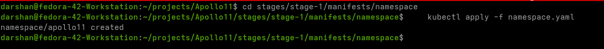
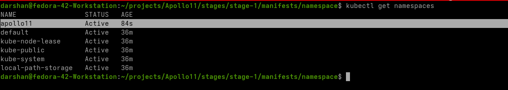
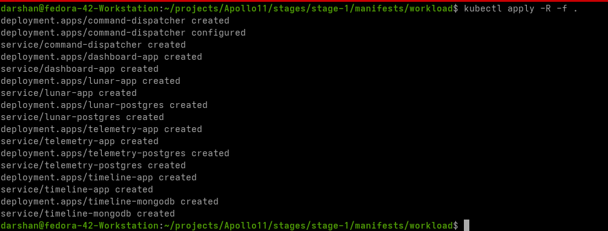

# Running the apps in local k8s

Now that we have all our code working with Docker Compose, it's time to run it on our local Kubernetes (k8s) cluster. There are multiple options for this:

| Distribution | Website |
| :--- | :--- |
| **Minikube** | [minikube.sigs.k8s.io](https://minikube.sigs.k8s.io/docs/start) |
| **Kind** | [kind.sigs.k8s.io](https://kind.sigs.k8s.io/docs/user/quick-start#creating-a-cluster) |
| **MicroK8s** | [microk8s.io](https://microk8s.io) |
| **k3s** | [k3s.io](https://k3s.io) |
| **k3d** | [k3d.io](https://k3d.io) |
| **Rancher Desktop** | [rancherdesktop.io](https://rancherdesktop.io) |
| **k0s** | [k0sproject.io](https://k0sproject.io) |
| **Docker Desktop** | [docker.com](https://www.docker.com/products/docker-desktop/) |

I have decided to use `k3d` for this course but it can be followed with absolutely any of these local distributions. Each of them have their tradeoffs and ultimately its our preference.

## Prerequisites

 `k3d`, `kubectl` and `docker` are needed to move ahead. Please ensure you have run the `prep.sh` script from the [Liftoff](../liftoff/liftoff.md) section to install these tools natively.

-----


-----

## Creating k3d cluster

- Create the cluster using our config:
    
    ```bash
    k3d cluster create --config stages/stage1/k3d-config.yaml
    ```


- Next run this command to cehck if cluster is running correctly:  

    ```bash
        kubectl cluster-info --context k3d-apollo11
    ```
 

- Confirm the nodes are correct 
    
    ```bash
    kubectl get nodes
    ```

- Can look at `cat ~/.kube/config` to confirm that cluster config is set correctly

> !!! note 
We will go in depth of the content of the config file when we visit RBAC section

- Lets try the default hello world of any k8s cluster, running the nginx image
   
    ```bash 
    kubectl run nginx --image=nginx
    ```
- You should be seeing a `pod/nginx created` output

- Confirm our pod has been created:

    ```bash
    kubectl get pods
    ```
    > Note: it could be in `ContainerCreating` state for  a while until the image is retrieved locally


- Lets port forward that pod and check if its accessible from the terminal 

    ```bash
    kubectl port-forward pod/nginx 8000:80
    ```

    This will make sure that the port 80 in the nginx pod will be exposed as port 8000 on your localhost


- Open a different terminal and try accessing the site:

    ```bash
    curl http://localhost:8000
    ```


- Lets cleanup the pod once we have tested

- Delete the pod using 
    
    ```bash
    kubectl delete pod/nginx
    ```


## Understanding : Pods, Deployments, ReplicaSets, and Services


### The Smallest Unit: The Pod 
> and why you don't run it directly

In Kubernetes, the **Pod** is the smallest deployable unit. Think of a Pod as a logical host **for one or more containers**. These containers are tightly coupled and share the same network namespace, storage volumes, and usually the same lifecycle. For example, if you have a web server and a sidecar container that pushes logs, they'd typically reside within the same Pod.

**So, why do we never run Pods directly?**

While you *can* create a standalone Pod, it's highly discouraged for production environments. Here's why:

* **No Self-Healing:** If a directly created Pod crashes, is evicted, or the node it's on fails, Kubernetes won't automatically bring it back. Your application will be down until you manually intervene.
* **No Scaling:** You can't easily scale a standalone Pod. If you need more instances of your application to handle increased load, you'd have to manually create more Pods.
* **No Rolling Updates:** Updating a directly created Pod to a new version means deleting the old one and creating a new one, leading to downtime for your application.
* **Manual Management Overhead:** Managing individual Pods quickly becomes a nightmare as your application grows.

This is where higher-level abstractions like ReplicaSets and Deployments come into play.

### Ensuring Stability: The ReplicaSet

A **ReplicaSet** is a Kubernetes controller that ensures a specified number of identical Pod replicas are running at all times. If a Pod fails, the ReplicaSet will automatically create a new one to maintain the desired count. It's the "self-healing" mechanism for your Pods.

A ReplicaSet typically includes:

* **`replicas`**: The desired number of Pod instances.
* **`selector`**: A set of labels (we will look at them in stage2) that the ReplicaSet uses to identify the Pods it manages.
* **`template`**: The Pod definition (container image, ports, resources, etc.) that the ReplicaSet uses to create new Pods.

**⚠️⚠️Why we should not use ReplicaSet directly:⚠️⚠️**

While ReplicaSets provide crucial self-healing and basic scaling, they lack capabilities for managing application updates. If you want to deploy a new version of your application, directly manipulating a ReplicaSet would mean manually deleting old Pods and hoping the ReplicaSet creates new ones with the updated template, which is not a controlled or graceful process. You wouldn't get features like rolling updates or easy rollbacks.

### The Orchestrator: The Deployment

This is where the **Deployment** shines! A Deployment is a higher-level API object that manages ReplicaSets, and by extension, your Pods. It provides declarative updates for Pods and ReplicaSets.

Think of a Deployment as the orchestrator of your application's lifecycle. When you define a Deployment, you specify the desired state of your application, including the container image, the number of replicas, and update strategies.

Key benefits of using Deployments:

* **Declarative Updates:** You simply declare the desired state (e.g., "I want 3 replicas of my Nginx app with version 1.25"). The Deployment controller then works to achieve that state.
* **Rolling Updates:** Deployments enable zero-downtime rolling updates. When you update the image version in your Deployment, it gradually creates new Pods with the new version and scales down the old ones, ensuring your application remains available throughout the process.
* **Rollbacks:** Made a mistake in your new version? Deployments allow you to easily roll back to a previous stable revision with a single command.
* **Self-Healing and Scaling (through ReplicaSets):** Deployments leverage ReplicaSets under the hood. When you create a Deployment, it automatically creates a ReplicaSet to manage your Pods, inheriting its self-healing and scaling capabilities.

**In essence, you define your application's desired state in a Deployment, and the Deployment takes care of managing the underlying ReplicaSets and Pods to achieve and maintain that state.**

### Connecting the Dots: Services

Even with Pods running reliably thanks to Deployments, there's still a challenge: how do other parts of your application (or external users) find and communicate with these Pods? Pods are ephemeral; their IP addresses can change when they are recreated or moved. This is where **Services** come in.

A **Service** is an abstract way to expose a set of Pods as a network service. It provides a stable IP address and DNS name for your application, regardless of which individual Pods are running behind it. Services also handle load balancing across the Pods they expose.

Key aspects of Services:

* **Stable Network Endpoint:** A Service gets a permanent IP address and DNS name, allowing other components to reliably connect to your application without needing to know the individual Pod IP addresses of the Pods.
* **Load Balancing:** Services automatically distribute incoming traffic across the healthy Pods that match its selector.
* **Decoupling:** Services decouple your application's front-end from its back-end. The front-end only needs to know the Service's stable address, not the constantly changing Pod IPs.

### The Inner Workings: ClusterIP Service

The **ClusterIP** is the default and most common type of Kubernetes Service.

* **⚠️Internal Access Only:⚠️** A ClusterIP Service assigns a virtual IP address that is only reachable from *within* the Kubernetes cluster. This makes it ideal for communication between different microservices within your application. **We will cover advanced services in stage 4**
* **How it Works:** When you create a ClusterIP Service, Kubernetes assigns it a stable IP address from a pool of internal cluster IPs. It then continuously monitors for Pods that match its `selector` labels. All traffic directed to the Service's ClusterIP is then load-balanced across these matching Pods.

**Example Scenario:**

    Imagine you have a frontend web application (exposed via a Deployment) that needs to communicate with a backend 
    API (also exposed via a Deployment). You would create a `ClusterIP` Service for your backend API. 
    Your frontend Pods can then simply use the backend Service's stable DNS name or IP address to make requests, 
    without ever needing to know the specific IP addresses of the backend Pods.


By understanding these fundamental building blocks – Pods as the smallest units, ReplicaSets ensuring their stability, Deployments orchestrating their lifecycle and updates, and Services providing stable network access – you're well on your way to mastering Kubernetes deployments.

## Creating namespace


- Lets create a namespace named `apollo11`. All our resources will go here.
- Kubernetes namespaces provide a mechanism to logically divide cluster resources among multiple users or teams. They help organize objects and prevent naming collisions in large environments, acting as virtual clusters within a physical cluster.
> To get more info on namespaces refer: [namespaces](https://notes.darshanraul.cloud/kubernetes/concepts/namespaces)

- All of our resources will be created in that namespace [except any non namespaced resources, run `kubectl api-resources` to check ]

    ```bash
    cd stages/stage-1/manifests/namespace
    kubectl apply -f namespace.yaml
    ```

    

- Now lets have a look if our namespace has been created. Run below command and ensure that the apollo11 namespace has been created

    ```bash
    kubectl get namespaces
    ```
    

#
## Creating Architecture


- Lets see that there are no resources in our new namespace: `kubectl get all -n apollo11`
>
>    - 📌📌**If you are not a newbie and want to see everything this stage creates**📌📌:
        ```bash
        cd /stages/stage-1/manifests/workload
        kubectl apply -R -f .
        ```
        

> ‼️‼️ **I still urge you to go through all the manifest files to just get a hang of the premise. You can then move to Stage2** ‼️‼️

### Steps


- Quickest way to delete everything? [only in test env, dont try anywhere else!]: `kubectl delete -R -f .` or if you are more of an adventurer`kubectl delete ns apollo11` and poof all the resources inside the namespace will be gone along with the namespace.


## Tools for Efficiency

Working with Kubernetes using only `kubectl` can sometimes be verbose and slow, especially when managing multiple contexts or namespaces. Here are three essential tools that significantly improve your workflow:

### 1. K9s - The Terminal UI

**What it is:**  

K9s is a powerful terminal-based user interface (TUI) for interacting with your Kubernetes clusters. Instead of typing long `kubectl` commands to get status or view logs, K9s gives you a dashboard directly in your terminal. It monitors your cluster in real-time, allowing you to debug, view logs, and manage resources effortlessly.

**Key Features:**

- **Real-time Monitoring:** Watch pods change status live without repeated `watch` commands.
- **Log Viewing:** Instantly stream logs for any pod.
- **Shell Access:** "Exec" into containers with a single keystroke.
- **Resource Management:** Delete, scale, or edit resources using simple hotkeys.

**How to use:**

- **Launch:** Simply type `k9s` in your terminal.
- **Navigation:**
    - Use `Arrow Keys` to move up/down.
    - Type `:` followed by a resource name to switch views (e.g., `:deployments`, `:services`, `:logs`).
    - Press `Enter` on a resource to "drill down" (e.g., from a Deployment to its Pods, from a Pod to its Containers/Logs).
    - Press `?` to see a cheatsheet of all available commands.
- **Video Tutorial:** [Watch K9s in Action](https://www.youtube.com/watch?v=AMUQzyPvO04&pp=ygUDazlz)

---

### 2. Kubens (Namespace Switcher)

**What it is:**  
`kubens` helps you switch between Kubernetes namespaces quickly. By default, `kubectl` commands run in the `default` namespace unless you specify `-n <namespace>`. Kubens sets your "active" namespace so you don't have to type `-n apollo11` with every command.

**Why use it:**

- **Simplicity:** Saves you from typing `-n <namespace>` hundreds of times.
- **Context:** Highlights your current namespace so you're always aware of where you are applying changes.

**How to use:**

- **List Namespaces:** Run `kubens` to see all available namespaces.
- **Switch:** Run `kubens apollo11` to switch to the `apollo11` namespace.
- **Interactive Mode:** Run `kubens` (without arguments) and perform a fuzzy search to select a namespace interactively.
- **Reset:** Run `kubens -` to switch back to the previous namespace.

---

### 3. Kubectx (Context Switcher)

**What it is:**  

`kubectx` is a utility to manage and switch between Kubernetes contexts (clusters). If you work with multiple clusters (e.g., local k3d, a staging cluster on AWS, and a production cluster), this tool makes switching between them instantaneous.

**How to use:**

- **List Contexts:** Run `kubectx` to see all known clusters.
- **Switch:** Run `kubectx <context-name>` (e.g., `kubectx k3d-apollo11`) to switch your `kubectl` commands to target that cluster.
- **Interactive:** Like kubens, running `kubectx` alone allows you to select a cluster interactively.
- **Rename:** You can even rename long context names to something shorter: `kubectx my-local=k3d-apollo11`.

---

### 💡 Pro Workflow

Combine these tools for maximum speed:
1. Use **`kubectx`** to select your target cluster (e.g., `k3d-apollo11`).
2. Use **`kubens`** to lock into your working namespace (e.g., `apollo11`).
3. Fire up **`k9s`** to interactively manage and debug your application.

This setup removes 90% of the friction associated with long `kubectl` commands!

---


