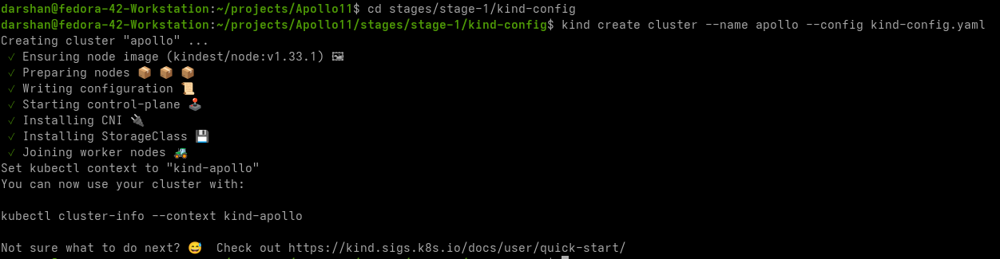
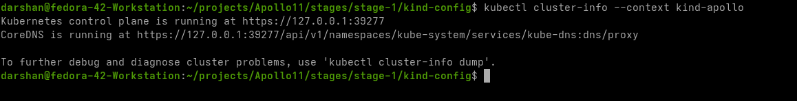
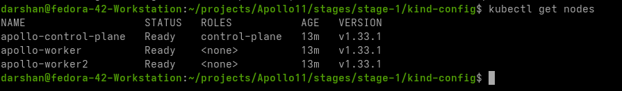
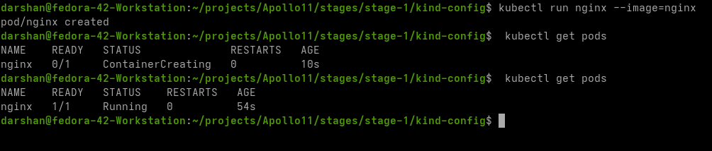
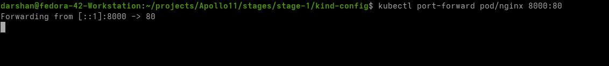
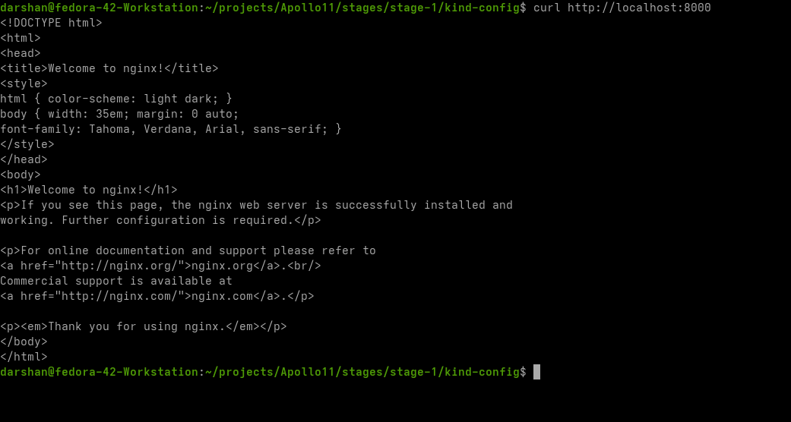
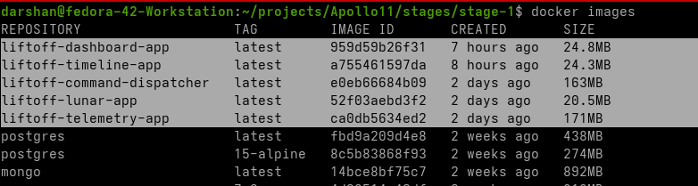
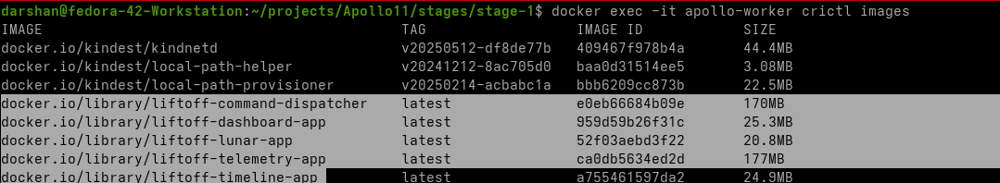

# Running the apps in local k8s

Now that we have all our code working with Docker Compose, it's time to run it on our local Kubernetes (k8s) cluster. There are multiple options for this:

- **[Minikube](https://minikube.sigs.k8s.io/docs/start)**
- **[Kind](https://kind.sigs.k8s.io/docs/user/quick-start#creating-a-cluster)** (Kubernetes in Docker)
- **[MicroK8s](https://microk8s.io)**
- **[k3s](https://k3s.io)**
- **[Rancher Desktop](https://k0sproject.io)**
- **[k0s](https://k0sproject.io)**
- **[Docker Desktop](https://www.docker.com/products/docker-desktop/)**

I have decided to use kind for this course but it can be followed with absolutely any of these local distributions. Each of them have their tradeoffs and ultimately its our preference.

## Prerequisites

This guide provides instructions to install `kind` (Kubernetes IN Docker) and `kubectl` (Kubernetes command-line tool) on Linux using binary downloads and adding them to your system's PATH. This ensures you always have the latest versions directly from the source. Assuming `docker` is already installed.

-----

### Installing `kind` (Kubernetes IN Docker) on Linux

1.  Get the latest `kind` release version:
  
    ```bash
    KIND_VERSION=$(curl -s https://api.github.com/repos/kubernetes-sigs/kind/releases/latest | grep '"tag_name":' | sed -E 's/.*"([^"]+)".*/\1/')
    echo "Latest kind version: $KIND_VERSION"
    ```

2.  Download the `kind` binary:
    
    *Note: Replace `amd64` with `arm64` if you are on an ARM-based system.*

    ```bash
    # For AMD64 / x86_64
    [ $(uname -m) = x86_64 ] && curl -Lo ./kind "https://kind.sigs.k8s.io/dl/${KIND_VERSION}/kind-linux-amd64"

    ```

3.  Make the binary executable:

    ```bash
    chmod +x ./kind
    ```

4.  Move the binary to a directory in your PATH:

    ```bash
    sudo mv ./kind /usr/local/bin/kind
    ```

5.  Verify the installation:

    ```bash
    kind version
    ```

-----

### Installing `kubectl` on Linux

1.  Get the latest `kubectl` release version:

    ```bash
    KUBECTL_VERSION=$(curl -s https://storage.googleapis.com/kubernetes-release/release/stable.txt)
    echo "Latest kubectl version: $KUBECTL_VERSION"
    ```

2.  Download the `kubectl` binary:

    ```bash
    curl -LO "https://storage.googleapis.com/kubernetes-release/release/${KUBECTL_VERSION}/bin/linux/amd64/kubectl"
    ```

    *Note: Replace `amd64` with `arm64` if you are on an ARM-based system.*

3.  Make the binary executable:

    ```bash
    chmod +x ./kubectl
    ```

4.  Move the binary to a directory in your PATH:

    ```bash
    sudo mv ./kubectl /usr/local/bin/kubectl
    ```

5.  Verify the installation:

    ```bash
    kubectl version --client
    ```


-----

> **ALTERNATIVES**

-  **For Windows/Mac**

-  **For Windows:**

  * Using Chocolatey (Recommended for ease):

    ```powershell
    choco install kubernetes-cli # Installs kubectl
    choco install kind # Installs kind
    ```

    Ensure Chocolatey is installed first: [https://chocolatey.org/install](https://chocolatey.org/install)

  * Using Scoop:

    ```powershell
    scoop install kubectl
    scoop install kind
    ```

    Ensure Scoop is installed first: [https://scoop.sh/](https://scoop.sh/)

-  **For macOS:**

  * Using Homebrew (Recommended):

    ```bash
    brew install kubectl
    brew install kind
    ```

    Ensure Homebrew is installed first: [https://brew.sh/](https://brew.sh/)

-  **Install required plugins in Vscode/Cursor:**
    - install the following plugins in your IDE of choice for better experience
        - docker
        - kubernetes
        - python
        - golang

## Creating kind cluster

- Change directory to kind directory in the stage 1 folder
    
    ```bash
    cd stages/stage-1/kind-config
    ```

- Look at the content of the kind config file. It is being used to create a kind cluster with custom settings (more that one node in this case) 
    
    ```bash
    cat kind-config.yaml
    ```

- You can read more about customizing kind configuration here: https://kind.sigs.k8s.io/docs/user/configuration/

- Lets create the kind cluster

    ```bash
    cd stages/stage-1/kind-config
    kind create cluster --name apollo --config kind-config.yaml
    ```

    

- Next run this command to cehck if cluster is running correctly:  

    ```bash
    kubectl cluster-info --context kind-apollo`
    ```

    

- Confirm the nodes are correct 
    
    ```bash
    kubectl get nodes
    ```

    

- Can look at `cat ~/.kube/config` to confirm that cluster config is set correctly

> !!! note 
We will go in depth of the content of the config file when we visit RBAC section

- Lets try the default hello world of any k8s cluster, running the nginx image
   
    ```bash 
    kubectl run nginx --image=nginx
    ```
- You should be seeing a `pod/nginx created` output

- Confirm our pod has been created:

    ```bash
    kubectl get pods
    ```
    > Note: it could be in `ContaineCreating` state for  a while until the image is retrieved locally

    

- Lets port forward that pod and check if its accessible from the terminal 

    ```bash
    kubectl port-forward pod/nginx 8000:80
    ```

    This will make sure that the port 80 in the nginx pod will be exposed as port 8000 on your localhost

    

- Open a different terminal and try accessing the site:

    ```bash
    curl http://localhost:8000
    ```

    

- Lets cleanup the pod once we have tested

- Delete the pod using 
    
    ```bash
    kubectl delete pod/nginx
    ```

## Folder Structure 

- In this module we will be creating all the components in the most simplest way possible, with deployments and expose them with clusterip services. 
- The folder/file structure is as follows:

    ```
    .
    ├── namespace
    │   └── namespace.yaml
    └── workload
        ├── command-dispatcher
        │   └── app
        │       ├── deployment.yaml
        │       ├── incorrect-deployment.yaml
        │       └── service.yaml
        ├── dashboard
        │   └── app
        │       ├── deployment.yaml
        │       └── service.yaml
        ├── lunar
        │   ├── app
        │   │   ├── deployment.yaml
        │   │   └── service.yaml
        │   └── db
        │       ├── deployment.yaml
        │       └── service.yaml
        ├── telemetry
        │   ├── app
        │   │   ├── deployment.yaml
        │   │   └── service.yaml
        │   └── db
        │       ├── deployment.yaml
        │       └── service.yaml
        └── timeline
            ├── app
            │   ├── deployment.yaml
            │   └── service.yaml
            └── db
                ├── deployment.yaml
                └── service.yaml


    ```

## Creating namespace


- Lets create a namespace named `apollo11`. All our resources will go here.
- Kubernetes namespaces provide a mechanism to logically divide cluster resources among multiple users or teams. They help organize objects and prevent naming collisions in large environments, acting as virtual clusters within a physical cluster.
> To get more info on namespaces refer: [namespaces](https://notes.darshanraul.cloud/kubernetes/concepts/namespaces)

- All of our resources will be created in that namespace [except any non namespaced resources, run `kubectl api-resources` to check ]

    ```bash
    cd stages/stage-1/manifests/namespace
    kubectl apply -f namespace.yaml
    ```

    

- Now lets have a look if our namespace has been created. Run below command and ensure that the apollo11 namespace has been created

    ```bash
    kubectl get namespaces
    ```
    


## Load all the images inside kind cluster

- To run our pods inside kind, we will need to load our docker images inside kind cluster.
- This is a temporary provision until we setup a CICD in the next sections

> Note: There will be similar provisions in other local distributions as well. Also in the next stages we will be moving to private registries where these steps will be obsolete. But to start with simple setup, these are needed

- Check if you have docker images for all the 5 services: lunar,dashboard,timeline,commmnd,telemetry. The database images are public so they will be pulled instead.

    ```bash
    docker images
    ```

    

- Once confirmed, lets load all the app images into kind cluster. Kind will automatically load them to all the nodes in the cluster

    ```bash
    kind load docker-image liftoff-dashboard-app:latest --name apollo
    kind load docker-image liftoff-timeline-app:latest --name apollo
    kind load docker-image liftoff-command-dispatcher:latest --name apollo
    kind load docker-image liftoff-lunar-app:latest --name apollo
    kind load docker-image liftoff-telemetry-app:latest --name apollo
    ```

- We can confirm these are loaded by running this command on one of the node containers

    ```bash
    docker exec -it apollo-worker crictl images
    ```
    

> !!! note
>
>   because this will be local images, **we need to ensure that we keep imagePullPolicy=never** when running in the local cluster to avoid any image pull business. **only for app images,db images will be pulled**


## Creating Architecture


- If you are not a newbie and want to get done with this stage at once:
    ```bash
    cd /stages/stage-1/manifests
    kubectl apply -R -f .
    ```


## Tools

These tools are designed to make working with Kubernetes clusters easier and more efficient from the command line:

### K9s
- **What it is:**
    - K9s is a terminal-based UI to interact with your Kubernetes clusters. It provides a real-time, interactive view of your cluster resources, making it easy to monitor and manage pods, deployments, services, and more.

- **How to use:**
    - Launch K9s by running `k9s` in your terminal.
    - Navigate resources using arrow keys, and use `:` to enter commands (e.g., `:pod` to view pods).
    - Press `?` inside K9s for a list of keyboard shortcuts.
- [**Video**](https://www.youtube.com/watch?v=AMUQzyPvO04&pp=ygUDazlz)

### Kubens
- **What it is:**
    - Kubens is a simple CLI tool to switch between Kubernetes namespaces quickly.
- **How to use:**
    - Run `kubens` to list all available namespaces.
    - Run `kubens <namespace>` to switch your current context to the specified namespace.
    - Your `kubectl` commands will now default to the selected namespace.

### Kubectx
- **What it is:**
    - Kubectx is a CLI tool to switch between multiple Kubernetes contexts (clusters) easily.
- **How to use:**
    - Run `kubectx` to list all available contexts.
    - Run `kubectx <context-name>` to switch your current context to the specified cluster.
    - This is useful if you work with multiple clusters (e.g., dev, staging, prod).

**Tip:** You can combine these tools for a smooth workflow: use `kubectx` to select your cluster, `kubens` to select your namespace, and `k9s` to interactively manage resources.

---


