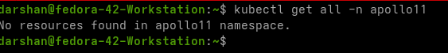

# Running the apps in local k8s

Now that we have all our code working with Docker Compose, it's time to run it on our local Kubernetes (k8s) cluster. There are multiple options for this:

- **[Minikube](https://minikube.sigs.k8s.io/docs/start)**
- **[Kind](https://kind.sigs.k8s.io/docs/user/quick-start#creating-a-cluster)** (Kubernetes in Docker)
- **[MicroK8s](https://microk8s.io)**
- **[k3s](https://k3s.io)**
- **[Rancher Desktop](https://k0sproject.io)**
- **[k0s](https://k0sproject.io)**
- **[Docker Desktop](https://www.docker.com/products/docker-desktop/)**

I have decided to use kind for this course but it can be followed with absolutely any of these local distributions. Each of them have their tradeoffs and ultimately its our preference.

## Prerequisites

This guide provides instructions to install `kind` (Kubernetes IN Docker) and `kubectl` (Kubernetes command-line tool) on Linux using binary downloads and adding them to your system's PATH. This ensures you always have the latest versions directly from the source. Assuming `docker` is already installed.

-----

### Installing `kind` (Kubernetes IN Docker) on Linux

1.  Get the latest `kind` release version:
  
    ```bash
    KIND_VERSION=$(curl -s https://api.github.com/repos/kubernetes-sigs/kind/releases/latest | grep '"tag_name":' | sed -E 's/.*"([^"]+)".*/\1/')
    echo "Latest kind version: $KIND_VERSION"
    ```

2.  Download the `kind` binary:
    
    *Note: Replace `amd64` with `arm64` if you are on an ARM-based system.*

    ```bash
    # For AMD64 / x86_64
    [ $(uname -m) = x86_64 ] && curl -Lo ./kind "https://kind.sigs.k8s.io/dl/${KIND_VERSION}/kind-linux-amd64"

    ```

3.  Make the binary executable:

    ```bash
    chmod +x ./kind
    ```

4.  Move the binary to a directory in your PATH:

    ```bash
    sudo mv ./kind /usr/local/bin/kind
    ```

5.  Verify the installation:

    ```bash
    kind version
    ```

-----

### Installing `kubectl` on Linux

1.  Get the latest `kubectl` release version:

    ```bash
    KUBECTL_VERSION=$(curl -s https://storage.googleapis.com/kubernetes-release/release/stable.txt)
    echo "Latest kubectl version: $KUBECTL_VERSION"
    ```

2.  Download the `kubectl` binary:

    ```bash
    curl -LO "https://storage.googleapis.com/kubernetes-release/release/${KUBECTL_VERSION}/bin/linux/amd64/kubectl"
    ```

    *Note: Replace `amd64` with `arm64` if you are on an ARM-based system.*

3.  Make the binary executable:

    ```bash
    chmod +x ./kubectl
    ```

4.  Move the binary to a directory in your PATH:

    ```bash
    sudo mv ./kubectl /usr/local/bin/kubectl
    ```

5.  Verify the installation:

    ```bash
    kubectl version --client
    ```


-----

> **ALTERNATIVES**

-  **For Windows/Mac**

-  **For Windows:**

  * Using Chocolatey (Recommended for ease):

    ```powershell
    choco install kubernetes-cli # Installs kubectl
    choco install kind # Installs kind
    ```

    Ensure Chocolatey is installed first: [https://chocolatey.org/install](https://chocolatey.org/install)

  * Using Scoop:

    ```powershell
    scoop install kubectl
    scoop install kind
    ```

    Ensure Scoop is installed first: [https://scoop.sh/](https://scoop.sh/)

-  **For macOS:**

  * Using Homebrew (Recommended):

    ```bash
    brew install kubectl
    brew install kind
    ```

    Ensure Homebrew is installed first: [https://brew.sh/](https://brew.sh/)

-  **Install required plugins in Vscode/Cursor:**
    - install the following plugins in your IDE of choice for better experience
        - docker
        - kubernetes
        - python
        - golang

## Creating kind cluster

- Change directory to kind directory in the stage 1 folder
    
    ```bash
    cd stages/stage-1/kind-config
    ```

- Look at the content of the kind config file. It is being used to create a kind cluster with custom settings (more that one node in this case) 
    
    ```bash
    cat kind-config.yaml
    ```

- You can read more about customizing kind configuration here: https://kind.sigs.k8s.io/docs/user/configuration/

- Lets create the kind cluster

    ```bash
    cd stages/stage-1/kind-config
    kind create cluster --name apollo --config kind-config.yaml
    ```

    

- Next run this command to cehck if cluster is running correctly:  

    ```bash
    kubectl cluster-info --context kind-apollo`
    ```

    

- Confirm the nodes are correct 
    
    ```bash
    kubectl get nodes
    ```

    

- Can look at `cat ~/.kube/config` to confirm that cluster config is set correctly

> !!! note 
We will go in depth of the content of the config file when we visit RBAC section

- Lets try the default hello world of any k8s cluster, running the nginx image
   
    ```bash 
    kubectl run nginx --image=nginx
    ```
- You should be seeing a `pod/nginx created` output

- Confirm our pod has been created:

    ```bash
    kubectl get pods
    ```
    > Note: it could be in `ContaineCreating` state for  a while until the image is retrieved locally

    

- Lets port forward that pod and check if its accessible from the terminal 

    ```bash
    kubectl port-forward pod/nginx 8000:80
    ```

    This will make sure that the port 80 in the nginx pod will be exposed as port 8000 on your localhost

    

- Open a different terminal and try accessing the site:

    ```bash
    curl http://localhost:8000
    ```

    

- Lets cleanup the pod once we have tested

- Delete the pod using 
    
    ```bash
    kubectl delete pod/nginx
    ```

## Folder Structure 

- In this module we will be creating all the components in the most simplest way possible, with deployments and expose them with clusterip services. 
- The folder/file structure is as follows:

    ```
    .
    ├── namespace
    │   └── namespace.yaml
    └── workload
        ├── command-dispatcher
        │   └── app
        │       ├── deployment.yaml
        │       ├── incorrect-deployment.yaml
        │       └── service.yaml
        ├── dashboard
        │   └── app
        │       ├── deployment.yaml
        │       └── service.yaml
        ├── lunar
        │   ├── app
        │   │   ├── deployment.yaml
        │   │   └── service.yaml
        │   └── db
        │       ├── deployment.yaml
        │       └── service.yaml
        ├── telemetry
        │   ├── app
        │   │   ├── deployment.yaml
        │   │   └── service.yaml
        │   └── db
        │       ├── deployment.yaml
        │       └── service.yaml
        └── timeline
            ├── app
            │   ├── deployment.yaml
            │   └── service.yaml
            └── db
                ├── deployment.yaml
                └── service.yaml


    ```

## Creating namespace


- Lets create a namespace named `apollo11`. All our resources will go here.
- Kubernetes namespaces provide a mechanism to logically divide cluster resources among multiple users or teams. They help organize objects and prevent naming collisions in large environments, acting as virtual clusters within a physical cluster.
> To get more info on namespaces refer: [namespaces](https://notes.darshanraul.cloud/kubernetes/concepts/namespaces)

- All of our resources will be created in that namespace [except any non namespaced resources, run `kubectl api-resources` to check ]

    ```bash
    cd stages/stage-1/manifests/namespace
    kubectl apply -f namespace.yaml
    ```

    

- Now lets have a look if our namespace has been created. Run below command and ensure that the apollo11 namespace has been created

    ```bash
    kubectl get namespaces
    ```
    

## Understanding : Pods, Deployments, ReplicaSets, and Services


### The Smallest Unit: The Pod 
> and why you don't run it directly

In Kubernetes, the **Pod** is the smallest deployable unit. Think of a Pod as a logical host **for one or more containers**. These containers are tightly coupled and share the same network namespace, storage volumes, and usually the same lifecycle. For example, if you have a web server and a sidecar container that pushes logs, they'd typically reside within the same Pod.

**So, why do we never run Pods directly?**

While you *can* create a standalone Pod, it's highly discouraged for production environments. Here's why:

* **No Self-Healing:** If a directly created Pod crashes, is evicted, or the node it's on fails, Kubernetes won't automatically bring it back. Your application will be down until you manually intervene.
* **No Scaling:** You can't easily scale a standalone Pod. If you need more instances of your application to handle increased load, you'd have to manually create more Pods.
* **No Rolling Updates:** Updating a directly created Pod to a new version means deleting the old one and creating a new one, leading to downtime for your application.
* **Manual Management Overhead:** Managing individual Pods quickly becomes a nightmare as your application grows.

This is where higher-level abstractions like ReplicaSets and Deployments come into play.

### Ensuring Stability: The ReplicaSet

A **ReplicaSet** is a Kubernetes controller that ensures a specified number of identical Pod replicas are running at all times. If a Pod fails, the ReplicaSet will automatically create a new one to maintain the desired count. It's the "self-healing" mechanism for your Pods.

A ReplicaSet typically includes:

* **`replicas`**: The desired number of Pod instances.
* **`selector`**: A set of labels (we will look at them in stage2) that the ReplicaSet uses to identify the Pods it manages.
* **`template`**: The Pod definition (container image, ports, resources, etc.) that the ReplicaSet uses to create new Pods.

**⚠️⚠️Why we should not use ReplicaSet directly:⚠️⚠️**

While ReplicaSets provide crucial self-healing and basic scaling, they lack capabilities for managing application updates. If you want to deploy a new version of your application, directly manipulating a ReplicaSet would mean manually deleting old Pods and hoping the ReplicaSet creates new ones with the updated template, which is not a controlled or graceful process. You wouldn't get features like rolling updates or easy rollbacks.

### The Orchestrator: The Deployment

This is where the **Deployment** shines! A Deployment is a higher-level API object that manages ReplicaSets, and by extension, your Pods. It provides declarative updates for Pods and ReplicaSets.

Think of a Deployment as the orchestrator of your application's lifecycle. When you define a Deployment, you specify the desired state of your application, including the container image, the number of replicas, and update strategies.

Key benefits of using Deployments:

* **Declarative Updates:** You simply declare the desired state (e.g., "I want 3 replicas of my Nginx app with version 1.25"). The Deployment controller then works to achieve that state.
* **Rolling Updates:** Deployments enable zero-downtime rolling updates. When you update the image version in your Deployment, it gradually creates new Pods with the new version and scales down the old ones, ensuring your application remains available throughout the process.
* **Rollbacks:** Made a mistake in your new version? Deployments allow you to easily roll back to a previous stable revision with a single command.
* **Self-Healing and Scaling (through ReplicaSets):** Deployments leverage ReplicaSets under the hood. When you create a Deployment, it automatically creates a ReplicaSet to manage your Pods, inheriting its self-healing and scaling capabilities.

**In essence, you define your application's desired state in a Deployment, and the Deployment takes care of managing the underlying ReplicaSets and Pods to achieve and maintain that state.**

### Connecting the Dots: Services

Even with Pods running reliably thanks to Deployments, there's still a challenge: how do other parts of your application (or external users) find and communicate with these Pods? Pods are ephemeral; their IP addresses can change when they are recreated or moved. This is where **Services** come in.

A **Service** is an abstract way to expose a set of Pods as a network service. It provides a stable IP address and DNS name for your application, regardless of which individual Pods are running behind it. Services also handle load balancing across the Pods they expose.

Key aspects of Services:

* **Stable Network Endpoint:** A Service gets a permanent IP address and DNS name, allowing other components to reliably connect to your application without needing to know the individual Pod IP addresses of the Pods.
* **Load Balancing:** Services automatically distribute incoming traffic across the healthy Pods that match its selector.
* **Decoupling:** Services decouple your application's front-end from its back-end. The front-end only needs to know the Service's stable address, not the constantly changing Pod IPs.

### The Inner Workings: ClusterIP Service

The **ClusterIP** is the default and most common type of Kubernetes Service.

* **⚠️Internal Access Only:⚠️** A ClusterIP Service assigns a virtual IP address that is only reachable from *within* the Kubernetes cluster. This makes it ideal for communication between different microservices within your application. **We will cover advanced services in stage 4**
* **How it Works:** When you create a ClusterIP Service, Kubernetes assigns it a stable IP address from a pool of internal cluster IPs. It then continuously monitors for Pods that match its `selector` labels. All traffic directed to the Service's ClusterIP is then load-balanced across these matching Pods.

**Example Scenario:**

    Imagine you have a frontend web application (exposed via a Deployment) that needs to communicate with a backend 
    API (also exposed via a Deployment). You would create a `ClusterIP` Service for your backend API. 
    Your frontend Pods can then simply use the backend Service's stable DNS name or IP address to make requests, 
    without ever needing to know the specific IP addresses of the backend Pods.


By understanding these fundamental building blocks – Pods as the smallest units, ReplicaSets ensuring their stability, Deployments orchestrating their lifecycle and updates, and Services providing stable network access – you're well on your way to mastering Kubernetes deployments.

## Load all the images inside kind cluster

- To run our pods inside kind, we will need to load our docker images inside kind cluster.
- This is a temporary provision until we setup a CICD in the next sections

> Note: There will be similar provisions in other local distributions as well. Also in the next stages we will be moving to private registries where these steps will be obsolete. But to start with simple setup, these are needed

- Check if you have docker images for all the 5 services: lunar,dashboard,timeline,commmnd,telemetry. The database images are public so they will be pulled instead.

    ```bash
    docker images
    ```

    

- Once confirmed, lets load all the app images into kind cluster. Kind will automatically load them to all the nodes in the cluster

    ```bash
    kind load docker-image liftoff-dashboard-app:latest --name apollo
    kind load docker-image liftoff-timeline-app:latest --name apollo
    kind load docker-image liftoff-command-dispatcher:latest --name apollo
    kind load docker-image liftoff-lunar-app:latest --name apollo
    kind load docker-image liftoff-telemetry-app:latest --name apollo
    ```

- We can confirm these are loaded by running this command on one of the node containers

    ```bash
    docker exec -it apollo-worker crictl images
    ```
    

> !!! note
>
>   because this will be local images, **we need to ensure that we keep imagePullPolicy=never** when running in the local cluster to avoid any image pull business. **only for app images,db images will be pulled**


## Creating Architecture


- Lets see that there are no resources in our new namespace: `kubectl get all -n apollo11`
    

>
>    - 📌📌**If you are not a newbie and want to see everything this stage creates**📌📌:
        ```bash
        cd /stages/stage-1/manifests/workload
        kubectl apply -R -f .
        ```
        

> ‼️‼️ **I still urge you to go through all the manifest files to just get a hang of the premise. You can then move to Stage2** ‼️‼️

### Steps


- Quickest way to delete everything? [only in test env, dont try anywhere else!]: `kubectl delete -R -f .` or if you are more of an adventurer`kubectl delete ns apollo11` and poof all the resources inside the namespace will be gone along with the namespace.

> 🤔 In docker compose we had a dependson condition which ensures that certain service is only launched after certain service, how do we achieve it in k8s? We will cover that in Stage2

## Tools

These tools are designed to make working with Kubernetes clusters easier and more efficient from the command line:

### K9s
- **What it is:**
    - K9s is a terminal-based UI to interact with your Kubernetes clusters. It provides a real-time, interactive view of your cluster resources, making it easy to monitor and manage pods, deployments, services, and more.

- **How to use:**
    - Launch K9s by running `k9s` in your terminal.
    - Navigate resources using arrow keys, and use `:` to enter commands (e.g., `:pod` to view pods).
    - Press `?` inside K9s for a list of keyboard shortcuts.
- [**Video**](https://www.youtube.com/watch?v=AMUQzyPvO04&pp=ygUDazlz)

### Kubens
- **What it is:**
    - Kubens is a simple CLI tool to switch between Kubernetes namespaces quickly.
- **How to use:**
    - Run `kubens` to list all available namespaces.
    - Run `kubens <namespace>` to switch your current context to the specified namespace.
    - Your `kubectl` commands will now default to the selected namespace.

### Kubectx
- **What it is:**
    - Kubectx is a CLI tool to switch between multiple Kubernetes contexts (clusters) easily.
- **How to use:**
    - Run `kubectx` to list all available contexts.
    - Run `kubectx <context-name>` to switch your current context to the specified cluster.
    - This is useful if you work with multiple clusters (e.g., dev, staging, prod).

**Tip:** You can combine these tools for a smooth workflow: use `kubectx` to select your cluster, `kubens` to select your namespace, and `k9s` to interactively manage resources.

---


