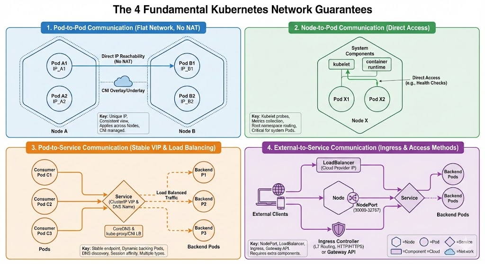

# Kubernetes Networking & Ingress

This section covers the fundamental networking concepts in Kubernetes and how Ingress serves as a crucial component for exposing applications.

## Kubernetes Networking Fundamentals

Kubernetes was designed with a specific philosophy regarding how containers should communicate. Unlike the standard Docker networking model which uses port mapping (NAT) to expose containers to the host, Kubernetes imposes a flat network structure.

interactive:

https://claude.ai/public/artifacts/d03fb795-13f5-4b0a-b045-5a0055be9d9d

# The 4 Network Guarantees in Kubernetes

Kubernetes requires every network implementation (via CNIs) to satisfy these fundamental requirements to ensure seamless communication across the cluster:

## 1. Pod-to-Pod Communication
All Pods can communicate with all other Pods across the cluster without Network Address Translation (NAT). This creates a flat network topology where any Pod with `IP_A` can directly communicate with any Pod at `IP_B`, regardless of which Node they're running on.

**Key Points:**
- Each Pod receives a unique IP address from the cluster's Pod CIDR range
- Pods see themselves with the same IP that other Pods see them as (no NAT)
- This applies across Node boundaries—Pods on different Nodes communicate as if on the same network
- The CNI plugin is responsible for implementing this routing, whether through overlay networks (like VXLAN in Flannel/Calico) or underlay networks (like AWS VPC CNI)
- Network policies can restrict this communication, but the underlying capability must exist

## 2. Node-to-Pod Communication
All Nodes and their system components (kubelet, kube-proxy, container runtime) can communicate with all Pods on that Node without NAT.

**Key Points:**
- Enables kubelet to perform health checks (liveness/readiness probes) on Pods
- Allows Node-level monitoring and logging agents to collect metrics from Pods
- This is typically achieved via the Node's root network namespace and routing tables
- The Node can reach Pods on other Nodes as well, though this is often part of Pod-to-Pod communication
- Critical for DaemonSets and system Pods that need Node-level access

## 3. Pod-to-Service Communication
Pods can communicate with Services using stable virtual IP addresses (VIPs) or DNS names to reach backend applications, decoupling consumers from specific Pod instances.

**Key Points:**
- Services provide stable endpoints (ClusterIP) backed by dynamic Pod sets
- kube-proxy or CNI-native service implementations handle load balancing across Service endpoints
- Service discovery works through DNS (typically CoreDNS) or environment variables
- Multiple service types exist: ClusterIP (internal only), NodePort, LoadBalancer
- Supports session affinity and various load balancing algorithms
- Headless services (ClusterIP: None) allow direct Pod discovery without VIP

## 4. External-to-Service Communication
External clients outside the cluster can reach Services through specific exposure methods designed for ingress traffic.

**Key Points:**
- **NodePort**: Exposes service on a static port (30000-32767) on every Node's IP
- **LoadBalancer**: Provisions an external load balancer (cloud provider dependent) with a stable external IP
- **Ingress**: HTTP/HTTPS layer 7 routing using an Ingress Controller (nginx, Traefik, etc.) with path-based or host-based routing
- **Gateway API**: Next-generation alternative to Ingress with role-oriented design and more expressive routing
- Typically requires additional components beyond the CNI (LoadBalancer requires cloud controller, Ingress requires controller)

---

## Additional Critical Network Considerations

### IP Address Management (IPAM)
- CNI plugins must manage IP allocation to prevent conflicts
- Pod CIDR ranges must not overlap with Node or Service CIDR ranges
- Different IPAM strategies exist: host-local, DHCP, cloud provider integration

### DNS Resolution
- CoreDNS (or kube-dns) provides service discovery within the cluster
- Pods automatically receive DNS configuration via `/etc/resolv.conf`
- Service DNS format: `<service-name>.<namespace>.svc.cluster.local`

### Network Policies
- Optional feature that requires CNI support (Calico, Cilium, Weave support this)
- Allows fine-grained control over Pod-to-Pod and Pod-to-Service traffic
- Default behavior without policies is allow-all

### Service Mesh Considerations
- Solutions like Istio, Linkerd operate at Layer 7 and add features like mTLS, advanced traffic management, and observability
- Work alongside CNI networking, not as replacement

### IPv4/IPv6 Dual Stack
- Kubernetes supports dual-stack networking where Pods can have both IPv4 and IPv6 addresses
- Requires CNI plugin support and proper cluster configuration

### Network Performance
- Overlay networks (VXLAN, IPIP) add encapsulation overhead
- Direct routing or VPC-native solutions offer better performance but require infrastructure support
- Consider MTU settings to avoid fragmentation

### Multi-Cluster Networking
- Tools like Submariner, Cilium Cluster Mesh enable Pod communication across clusters
- Requires careful IP space planning and network connectivity between clusters

These guarantees form the foundation that allows Kubernetes to provide a consistent, portable networking model across different infrastructure providers and CNI implementations.

### Why CNIs are Required
Kubernetes **does not** implement the network itself. It offloads the logic of allocating IPs and setting up routes to **CNI (Container Network Interface)** plugins.
Common CNIs include:
-   **Flannel**: Simple overlay network (vxlan).
-   **Calico**: Layer 3 networking with BGP, supports Network Policies.
-   **Cilium**: eBPF-based high-performance networking and security.

The CNI plugin is responsible for ensuring the "flat network" guarantee is met, often by creating an overlay network (encapsulating packets) or using direct routing.

### Why separate CIDRs?
Understanding the network ranges is crucial:

-   **Node CIDR** (e.g., `192.168.1.0/24`): The physical network where your servers/VMs live.
-   **Pod CIDR** (e.g., `10.42.0.0/16`): A dedicated virtual network for Pods. Every Pod gets a unique IP from this range. Separation allows Pods to move freely without IP conflicts with the host network.
-   **Service CIDR** (e.g., `10.43.0.0/16`): A virtual IP range for Services. These IPs do not exist on any interface; `kube-proxy` intercepts traffic destined for these IPs and forwards it to random backing Pod IPs.
