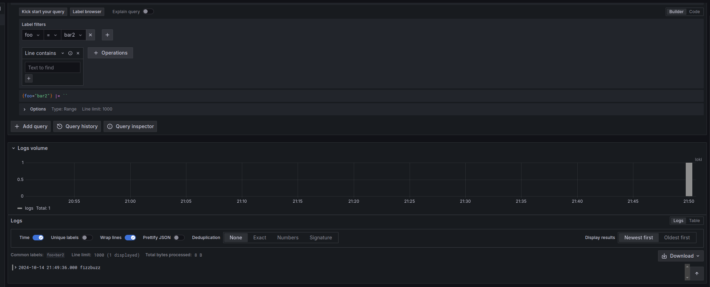

# To send a test log message to loki

```
curl -v -H "Content-Type: application/json" -XPOST -s "http://localhost:3100/loki/api/v1/push" --data-raw \
 '{"streams": [{ "stream": { "foo": "bar2" }, "values": [ [ "1728922776000000000", "fizzbuzz" ] ] }]}'

```

> Replace  1728922776000000000 with the relevant epoch time 

You should be able to see the logs in loki as below

