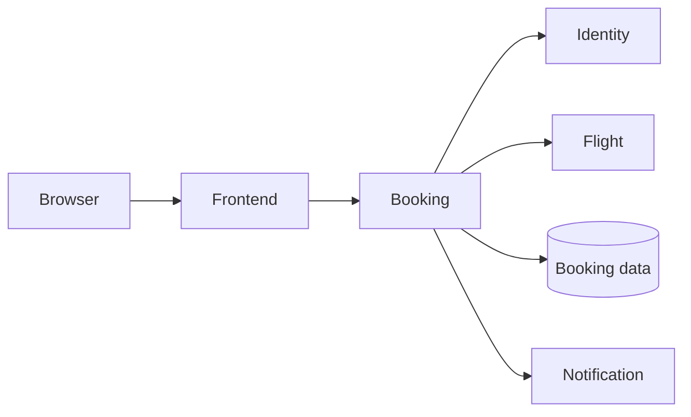

# 🛫 Meet Apollo Airlines

Imagine a passenger has found a flight and presses Book. They expect a
confirmation and a reservation they can find again later. Apollo Airlines has
several pieces of work to coordinate before it can deliver that simple result.

The frontend gives the passenger a way to interact with the airline. Behind
the booking action, the booking service calls identity and flight, records the
reservation in its database, and asks notification to handle confirmation work.
This simplified picture follows that action; later, Guidance will explain the
network routes connecting these pieces.

Booking sits at the meeting point of several dependencies. If its process is
running but it cannot reach flight or its database, the passenger may still be
unable to book. That distinction will return in Launchpad, Flight Control, and
Mission Operations. *(Diagram OR-02: a simplified passenger workflow.)*

## The same airline, new questions

In Launchpad, we ask how to run these programs together. At Liftoff, we ask what
happens when a Pod disappears. Mission Data follows the reservation through a
database Pod replacement. Mission Operations follows the clues when a booking
slows down. You will already know the passenger’s goal when each new Kubernetes
mechanism arrives.

## 🗺️ How Apollo Airlines Evolves (Macro-Architecture Map)

Rather than learning isolated Kubernetes features in the abstract, you will watch
Apollo Airlines progressively evolve from a single-machine script into an
enterprise-grade, observable, resilient cloud platform:

```mermaid
flowchart TD
  subgraph M0 ["Stage 0: Launchpad · Containers"]
    direction TB
    L_HOST["Single Host / Docker Compose"]
    L_NET["Bridge Network: apollo-airlines"]
    L_BOX["10 Isolated Containers (Apps + Postgres + Redis)"]
    L_HOST --- L_NET --- L_BOX
  end

  subgraph M1 ["Stage 1: Liftoff · Workloads"]
    direction TB
    W_NS["Namespace: apollo-airlines"]
    W_CTRL["Deployments + ReplicaSets (Replicas: 2)"]
    W_SVC["ClusterIP & NodePort Services"]
    W_JOBS["Schema Bootstrap Jobs"]
    W_NS --- W_CTRL --- W_SVC --- W_JOBS
  end

  subgraph M2 ["Stage 2: Guidance · Networking"]
    direction TB
    N_NS1["Namespace: apollo-airlines-apps (APIs & DBs)"]
    N_NS2["Namespace: apollo-airlines-ui (Frontend)"]
    N_EDGE["MetalLB (Layer 2 VIP) + Envoy Gateway (HTTPRoutes)"]
    N_EDGE --> N_NS2
    N_EDGE --> N_NS1
  end

  subgraph M3 ["Stage 3: Mission Data · Storage"]
    direction TB
    S_STS["StatefulSets (identity-db, flight-db, booking-db)"]
    S_DNS["Headless Services (clusterIP: None)"]
    S_PVC["volumeClaimTemplates + Dynamic StorageClass"]
    S_STS --- S_DNS --- S_PVC
  end

  subgraph M4 ["Stage 4: Flight Control · Reliability"]
    direction TB
    R_PROBES["Startup, Liveness & Readiness Probes"]
    R_DRAIN["preStop Hooks (sleep 5) + Graceful SIGTERM"]
    R_QOS["Resource Requests & Limits (Guaranteed QoS) + PDBs"]
    R_PROBES --- R_DRAIN --- R_QOS
  end

  subgraph M5 ["Stage 5: Payload Integration · Delivery"]
    direction TB
    D_HELM["Parameterized Helm Chart (dev vs prod values)"]
    D_GITOPS["Argo CD Continuous GitOps Reconciliation"]
    D_HELM --- D_GITOPS
  end

  subgraph M6 ["Stage 6: Mission Operations · Observability"]
    direction TB
    O_NS["Namespace: apollo-observability"]
    O_STACK["Prometheus (Metrics) + Loki (Logs) + Tempo (Traces)"]
    O_OTEL["OTel Collector + Grafana Dashboards"]
    O_NS --- O_STACK --- O_OTEL
  end

  subgraph M7 ["Stage 7: Orbital Maneuvering · Scaling"]
    direction TB
    SC_REDIS["Redis Cache-Aside for Flight Search"]
    SC_HPA["HPA v2 (CPU Scaling 1-3) + VPA Recommendations"]
    SC_SCHED["Node Affinity, Taints & Topology Spread Constraints"]
    SC_REDIS --- SC_HPA --- SC_SCHED
  end

  M0 ==> M1 ==> M2 ==> M3 ==> M4 ==> M5 ==> M6 ==> M7
```

### Stage-by-Stage Architecture Progression

| Stage | Infrastructure Boundary | Key Architectural Leap |
|---|---|---|
| **0. Launchpad** | Single Docker Host | 10 containers on a local Docker bridge; learns process vs image vs container. |
| **0.5. Ignition** | 3-Node `kind` Cluster | Control plane + 2 worker nodes; observes kubelet, API server, and bare Pod lifecycle. |
| **1. Liftoff** | Single Namespace (`apollo-airlines`) | Controllers replace bare Pods; Deployments, ReplicaSets, Services, ConfigMaps, Secrets, tokenless ServiceAccounts, schema Jobs. |
| **2. Guidance** | Multi-Namespace (`apps` + `ui`) | Production namespace boundary; eliminates NodePorts using MetalLB Layer 2 VIP and Envoy Gateway API HTTPRoutes. |
| **3. Mission Data** | Dynamic Storage (`local-path`) | Replaces ephemeral `emptyDir` with StatefulSets, headless Services, and persistent PVCs that survive Pod deletion. |
| **4. Flight Control**| Node Scheduling & Reliability | Zero-downtime rolling updates with `preStop` connection draining, multi-tier probes, and PodDisruptionBudgets. |
| **5. Payload** | Automated GitOps | Consolidates raw YAML into parameterized Helm charts; deploys automated GitOps reconciliation with Argo CD. |
| **6. Operations** | Dedicated `apollo-observability` | Correlates bookings across Prometheus metrics, Loki log streams, and OpenTelemetry/Tempo distributed traces. |
| **7. Scaling** | Elastic Autoscaling | Combines Redis Cache-Aside query caching with HPA autoscaling, VPA recommendations, and topology-spread scheduling. |

You don’t need to memorize the whole application now. Keep one question in mind:
**can the passenger complete their booking, and can we explain why?**

[Head to the Launchpad mission briefing →](../missions/launchpad)

