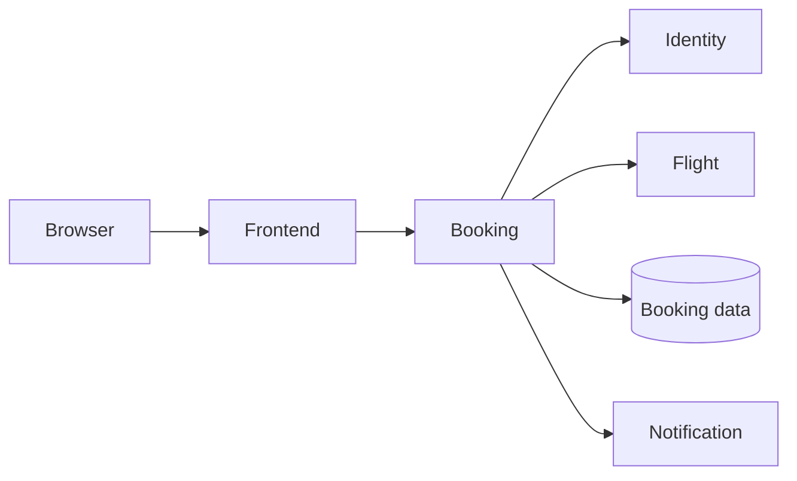

# 🛫 Meet Apollo Airlines

Imagine a passenger has found a flight and presses Book. They expect a
confirmation and a reservation they can find again later. Apollo Airlines has
several pieces of work to coordinate before it can deliver that simple result.

The frontend gives the passenger a way to interact with the airline. Behind
the booking action, the booking service calls identity and flight, records the
reservation in its database, and asks notification to handle confirmation work.
This simplified picture follows that action; later, Guidance will explain the
network routes connecting these pieces.

Booking sits at the meeting point of several dependencies. If its process is
running but it cannot reach flight or its database, the passenger may still be
unable to book. That distinction will return in Launchpad, Flight Control, and
Mission Operations. *(Diagram OR-02: a simplified passenger workflow.)*

## The same airline, new questions

In Launchpad, we ask how to run these programs together. At Liftoff, we ask what
happens when a Pod disappears. Mission Data follows the reservation through a
database Pod replacement. Mission Operations follows the clues when a booking
slows down. You will already know the passenger’s goal when each new Kubernetes
mechanism arrives.

You don’t need to memorize the whole application now. Keep one question in mind:
**can the passenger complete their booking, and can we explain why?**

[Head to Launchpad →](../learn/containers/process-image-container)
