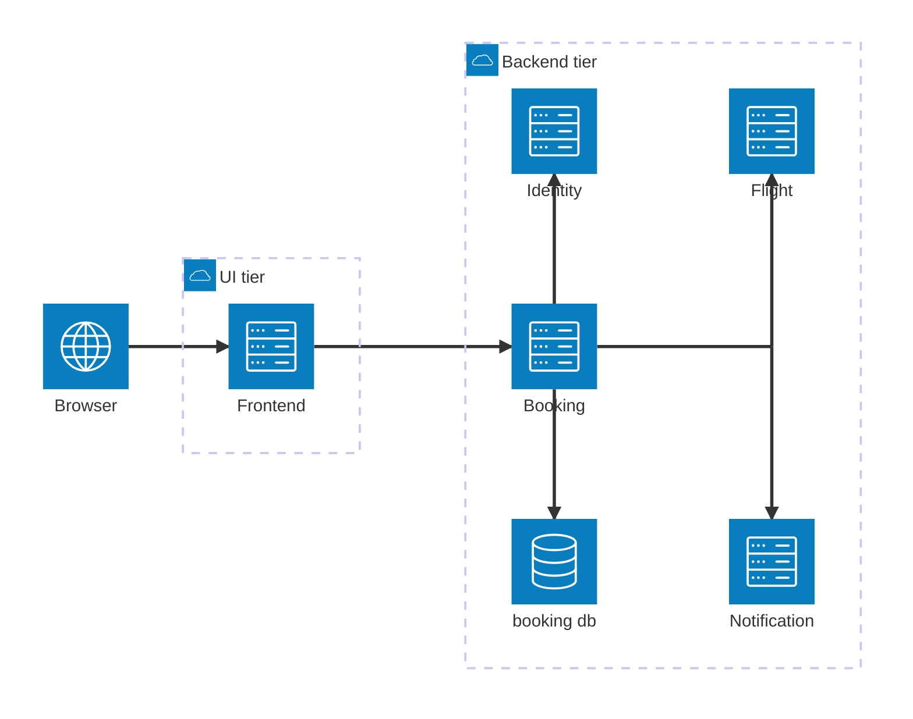

# Meet Apollo Airlines

**You will be able to:** name every component, trace one booking through them, and say which stage adds what.

## Components

| Component | Tech | Port | Job |
|---|---|---|---|
| `frontend` | React + nginx | 3000 | Passenger UI; calls the APIs from the browser |
| `identity` | Python / FastAPI | 8080 | Login, JWT, passenger profile |
| `flight` | Go / Gin | 8081 | Flight inventory, seat counts |
| `booking` | Go / Gin | 8082 | Creates reservations (the flagship workflow) |
| `search` | Go / Gin | 8083 | Flight search, cached in Redis |
| `notification` | Go / Gin | 8084 | Confirmation work after a booking |
| `identity-db`, `flight-db`, `booking-db` | PostgreSQL 15 | 5432 | One database per service |
| `redis` | Redis 7 | 6379 | Search cache |

Launchpad also runs Dozzle (port 8085) as a log viewer. It is tooling, not part of the app.

## One booking, end to end

```mermaid
architecture-beta
  service browser(internet)[Browser]

  group ui(cloud)[UI tier]
  service frontend(server)[Frontend] in ui

  group apps(cloud)[Backend tier]
  service booking(server)[Booking] in apps
  service identity(server)[Identity] in apps
  service flight(server)[Flight] in apps
  service notification(server)[Notification] in apps
  service bookingdb(database)[booking db] in apps
  junction calls in apps

  browser:R --> L:frontend
  frontend:R --> L:booking
  booking:T --> B:identity
  booking:B --> T:bookingdb
  booking:R -- L:calls
  calls:T --> B:flight
  calls:B --> T:notification
```

- Booking calls **identity** (is this token valid?), then **flight** (get flight, decrement seats).
- Booking writes the reservation to **booking-db**, then asks **notification** to handle the confirmation.
- Booking depends on four things. **The process can be running while any of them is unreachable, and the passenger still cannot book.**
- That gap is what readiness probes (Stage 4) and traces (Stage 6) are for.

## What each stage adds

| Stage | Adds | New boundary |
|---|---|---|
| Launchpad | 10 containers on one Docker bridge network | One host |
| Ignition | 3-node `kind` cluster, one bare Pod | Control plane + 2 workers |
| 1 Liftoff | Deployments, Services, ConfigMaps, Secrets, Jobs | Namespace `apollo-airlines` |
| 2 Guidance | Namespace split, MetalLB, Envoy Gateway, TLS | `apollo-airlines-apps` + `apollo-airlines-ui` |
| 3 Mission Data | StatefulSets, headless Services, PVCs | Data survives Pod replacement |
| 4 Flight Control | Probes, graceful shutdown, QoS, PDBs, spread | Safe restarts and drains |
| 5 Payload | Helm, Kustomize, Argo CD | Git is the source of truth |
| 6 Operations | Prometheus, Loki, Tempo, Grafana, OTel | `apollo-observability` |
| 7 Orbital | Redis cache-aside, HPA, VPA, scheduling rules | Load-driven change |
| 8 Command Module | RBAC, PSA, NetworkPolicy, secrets, admission | *Planned* |
| 9 Lunar Orbit | Terraform + EKS, backup/restore | *Planned* |

## Keep one question in mind

> Can the passenger complete a booking, and can I show why or why not?

Next: [Launchpad briefing](../missions/launchpad).
