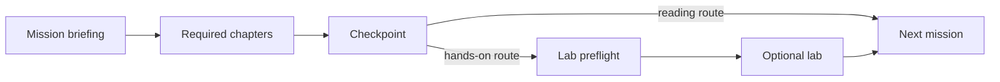

# How to use this course

Apollo11 has one required learning sequence and optional experiments. You never
need a cluster to understand the core explanation.

## Choose your route

| Route | Do this | Skip this |
| --- | --- | --- |
| **Read and understand** | Read each mission briefing and its chapters; answer the checkpoints. | Workstation setup and all lab pages. |
| **Read and practise** | Read the chapters, prepare the workstation, then run the matching lab. | Nothing; the lab comes after the explanation. |
| **Return for reference** | Use the glossary, command reference, or troubleshooting guide. | The ordered route, if you already know the prerequisite concept. |

Do not begin with a lab. A lab assumes that you can already predict the result
it asks you to investigate.

## Recognise the page type

- **Mission briefing** — the problem, outcomes, chapter order, and readiness
  criteria for one stage.
- **Chapter** — the required explanation. Commands here are evidence examples,
  not required exercises unless a block explicitly says otherwise.
- **Optional lab** — a runnable investigation in the separate Apollo11
  repository. It names its starting state, expected evidence, recovery, and
  cleanup boundary.
- **Reference** — material to consult when a term or command is unfamiliar.
- **Planned mission** — a design lesson, not a claim that the control is
  installed in the supported local environment.

## Follow one stage at a time

If a command reports `NotFound`, first check the stage, repository revision,
cluster context, and namespace. Do not create a missing object merely to make
the next command pass; doing so can hide a snapshot mismatch.

## Know when a stage is complete

A stage is complete when you can:

1. explain the problem in your own words;
2. name the object or intent involved;
3. name the actor that performs the action;
4. describe evidence of acceptance, convergence, and useful behaviour; and
5. state one thing the mechanism does not guarantee.

Running every command without being able to explain the result is not
completion. Conversely, a reader who can answer these questions may continue
without running the optional lab.

Continue to [Terminal, Git, and YAML essentials](./terminal-git-and-yaml), then
[meet Apollo Airlines](./apollo-airlines).
