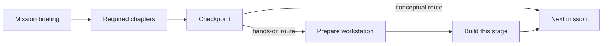

# How to use this course

Apollo11 has one required learning sequence and optional experiments. You never
need a cluster to understand the core explanation.

## Choose your route

| Route | Do this | Skip this | Outcome |
| --- | --- | --- | --- |
| **Conceptual study** | Read each mission briefing and its chapters; answer the checkpoints. | Workstation setup and all build/lab pages. | Understands cloud-native architecture, resource relationships, and operational trade-offs. |
| **Hands-on mission (Recommended)** | Read chapters, prepare the workstation, then build the stage and verify recovery. | Nothing; implementation is required for hands-on completion. | Authors manifests, manages live cluster resources, diagnoses bounded failures, and proves recovery. |
| **Return for reference** | Use the glossary, command reference, or troubleshooting guide. | The ordered route, if you already know the prerequisite concept. | Quick operational and debugging reference. |

Do not begin with a build page. Implementation assumes that you can already predict the result
and understand the mechanism you are constructing.

## Recognise the page type

- **Mission briefing** — the application challenge, expected outcomes, chapter sequence, and readiness criteria for one stage.
- **Chapter** — the core conceptual explanation. Commands here illustrate mechanisms and provide evidence examples.
- **Build this stage** — the hands-on implementation in the separate Apollo11 repository (`Apollo11/`). You author learner-owned manifests (stored in `learner-work/`), apply them in dependency order, observe behavior, run a controlled failure experiment, and restore the system.
- **Reference** — material to consult when a term or command is unfamiliar.
- **Planned mission** — a design lesson, not a claim that the control is installed in the supported local environment.

## Follow one stage at a time

```mermaid
flowchart LR
  B[Mission briefing] --> C[Required chapters]
  C --> Q[Checkpoint]
  Q -->|conceptual route| N[Next mission]
  Q -->|hands-on route| S[Prepare workstation]
  S --> L[Build this stage]
  L --> N
```

If a command reports `NotFound`, first check the stage directory, repository revision,
cluster context, and namespace. Do not create an arbitrary object merely to make
the next command pass; doing so can hide a snapshot mismatch.

## Know when a stage is complete

Completion depends on your chosen route:

### Conceptual study completion
A chapter or conceptual stage is complete when you can:
1. explain the application problem in your own words;
2. name the Kubernetes object or intent involved;
3. name the actor that performs the reconciliation or action; and
4. state one thing the mechanism does not guarantee.

### Hands-on mission completion
Hands-on mission completion requires direct operational evidence:
1. **Build**: You authored the stage's resource manifest or configuration in `learner-work/` rather than relying solely on pre-packaged installers.
2. **Observe**: You verified API acceptance, controller status, and an actual useful application endpoint or database response.
3. **Investigate**: You executed the stage's bounded failure experiment and identified the specific failure evidence.
4. **Recover**: You restored the healthy configuration and proved recovery through observable endpoint behavior, not resource existence alone.
5. **Explain**: You can articulate which actor reacted and why the system recovered.

Passing automated regression verifiers (`verify.sh`) provides maintainer reproducibility confidence, but your own authored artifacts, observations, and recovery constitute hands-on completion.

Continue to [Terminal, Git, and YAML essentials](./terminal-git-and-yaml), then
[meet Apollo Airlines](./apollo-airlines).
