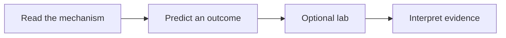

# Mission Briefing: Before You Board

You don’t need to arrive knowing Kubernetes. Bring enough terminal familiarity to
navigate files and run a command, and the idea that a browser sends a request to
a server. We’ll unpack containers, YAML, DNS, storage, and signals when Apollo
Airlines gives us a reason to use them.

Each mission begins with a problem: perhaps a booking service disappears, a
database loses its data, or a passenger’s request takes too long. Read how the
pieces work, then pause and predict what would happen if one of them changed.
The labs give you a place to try that prediction. You can also keep reading and
come back to the experiments later.



The lab is a chance to compare your prediction with a running system. The story
and explanation are there whether or not you run it. *(Diagram OR-01.)*

## 📁 The Two Repositories: Textbook vs. Application Code

To follow this course effectively, understand that two repositories exist:

1. **`apollo11-docs` (The Textbook):** The documentation site you are reading right now. It teaches the concepts, mental models, failure boundaries, and guides the experiments.
2. **`Apollo11` (The Application Code & Labs):** The GitHub repository containing the complete Apollo Airlines source code, Dockerfiles, Kubernetes manifests, and automated verification scripts.

:::important[Hands-On Lab Setup]
If you choose the **hands-on route**, clone the companion `Apollo11` repository into your workspace before starting the labs:

```bash
git clone https://github.com/darshan-raul/Apollo11.git
cd Apollo11
git checkout 7b693c9bae0a789dc9db8e0628c478fd0dd53e88
```

Every hands-on lab in this course runs from inside that `Apollo11` repository, navigating into stage directories such as `stages/launchpad/`, `stages/ignition/`, and `stages/stage1/`.
:::

Next, read [how this course works](./how-to-use-this-course). It defines the
page types, the reading-only and hands-on routes, and what counts as completing
a stage. When you are ready for experiments, workstation requirements and tools
are detailed in [Prepare your launchpad](../labs/setup).

