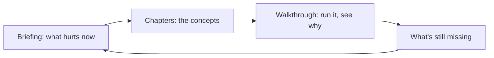

# Before you board

**You will be able to:** decide whether you are ready, and set up the two repositories.

## Assumed knowledge

- Run commands in a terminal; use `cd`, `ls`, `cat`.
- A browser sends HTTP requests to a server.
- Nothing else. Containers, YAML, DNS, storage and signals are taught when needed.

## Two repositories

| Repo | Contains | Use it to |
|---|---|---|
| `apollo11-docs` | This site | Learn the concepts and follow the walkthroughs |
| `Apollo11` | App source, Dockerfiles, manifests, scripts | The YAML you read and the scripts you run |

## Setup for the hands-on route

Install Docker, then let the bootstrap script install everything else
(kind, kubectl, Helm, jq, k6, Argo CD, ...) via [mise](https://mise.jdx.dev):

```bash
git clone https://github.com/darshan-raul/Apollo11.git
cd Apollo11
./prep.sh              # install mise + the course toolchain
exec $SHELL            # reload your shell
./prep.sh --verify     # every line should be ✅
git checkout 69113dcc80f77e32301d8ee7b9e73a67c923de96
git rev-parse HEAD     # must print the hash above
```

- Run every walkthrough from the `Apollo11` repo root.
- Run `prep.sh` before the `git checkout`: the pinned commit predates the script.
- Tool list, manual install option and preflight: [Prepare your launchpad](../labs/setup#install-the-tools-with-the-bootstrap-script).

## Learning loop used throughout


```mermaid
flowchart LR
  B[Briefing: what hurts now] --> R[Chapters: the concepts] --> W[Walkthrough: run it, see why] --> N[What's still missing] --> B
```

- Every stage starts from a limit of the previous one, and ends by naming the next one.
- Read each step's **Why this way** and **Compared with** bullets. They matter more than the commands.

Next: [How this course works](./how-to-use-this-course).
